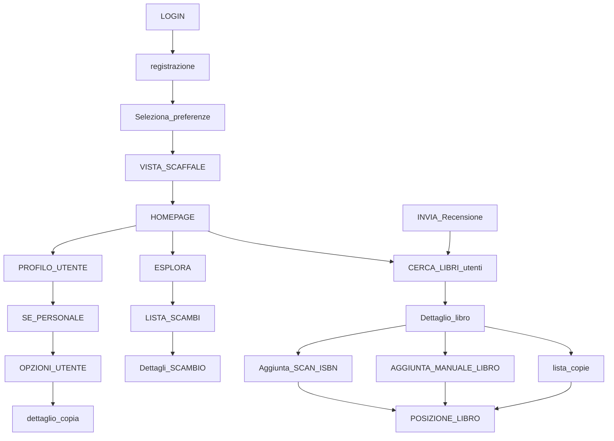
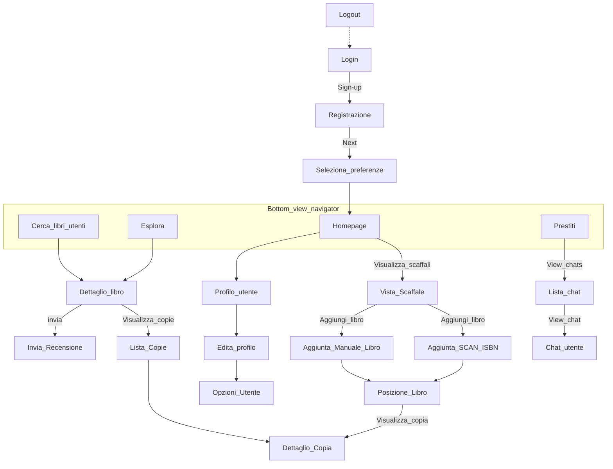
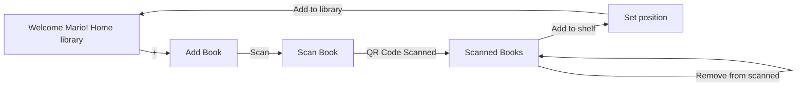
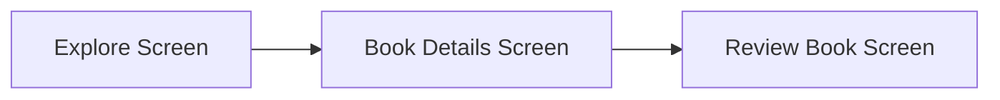
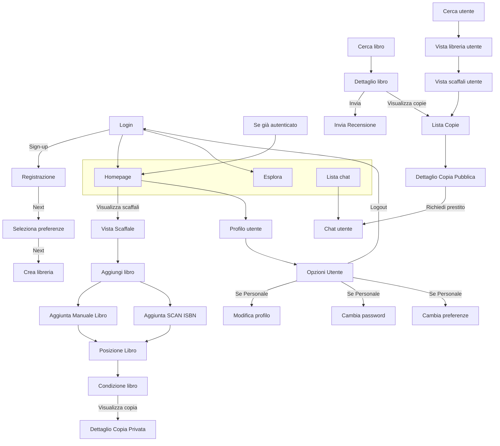

UNIVERSITÀ DEGLI STUDI DI BRESCIA logo

## UNIVERSITÀ DEGLI STUDI DI BRESCIA

### DIPARTIMENTO DI INGEGNERIA DELL'INFORMAZIONE

Corso di Laurea Magistrale
in Ingegneria Informatica

# Progetto del corso di Mobile Application Development

Sviluppo di una applicazione android per la gestione digitale di librerie

# BookIT

**Studenti:**

Mio Francesco - 731397
Pezzotti Enrico - 730313
Visini Mattia - 731036

Anno Accademico 2024/2025
<page_number>

1
</page_number>

# Indice

**1 Introduzione** **4**
1.1 Definizione preliminare delle funzionalità 4

**2 Analisi competitor** **6**
2.1 Analisi competitor diretti 6
2.1.1 Analisi dimensionale 7
2.1.2 Analisi delle features 8
2.1.3 Analisi App Libib 8
2.2 Analisi competitor indiretti 11

**3 User research** **13**
3.1 Profilo utente 13
3.2 Questionari e risultati 14
3.2.1 Questionario utente 14
3.2.2 Risultati 15
3.3 Personas e Scenarios 23

**4 App design** **27**
4.1 Revisione delle funzionalità 27
4.2 Navigation map iniziale 28
4.2.1 Navigation map cartacea 29
4.2.2 Navigation map digitale 29
4.3 Paper prototype 30
4.4 Mockup navigation map 32
4.4.1 Flusso Login e Registrazione 33
4.4.2 Flusso Homepage 33
4.4.3 Flusso Aggiunta libro 34
4.4.4 Flusso Profilo 34
4.4.5 Flusso Richiesta prestito 35
4.4.6 Flusso Chat 35
4.4.7 Flusso Recensione 36
4.5 Visual design 36

**5 Implementazione** **40**
5.1 Google Firebase 40
5.1.1 Firebase Authentication 40
5.1.2 Firestore Realtime Database 41
5.2 Supabase 42
5.3 OneSignal 43
5.4 Permessi utilizzati 46

<page_number>2</page_number>

5.5 Struttura dei package 47
5.6 Navigation map finale 47
5.7 Pagine principali 48
5.7.1 Login e Registrazione 48
5.7.2 Homepage 50
5.7.3 Profilo Utente 53
5.7.4 Esplora 55
5.7.5 Chat 59

**6 Possibili sviluppi futuri 61**

<page_number>3</page_number>

# Capitolo 1

## Introduzione

L'applicazione "BookIT", sviluppata in Kotlin per smartphone Android, nasce con l'idea di digitalizzare le librerie domestiche. Il progetto, realizzato nell'ambito del corso di "Mobile Application Development", si propone di creare un'esperienza utente intuitiva e funzionale, permettendo ai propri utenti di creare il corrispettivo digitale della propria libreria assieme ai relativi scaffali e libri. Un secondo obiettivo nato dall'idea originaria, prevede l'integrazione di un sistema di proposta prestiti, attraverso cui gli utenti possano accordarsi per scambiarsi le proprie copie, come avviene in una biblioteca. Il progetto intende dunque creare una piattaforma a supporto di una community dedicata allo scambio di copie cartacee possedute dagli utenti. Per questo motivo si intende predisporre anche una sezione in cui l'utente possa effettuare ricerche, sia di libri che di utenti, visualizzando recensioni ed eventuali copie disponibili per il prestito.

Il processo di sviluppo dell'app di BookIT si è svolto in queste quattro fasi:

* **Studio competitor:** analisi dei competitor presenti sul mercato, per comprendere il contesto in cui si inserirebbe il progetto.

* **User reserch:** analisi degli utenti, tramite questionari e personas, per definire le necessità della clientela a cui ci si rivolge.

* **App design:** progettazione strutturale e visiva dell'applicazione attraverso bozze e prototipi, per impostare nel modo migliore il lavoro.

* **Implementazione:** sviluppo effettivo dell'applicazione per dispositivi Android utilizzando il linguaggio Kotlin con l'IDE Android Studio.

Per quanto riguarda la gestione dei dati e l'autenticazione, è stato utilizzato Firebase, mentre l'interfaccia utente è stata progettata seguendo i principi di usabilità di Nielsen e le leggi della Gestalt apprese durante il corso di Interazione Uomo-Macchina. Questa relazione illustra nel dettaglio l'intero iter di sviluppo, fornendo una panoramica completa delle scelte progettuali, delle tecnologie utilizzate e dei risultati ottenuti.

## 1.1 Definizione preliminare delle funzionalità

Di seguito si specifica in modo più dettagliato l'elenco delle funzionalità previste per l'applicazione, stilato prima dello studio dei competitor e della User Research.

<page_number>4</page_number>

Su questa base è stato impostato il successivo lavoro di ricerca volto ad individuare i punti centrali del progetto e scartare quelli meno rilevanti. La revisione di questo elenco prima della fase di design ci ha permesso di concentrarci maggiormente sulle vere necessità del mercato, piuttosto che sulla nostra limitata visione iniziale del progetto.

## Funzionalità Essenziali

* **Autenticazione:** Registrazione e login per creare e gestire un account utente

* **Profilo utente:** Visualizzazione e modifica di informazioni personali (user-name, email, location e preferenze generi) e gestione visibilità pubblica delle proprie librerie

* **Gestione libreria:** Creazione di librerie, scaffali ed aggiunta manuale di nuovi libri per titolo, autore o ISBN.

* **Ricerca:** Possibilità di ricerca di utenti e libri

* **Copie disponibili:** Una volta trovato il libro di interesse sarà possibile visualizzare le copie che sono disponibili per il prestito ed eventualmente richiederlo compilando un'apposita richiesta con data di inizio e fine prestito.

## Funzionalità Avanzate

* **Chat utenti:** Sezione dedicata alla chat in tempo reale tra utenti per discussione su libri e prestiti

* **Gestione recensioni:** Ogni utente può esprimere un proprio parere tramite recensione (testuale e tramite rating) nell'apposita pagina di dettaglio libro accessibile dalla pagina Esplora

* **Sezione Esplora personalizzata:** Visualizzazione di un feed dei libri ed utenti che hanno preferenze simili alle nostre

* **Gamification:** Possibilità di lanciare sfide di lettura personali o tra utenti

5

# Capitolo 2

# Analisi competitor

## 2.1 Analisi competitor diretti

La prima fase su cui ci siamo concentrati è stata l’analisi dei competitor presenti attualmente sul mercato. Inizialmente abbiamo effettuato una ricerca negli store mobile, sia sull’Apple Store (iOS) che sul Play Store (Android), per individuare applicazioni simili alla nostra, identificabili come “competitor”. Di queste abbiamo analizzato le funzionalità offerte, valutato i punti di forza e individuato le criticità, con l’obiettivo di evitare tali debolezze nello sviluppo della nostra app.

Nello specifico il lavoro si è suddiviso nei seguenti passi:

* Abbiamo dapprima cercato sugli store mobile (Apple Store e Play Store) applicazioni simili alla nostra. Quindi applicazioni dedicate alla gestione digitale di una libreria.

* Per ciascuna app individuata, abbiamo in un primo momento osservato la descrizione proposta dagli sviluppatori e i commenti degli utenti che forniscono spesso ottimi feedback. In seguito, abbiamo scaricato alcune di queste per poter analizzare più in dettaglio le funzionalità che ci interessavano maggiormente.

* In seguito abbiamo stilato in versione tabellare l’analisi dimensionale e le diverse *features* e funzionalità che ogni app offre, in modo tale da confrontarle tra di loro.

Le applicazioni che abbiamo identificato sono le seguenti:

* Handy

* Buddy

* Bookshelf

* Goodreads

* Libib

* CLZ Books

<page_number>6</page_number>

## 2.1.1 Analisi dimensionale

<table>
  <thead>
    <tr>
        <th>Caratteristica</th>
        <th>Handy</th>
        <th>Buddy</th>
        <th>Bookshelf</th>
        <th>Goodreads</th>
        <th>Libib</th>
        <th>CLZ Books</th>
    </tr>
  </thead>
  <tbody>
    <tr>
        <td><strong>Business model</strong></td>
        <td>Freemium</td>
        <td>Premium</td>
        <td>Freemium</td>
        <td>Free</td>
        <td>Free</td>
        <td>Premium</td>
    </tr>
    <tr>
        <td><strong>Prezzo</strong></td>
        <td>9,99€ tantum</td>
        <td>6,99€ tantum</td>
        <td>2,99€/m<br/>69,99€ tantum</td>
        <td>Gratuita</td>
        <td>Gratuita</td>
        <td>1,99€/m<br/>19,99€/a</td>
    </tr>
    <tr>
        <td><strong>Registrazione</strong></td>
        <td>no</td>
        <td>no</td>
        <td>sì</td>
        <td>sì</td>
        <td>sì</td>
        <td>opzionale</td>
    </tr>
    <tr>
        <td><strong>Limite libreria</strong></td>
        <td>100 / ill.</td>
        <td>50 / ill.</td>
        <td>ill.</td>
        <td>ill.</td>
        <td>ill.</td>
        <td>ill.</td>
    </tr>
    <tr>
        <td><strong>Download</strong></td>
        <td>500k</td>
        <td>?</td>
        <td>1M</td>
        <td>10M</td>
        <td>100k</td>
        <td>100k</td>
    </tr>
    <tr>
        <td><strong>Punteggio Apple</strong></td>
        <td>n.d.</td>
        <td>4,8</td>
        <td>4,7</td>
        <td>4,6</td>
        <td>4,5</td>
        <td>4,8</td>
    </tr>
    <tr>
        <td><strong>Punteggio Google</strong></td>
        <td>3,8</td>
        <td>n.d.</td>
        <td>4,5</td>
        <td>2,9</td>
        <td>4,5</td>
        <td>4,5</td>
    </tr>
    <tr>
        <td><strong>Dimensione Android</strong></td>
        <td>61 MB</td>
        <td>n.d.</td>
        <td>22 MB</td>
        <td>22 MB</td>
        <td>37 MB</td>
        <td>12 MB</td>
    </tr>
    <tr>
        <td><strong>Dimensione Apple</strong></td>
        <td>n.d.</td>
        <td>30 MB</td>
        <td>64 MB</td>
        <td>66 MB</td>
        <td>37 MB</td>
        <td>24 MB</td>
    </tr>
    <tr>
        <td><strong>Piattaforme</strong></td>
        <td>Mobile, Tablet</td>
        <td>Mobile, Tablet</td>
        <td>Mobile, Tablet, Web</td>
        <td>Mobile, Tablet, Web</td>
        <td>Mobile, Tablet</td>
        <td>Mobile, Tablet</td>
    </tr>
  </tbody>
</table>

Tabella 2.1: Analisi dimensionale tra le app analizzate

Dall’analisi dimensionale emerge una certa eterogeneità tra le applicazioni analizzate, sia in termini di business model che di accessibilità. La maggior parte delle app adotta modelli premium o freemium, mentre le soluzioni completamente gratuite sono solo due (Goodreads e Libib). La registrazione obbligatoria varia da prodotto a prodotto, infatti alcuni permettono l’utilizzo immediato mentre altri richiedono da subito la creazione di un account. Per quanto riguarda i limiti di utilizzo, solo *Handy* e *Buddy* impongono restrizioni sul numero di libri archiviabili nella versione gratuita. I punteggi degli store digitali, ad esempio Google Play Store, mostrano valutazioni con valori spesso superiori a 4,5, fatta eccezione per *Goodreads* che presenta un punteggio relativamente basso sul Google Play Store (2,9).

<page_number>7</page_number>

## 2.1.2 Analisi delle features

<table>
  <thead>
    <tr>
        <th>Funzionalità</th>
        <th>Handy</th>
        <th>Buddy</th>
        <th>Bookshelf</th>
        <th>Goodreads</th>
        <th>Libib</th>
        <th>CLZ Books</th>
    </tr>
  </thead>
  <tbody>
    <tr>
        <td>Categorie<br/>(scaffali/liste/tag..)</td>
        <td>sì</td>
        <td>sì</td>
        <td>sì</td>
        <td>sì</td>
        <td>sì</td>
        <td>sì</td>
    </tr>
    <tr>
        <td>Altro oltre a libri</td>
        <td>no</td>
        <td>no</td>
        <td>no</td>
        <td>no</td>
        <td>sì</td>
        <td>no</td>
    </tr>
    <tr>
        <td>Scansione ISBN</td>
        <td>sì</td>
        <td>sì</td>
        <td>sì</td>
        <td>sì</td>
        <td>sì</td>
        <td>sì</td>
    </tr>
    <tr>
        <td>Prestito</td>
        <td>sì</td>
        <td>sì</td>
        <td>no</td>
        <td>no</td>
        <td>no</td>
        <td>no</td>
    </tr>
    <tr>
        <td>Notifiche</td>
        <td>sì</td>
        <td>sì</td>
        <td>sì</td>
        <td>sì</td>
        <td>sì</td>
        <td>sì</td>
    </tr>
    <tr>
        <td>Filtri/Ricerca<br/>(locale)</td>
        <td>sì</td>
        <td>sì</td>
        <td>sì</td>
        <td>sì</td>
        <td>sì</td>
        <td>sì</td>
    </tr>
    <tr>
        <td>Aggiunta manuale</td>
        <td>sì</td>
        <td>sì</td>
        <td>sì</td>
        <td>no</td>
        <td>sì</td>
        <td>sì</td>
    </tr>
    <tr>
        <td>Social (share,<br/>recensioni...)</td>
        <td>no</td>
        <td>no</td>
        <td>sì</td>
        <td>sì</td>
        <td>no</td>
        <td>no</td>
    </tr>
    <tr>
        <td>Import/export CSV</td>
        <td>sì</td>
        <td>sì</td>
        <td>sì</td>
        <td>no</td>
        <td>no</td>
        <td>no</td>
    </tr>
    <tr>
        <td>Statistiche</td>
        <td>sì</td>
        <td>sì</td>
        <td>sì</td>
        <td>no</td>
        <td>no</td>
        <td>sì</td>
    </tr>
    <tr>
        <td>Ricerca online</td>
        <td>sì</td>
        <td>sì</td>
        <td>sì</td>
        <td>sì</td>
        <td>no</td>
        <td>no</td>
    </tr>
    <tr>
        <td>Backup</td>
        <td>sì</td>
        <td>sì</td>
        <td>sì</td>
        <td>no</td>
        <td>no</td>
        <td>sì</td>
    </tr>
    <tr>
        <td>Funzioni lettura<br/>(segnalibri, tracking)</td>
        <td>minime</td>
        <td>sì</td>
        <td>sì</td>
        <td>no</td>
        <td>minime</td>
        <td>minime</td>
    </tr>
    <tr>
        <td>Sincronizzazione<br/>(account)</td>
        <td>no</td>
        <td>sì</td>
        <td>sì</td>
        <td>sì</td>
        <td>sì</td>
        <td>sì</td>
    </tr>
    <tr>
        <td>Rating libri</td>
        <td>sì</td>
        <td>sì</td>
        <td>sì</td>
        <td>sì</td>
        <td>sì</td>
        <td>sì</td>
    </tr>
    <tr>
        <td>Gamification<br/>(challenge, badge...)</td>
        <td>no</td>
        <td>no</td>
        <td>no</td>
        <td>sì</td>
        <td>no</td>
        <td>no</td>
    </tr>
  </tbody>
</table>

Tabella 2.2: Confronto delle funzionalità tra le app analizzate

Dall’analisi comparativa delle funzionalità emerge che alcune caratteristiche sono ormai diventate uno standard tra le applicazioni del settore, come la scansione del codice ISBN, l’organizzazione dei libri in categorie, la presenza di filtri e funzioni di ricerca, nonché le notifiche push. Tuttavia, funzionalità più avanzate o specifiche come il sistema di prestito, le statistiche, l’import/export di dati e le funzioni di lettura (segnalibri e tracking) risultano essere meno diffuse e presenti solo in alcune app. La gamification, sebbene implementata solo da Goodreads, non è largamente adottata, confermando, come vedremo nel successivo capitolo, quanto emerso anche dai questionari, ovvero il suo scarso interesse da parte degli utenti. Un ultimo aspetto interessante da notare in questa fase riguarda il prestito. Si nota come nell’analisi di queste applicazioni non siano stati individuati dei veri sistemi di supporto allo scambio di libri, il che ci porta a intravedere una potenziale area di mercato non sfruttata in cui lo sviluppo di BookIt può essere profittevole.

## 2.1.3 Analisi App Libib

Tra le diverse applicazioni dei competitor diretti che sono state individuate, abbiamo deciso di scaricare **Libib**, essendo tra quelle gratuite presenti su Google PLay store con la valutazione più alta, al momento dell’analisi. L’obiettivo è quello di os-

<page_number>8</page_number>

servare come sono state implementate le diverse features dal punto di vista grafico e l'organizzazione adottata per la disposizione degli elementi principali della UI. Di seguito vengono riportati alcuni screenshot rilevati direttamente dall'utilizzo dell'applicazione.

Screenshot of the Login screen showing an email field, a "Next" button, and a "Create Account" button.

Screenshot of the Create Account screen showing fields for First Name, Last Name, Country selection, Email, Password, a terms of service checkbox, and "Sign Up" and "Cancel" buttons.

Figura 2.1: Login

Figura 2.2: Registrazione

Come si osserva dalla prime due schermate di login e registrazione, si può già intuire quella che sarà la palette di colori utilizzata per il tema dell'applicazione. Inoltre, per la visualizzazione di entrambi i form di compilazione, sono state utilizzate due CardView con angoli smussati ed una leggera ombra per garantire elevazione e contrasto rispetto allo sfondo. Questa scelta è molto comune nelle più recenti applicazioni android ed è ormai utilizzata come standard in linea con un design moderno e pulito. Tuttavia uno dei difetti che abbiamo subito rilevato è l'assenza di un sistema di recupero password.

Le successive tre schermate mostrano rispettivamente la homepage, l'aggiunta di una nuova libreria e la vista al suo interno.

<page_number>9</page_number>

Screenshot of the application homepage showing "Collections" under the user "Francesco Mio" with a search icon.

Screenshot of the "Add Collection" screen with fields for Collection Title and Language selection.

Screenshot of the bottom navigation bar for the Homepage.

Screenshot of the "Salotto" collection view with a floating action button.

Figura 2.3: Homepage

Figura 2.4: Aggiunta libreria

Figura 2.5: Vista libreria

Nel complesso, lo stile dell'interfaccia grafica è molto minimale. L'applicazione consente di cercare libri all'interno della libreria, aggiungere nuove librerie (chiamate "Collections" nell'app) e inserire nuovi libri, come suggerito dal pulsante flottante (FAB) presente in basso a destra nelle varie schermate. Abbiamo inoltre concordato sul fatto che le pagine risultano eccessivamente spoglie, soprattutto quando non è ancora stata registrata alcuna libreria o libro. In questi casi, infatti, non viene mostrato alcun messaggio all'utente.

Le immagini riportate di seguito mostrano, rispettivamente, l'aggiunta di un nuovo libro, la visualizzazione dei relativi dettagli e un dialog di conferma per la sua eliminazione.

<page_number>10</page_number>

Screenshot of the application showing the FAB Button menu for adding a new book.

Screenshot of the application showing the book details page.

Screenshot of the application showing the delete confirmation dialog.

Figura 2.6: FAB Button per l'inserimento di nuovo libro

Figura 2.7: Dettaglio libro

Figura 2.8: Dialog per l'eliminazione del libro dalla libreria

Come si può notare dalla figura 2.6, è stato implementato un Floating Action Button che consente la visualizzazione di un piccolo menù di scelta in cui l'utente può selezionare la modalità di inserimento preferita. Il menù prevede l'inserimento del libro in modalità manuale oppure tramite scannerizzazione dell'ISBN. La figura 2.7 mostra la pagina relativa al dettaglio della copia inserita, in particolare è possibile visualizzare tramite apposito menù a tendina informazioni più specifiche e modificare o cancellare il libro stesso. L'applicazione prevede una conferma di cancellazione tramite un apposito AlertDialog, che viene visualizzato in sovraimpressione rispetto allo sfondo.

## 2.2 Analisi competitor indiretti

Oltre alle applicazioni che offrono funzionalità simili alla nostra, cercando di risolvere il medesimo problema di gestione della libreria personale e monitoraggio dei prestiti, abbiamo individuato anche alcuni competitor indiretti. Questi non offrono esattamente gli stessi servizi, ma si rivolgono a un pubblico simile e rispondono, in modo differente, ad alcuni bisogni sovrapponibili, come l'accesso ai libri e la loro organizzazione. Come possibili competitor indiretti abbiamo individuato:

* Kindle

* Apple Books

* Google Play Books

* Biblioteche

* Servizi web di prestito digitale

<page_number>11</page_number>

Possiamo dividere questi competitor essenzialmente in due gruppi: Lettori di e-Book e Servizi di prestito libri. Il prodotto Amazon Kindle insieme alle applicazioni Google Play Books e Apple Books forniscono copie digitali dei libri, eliminando sia la necessità di possedere necessariamente un copia cartacea dei libri, sia la possibilità di mettere a disposizione i propri libri per lo scambio. Una crescita nella fruizione di libri digitali a discapito della carta rappresenterebbe una forma di competizione indiretta per questo progetto.

Il secondo gruppo di competitor indiretti riguarda invece le biblioteche e, in generale, le piattaforme che forniscono già un servizio ben organizzato e strutturato di prestito libri. Pur offrendo un servizio simile al nostro per finalità, queste entità si distinguono per la modalità di fruizione: nelle biblioteche la consultazione dei libri avviene principalmente in modo fisico, mentre nella nostra applicazione la visualizzazione delle librerie e la gestione dei prestiti avvengono in formato digitale. Un ulteriore aspetto di questo settore, in contrasto con la proposta di BookIt, riguarda il fatto che gli utenti non detengono la proprietà delle copie utilizzate; questo può rappresentare uno svantaggio nel momento in cui vi sia poco interesse nella cura dei volumi.

<page_number>12</page_number>

# Capitolo 3

# User research

Il presente capitolo illustra la fase di User Research, essenziale nel processo di progettazione centrata sull’utente. L’obiettivo di tale fase è stato quello di raccogliere dati qualitativi e quantitativi sui potenziali utenti, al fine di identificare i requisiti funzionali e non funzionali dell’applicazione, e di creare un modello concettuale dell’utente per guidare le successive scelte progettuali.

## 3.1 Profilo utente

La fase iniziale della progettazione, in accordo con i principi dello User-Centered Design, si è concentrata sulla definizione di un profilo utente preliminare. Tale profilo, inteso come modello concettuale dell’utente target dell’applicazione "BookIT", è stato elaborato a partire da ipotesi iniziali sui potenziali utenti target dell’applicazione. Il profilo è stato poi validato e arricchito tramite la successiva fase di raccolta dati empirici. Le ipotesi iniziali, formulate prima della somministrazione dei questionari, hanno delineato un utente con le seguenti caratteristiche:

* **Età:** Si è ipotizzata una maggiore concentrazione di utenti nella fascia d’età 20-50 anni, considerata più propensa all’utilizzo di strumenti digitali per l’organizzazione personale. In questa fascia si presume anche un maggior interesse per la lettura e l’acquisto di libri rispetto a età minori.

* **Genere:** L’applicazione si rivolge a un pubblico trasversale, senza distinzione di genere. Si prevede quindi un utilizzo equamente distribuito tra utenti di genere maschile e femminile.

* **Competenze tecnologiche:** Gli utenti target possiedono in generale competenze tecnologiche medio-basse o medie. Si ipotizza una familiarità di base con smartphone, tablet e applicazioni mobili. L’app è progettata con un’interfaccia intuitiva e semplice, pensata per risultare accessibile anche a chi non ha particolare esperienza in ambito digitale ma è motivato a organizzare e tenere traccia dei propri libri.

La tabella seguente illustra in modo dettagliato le caratteristiche del profilo utente, raggruppandole in macro-aree per maggior chiarezza espositiva.

<page_number>13</page_number>

<table>
  <thead>
    <tr>
        <th colspan="2">Caratteristiche socio-demografiche</th>
    </tr>
  </thead>
  <tbody>
    <tr>
        <td>Età</td>
        <td>20-50 anni</td>
    </tr>
    <tr>
        <td>Genere</td>
        <td>Indifferente</td>
    </tr>
    <tr>
        <td>Manualità</td>
        <td>Irrilevante</td>
    </tr>
    <tr>
        <td>Daltonismo</td>
        <td>Indifferente</td>
    </tr>
    <tr>
        <th colspan="2">Competenze tecnologiche</th>
    </tr>
    <tr>
        <td>Esperienza smartphone</td>
        <td>Medio-bassa</td>
    </tr>
    <tr>
        <td>Esperienza utilizzo app di<br/>gestione e organizzazione</td>
        <td>Bassa</td>
    </tr>
    <tr>
        <td>Esperienza dei sistemi<br/>informatici</td>
        <td>Medio-bassa</td>
    </tr>
    <tr>
        <th colspan="2">Caratteristiche comportamentali e ambientali</th>
    </tr>
    <tr>
        <td>Uso del sistema</td>
        <td>Opzionale</td>
    </tr>
    <tr>
        <td>Frequenza d’uso</td>
        <td>Giornaliera-Settimanale</td>
    </tr>
    <tr>
        <td>Addestramento di base</td>
        <td>Nessuno</td>
    </tr>
    <tr>
        <td>Uso di altri strumenti</td>
        <td>No</td>
    </tr>
    <tr>
        <td>Importanza del compito</td>
        <td>Bassa</td>
    </tr>
    <tr>
        <td>Struttura del compito</td>
        <td>Medio-Bassa</td>
    </tr>
    <tr>
        <th colspan="2">Caratteristiche ambientali</th>
    </tr>
    <tr>
        <td>Ambiente fisico</td>
        <td>Qualsiasi (principalmente casa)</td>
    </tr>
    <tr>
        <td>Sicurezza dell’ambiente</td>
        <td>Non usare alla guida</td>
    </tr>
  </tbody>
</table>

## 3.2 Questionari e risultati

Dopo aver delineato il possibile profilo utente siamo passati alla creazione del questionario da somministrare agli utenti. Il questionario è stato creato grazie a Google Forms ed i risultati sono stati raccolti in forma anonima. Il questionario è disponibile al seguente link: [https://forms.gle/PZcTQnMrJ3iVSG9FA](https://forms.gle/PZcTQnMrJ3iVSG9FA)

### 3.2.1 Questionario utente

Il questionario utente è stato creato in modo tale da ricavare informazioni utili alla formmulazione delle personase per lo sviluppo dell’applicazione. Di seguito vengono riportati i principali punti:

* **Anagrafica:** si raccolgono informazioni circa l’età anagrafica (suddivisa in cinque range differenti)

<page_number>14</page_number>

* **Disponibilità di libri:** si vuole stimare la quantità di libri mediamente posseduti.

* **Tendenza al prestito:** si raccolgono informazioni circa la tendeza a richiedere in prestito libri ed a mettere a disposizione le proprie copie.

* **Esperienze pregresse:** si cerca di capire quanto l'utente sia pratico di sistemi per la gestione digitale della propria libreria o lettura. Si chiede eventualmente di fornire, tramite risposta aperta, lati positivi e negativi che ha riscontrato. Si vuole inoltre capire la diffusione dei competitor individuati.

* **Preferenze e funzionalità:** viene richiesto all'utente il grado di interesse rispetto alle funzionalità che potrebbero essere implementate nell'applicazione.

Per le domande in cui veniva richiesto di esprimere un livello di intersse, in particolare per la tendenza al prestito e alle funzionalità, abbiamo sfruttato una scala Likert su quattro livelli in modo da non offrire una via di mezzo e costringere l'utente a sbilanciarsi verso un polo. Infine abbiamo lasciato spazio anche per delle proposte spontanee degli intervistati rigurado alle funzionalità che avrebbero desiderato. Questo ci ha fornito degli spunti molto interessanti.

## 3.2.2 Risultati

In totale abbiamo ottenuto 95 risposte al questionario per gli utenti. Di seguito verranno analizzati i risultati ottenuti.

### Anagrafica

La prima domanda del questionario si occupa di raccogliere informazioni anagrafiche dei possibili fruitori dell'applicazione mobile BookIT. Come si nota dall'immagine sottoriportata, si delinea una maggiore concentrazione nella fascia d'età 21-35 seguita da una percentuale comunque rilevante di persone nella fascia d'età (36-65).

Quanti anni hai?
95 risposte

<table>
  <thead>
    <tr>
        <th>Fascia d'età</th>
        <th>Percentuale</th>
    </tr>
  </thead>
  <tbody>
    <tr>
        <td>Da 18 a 20</td>
        <td>37,9</td>
    </tr>
    <tr>
        <td>Tra 21 e 35</td>
        <td>42,1</td>
    </tr>
    <tr>
        <td>Tra 36 e 65</td>
        <td>20</td>
    </tr>
    <tr>
        <td colspan="2">Più di 65</td>
    </tr>
  </tbody>
</table>

Figura 3.1: Anagrafica questionario utente

<page_number>15</page_number>

# Libri posseduti e prestiti

Dai risultati ottenuti si evince che la maggioranza delle persone sottoposte al questionario possiede da 10 a 50 libri, e si può affermare che più della metà (56,8%) possieda più di 50 libri.

**Quanti libri possiedi?**
95 risposte

<table>
  <thead>
    <tr>
        <th>Categoria</th>
        <th>Percentuale (%)</th>
    </tr>
  </thead>
  <tbody>
    <tr>
        <td colspan="2">Meno di 10</td>
    </tr>
    <tr>
        <td>Da 10 a 50</td>
        <td>31,6</td>
    </tr>
    <tr>
        <td>Da 50 a 100</td>
        <td>24,2</td>
    </tr>
    <tr>
        <td>Più di 100</td>
        <td>37,9</td>
    </tr>
  </tbody>
</table>

Figura 3.2: Quantità di libri nelle proprie librerie

**Quanto spesso ti capita di prestare libri**

95 risposte

<table>
  <thead>
    <tr>
        <th>Frequenza</th>
        <th>Risposte (n)</th>
        <th>Percentuale (%)</th>
    </tr>
  </thead>
  <tbody>
    <tr>
        <td>1</td>
        <td>53</td>
        <td>55,8</td>
    </tr>
    <tr>
        <td>2</td>
        <td>28</td>
        <td>29,5</td>
    </tr>
    <tr>
        <td>3</td>
        <td>11</td>
        <td>11,6</td>
    </tr>
    <tr>
        <td>4</td>
        <td>3</td>
        <td>3,2</td>
    </tr>
  </tbody>
</table>

Figura 3.3: Frequenza prestito di libri

<page_number>16</page_number>

Quanto tieni in considerazione l'opzione di chiedere in prestito un libro prima di acquistarlo?

95 risposte

<table>
  <thead>
    <tr>
        <th>Valutazione</th>
        <th>Risposte (%)</th>
    </tr>
  </thead>
  <tbody>
    <tr>
        <td>1</td>
        <td>22 (23,2%)</td>
    </tr>
    <tr>
        <td>2</td>
        <td>29 (30,5%)</td>
    </tr>
    <tr>
        <td>3</td>
        <td>23 (24,2%)</td>
    </tr>
    <tr>
        <td>4</td>
        <td>21 (22,1%)</td>
    </tr>
  </tbody>
</table>

Figura 3.4: Considerazione del prestito prima dell'acquisto

Quanto spesso ti capita di chiedere libri in prestito

95 risposte

<table>
  <thead>
    <tr>
        <th>Frequenza</th>
        <th>Risposte (%)</th>
    </tr>
  </thead>
  <tbody>
    <tr>
        <td>1</td>
        <td>45 (47,4%)</td>
    </tr>
    <tr>
        <td>2</td>
        <td>29 (30,5%)</td>
    </tr>
    <tr>
        <td>3</td>
        <td>12 (12,6%)</td>
    </tr>
    <tr>
        <td>4</td>
        <td>9 (9,5%)</td>
    </tr>
  </tbody>
</table>

Figura 3.5: Frequenza richiesta di prestito libri

Per quanto riguarda la frequenza del prestito di libri, circa la metà delle persone afferma di non prestare né richiedere libri in prestito. Il restante 50% dichiara di prestare e richiedere libri solitamente o spesso, mentre una piccolissima percentuale afferma di fare un uso assiduo del prestito in entrambe le forme.

## Esperienze pregresse

Più della metà della popolazione di riferimento del questionario afferma di fare o aver fatto uso di applicazioni per la lettura in formato digitale di libri, denotando il fatto che comunque vi è un interesse per il mondo della lettura con la possibilità di digitalizzare questo processo. È interessante notare che più dell'80% delle persone non abbia mai utilizzato un'app per la gestione dei libri cartacei, mentre solo una

<page_number>17</page_number>

piccola percentuale ne ha fatto uso in passato o la utilizza tutt’ora.

Con le successive domande abbiamo quindi cercato di capire le motivazioni legate all’abbandono tali applicazioni, mettendo in evidenza lati positivi e negativi che hanno riscontrato durante il loro utilizzo, per trarre informazioni sulle funzionalità chiave di questo settore. Le risposte che abbiamo ottenuto, infatti, si sono rivelate molto preziose per quanto la ridefinizione delle funzionalità che avevamo pensato in origine.

Hai mai usato un'app o un dispositivo per leggere libri in formato digitale? Ad esempio Kindle, Google Libri, Apple Books...

95 risposte

<table>
  <tbody>
    <tr>
        <td>Risposta</td>
        <td>Percentuale</td>
    </tr>
    <tr>
        <td>Si, tutt'ora</td>
        <td>30,5</td>
    </tr>
    <tr>
        <td>Si, in passato</td>
        <td>31,6</td>
    </tr>
    <tr>
        <td>No, mai</td>
        <td>37,9</td>
    </tr>
  </tbody>
</table>

Figura 3.6: Utilizzo app competitor

Hai mai usato un'app per gestire i tuoi libri cartacei?

95 risposte

<table>
  <tbody>
    <tr>
        <td>Risposta</td>
        <td>Percentuale</td>
    </tr>
    <tr>
        <td>Si, tutt'ora la utilizzo</td>
        <td>[illegible]</td>
    </tr>
    <tr>
        <td>Si, in passato</td>
        <td>[illegible]</td>
    </tr>
    <tr>
        <td>No, mai</td>
        <td>82,1</td>
    </tr>
    <tr>
        <td>No e non mi interessa</td>
        <td>11,6</td>
    </tr>
  </tbody>
</table>

Figura 3.7: Utilizzo app gestione digitale della libreria

<page_number>18</page_number>

**Quali motivazioni ti hanno spinto ad abbandonate l'applicazione**

4 risposte

<table>
  <thead>
    <tr>
        <th>Motivazione</th>
        <th>Risposte</th>
        <th>Percentuale (%)</th>
    </tr>
  </thead>
  <tbody>
    <tr>
        <td>L'interfaccia era complessa</td>
        <td>1</td>
        <td>25</td>
    </tr>
    <tr>
        <td>Affrontavo frequenti problemi tecnici</td>
        <td>0</td>
        <td>0</td>
    </tr>
    <tr>
        <td>Ho capito che non mi serviva davvero</td>
        <td>1</td>
        <td>25</td>
    </tr>
    <tr>
        <td>L'app non faceva quello che mi aspettavo</td>
        <td>1</td>
        <td>25</td>
    </tr>
    <tr>
        <td>C'erano dei costi che non volevo sostenere</td>
        <td>1</td>
        <td>25</td>
    </tr>
    <tr>
        <td> </td>
        <td>1</td>
        <td>25</td>
    </tr>
    <tr>
        <td>Sono incapace a essere ordinato/a</td>
        <td>1</td>
        <td>25</td>
    </tr>
  </tbody>
</table>

Figura 3.8: Motivazioni di abbandono

**Quale di queste app conosci**

6 risposte

<table>
  <thead>
    <tr>
        <th>App</th>
        <th>Risposte</th>
        <th>Percentuale (%)</th>
    </tr>
  </thead>
  <tbody>
    <tr>
        <td>Handy Library</td>
        <td>1</td>
        <td>16.7</td>
    </tr>
    <tr>
        <td>Book Buddy</td>
        <td>0</td>
        <td>0</td>
    </tr>
    <tr>
        <td>Bookshelf</td>
        <td>1</td>
        <td>16.7</td>
    </tr>
    <tr>
        <td>Goodreads</td>
        <td>2</td>
        <td>33.3</td>
    </tr>
    <tr>
        <td>Libib</td>
        <td>0</td>
        <td>0</td>
    </tr>
    <tr>
        <td>CLZ Books</td>
        <td>0</td>
        <td>0</td>
    </tr>
    <tr>
        <td>Bookmory</td>
        <td>2</td>
        <td>33.3</td>
    </tr>
    <tr>
        <td>Anobii</td>
        <td>1</td>
        <td>16.7</td>
    </tr>
  </tbody>
</table>

Figura 3.9: Conoscenza altre app per la gestione di libri

<page_number>19</page_number>

Screenshot of survey responses for positive aspects of apps

Di queste app quali lati positivi hai apprezzato?

6 risposte

Il poter tenere traccia di tutte le mie letture

Archiviazione libri e avanzamento lettura, possibilità di inserire le note e i riferimenti pagina.

Poter tenere conto dei libri che ho letto e soprattutto una lista dei libri interessanti di cui sento parlare o leggo recensioni

Gratis e fanno quello che mi serve

Utilizzo facile

Condividere commenti sui libri, scansione dei codici per inserimento dati

Figura 3.10: Lati positivi

Screenshot of survey responses for negative aspects of apps

Quali lati negativi hai invece riscontrato?

6 risposte

L'interfaccia dell'app è poco intuitiva

La sezione Note mette degli spazi strambi, no possibilità di grassetto e a colori.

Mi dimentico di aggiornarla

mancano alcune funzionalità

Non ha tutti i libri, tanti non li conosce e sono da inserire a mano

Nessuno

Figura 3.11: Lati negativi

## Preferenze e funzionalità

In questa sezione abbiamo richiesto all'utente di esprimere il grado di interesse (o di preferenza) per determinate funzionalità che potrebbero essere implementate all'interno della nostra applicazione, basandoci sulle funzionalità individuate nell'analisi dei competitor. Le risposte alla prima domanda indicano che la maggior parte delle persone avrebbe interesse per una community attraverso cui poter chiedere libri in prestito.

<page_number>20</page_number>

**Ti piacerebbe avere una community a cui chiedere in prestito un libro che cerchi?**

95 risposte

<table>
  <thead>
    <tr>
        <th>Categoria</th>
        <th>Risposte (%)</th>
    </tr>
  </thead>
  <tbody>
    <tr>
        <td>1</td>
        <td>17 (17,9%)</td>
    </tr>
    <tr>
        <td>2</td>
        <td>26 (27,4%)</td>
    </tr>
    <tr>
        <td>3</td>
        <td>32 (33,7%)</td>
    </tr>
    <tr>
        <td>4</td>
        <td>20 (21,1%)</td>
    </tr>
  </tbody>
</table>

Figura 3.12: Presenza di una community per i prestiti

**Quanto ritieni importati queste funzionalità nella gestione dei tuoi libri?**

<table>
  <thead>
    <tr>
        <th>Funzionalità</th>
        <th>Non importante</th>
        <th>Poco importante</th>
        <th>Abbastanza utile</th>
        <th>Molto utile</th>
    </tr>
  </thead>
  <tbody>
    <tr>
        <td>Suddivisio...</td>
        <td>5</td>
        <td>10</td>
        <td>25</td>
        <td>48</td>
    </tr>
    <tr>
        <td>Ricevere n...</td>
        <td>3</td>
        <td>12</td>
        <td>22</td>
        <td>60</td>
    </tr>
    <tr>
        <td>Consigli e...</td>
        <td>6</td>
        <td>15</td>
        <td>32</td>
        <td>38</td>
    </tr>
    <tr>
        <td>Challenge...</td>
        <td>35</td>
        <td>33</td>
        <td>18</td>
        <td>7</td>
    </tr>
    <tr>
        <td>Statistiche...</td>
        <td>25</td>
        <td>26</td>
        <td>27</td>
        <td>17</td>
    </tr>
    <tr>
        <td>Possibilità...</td>
        <td>20</td>
        <td>25</td>
        <td>30</td>
        <td>18</td>
    </tr>
    <tr>
        <td>Chiedere li...</td>
        <td>12</td>
        <td>15</td>
        <td>38</td>
        <td>28</td>
    </tr>
  </tbody>
</table>

Figura 3.13: Importanza di alcune funzionalità

Il grafico riportato mostra dati importanti nella definizione delle funzionalità cruciali per gli utenti. Spiccano in particolare la possibilità di suddividere i libri per librerie e scaffali, ricevere notifiche sui prestiti in scadenza e visualizzare consigli e recensioni degli altri utenti. Per quanto riguarda invece la possibilità di completare challenge di lettura (sfide personali o con altri utenti), la maggior parte delle persone ha ritenuto questa funzionalità poco rilevante, nonostante sia messa a disposizione da alcuni competitor analizzati. Questo dato ci ha spinto a non prendere in considerazione lo sviluppo di aspetti di gamification per questo progetto.

<page_number>21</page_number>

Screenshot of survey responses for suggested features part 1

Figura 3.14: Funzionalità suggerite 1

Screenshot of survey responses for suggested features part 2

Figura 3.15: Funzionalità suggerite 2

<page_number>22</page_number>

Screenshot of survey responses regarding desired features for book management.

Figura 3.16: Funzionalità suggerite 3

## 3.3 Personas e Scenarios

Al fine di condensare tutte le informazioni raccolte dal questionario, abbiamo definito dei possibili utenti dell’applicazione, delineando degli scenari in cui questi sfruttano l’applicazione BookIt per soddisfare un bisogno specifico. Si presentano di seguito due Personas con caratteristiche diverse per età, professione e interessi, per mostrare come l’uso dell’app si applichi ad esigenze differenti nella gestione dei propri libri. Nel primo caso verrà mostrato un contesto legato alla gestione della libreria personale, mentre nel secondo si evidenziano le potenzialità della funzione di prestito.

<page_number>23</page_number>

# Personas: Alessia Ferrari

Persona card for Alessia Ferrari

**Alessia Ferrari**

## Alessia Ferrari

Photograph of Alessia Ferrari

**AGE**: 52
**EDUCATION**: Philosophy PhD
**STATUS**: Single
**OCCUPATION**: Social worker
**LOCATION**: Brescia, Italy
**TECH LITERATE**: Hight

> I love reading. My best time is beside the fire with a book and an hot cup of tea

### Personality

* Introvert
* Books lover
* Savvy
* Meticulous
* Savvy

### Bio

She's from Bologna and currently lives in Brescia. She has always been an avid reader. Since childhood, she has devoured novels and essays, developing a particular love for fantasy books. In addition to academic texts, she loves reading classic and contemporary fiction.

### Core needs

* Need to find people with similar skills that can help her tackle company goals.
* View all her hirings in an overview
* The price of the service is very important

### Frustrations

* Every time he wants to read a book he has trouble finding it in the library
* She gets angry when she lends a book that is never returned
* Not having anyone to discuss one's readings with or to delve deeper into certain topics.

### Social media

Pinterest logo

Facebook logo

### Platform

Desktop icon

Smartphone icon

Android icon

Figura 3.17: Personas Alessia Ferrari

## Scenario: *Ricerca di un libro nella propria libreria*

Dopo una lunga e intensa giornata di lavoro, Alessia non vede l'ora di concedersi un momento di relax con la lettura del suo libro preferito: «Il piccolo principe». Dopo cena, si prepara una tisana profumata alla camomilla e si accomoda sul divano, pronta per immergersi nelle pagine che tanto ama. C'è solo un problema: il libro sembra essere scomparso. Si alza e inizia a cercarlo nella libreria, spostando pile di romanzi e saggi accumulati negli anni. Ogni scaffale viene ispezionato con cura, ma del libro nessuna traccia. Il pensiero di averlo perso la innervosisce. Dove può essere finito? Poi, d'improvviso, si ricorda dell'app BookIt, che aveva scaricato proprio per situazioni come questa. Aprendo l'app, digita rapidamente il titolo nella barra di ricerca dell'homepage. In un attimo, sullo schermo compare il libro con la sua esatta posizione nella libreria. Con un sorriso sollevato, Alessia si dirige verso lo scaffale indicato e, finalmente, eccolo lì! Lo afferra con entusiasmo,

<page_number>24</page_number>

si sistema di nuovo sul divano e, con un sospiro di sollievo, si immerge nella sua lettura serale.

**Personas: Carlo Rossi**

Persona profile for Carlo Rossi

## Carlo Rossi

### Carlo Rossi

Photograph of Carlo Rossi

**AGE**: 23
**EDUCATION**: Middle School
**STATUS**: Taken
**OCCUPATION**: College Student
**LOCATION**: Bergamo, Italy
**TECH LITERATE**: Medium

> I dont have so much time to reed but my house is full of books: I almost have no more space!

### Personality

* Extrovert [x]
* Messy [x]
* Spender [x]
* Tech-savvy [x]

### Bio

Carlo, currently living in Brescia, is studying Biochemistry at the University. He has been practicing various sports since he was a young boy, developing a strong passion for physical activity and well-being. At home, Luca has a large collection of books, mostly focused on science topics like chemistry, reflecting his deep interest in learning and expanding his knowledge. His balance between academic commitment, sports, and personal interests makes him a dynamic and always active person.

### Core needs

* An app that allows him to quickly add books to his collection without spending too much time.
* Easily find a book in his library.
* Someone to ask for book loan

### Frustrations

* He can never find anyone who can lend him books
* Every time he wants to read a book he has trouble finding it in the library
* It is difficult for him to check if he already has a book.

### Social media

Social media icons: YouTube, X, Instagram

### Platform

Platform icons: Android, Mobile phone

Figura 3.18: Personas Carlo Rossi

### Scenario: Richiesta di prestito per un esame universitario

Carlo Rossi, studente universitario di 23 anni, sta preparando l'esame di Biochimica. Determinato a ottenere un buon voto, si accorge di non avere il libro di riferimento per approfondire alcuni argomenti chiave. Seduto alla scrivania, circondato da appunti, decide di andare in biblioteca, ma scopre che tutte le copie sono già in prestito. Con l'esame imminente, deve trovare rapidamente un'alternativa. Gli viene in mente BookIT, un'app che permette alle persone di prestarsi libri tra loro. Prende il telefono, apre l'app e nella sezione *Explore* cerca il titolo del libro. Trova subito una persona nelle vicinanze che lo possiede e gli invia una

<page_number>25</page_number>

richiesta di prestito per qualche settimana. Il proprietario accetta e gli propone di incontrarsi in università per lo scambio. Carlo si reca all’appuntamento, ritira il libro e ringrazia il proprietario. Finalmente può concentrarsi sul ripasso e approfondire i concetti più complessi. Nei giorni seguenti studia intensamente e, grazie al libro, affronta l’esame con maggiore sicurezza. Al termine del prestito, restituisce il libro, soddisfatto di aver trovato una soluzione rapida ed efficace, senza dover affrontare una spesa per così poco.

<page_number>26</page_number>

# Capitolo 4

# App design

Conclusa l'analisi degli utenti e l'elaborazione dei dati raccolti tramite i questionari, siamo passati alla fase di progettazione dell'applicazione. L'integrazione dell'analisi dei competitor con i risultati della ricerca sugli utenti e la definizione delle Personas con i relativi scenari, ci ha permesso di definire le funzionalità chiave da implementare. Prima di avviare la fase di sviluppo vero e proprio sull'IDE Android Studio, abbiamo progettato dei mockup per avere un'idea dell'aspetto grafico che dovesse avere l'applicazione ed essere sicuri di elencare e prevedere tutte (o almeno la maggior parte) delle schermate da produrre in fase di implementazione. In un primo momento abbiamo disegnato dei wireframe cartacei per tradurli successivamente in prototipi digitali utilizzando l'applicativo Figma. Questo approccio ci ha consentito di focalizzarci inizialmente sull'organizzazione visiva degli elementi e sul flusso delle interazioni, fornendoci al contempo una guida utile per la successiva implementazione del codice. È stata sviluppata anche una navigation map, prima in forma cartacea come bozza e poi in versione digitale, per rappresentare la navigazione dell'utente attraverso l'applicazione. Questo ulteriore passaggio ci ha consentito di chiarire i collegamenti tra le varie schermate e ha fornito una base solida su cui impostare il lavoro della fase successiva.

Nel documento è presente alla sezione 4.2 la navigation map pensata in origine prima dell'effettivo sviluppo dell'applicazione, mentre nella sezione 5.6 viene visualizzata la navigation map finale che mostra la reale navigazione a lavoro terminato. La progettazione è stata ispirata principalmente dal materiale elaborato durante il corso insieme al docente e dai principi del Material Design 3 di Google, tenendo inoltre conto delle leggi della Gestalt e dei design pattern trattati durante le lezioni.

## 4.1 Revisione delle funzionalità

Rileggendo l'elenco provvisorio delle funzionalità (cfr. paragrafo 1.1), al termine della raccolta dei dati sugli utenti e le dovute analisi, possiamo identificare le funzionalità chiave su cui centrare la progettazione e scartare eventuali idee che ha poco senso sviluppare.

Tra le scelte progettuali, si è deciso di integrare le seguenti funzionalità principali:

<page_number>27</page_number>

* **Scansione del codice ISBN**: per recuperare automaticamente le informazioni relative ai libri, evitando l'inserimento manuale dei dati, spesso percepito dagli utenti come un'operazione lunga e poco pratica.

* **Integrazione Google Books APIs**: come ulteriore supporto all'aggiunta manuale di un libro, qualora quella tramite scansione non fosse possibile, abbiamo previsto di integrare una ricerca facilitata dei dati di un libro attraverso un'apposita API offerta da Google.

* **Sistema di segnalibro**: per tracciare i progressi di lettura. Questa funzionalità, presente solo in due delle applicazioni concorrenti, è stata suggerita e apprezzata anche dagli utenti nei questionari.

* **Notifiche push**: la totalità delle applicazioni analizzate nei competitor utilizzava questa funzionalità, e risulta gradita anche da diversi utenti intervistati; si è dunque deciso di implementare un sistema di notifiche push per:

    - Avvisare gli utenti della ricezione di nuovi messaggi in chat

    - Notificare le richieste di prestito

    - Informare sull'esito delle richieste di prestito (accettazione o rifiuto)

Come osservato in fase di User Reaseach, si è stabilito di **non sviluppare aspetti di Gamification**, in quanto i feedback raccolti tramite i questionari indicano che la maggior parte degli utenti non considera tale elemento prioritario o utile nell'esperienza d'uso dell'applicazione.

## 4.2 Navigation map iniziale

Durante la fase di progettazione è stata inizialmente realizzata una navigation map utilizzando dei post-it, con l'obiettivo di rappresentare in modo visuale e immediato la navigazione tra le diverse pagine dell'applicazione. Questo approccio ci ha permesso di averre un'idea preliminare della struttura e del flusso dell'interfaccia. In un secondo momento, la mappa è stata digitalizzata tramite Excalidraw, così da ottenere una versione più ordinata e facilmente condivisibile.

<page_number>28</page_number>

## 4.2.1 Navigation map cartacea



Figura 4.1: Navigation Map cartacea

## 4.2.2 Navigation map digitale



Figura 4.2: Navigation Map digitale

<page_number>29</page_number>

## 4.3 Paper prototype

In questa sezione vengono mostrati i diversi paper prototype realizzati sotto forma di wireframe che hanno rappresentato un primo passo per definire la struttura e l'organizzazione dell'interfaccia grafica della nostra applicazione. Questi prototipi si sono rivelati particolarmente utili per comprendere meglio come sfruttare lo spazio disponibile sullo schermo per permettere all'utente di visualizzare le informazioni necessarie e semplificare l'esecuzione delle operazioni principali.

Paper prototype of the Login screen showing fields for username and password, and buttons for login, forgot password, and registration.

Figura 4.3: Login

Paper prototype of the Registration screen with a form containing fields for Name, Surname, Username, Mail, Password, and Confirm Password, with a Submit button.

Figura 4.4: Registrazione

**SELEZIONA LE CATEGORIE DI LIBRI PREFERITE**
* GIALLO [x]
* FANTASY [x]

**Lista dei generi**
* [ ] [ ]
* [ ] [ ]
* [ ] [ ]
* [ ] [ ]
* [ ] [ ]
* [ ] [ ]

[NEXT]

Figura 4.5: Selezione preferenze

**HOME PAGE**
* BUONGIORNO! [User Icon]
* [LIBRERIA CASA ▾] [A]
* [SCAFFALI] [PRESTITO] [*]
* [🔍 cerca...]
* [ ] SCAFF
* [ ] SCAFF
* [+]
* [ESPLORA] [LIB] [SCAMBI]

Figura 4.6: Homepage

Paper prototype of the Manual Book Addition screen with fields for Title, Edition, Year, Status, and Genres, and an Add button.

Figura 4.7: Aggiunta libro manuale

Paper prototype of the Book Positioning screen with options to select a library and a shelf, and a Done button.

Figura 4.8: Posizionamento del libro

<page_number>30</page_number>

## VISTA SCAFFALE

Mockup of the "Vista Scaffale" screen showing a library view with shelves and books.

Figura 4.9: Vista Scaffale

## ESPLORA

Mockup of the "Esplora" screen showing a search bar and book categories.

Figura 4.12: Sezione explore

## Profilo Utente

Mockup of the "Profilo Utente" screen showing user details, ratings, and library stats.

Figura 4.10: Vista profilo utente

## CERCA LIBRI/utenti

Mockup of the "Cerca Libri/utenti" screen showing a search interface with a keyboard.

Figura 4.13: Pagina cerca libri/utenti

## OPZIONI UTENTE

Mockup of the "Opzioni Utente" screen showing a menu with options like reviews, loans, and profile editing.

Figura 4.11: Operazioni utente

## DETTAGLIO LIBRO

Mockup of the "Dettaglio Libro" screen showing details for the book "I Miserabili" by Victor Hugo.

Figura 4.14: Dettaglio libro

<page_number>31</page_number>

Mockup of "INVIA RECENSIONE" screen showing book title, rating stars, and a text field for writing a review.

Figura 4.15: Scrivi recensione

Mockup of "LISTA COPIE" screen showing a list of available copies for "I MISERABILI" by Victor Hugo with users Mario, Gianni, and Fabiana.

Figura 4.16: Lista copie del libro

Mockup of "DETTAGLIO COPIA" screen showing details for "I MISERABILI", including edition, state, and the current borrower Mario Moli.

Figura 4.17: Dettaglio copia

Mockup of "DETTAGLI SCAMBIO" screen showing a loan request from Luigi for "LIBRO XY".

Figura 4.18: Proposta prestito

Mockup of "LISTA SCAMBI" screen showing a list of exchanges involving Luigi and Mario.

Figura 4.19: Lista scambi

# 4.4 Mockup navigation map

Successivamente sono stati creati i mockup dell'applicazione in formato digitale tramite l'utilizzo del software Figma. Di seguito vengono mostrati i diversi flussi di navigazione in accordo con la navigation map.

32

## 4.4.1 Flusso Login e Registrazione

Screenshots showing the login and registration flow on a mobile app called Book It, including login, registration form, and preference selection screens.

Figura 4.20: Flusso Login Registrazione

## 4.4.2 Flusso Homepage

Screenshots showing the homepage flow of the mobile app, including the main dashboard, shelf views, and book details.

Figura 4.21: Flusso Homepage

<page_number>33</page_number>

### 4.4.3 Flusso Aggiunta libro



Figura 4.22: Flusso Aggiunta libro

### 4.4.4 Flusso Profilo

Screenshots of the "Your profile" and "Edit profile" screens showing user statistics, library locations, and account settings.

Figura 4.23: Flusso Profilo

<page_number>34</page_number>

## 4.4.5 Flusso Richiesta prestito

Screenshots showing the loan request flow: from book search, to book details, to selecting an available copy, and finally setting dates and requesting the loan.
Screenshots showing the loan request flow: from book search, to book details, to selecting an available copy, and finally setting dates and requesting the loan.
Screenshots showing the loan request flow: from book search, to book details, to selecting an available copy, and finally setting dates and requesting the loan.
Screenshots showing the loan request flow: from book search, to book details, to selecting an available copy, and finally setting dates and requesting the loan.

Figura 4.24: Flusso Richiesta prestito

## 4.4.6 Flusso Chat

Screenshots of the chat interface showing a list of conversations and an active chat window where a user is requesting to borrow a book with "Accept Loan" and "Reject Loan" buttons.

Figura 4.25: Flusso Chat

<page_number>35</page_number>

## 4.4.7 Flusso Recensione



Figura 4.26: Flusso Recensione

## 4.5 Visual design

Il *visual design* di un'applicazione mobile rappresenta uno degli aspetti fondamentali dell'esperienza utente, in quanto contribuisce a definire l'aspetto estetico, la coerenza visiva e la chiarezza dell'interfaccia. Tra gli elementi principali che ne determinano l'efficacia si possono individuare i colori, la tipografia e il layout.

* **Colori:** La scelta della palette cromatica influisce non solo sull'identità visiva dell'app ma anche sulla leggibilità e sull'accessibilità dei contenuti.

* **Tipografia:** La tipografia riguarda l'uso dei font, delle dimensioni e degli stili del testo ed è molto importante poichè contribuisce ad una migliore leggibilità.

* **Layout:** Definisce la disposizione degli elementi visivi all'interno dell'interfaccia. L'obiettivo è quello di assicurare un'organizzazione logica e intuitiva dei contenuti, facilitando l'interazione da parte dell'utente.

Nel nostro caso, come già anticipato nell'introduzione dell'App Design, abbiamo fatto riferimento principalmente al materiale elaborato durante il corso insieme al docente e ai principi e componenti del Material Design 3 di Google, tenendo inoltre conto delle leggi della Gestalt e dei design pattern trattati durante le lezioni. Per quanto riguarda la scelta dei colori e della tipografia, abbiamo utilizzato *Material Theme Builder*, il quale ci ha permesso ottenere una palette cromatica con la definizione dei vari colori primari, secondari e terziari. Abbiamo sostituito a questo punto la palette cromatica basata su tonalità scure (gradazioni di grigio) adottata

<page_number>36</page_number>

per semplicità nelle prime fasi di progettazione. Si è optato per un tema dai colori più vivi e naturali, incentrato sul verde: questa scelta nasce dalla volontà di rendere l’esperienza visiva più accogliente e rilassante, favorendo una percezione di ordine e chiarezza. Il verde, in particolare, è stato scelto come colore principale dell’app poichè evoca armonia, crescita e tranquillità, caratteristiche che riflettono la cura organizzativa della propria libreria, e un senso di serenità e fiducia richiesto all’interno di una community collaborativa. L’utilizzo di diverse tonalità è limitato a poche varianti per preservare chiarezza visiva.

Di seguito vengono riportate le immagini, ottenute con *Material Theme Builder*, relative alla palette cromatica e l’effetto dei colori su i principali componenti del *Material Design 3*. Inoltre, la piattaforma ci ha fornito le versioni in *Light Scheme* e *Dark Scheme* ma la seconda non è stata utilizzata.

<table>
  <thead>
    <tr>
        <th colspan="18">Primary</th>
    </tr>
  </thead>
  <tbody>
    <tr>
        <td>100</td>
        <td>99</td>
        <td>98</td>
        <td>95</td>
        <td>90</td>
        <td>80</td>
        <td>70</td>
        <td>60</td>
        <td>50</td>
        <td>40</td>
        <td>35</td>
        <td>30</td>
        <td>25</td>
        <td>20</td>
        <td>15</td>
        <td>10</td>
        <td>5</td>
        <td>0</td>
    </tr>
    <tr>
        <th colspan="18">Secondary</th>
    </tr>
    <tr>
        <td>100</td>
        <td>99</td>
        <td>98</td>
        <td>95</td>
        <td>90</td>
        <td>80</td>
        <td>70</td>
        <td>60</td>
        <td>50</td>
        <td>40</td>
        <td>35</td>
        <td>30</td>
        <td>25</td>
        <td>20</td>
        <td>15</td>
        <td>10</td>
        <td>5</td>
        <td>0</td>
    </tr>
    <tr>
        <th colspan="18">Tertiary</th>
    </tr>
    <tr>
        <td>100</td>
        <td>99</td>
        <td>98</td>
        <td>95</td>
        <td>90</td>
        <td>80</td>
        <td>70</td>
        <td>60</td>
        <td>50</td>
        <td>40</td>
        <td>35</td>
        <td>30</td>
        <td>25</td>
        <td>20</td>
        <td>15</td>
        <td>10</td>
        <td>5</td>
        <td>0</td>
    </tr>
  </tbody>
</table>

Figura 4.27: Palette cromatica

Screenshot of Material Design 3 components showing text fields, buttons, and chips with the selected color theme.

Figura 4.28: Componenti Material Design 3

<page_number>37</page_number>

Material Design Light Scheme color palette showing Primary, Secondary, Tertiary, and Error color groups with their respective containers and surface variants.

Figura 4.29: Light Scheme

Per quanto riguarda invece la tipografia

Per quanto riguarda la tipografia abbiamo testato diversi tipi di carattere, volendo inizialmente puntare su un font che richiamasse il tema della scrittura, dei libri e l'ambiente delle librerie. Come si può osservare anche dai prototipi digitali, pensavamo di adottare un font con grazie che avesse un sentore di antico. Tuttavia ci siamo resi conto quanto questa scelta fosse in contrasto con l'aspetto estetico generale dell'app e l'obiettivo di alimentare una comunity in un target piuttosto giovane. Abbiamo quindi scelto Roboto come font principale dell'app per la sua chiarezza e leggibilità. È un font sans-serif moderno, progettato da Google specificamente per il sistema operativo Android e garantisce un'ottima integrazione con l'ambiente nativo dell'app.

<page_number>38</page_number>

# Roboto

The quick brown fox jumps over the lazy dog
Aa Bb Cc Dd Ee Ff Gg Hh Ii Jj Kk Ll Mm
Nn Oo Pp Qq Rr Ss Tt Uu Vv Ww Xx Yy Zz

1234567890 (.,!?#$%&*/\@:;)

# Penultimate

The spirit is willing but the flesh is weak

# SCHADENFREUDE

3964 Elm Street and 1370 Rt. 21

https://fonts-online.ru info@fonts-online.ru

Figura 4.30: Roboto FontFamily

<page_number>39</page_number>

# Capitolo 5

# Implementazione

## 5.1 Google Firebase

Per la realizzazione del backend dell’applicazione è stato utilizzato Google Firebase, una piattaforma cloud offerta da Google che fornisce numerosi servizi utili per lo sviluppo di applicazioni mobile. Tra i principali vantaggi vi sono la disponibilità di un piano gratuito, sufficiente per applicazioni di piccola o media scala, e l’offerta di funzionalità pronte all’uso come l’autenticazione degli utenti e un database in tempo reale.

La connessione tra l’applicazione e Firebase è stata realizzata tramite l’SDK ufficiale per Android, che consente di integrare in modo semplice e diretto le funzionalità della piattaforma all’interno del codice sviluppato in Kotlin.

### 5.1.1 Firebase Authentication

Per la gestione dell’autenticazione degli utenti è stato utilizzato Firebase Authentication, un servizio che consente di registrare e autenticare gli utenti in modo sicuro e affidabile. Nel contesto dello sviluppo dell’applicazione, questo servizio è stato impiegato per:

* la creazione di nuovi utenti tramite email e password;

* il login di utenti già registrati;

* il logout dell’utente corrente;

* il reset della password;

* l’aggiornamento dell’email associata all’account.

Firebase Authentication gestisce automaticamente la persistenza della sessione, mantenendo l’utente autenticato anche dopo il riavvio dell’applicazione, evitando così la necessità di effettuare nuovamente il login ad ogni apertura.

A ogni utente autenticato viene assegnato un User ID (UID) univoco, utilizzato come chiave per gestire i dati nel database e identificare in modo sicuro l’utente all’interno dell’applicazione.

<page_number>40</page_number>

## 5.1.2 Firestore Realtime Database

Per la gestione dei dati dell'applicazione è stato utilizzato Firestore Realtime Database, un database NoSQL offerto da Firebase, in cui i dati vengono salvati in formato JSON, all'interno di una struttura scalabile e flessibile.

Il database è organizzato in raccolte, che contengono documenti, ognuno dei quali è composto da campi. Questi campi possono essere di tipo semplice oppure più complessi, come array o riferimenti ad altri documenti.

Nel nostro progetto, la struttura del database è articolata in diverse raccolte principali:

*   **Book_unique**: contiene le informazioni relative ai libri disponibili nell'applicazione. Ogni documento include un array di recensioni.

*   **Book_copy**: rappresenta una copia di un libro associata a un utente. Ogni copia è univoca e contiene informazioni specifiche sulla singola unità.

*   **User**: conserva i dati degli utenti registrati, comprese le preferenze di genere.

*   **Libraries**: contiene le informazioni sulle librerie create dagli utenti, come il nome e la visibilità. Ogni documento include un array di scaffali, e ogni scaffale contiene riferimenti agli ID delle copie dei libri.

*   **Chat**: raccoglie tutte le informazioni necessarie per gestire le conversazioni tra utenti.

Di seguito è mostrata la struttura delle principali raccolte utilizzate nel database Firestore dell'applicazione:

Schema of BOOK_UNIQUE collection showing fields like author, genres, isbn, photoUri, publishedYear, publisher, title and a subcollection REVIEWS with reviewId, rating, review, and userId.

Schema of CHAT collection showing chatId and a subcollection MESSAGES with fields like messageId, read, senderId, sentByCurrentUser, text, timestamp, type, and loanProposalDetails object.

<page_number>41</page_number>

Diagram of BOOK_COPY data structure

Diagram of LIBRARIES and SHELVES data structures

Diagram of USER data structure

## 5.2 Supabase

Per la gestione dello storage delle immagini nel nostro progetto, abbiamo utilizzato il servizio gratuito offerto da Supabase. Come illustrato durante le lezioni, Supabase consente di salvare in modo semplice le immagini caricate dagli utenti, come le foto profilo e le immagini dei libri. Nel nostro caso specifico, Supabase è stato impiegato per memorizzare le foto profilo degli utenti e le immagini dei libri che gli utenti aggiungono manualmente alla loro libreria. Lo storage è realizzato attraverso un unico bucket nominato **booktapplications**, al cui interno abbiamo creato due directory:

* `avatar`, contenente le immagini profilo, nominate secondo l'identificativo (UID) assegnato da Firebase Authentication.

* `bookImage`, contenente le copertine esclusivamente dei libri aggiunti manualmente.

È importante sottolineare che le copertine dei libri aggiunti tramite scansione del codice ISBN o ricerca per titolo non vengono salvate nello storage. In questi casi, per ogni libro viene invece memorizzato un attributo aggiuntivo contenente l'URL pubblico dell'immagine fornito dalle API di Google Books.

Il bucket è stato configurato come pubblico in lettura, in modo da permettere la

<page_number>42</page_number>

visualizzazione delle immagini in modo rapido.

Per quanto riguarda le operazioni di scrittura, è necessario l’utilizzo di una chiave privata, in questo modo, le scritture risultano protette e limitate solo agli utenti autorizzati.

# 5.3 OneSignal

Nel progetto è stato inoltre sviluppato un sistema di notificazione per l’invio agli utenti dell’app notifiche push. Tali notifiche permettono di:

* Segnalare all’utente la ricezione di una nuova richiesta di prestito.

* Avvertire l’utente che la sua richiesta di prestito è stata accettata o rifiutata.

* Segnalare all’utente la ricezione di un nuovo messaggio nella chat.

Per implementare tutto ciò è stato utilizzato OneSignal, una piattaforma di notifiche push cross-platform (Android, iOS, Web, ecc.) che fornisce un’interfaccia semplice ed intuitiva per gestire e inviare notifiche. Su Android, OneSignal si appoggia a Firebase Cloud Messaging (FCM) per l’invio delle notifiche push. OneSignal funge quindi da intermediario tra FCM e i device degli utenti. Per il collegamento del progetto Firebase a OneSignal abbiamo creato un nuovo account sulla piattaforma ed un nuovo project denominato "BookIT". Successivamente è stata generata un nuova chiave privata nella pagina service account di firebase ed abbiamo utilizzato questo file .json come input per il collegamento con OneSignal. Una volta selezionato il target SDK (Native Android) abbiamo ricevuto l’App ID e l’App API Key con cui poter inviare richieste di invio notifiche tramite apposita API OneSignal. Per quanto riguarda il setup in Android Studio, è stato aggiunto al `build.gradle.kts (Module: app)` la dipendenza `implementation("com.onesignal:OneSignal:[5.1.6, 5.1.99]")` e successivamente inizializzato l’SDK nella `MainApplication.kt`.

Code snippet showing OneSignal SDK initialization in Kotlin

Figura 5.1: Inizializzazione OneSignal SDK

Quando un utente si registra o effettua il login, una volta concessi i permessi per la ricezione di notifiche, all’utente viene assegnato un playerId, che corrisponde al Subscription ID (ID del device), che viene salvato correttamente nel database Firebase sotto il nodo "user" come attributo "playerId". Questo ID verrà poi recuperato per indirizzare la notifica all’utente specifico associato.

<page_number>43</page_number>

```kotlin
fun updateUserPlayerId(playerId: String) {
    val userId = FirebaseAuth.getInstance().currentUser?.uid ?: return
    val userRef = mDbRef.child("user").child(userId)

    val updates = mapOf<String, Any>(
        "playerId" to playerId
    )

    userRef.updateChildren(updates).addOnSuccessListener {
        OneSignal.login(userId)
    }
}
```

Figura 5.2: Salvataggio playerId associato all'utente

Inoltre, OneSignal fornisce due metodi fondamentali per la gestione della consistenza del collegamento utente-device:

*   `OneSignal.login(userId)`: associa in modo esplicito l'utente autenticato (tramite il suo identificativo univoco uid) al dispositivo corrente, permettendo l'invio mirato di notifiche push.

*   `OneSignal.logout()`: disconnette il dispositivo dall'utente precedentemente associato, evitando che notifiche destinate a un vecchio utente vengano recapitate erroneamente.

Infine, una volta effettuato il logout dalla propria pagina profilo, il relativo playerId (Subscription ID del device in OneSignal) associato all'utente, viene cancellato tramite il metodo `clearPlayerId(uid: String, onComplete: (Boolean) -> Unit = )`, garantendo consistenza anche nel Firebase Realtime Database.

Codice salvataggio playerId durante il login

Figura 5.3: Codice salvataggio playerId durante il login

<page_number>44</page_number>

```kotlin
mDbRef.child("user").child(uid).setValue(user).addOnSuccessListener {
    CoroutineScope(Dispatchers.IO).launch {
        OneSignal.Notifications.requestPermission(true)

        val playerId = OneSignal.User.pushSubscription.id
        if (playerId != null) {
            updateUserPlayerId(playerId)
        }
    }
}
```

Figura 5.4: Codice salvataggio playerId durante la registrazione

Di seguito vengono riportati i vantaggi di usare OneSignal come sistema di notificazione rispetto a Firebase con FCM puro:

<table>
  <thead>
    <tr>
        <th>Funzionalità</th>
        <th>Firebase (FCM puro)</th>
        <th>OneSignal</th>
    </tr>
  </thead>
  <tbody>
    <tr>
        <td>Invio notifiche push</td>
        <td>Sì</td>
        <td>Sì</td>
    </tr>
    <tr>
        <td>Dashboard grafica</td>
        <td>No (solo via API)</td>
        <td>Sì</td>
    </tr>
    <tr>
        <td>Segmentazione utenti</td>
        <td>No</td>
        <td>Sì</td>
    </tr>
    <tr>
        <td>Analitiche e A/B test</td>
        <td>No</td>
        <td>Sì</td>
    </tr>
    <tr>
        <td>Integrazione</td>
        <td>Richiede backend</td>
        <td>Nessun backend richiesto</td>
    </tr>
  </tbody>
</table>

Tabella 5.1: Confronto tra Firebase (FCM) e OneSignal

Nelle due figure sottostanti è possibile vedere un esempio delle notifiche ricevute in caso di proposta di prestito, accettazione o rifiuto della stessa e delle notifiche relative a tutti i messaggi scambiati nella chat.

<page_number>45</page_number>

Screenshot of mobile notifications showing a loan request for 'Piccolo principe'

Screenshot of mobile notifications showing chat messages and a loan status update

Figura 5.5: Esempio notifiche ricevute

Figura 5.6: Esempio notifiche ricevute

# 5.4 Permessi utilizzati

L'applicazione richiede l'autorizzazione a una serie di permessi necessari per il corretto funzionamento. Di seguito si elencano i permessi richiesti:

* **CAMERA**: consente l'accesso alla fotocamera del dispositivo. Viene utilizzato per lo *scanner ISBN*, funzionalità che permette l'aggiunta rapida di un libro tramite la scansione del codice a barre.

* **INTERNET**: necessario per accedere a servizi remoti tramite connessione di rete. Questo permesso è utilizzato per interagire con Firebase e con Supabase, consentendo il salvataggio e il recupero dei dati.

* **WRITE_EXTERNAL_STORAGE**: consente la scrittura nello storage esterno. Viene utilizzato per caricare immagini su Supabase Storage, ad esempio l'avatar dell'utente o la copertina di un libro.

<page_number>46</page_number>

* **READ_EXTERNAL_STORAGE**: consente la lettura da storage esterno. Viene utilizzato per il recupero delle immagini su Supabase Storage, ad esempio l'avatar dell'utente o la copertina di un libro.

* **ACCESS_NETWORK_STATE**: consente all'app di accedere alle informazioni sullo stato della rete, ad esempio, prima di tentare una richiesta online, l'app può controllare se c'è una connessione attiva.

* **POST_NOTIFICATIONS**: consente all'app di inviare notifiche al dispositivo.

## 5.5 Struttura dei package

Il progetto è organizzato secondo una struttura modulare che separa le diverse responsabilità dell'applicazione. Questo approccio favorisce una maggiore chiarezza e manutenibilità del codice.

Di seguito i principali package del progetto:

* `com.example.bookit.adapter` - raggruppa gli *adapter* utilizzati per la gestione di componenti dinamiche dell'interfaccia utente, come le RecyclerView. Si occupa quindi di connettere gli elementi grafici ai dati.

* `com.example.bookit.firebase` - include le classi responsabili della comunicazione con Firebase, come lettura e scrittura dei dati.

* `com.example.bookit.model` - contiene le classi modello che rappresentano le principali entità dell'applicazione: User, Library, Shelf, Book, BookCopy, Review e Message. `com.example.bookit.utils` – raggruppa le classi a supporto di alcune funzioni specifiche che si basano su servizi terzi tra cui notifiche e lettura di codici a barre.

* `com.example.bookit.ui` – ospita le logiche dei fragment e delle activity, organizzato in diversi sottopackage in base alle diverse sezioni dell'applicazione:

    - explore

    - home

    - loan

    - profile

## 5.6 Navigation map finale

Di seguito è mostrata la Navigation Map dell'applicazione al termine dell'implementazione. Rispetto alla versione precedente (figura 4.2), si possono osservare alcune modifiche e miglioramenti nell'organizzazione della navigazione.

<page_number>47</page_number>



Figura 5.7: Navigation Map Post Implementazione

# 5.7 Pagine principali

In questa sezione si descrivono le principali interfacce dell'applicazione mobile. Per ciascuna pagina vengono illustrate le funzionalità implementate, le scelte progettuali adottate e viene fornita un'anteprima visiva del risultato ottenuto. L'analisi è organizzata in sottosezioni, ciascuna dedicata a una specifica area funzionale dell'app.

## 5.7.1 Login e Registrazione

All'apertura dell'applicazione, l'utente viene accolto dalla schermata di login, illustrata in figura sottostante.

48

Screenshot of the BookIT login page showing email and password fields, a login button, and a registration link.

Figura 5.8: Pagina Login

Questa pagina consente all’utente di accedere al proprio account tramite l’inserimento delle credenziali, utilizzando il sistema di autenticazione fornito da Firebase Authentication. Nel caso in cui l’indirizzo email e la password inseriti siano corretti e corrispondano a un account registrato, verrà avviata l’attività associata alla schermata principale dell’applicazione. In caso contrario, verrà mostrato a schermo un messaggio di errore, informando l’utente della mancata autenticazione.

Nel caso in cui l’utente abbia dimenticato la password, è possibile avviare la procedura di ripristino. Dopo aver inserito il proprio indirizzo email in un `AlertDialog`, viene automaticamente inviato un link per il reset tramite il metodo

`FirebaseAuth.getInstance().sendPasswordResetEmail(emailRecover).`

Se l’indirizzo inserito è associato a un account registrato, il sistema invierà un’email contenente un link a una pagina web dedicata, nella quale l’utente potrà inserire una nuova password. L’intera gestione del link per il ripristino della password è completamente delegata a Firebase Authentication.

Se l’utente non possiede un account, può avviare la procedura di registrazione cliccando sull’apposito pulsante. L’activity di registrazione è articolata in 3 fragment distinti, visibili in figura sotto. Il primo fragment consente all’utente di specificare tutti i suoi dati personali e le informazioni necessarie per accedere all’applicazione. Il secondo fragment è dedicato alla selezione delle preferenze di generi, implementato tramite il componente `ChipGroup` di Material Design che permette una selezione delle categorie preferite dall’utente. Mentre nell’ultima fase del processo di registrazione si prevede la creazione della prima libreria personale per facilitare l’utilizzo dell’applicazione sin da subito.

<page_number>49</page_number>

Screenshot of the "Crea il tuo Account (1/3)" screen showing fields for Name, Surname, Email, Date of Birth, Username, Password, Confirm Password, and Location.

Screenshot of the "Scegli le tue preferenze (2/3)" screen showing selected preferences (Giallo, Biografie, Cucina) and a grid of genre options to choose from.

Screenshot of the "Crea la tua prima libreria (3/3)" screen with a field to enter the name of the first library.

Figura 5.9: Creazione account

Figura 5.10: Scelta prefenze

Figura 5.11: Creazione prima libreria

Una volta completato il processo di registrazione, viene creato l'account all'interno di Firebase Authentication, successivamente viene generato un nodo dedicato utente nel database, contenente tutte le informazioni adesso associate.

Al termine degli aggiornamenti sul database, l'utente viene automaticamente autenticato e verrà avviata la *Home Activity* che consente la visualizzazione della pagina principale dell'applicazione.

## 5.7.2 Homepage

Nel caso in cui l'utente sia già autenticato, l'applicazione salta la fase di login e avvia direttamente la *Home Activity*, così come dopo un login o una registrazione effettuati con successo. In entrambi i casi, viene mostrata la bottom navigation bar e il fragment corrispondente alla schermata iniziale. Il fragment mostrato in figura 5.12 viene visualizzato nella prima pagina di questa activity.

In questa schermata, nella parte superiore è stata inserita una CardView, contenente uno Spinner in cui è selezionata la libreria attualmente visualizzata dall'utente e che permette all'utente di cambiare rapidamente la libreria da visualizzare. Nella seconda CardView sono invece presenti filtri per modificare la visualizzazione della libreria corrente. Il primo filtro permette di visualizzare una RecyclerView con tutti gli scaffali presenti all'interno, che se cliccati portano alla visualizzazione di tutti i libri contenuti al loro interno. Il secondo filtro mostra esclusivamente i libri attualmente in prestito della libreria, mentre l'ultimo visualizza i libri in lettura. È inoltre possibile cercare uno specifico titolo tramite il campo EditText.

Ogni libro visualizzato nell'elenco, sia nella homepage sia nella vista dello scaffale, apre una schermata dettagliata che mostra le condizioni della copia posseduta. In

<page_number>50</page_number>

questa schermata è presente la possibilità di segnare tramite Switch se il libro è attualmente in lettura, specificando anche la pagina del segnalibro per tracciare il progresso di lettura. Un altro Switch consente di contrassegnare il libro come in prestito: nel caso in cui il prestito sia gestito tramite l’applicazione, questa segnalazione avviene automaticamente. La rimozione del libro dal prestito alla sua conclusione non è automatizzata per via della mancanza di funzionalità lato backend sul database, richiedendo quindi un’azione manuale da parte dell’utente.

Screenshot of the application homepage showing the user's personal library with shelves like "Primo piano" and "Secondo piano".

Screenshot showing the contents of a shelf named "primo", listing books like "Il piccolo libro della Pace", "Piccolo principe", and "L'investitore intelligente".

Screenshot of the book details page for "L'investitore intelligente", showing position, conditions (rating), and reading progress switches.

Figura 5.12: Homepage

Figura 5.13: Visualizza libri dentro scaffale

Figura 5.14: Informazioni sul libro

Nella schermata principale è stato inserito un `ExtendedFloatingActionButton`, posizionato nell’angolo in basso a destra, che consente di aggiungere nuove librerie, scaffali e di inserire libri. L’applicazione prevede due modalità di inserimento dei libri:

*   **Inserimento manuale o tramite ricerca:** l’utente può cercare i dati del libro inserendo il titolo o ISBN in un campo `EditText`. Il sistema esegue una richiesta di ricerca utilizzando le API di Google Books, fornendo una lista di suggerimenti rilevanti. Qualora il campo di ricerca sia lasciato vuoto, è comunque possibile inserire manualmente tutti i dati del libro. Nel secondo step di inserimento vengono mostrati due `Spinner` per scegliere la posizione della copia, ovvero la libreria e lo scaffale di destinazione.

Nell’ultimo step, se il libro è stato selezionato tramite la ricerca, sarà richiesto di inserire solo le condizioni della copia. In caso di inserimento manuale, invece, sarà necessario anche selezionare i generi del libro e sarà possibile caricare

<page_number>51</page_number>

una foto della copertina. Questa immagine verrà poi salvata su Supabase nel bucket `bookapplication.md`, all'interno della cartella `cover` nella directory `bookImage`, utilizzando il metodo visto a lezione.

* **Inserimento tramite scanner ISBN:** selezionando questa modalità, si apre la fotocamera del dispositivo e, tramite la libreria *Scanbot Barcode Scanner SDK*, viene attivato il riconoscimento automatico del codice a barre corrispondente all'ISBN del libro. Questa libreria gestisce il flusso video, identifica la posizione del codice e ne effettua la decodifica in modo efficiente. Una volta acquisito l'ISBN, il sistema interroga le Google Books API per recuperare automaticamente le informazioni relative al libro. L'utente viene poi diretto nel fragment dove potrà scegliere l'allocazione della copia.

Screenshot dell'applicazione mobile che mostra la ricerca di un libro (Step 1)

Screenshot dell'applicazione mobile che mostra la scelta della libreria e dello scaffale (Step 2)

Screenshot dell'applicazione mobile che mostra i dettagli finali e la condizione del libro (Step 3)

Figura 5.15: Aggiungi libro(Step 1)

Figura 5.16: Aggiungi libro(Step 2)

Figura 5.17: Aggiungi libro(Step 3)

<page_number>52</page_number>

Screenshot of the "Dettagli libro (3/3)" screen in the mobile application, showing fields for book name, author, photo, condition rating, and genre selection.

Figura 5.18: Aggiungi manuale libro (Step 3)

Screenshot of the "Scan Item" screen in the mobile application, showing the barcode scanner interface with a detected book "L'investitore intelligente" by Benjamin Graham.

Figura 5.19: Aggiungi libro tramite scanner

### 5.7.3 Profilo Utente

Nel caso in cui si clicchi sull'immagine profilo presente in figura 5.12, viene avviata una nuova activity, `UserProfileActivity`, dedicata alla visualizzazione dell'account personale. Questa schermata presenta i dettagli sui libri in prestito e il totale dei libri posseduti dall'utente, fornendo una panoramica completa della propria collezione.

Nella parte inferiore della pagina è presente una RecyclerView che mostra tutte le librerie personali dell'utente. Per ogni libreria è stato utilizzato un componente Switch che permette di modificare la visibilità della libreria agli altri utenti, influenzando anche la visibilità di tutti i libri contenuti al suo interno.

Inoltre, ogni elemento della RecyclerView è dotato di un contextual swipe per facilitare l'accesso alle funzionalità di gestione. Per implementare questa funzionalità è stata utilizzata una libreria esterna già predisposta per questo comportamento, limitando l'implementazione alla sola specificazione degli handler per i click effettuati.

Come suggerimento visivo sono stati inseriti tre puntini per indicare che è possibile effettuare azioni aggiuntive tramite swipe verso sinistra. Questo gesto fa comparire due icone funzionali: la prima consente di modificare il nome della libreria, mentre la seconda permette di eliminarla completamente.

<page_number>53</page_number>

Screenshot of the user profile screen showing "Benvenuto mattia!", total books, and libraries.

Screenshot of the profile settings screen with options for "Modifica Profilo", "Cambia Password", "Preferenze", "Elimina Account", and "Log Out".

Screenshot of the edit profile screen with fields for Username, Email, and Position.

Figura 5.20: Profilo utente

Figura 5.21: Impostazioni profilo

Figura 5.22: Modifica profilo

Nella figura 5.20 è inoltre presente l'icona della matita che indica la possibilità di passare alla pagina dedicata alla modifica delle informazioni associate all'account. In questa pagina è possibile visualizzare tutte le modifiche apportabili al profilo utente, includendo anche un bottone che permette all'utente di disconnettersi dal proprio account.

La prima opzione disponibile porta ad un form in cui è possibile modificare alcune informazioni personali. La logica sottostante implementa controlli che verificano che due utenti non possano avere lo stesso username e che l'email inserita sia formattata correttamente e unica nel database, poiché utilizzata per l'accesso. Al termine delle modifiche, un bottone dedicato permette di salvare le modifiche nel database di Firebase.

Inoltre, in questa pagina è possibile cambiare la foto profilo cliccando sull'immagine corrente oppure sulla scritta sottostante. Al click viene aperta la galleria del dispositivo, permettendo all'utente di selezionare la nuova immagine. Una volta selezionata, vengono letti i dati dell'immagine e i byte dell'immagine vengono caricati nel bucket Supabase *booktapplications.md*, specificamente nella directory *avatar*. Il nome della foto caricata corrisponde all'UID dell'utente autenticato, semplificando le operazioni di lettura e gestione dei file e garantendo un nome univoco per ciascun avatar. Qualora in Supabase fosse già presente un file con lo stesso nome, questo verrà sovrascritto.

<page_number>54</page_number>

Screenshot of "Cambia Password" screen

Screenshot of "Scegli le tue preferenze" screen

Screenshot of "Impostazioni Profilo" screen with "Elimina Account" alert

Figura 5.23: Modifica password

Figura 5.24: Modifica preferenze

Figura 5.25: Alert elimina Account

La seconda voce mostrata in figura 5.21 conduce a un form dedicato all'aggiornamento della password dell'utente. Per motivi di sicurezza, viene richiesto l'inserimento della password attuale, seguito dalla nuova password digitata due volte per evitare errori.

Al click del pulsante *Salva*, viene creata una credenziale tramite `credential=EmailAuthProvider.getCredential(email, oldPass)` utilizzata per riatutenticare l'utente tramite il metodo Firebase `user.reauthenticate(credential)`. Solo in caso di autenticazione riuscita viene eseguita l'operazione

`user.updatePassword(newPass)`, fornita da Firebase Authentication, per aggiornare effettivamente la password dell'utente attualmente loggato.

La terza voce presente nell'interfaccia consente all'utente di modificare le preferenze selezionate in fase di registrazione. L'interazione avviene attraverso l'uso di componenti ChipGroup, sia per la visualizzazione delle preferenze disponibili sia per la selezione di quelle selezionate.

L'ultima voce disponibile è dedicata alla cancellazione dell'account. Al click viene mostrata un AlertDialog personalizzato in coerenza con lo stile dell'applicazione. Tale dialogo ha lo scopo di richiedere una conferma da parte dell'utente, al fine di evitare eliminazioni accidentali del profilo e dei relativi dati associati.

## 5.7.4 Esplora

Una volta cliccato sull'icona "Esplora" della bottom navigation view, viene visualizzato un Fragment contenente un campo di ricerca nella parte superiore e una RecyclerView sottostante che presenta elementi Post. Ogni elemento Post è strutturato per mostrare la foto profilo dell'utente, il suo username e due copertine di

<page_number>55</page_number>

libri che l'utente possiede all'interno delle sue librerie pubbliche. I post visualizzati dall'utente vengono filtrati in base alla similitudine delle preferenze espresse durante la fase di registrazione. Il sistema implementa il calcolo della similarità di Jaccard tra i generi preferiti dell'utente corrente e quelli di ciascun utente presente nel database, permettendo di identificare utenti con gusti affini confrontando i set di preferenze, creando così un feed personalizzato.

Al click su ogni elemento della RecyclerView viene visualizzato il fragment del profilo utente selezionato, dove vengono mostrate le sue librerie pubbliche. L'utente può quindi navigare tra i diversi scaffali e libri, visualizzando per ogni copia i dettagli associati. Nel caso in cui il libro non sia attualmente in prestito, il sistema abilita la funzionalità per inviare una proposta di prestito direttamente al proprietario specificando la data di fine del prestito. Una volta premuto sul pulsante di invio richiesta di prestito, l'utente viene reindirizzato automaticamente alla chat con l'utente proprietario del libro, dove potrà vedere i dettagli del prestito.

Screenshot of the "Esplora" page showing a list of books like "Castelli di rabbia" and "Harry Potter e il calice di fuoco"

Screenshot of a user profile "MyFrazz" showing stats like 4 total books and a list of libraries

Screenshot of a library shelf list "MyFrazz" showing "Primo Scaffale" and "Secondo scaffale"

Figura 5.26: Pagina esplora

Figura 5.27: Profilo utente

Figura 5.28: Lista scaffali utente

<page_number>56</page_number>

Screenshot of book copy details and loan request for "Castelli di rabbia" by Alessandro Baricco

Screenshot of loan request form for "The Hunger Games" by Suzanne Collins

Figura 5.29: Dettaglio copia e richiesta prestito

Figura 5.30: Form richiesta prestito

Nel caso in cui l'utente inizi a digitare nel campo di ricerca, il sistema attiva la funzionalità di ricerca tra i libri che contengono i caratteri inseriti, inoltre, viene presentata all'utente la possibilità di selezionare tra due modalità di ricerca tramite appositi flag posizionati immediatamente sotto la barra di ricerca, permettendo di cercare libri oppure utenti.

I risultati della ricerca vengono sempre visualizzati in una RecyclerView il cui contenuto varia in base al flag selezionato. Quando è attivo il flag "Libri", la RecyclerView mostra i libri che corrispondono ai criteri di ricerca inseriti. Al contrario, quando è selezionata la vista "Utenti", vengono visualizzati gli account registrati che corrispondono alla query di ricerca.

Al click su un determinato utente dalla lista dei risultati, viene visualizzato lo stesso fragment di profilo utente illustrato in figura 5.27, e il flusso di navigazione procede seguendo la stessa logica descritta in precedenza per l'esplorazione delle librerie pubbliche e l'invio di proposte di prestito.

Nel caso in cui il click avvenga su un libro, viene visualizzato un fragment dedicato ai dettagli del libro. Nella parte superiore sono contenuti i dettagli specifici del libro, mentre immediatamente sotto è presente una RatingBar che indica la media delle valutazioni espresse dagli utenti. Sotto questo elemento è stata inserita una RecyclerView contenente le recensioni, mostrando per ciascuna recensione l'utente che l'ha scritta e la sua valutazione specifica del libro.

Nella parte inferiore della pagina sono stati inseriti due bottoni. Il primo bottone contenente il logo di Amazon che, se cliccato, porta direttamente alla pagina Amazon relativa al libro, nel caso in cui l'utente desideri acquistarlo.

Il sistema implementa un controllo che verifica la presenza dell'applicazione Amazon installata sul dispositivo dell'utente. Qualora l'applicazione risulti presente,

<page_number>57</page_number>

il sistema procede all’aperture dell’app e ricerca il libro specificato al suo interno. In caso contrario viene reindirizzato alla pagina web corrispondente del libro su Amazon.

```kotlin
private fun findBookOnAmazon(amazonUrl: String) {

    val intent = Intent(Intent.ACTION_VIEW).apply {
        data = Uri.parse(amazonUrl)
        setPackage("com.amazon.mShop.android.shopping")
    }

    if (intent.resolveActivity(requireActivity().packageManager) != null) {
        startActivity(intent)
    } else {
        val browserIntent = Intent(Intent.ACTION_VIEW, Uri.parse(amazonUrl))
        startActivity(browserIntent)
    }
}
```

Figura 5.31: Controllo se l’app Amazon è presente

Screenshot of the "Esplora" page of the mobile application showing a search bar and book covers.

Screenshot of the "Dettagli Libro" page for "The Hunger Games" showing book details, reviews, and a "Copie disponibili" button.

Screenshot of the "Lista copie" page for "The Hunger Games" showing available copies and the users who own them.

Figura 5.32

Figura 5.33: Dettaglio libro

Figura 5.34: Lista copie

Il secondo bottone presente è quello relativo alle copie disponibili, al click determina un cambiamento del fragment per visualizzare tutte le copie attualmente disponibili del libro selezionato. Questa sezione mostra esclusivamente le copie non in prestito e quelle presenti in librerie pubbliche, presentandole attraverso una RecyclerView contenente tutte le copie relative al libro e l’utente che la possiede. Al click di ogni elemento della lista, la pagina visualizzata corrisponde a quella presente in figura 5.29, dove l’utente può procedere con l’invio di una richiesta di prestito.

<page_number>58</page_number>

# 5.7.5 Chat

Nella sezione chat si arriva direttamente alla schermata mostrata in figura 5.35 una volta che viene inviata una richiesta di prestito per un libro. In questa interfaccia è possibile visualizzare lo stato della richiesta e scrivere messaggi aggiuntivi con il proprietario del libro per coordinare i dettagli del prestito.

Dal punto di vista del proprietario del libro, nella schermata delle chat apparirà un nuovo messaggio dall’utente richiedente. Aprendo la conversazione, vedrà la richiesta di prestito con due bottoni dedicati per accettarla o rifiutarla, permettendo una gestione semplice e immediata delle richieste ricevute.

È stata inoltre implementata una logica di controllo per gestire il caso di richieste multiple per lo stesso libro. Il sistema permette di accettare esclusivamente una richiesta per volta per ogni libro, prevenendo conflitti di prestito. Una volta che una richiesta viene accettata, tutte le altre richieste pendenti per lo stesso libro vengono rifiutate se si prova ad accettarle, evitando sovrapposizioni nella gestione dei libri.

Screenshot dell'interfaccia chat che mostra l'invio di una proposta di prestito per il libro "The Hunger Games" con stato "In attesa".

Screenshot dell'interfaccia che mostra la lista delle chat attive con diversi utenti.

Screenshot dell'interfaccia chat dal lato del proprietario che mostra la ricezione di una proposta di prestito con i tasti "RIFIUTA" e "ACCETTA".

Figura 5.35: Invio proposta presitito

Figura 5.36: Lista chat

Figura 5.37: Ricezione della proposta di prestito

<page_number>59</page_number>

Screenshot of a mobile chat interface showing a conversation between users about a book loan.

Figura 5.38: Chat

La chat è stata implementata utilizzando il metodo delle room, seguendo l'approccio visto a lezione. Questo sistema permette di creare spazi di conversazione dedicati per ogni coppia di utenti coinvolti in una transazione di prestito, garantendo la privacy e l'organizzazione delle comunicazioni. Ogni room è identificata univocamente e contiene la cronologia completa della conversazione tra i due utenti.

<page_number>60</page_number>

# Capitolo 6

## Possibili sviluppi futuri

L’applicazione sviluppata costituisce una base solida per l’archiviazione dei libri posseduti dagli utenti e la gestione dei prestiti. Nonostante le funzionalità implementate siano già efficaci rispetto agli obiettivi del progetto, esistono numerose potenzialità di estensione e miglioramento che potrebbero essere sviluppate in future versioni del sistema.

Tra queste troviamo:

* **Chiusura automatica dei prestiti**: implementazione di una funzione lato database che gestisca automaticamente la chiusura dei prestiti alla data di scadenza, riducendo l’intervento manuale dell’utente.

* **Notifiche di promemoria per la restituzione**: introduzione di notifiche automatiche che avvisino l’utente dell’imminente scadenza di un prestito, ricordandolo di rispettare i tempi di resituzione.

* **Inserimento batch dei libri tramite scanner ISBN**: implementazione della possibilità di aggiungere più libri contemporaneamente mediante scansione dei codici ISBN, velocizzando l’inserimento dei libri all’interno della propria libreria.

* **Visualizzazione geografica delle copie**: integrazione di una mappa che mostri le copie presenti nelle vicinanze della posizione dell’utente, facilitando la ricerca e la richiesta di prestiti in base alla prossimità geografica.

<page_number>61</page_number>