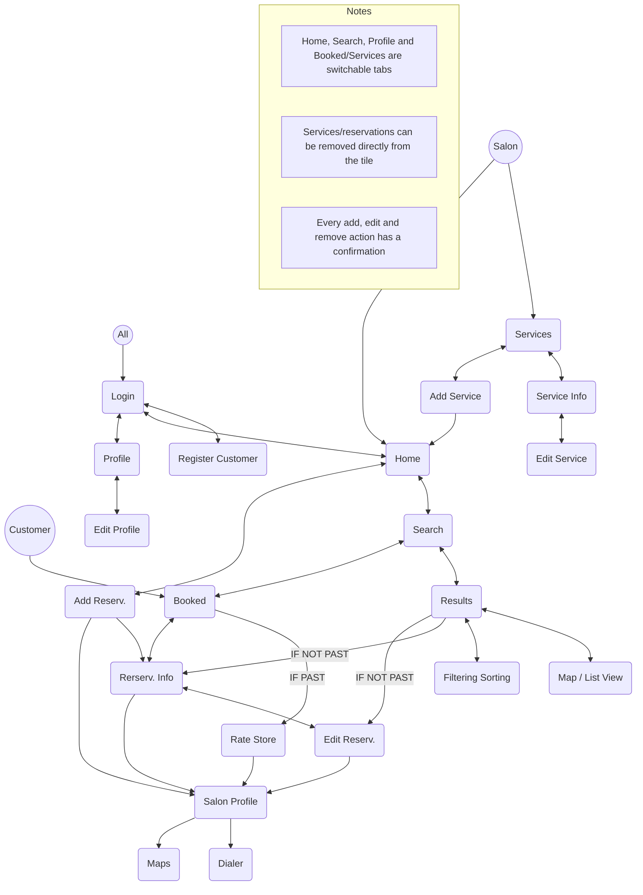

# CutitApp

An Android application for hairdressers and their customers

Michele Rizzo
University of Brescia

February 7, 2023

# Abstract

CutitApp is an Android application, specially designed for hairdressers and their customers.

The hairdresser can publish a service, e.g. *Haircut and Style* together with some details such as price and description.

The customer can browse among several offers, filter them, eventually book the desired one and rate the quality of the service.

In this article, I will go through the design and developing process.

# 1 User Research

The User Research phase involved interviews/questionnaires, personas and scenarios. This step was extremely important to determine the main needs of the app's potential users.

## 1.1 Interviews design

The original idea was to design a structured interview with a questionnaire. The interview aims to assess:

* General demographic information: age, city, education, employ and tech skills.

* Customers' habits, priorities and frustrations regarding hair salons.

* Experience with reservations and similar apps.

* Customers' needs and priorities.

* Hairdressers' habits and frustrations.

* Hairdressers' needs.

In the next sections I will report the full interview.

## 1.2 Interview

Hi, I'm Michele, an app designer and developer. The goal of this interview is to collect user informations for an app I'm developing: CutitApp. It is an app designed for hairdressers and their customers. Thanks to this app, hairdressers can list their services, making it available to potential customers to choose among them and make a reservation.

All the data collected during this interview are confidential: they're only used for investigation and design purposes by the development team. If you agree, we can start.

**Demographic**

1. What's your name? How old are you?

2. Where do you live?

3. What is your education?

4. What is your employment?

5. What are your smartphone and app skills? *Bad, medium, high*

**Customer habits**

1. How many hair salons are there in your city?

2. How often do you go to a hair salon?

<page_number>1</page_number>

3. Do you like experimenting with new hairdressers?

4. How do you discover them? *Word of mouth, social media, local advertisement, dedicated apps.*

5. What is important for you when you choose a hair treatment? *Price, distance, quality, etc.*

6. How do you usually book an appointment? *Phone, WhatsApp, website, apps, etc.*

7. Why? Is this the only way to book or you just like it?

8. Is there anything annoying with this booking method? If so, what? *E.g.. The hairdresser takes a long to answer the phone.*

## Experience with similar apps .

1. Have you used any beauty services/booking related apps?

2. What app?

3. What do you like about it?

4. What do you not like about it?

**App specific** Think about an app specifically designed for hairdressers.

1. What aspects would make you give it a shot? *Ease of use, modern and elegant graphic, time saving, discounts, reviews of the services, notifications, etc.*

2. What features do you expect from it? *Geo-localization based search, personalized suggestions, favorites, reservation history, edit/remove reservations, notifications for the next reservation, rating.*

## Hairdresser habits .

1. Are you the hair salon’s owner?

2. How many hairdressers work there?

3. How do your customers discover your activity and your services? *Word of mouth, socials, local advertising (radio, journals, ... ), apps, etc.*

4. Have you got a website?

5. How do you manage your appointments? *Paper agenda, website, app, etc.*

6. Is there anything annoying with this method? If so, what? *E.g. sometimes the Customers show up at the wrong time because they don’t have memos to remind them of their bookings.*

7. What aspects of using an app could be useful for a salon? *Easy management of services/reservations, reach more customers, receive feedbacks through reviews, etc.*

## Conclusion .

1. If such an app was developed, would you give it a try?

Thanks for your time and patience. Your interview will help us develop a useful app. This is the end of the interview.

# 1.3 Google Modules

Since the interviews require a lot of time to be done, in order to get a bigger amount of data I decided to turn it into a structured questionnaire deployed through Google Modules.

For this reason, I tried to transform as many open questions as possible into closed ones. For example, the technical skill level was turned into a 1 to 5 rating. The same criteria have been applied to all the questions related to the importance of certain aspects (like price, distance, quality) or to rate how relevant certain characteristics are to the app users (ease of use, graphics, time-saving, etc.).

The open questions that could have some suggestions were turned into multiple choice with the *other* option. For example, this is the case of the question regarding how the customer got to know the hair salons. Also, the expected app functionalities were turned into a multiple-choice question. Please, notice that such questions could have more than one answer.

<page_number>2</page_number>

# 1.4 Questionnaire results

The questionnaire was shared mainly on my Instagram. It had more than 30 responses, which is a statistically significant sample.

The age group of the sample, which is well balanced between males and females, is between 19 and 51 years; the most frequent one is 27. The users' locations are heterogeneous: even if Castiglione delle Stiviere is the most frequent, there are also users from Brescia, Rome, Cremona, Gravina in Puglia and other cities.

The education is divided between high school and degree (both Bachelor's and Master's). The sample has students, workers, architects, developers, and employees. The mean technology and app skill is over 4 out of 5.

<table>
  <tbody>
    <tr>
        <td>Age</td>
        <td>Count (Percentage)</td>
    </tr>
    <tr>
        <td>19</td>
        <td>1 (3.2%)</td>
    </tr>
    <tr>
        <td>20</td>
        <td>4 (12.9%)</td>
    </tr>
    <tr>
        <td>24</td>
        <td>2 (6.5%)</td>
    </tr>
    <tr>
        <td>25</td>
        <td>1 (3.2%)</td>
    </tr>
    <tr>
        <td>27</td>
        <td>9 (29%)</td>
    </tr>
    <tr>
        <td>28</td>
        <td>4 (12.9%)</td>
    </tr>
    <tr>
        <td>29</td>
        <td>4 (12.9%)</td>
    </tr>
    <tr>
        <td>31</td>
        <td>1 (3.2%)</td>
    </tr>
    <tr>
        <td>33</td>
        <td>1 (3.2%)</td>
    </tr>
    <tr>
        <td>35</td>
        <td>1 (3.2%)</td>
    </tr>
    <tr>
        <td>41</td>
        <td>1 (3.2%)</td>
    </tr>
    <tr>
        <td>43</td>
        <td>1 (3.2%)</td>
    </tr>
    <tr>
        <td>51</td>
        <td>1 (3.2%)</td>
    </tr>
  </tbody>
</table>

Figure 1: Ages

It turned out that the majority of the users goes to the hairdressers every two or three months; they discover new salons by word of mouth or simply passing near them by car. The most important factor to choose a treatment is the quality of the service, followed by the price and the distance from home. Also the friendliness, the hygiene and the usage of bio and qualitative products are pointed out.

<table>
  <tbody>
    <tr>
        <td>Rating</td>
        <td>Count (Percentage)</td>
    </tr>
    <tr>
        <td>1</td>
        <td>0 (0%)</td>
    </tr>
    <tr>
        <td>2</td>
        <td>1 (3.2%)</td>
    </tr>
    <tr>
        <td>3</td>
        <td>10 (32.3%)</td>
    </tr>
    <tr>
        <td>4</td>
        <td>15 (48.4%)</td>
    </tr>
    <tr>
        <td>5</td>
        <td>5 (16.1%)</td>
    </tr>
  </tbody>
</table>

Figure 2: Price

<table>
  <tbody>
    <tr>
        <td>Rating</td>
        <td>Count (Percentage)</td>
    </tr>
    <tr>
        <td>1</td>
        <td>0 (0%)</td>
    </tr>
    <tr>
        <td>2</td>
        <td>3 (9.7%)</td>
    </tr>
    <tr>
        <td>3</td>
        <td>10 (32.3%)</td>
    </tr>
    <tr>
        <td>4</td>
        <td>11 (35.5%)</td>
    </tr>
    <tr>
        <td>5</td>
        <td>7 (22.6%)</td>
    </tr>
  </tbody>
</table>

Figure 3: Distance from home

<table>
  <tbody>
    <tr>
        <td>Rating</td>
        <td>Count (Percentage)</td>
    </tr>
    <tr>
        <td>1</td>
        <td>0 (0%)</td>
    </tr>
    <tr>
        <td>2</td>
        <td>0 (0%)</td>
    </tr>
    <tr>
        <td>3</td>
        <td>1 (3.2%)</td>
    </tr>
    <tr>
        <td>4</td>
        <td>10 (32.3%)</td>
    </tr>
    <tr>
        <td>5</td>
        <td>20 (64.5%)</td>
    </tr>
  </tbody>
</table>

Figure 4: Service quality

The majority of the users book via phone (64.5%) or WhatsApp (19.4%) even though there are alternatives. Some users underline that they would prefer a smarter way to book such as an app with a calendar to check autonomously the availability of the salon. Just a few users (19.4%) searched and/or booked wellness treatments with dedicated Apps like Uala, Groupon or Maps. One of them noticed that such apps work better for big cities like Milan.

The characteristics that would encourage the customers to use a dedicated app for hair salons are in order: ease of use, saving time searching and booking a service, discounts, notifications for next appointments and the service reviews of the other customers; on the other way, an eye-catching and modern graphic seem not to be not to be as relevant as the other aspects.

<table>
  <tbody>
    <tr>
        <td>Rating</td>
        <td>Count (Percentage)</td>
    </tr>
    <tr>
        <td>1</td>
        <td>0 (0%)</td>
    </tr>
    <tr>
        <td>2</td>
        <td>1 (3.2%)</td>
    </tr>
    <tr>
        <td>3</td>
        <td>1 (3.2%)</td>
    </tr>
    <tr>
        <td>4</td>
        <td>7 (22.6%)</td>
    </tr>
    <tr>
        <td>5</td>
        <td>22 (71%)</td>
    </tr>
  </tbody>
</table>

Figure 5: Ease of use

<page_number>3</page_number>

<table>
  <tbody>
    <tr>
        <td>Category</td>
        <td>Value (Percentage)</td>
    </tr>
    <tr>
        <td>1</td>
        <td>0 (0%)</td>
    </tr>
    <tr>
        <td>2</td>
        <td>2 (6.5%)</td>
    </tr>
    <tr>
        <td>3</td>
        <td>12 (38.7%)</td>
    </tr>
    <tr>
        <td>4</td>
        <td>9 (29%)</td>
    </tr>
    <tr>
        <td>5</td>
        <td>8 (25.8%)</td>
    </tr>
  </tbody>
</table>

Figure 6: Modern graphic

<table>
  <tbody>
    <tr>
        <td>Category</td>
        <td>Value (Percentage)</td>
    </tr>
    <tr>
        <td>1</td>
        <td>0 (0%)</td>
    </tr>
    <tr>
        <td>2</td>
        <td>0 (0%)</td>
    </tr>
    <tr>
        <td>3</td>
        <td>2 (6.5%)</td>
    </tr>
    <tr>
        <td>4</td>
        <td>8 (25.8%)</td>
    </tr>
    <tr>
        <td>5</td>
        <td>21 (67.7%)</td>
    </tr>
  </tbody>
</table>

Figure 7: Time saving

<table>
  <tbody>
    <tr>
        <td>Category</td>
        <td>Value (Percentage)</td>
    </tr>
    <tr>
        <td>1</td>
        <td>0 (0%)</td>
    </tr>
    <tr>
        <td>2</td>
        <td>1 (3.2%)</td>
    </tr>
    <tr>
        <td>3</td>
        <td>6 (19.4%)</td>
    </tr>
    <tr>
        <td>4</td>
        <td>9 (29%)</td>
    </tr>
    <tr>
        <td>5</td>
        <td>15 (48.4%)</td>
    </tr>
  </tbody>
</table>

Figure 8: Discounts

<table>
  <tbody>
    <tr>
        <td>Category</td>
        <td>Value (Percentage)</td>
    </tr>
    <tr>
        <td>1</td>
        <td>0 (0%)</td>
    </tr>
    <tr>
        <td>2</td>
        <td>1 (3.2%)</td>
    </tr>
    <tr>
        <td>3</td>
        <td>6 (19.4%)</td>
    </tr>
    <tr>
        <td>4</td>
        <td>13 (41.9%)</td>
    </tr>
    <tr>
        <td>5</td>
        <td>11 (35.5%)</td>
    </tr>
  </tbody>
</table>

Figure 9: Service reviews

<table>
  <tbody>
    <tr>
        <td>Category</td>
        <td>Value (Percentage)</td>
    </tr>
    <tr>
        <td>1</td>
        <td>1 (3.2%)</td>
    </tr>
    <tr>
        <td>2</td>
        <td>4 (12.9%)</td>
    </tr>
    <tr>
        <td>3</td>
        <td>5 (16.1%)</td>
    </tr>
    <tr>
        <td>4</td>
        <td>8 (25.8%)</td>
    </tr>
    <tr>
        <td>5</td>
        <td>13 (41.9%)</td>
    </tr>
  </tbody>
</table>

Figure 10: Notifications for next reservations

Other suggestions are social media integration, showing the position on the map and the possibility to cancel the appointment in case of unexpected events.

Regarding the desired functionalities of the app, in order we have: edit/modify the reservation (93.5%), Geo-localization based search (83.9%), rating of the quality of the service (71%), reservation history (61.3%) and notifications (58.1%). Personalized suggestions and favorites get less than 40%.

Some users suggested an advanced filtering (like for the price) and a live chat with the hair salon.

The 61.3% of the users would use such an app if it existed and the 35.5% is skeptical (maybe).

Unfortunately, none of the users is an hairdresser. Despite this, some of them filled in also the part of the questionnaire dedicated to hairdressers.

It turned out that customers discover hair salons by word of mouth and the salons manage bookings mainly with a paper agenda. The main attractive aspect of a dedicated app such as CutitApp would be the possibility to reach more customers, followed by the easy management of services and reservations. Also the possibility to improve thanks to the users' reviews is an appreciated plus.

Since the lack of actual hairdressers, further ideas regarding the salon have been inspired by Treatwell. It is a very popular app for searching and booking general beauty treatments, such as massages, cosmetics treatments, hair, beard, etc.

<table>
  <tbody>
    <tr>
        <td>Category</td>
        <td>Value (Percentage)</td>
    </tr>
    <tr>
        <td>1</td>
        <td>0 (0%)</td>
    </tr>
    <tr>
        <td>2</td>
        <td>0 (0%)</td>
    </tr>
    <tr>
        <td>3</td>
        <td>0 (0%)</td>
    </tr>
    <tr>
        <td>4</td>
        <td>4 (40%)</td>
    </tr>
    <tr>
        <td>5</td>
        <td>6 (60%)</td>
    </tr>
  </tbody>
</table>

Figure 11: Easy management of the services

<page_number>4</page_number>

<table>
  <tbody>
    <tr>
        <td>Category</td>
        <td>Value</td>
    </tr>
    <tr>
        <td>1</td>
        <td>0 (0%)</td>
    </tr>
    <tr>
        <td>2</td>
        <td>0 (0%)</td>
    </tr>
    <tr>
        <td>3</td>
        <td>1 (10%)</td>
    </tr>
    <tr>
        <td>4</td>
        <td>3 (30%)</td>
    </tr>
    <tr>
        <td>5</td>
        <td>6 (60%)</td>
    </tr>
  </tbody>
</table>

Figure 12: Smart management of the reservations

<table>
  <tbody>
    <tr>
        <td>Category</td>
        <td>Value</td>
    </tr>
    <tr>
        <td>1</td>
        <td>0 (0%)</td>
    </tr>
    <tr>
        <td>2</td>
        <td>0 (0%)</td>
    </tr>
    <tr>
        <td>3</td>
        <td>0 (0%)</td>
    </tr>
    <tr>
        <td>4</td>
        <td>3 (30%)</td>
    </tr>
    <tr>
        <td>5</td>
        <td>7 (70%)</td>
    </tr>
  </tbody>
</table>

Figure 13: Possibility to reach more customers

<table>
  <tbody>
    <tr>
        <td>Category</td>
        <td>Value</td>
    </tr>
    <tr>
        <td>1</td>
        <td>0 (0%)</td>
    </tr>
    <tr>
        <td>2</td>
        <td>0 (0%)</td>
    </tr>
    <tr>
        <td>3</td>
        <td>0 (0%)</td>
    </tr>
    <tr>
        <td>4</td>
        <td>5 (50%)</td>
    </tr>
    <tr>
        <td>5</td>
        <td>5 (50%)</td>
    </tr>
  </tbody>
</table>

Figure 14: Possibility to improve with users' reviews

# 1.5 Personas Design

The structure of the personas is simple. I derived it analyzing several personas templates and contextualizing them to CutitApp.

**About** Generic demographic information together with some tags. The first tag is the role (customer or hairdresser), the others are personality traits such as analytical/creative, organized/messy and so on.

**Bio** Short description of the persona and its interests.

**Motivations** What encourages the persona to use the app? Ease of use, time-saving, the discovery of new hairdressers and finding low prices. The last two are substituted by finding new customers and organization for the hairdresser.

**Goals and Needs** What the persona needs in the context of the hairdressers' app.

**Frustrations** What are the main frustrations with the existent technology.

**Personality** 4-way Myers-Briggs indicator (introvert/extrovert, sensing/intuition, thinking/feeling, judging/perceiving) plus independent/team player.

**Technology skills** IT and internet, Mobile apps, Social networks, Online bookings.

**Brands** Social networks, music streaming services, fashion brands and other brands that the persona appreciates.

I paid particular attention also to the graphic design of the persona: the style is modern and minimal. I started from a community template found in Figma - the app I used to prototype -, I modded the style and created some custom components such as the personality sliders.

In the following sections I'll present four personas: two customers and two hairdressers.

<page_number>5</page_number>

# 1.5.1 Sophie Monroe


Sophie Monroe profile picture

**Sophie Monroe**
*Influencer*
*"Imagination is more important than knowledge"*

**About**
* 24
* Digital Innovation
* Milan
* Female
* Student
* Single

<mark>Customer</mark> <mark>Curious</mark> <mark>Energetic</mark>
<mark>Messy</mark> <mark>Creative</mark> <mark>Tech Savvy</mark>

**Bio**
Sophie is an enthusiast traveller and sea lover. She loves making shootings and endorsing beauty products in her free time.

**Motivations**

<table>
  <tbody>
    <tr>
        <td>Category</td>
        <td>Value</td>
    </tr>
    <tr>
        <td>Ease of use</td>
        <td>100</td>
    </tr>
    <tr>
        <td>Time saving</td>
        <td>30</td>
    </tr>
    <tr>
        <td>Discover new hairdressers</td>
        <td>60</td>
    </tr>
    <tr>
        <td>Find low prices</td>
        <td>10</td>
    </tr>
  </tbody>
</table>

**Goals and Needs**
* Easily find an hairstylist nearby when she is out of town for shootings.
* Rely on customer reviews to choose a good hairdresser.
* Experimenting new hairstylists.

**Frustrations**
* Beauty apps are too complex for her needs.
* It's hard to discover talented hairstylists.

**Personality**

<table>
  <tbody>
    <tr>
        <td>Left Trait</td>
        <td>Score (1-10)</td>
        <td>Right Trait</td>
    </tr>
    <tr>
        <td>Introvert</td>
        <td>9</td>
        <td>Extrovert</td>
    </tr>
    <tr>
        <td>Sensing</td>
        <td>7</td>
        <td>Intuition</td>
    </tr>
    <tr>
        <td>Thinking</td>
        <td>8</td>
        <td>Feeling</td>
    </tr>
    <tr>
        <td>Judging</td>
        <td>6</td>
        <td>Perceiving</td>
    </tr>
    <tr>
        <td>Independent</td>
        <td>3</td>
        <td>Team player</td>
    </tr>
  </tbody>
</table>

**Technology skills**

<table>
  <tbody>
    <tr>
        <td>Skill</td>
        <td>Level</td>
    </tr>
    <tr>
        <td>IT and Internet</td>
        <td>90</td>
    </tr>
    <tr>
        <td>Mobile apps</td>
        <td>80</td>
    </tr>
    <tr>
        <td>Social networks</td>
        <td>95</td>
    </tr>
    <tr>
        <td>Online bookings</td>
        <td>70</td>
    </tr>
  </tbody>
</table>

**Brands**
TikTok logo Instagram logo
Spotify logo ZARA logo H&M logo


Figure 15: Sophie Monroe, customer

Sophie Monroe is a young customer. She is freely inspired by the person in the questionnaire who was concerned because beauty apps often work only for big cities. She is an influencer and she needs to find a good hairdresser even when she is not in Milan.

Like it was pointed out by user research, she thinks that booking through the phone is not so handy. She tried some apps to search for hairdressers like Google Maps; this one specifically only redirects to the salon website - when there is one - or shows the phone number.

Core features for her are the Geo-localization based search and the rating of the hair salon's services. Furthermore, for her the app has to be simple and intuitive.

<page_number>6</page_number>

# 1.5.2 Simone Riccardi

User persona profile for Simone Riccardi, including photo, bio, motivations, goals, frustrations, personality traits, technology skills, and favorite brands.

Figure 16: Simone Riccardi, customer

Simone Riccardi is a middle aged customer. Like some people in the questionnaire, he doesn't like talking on the phone. He is an established manager, so he often has to reschedule his appointments (hair treatments included) to overcome last minute changes. Indeed, the possibility to cancel the appointment in case of unexpected events was one of the users suggestions. He needs a fast and reliable reservation system, so he can move or cancel a reservation without spending too much time.

Since he doesn't want to spend too much money, another important thing for him is the price of the treatments. He would love an advanced filtering feature, like some users of the questionnaire pointed out.

<page_number>7</page_number>

# 1.5.3 Marco Tagliaferri

User Persona Profile for Marco Tagliaferri

Photograph of Marco Tagliaferri

### Bio

Marco is the owner of a big hair salon. He loves talking with strangers and listen to their stories.

### Motivations

<table>
  <tbody>
    <tr>
        <td>Category</td>
        <td>Value</td>
    </tr>
    <tr>
        <td>Ease of use</td>
        <td>80</td>
    </tr>
    <tr>
        <td>Time saving</td>
        <td>90</td>
    </tr>
    <tr>
        <td>Find new customers</td>
        <td>30</td>
    </tr>
    <tr>
        <td>Organization</td>
        <td>40</td>
    </tr>
  </tbody>
</table>

### Goals and Needs

* Reliable and autonomous way to manage appointments.

* Leave the paper agenda and get digital.
* Easy access to the appointments' history.

### Frustrations

* He has to continously stop his activity to answer the phone.

* Huge amount of agendas accumulated during the years.

### Personality

<table>
  <tbody>
    <tr>
        <td>Trait A</td>
        <td>Position (0-100)</td>
        <td>Trait B</td>
    </tr>
    <tr>
        <td>Introvert</td>
        <td>25</td>
        <td>Extrovert</td>
    </tr>
    <tr>
        <td>Sensing</td>
        <td>40</td>
        <td>Intuition</td>
    </tr>
    <tr>
        <td>Thinking</td>
        <td>45</td>
        <td>Feeling</td>
    </tr>
    <tr>
        <td>Judging</td>
        <td>55</td>
        <td>Perceiving</td>
    </tr>
    <tr>
        <td>Independent</td>
        <td>65</td>
        <td>Team player</td>
    </tr>
  </tbody>
</table>

### Technology skills

<table>
  <tbody>
    <tr>
        <td>Skill Area</td>
        <td>Proficiency</td>
    </tr>
    <tr>
        <td>IT and Internet</td>
        <td>35</td>
    </tr>
    <tr>
        <td>Mobile apps</td>
        <td>40</td>
    </tr>
    <tr>
        <td>Social networks</td>
        <td>45</td>
    </tr>
    <tr>
        <td>Online bookings</td>
        <td>15</td>
    </tr>
  </tbody>
</table>

### Brands

Google logo
Coca-Cola logo
Wella logo

Android logo

Marvel logo

Figure 17: Marco Tagliaferri, hairdresser

Marco Tagliaferri is an experienced hairdresser, owner of a big hair salon. His salon is like the ones reported in the questionnaire: an old school one, where all the reservations are managed through a paper agenda.

Even if he is not a tech nerd, he wants to get digital because he thinks that the advantages are many. For example, the history of the appointments could be easily accessible. Ease of use is all for him.

Furthermore, he is tired of answering the phone while he is working; this is a huge waste of time and a loss of focus on the customer. An automated system, like an app, would be magnificent for him.

<page_number>8</page_number>

# 1.5.4 Sara Greco

Sara Greco photograph

**Sara Greco**
Junior hairdresser
"Alone we can do so little, together we can do so much"

**About**
* 25
* Luniklef
* Cosenza
* Female
* Sara's style
* Engaged

Hairdresser Ambitious Emotional
Dynamic Kind Tech Enthusiast

**Bio**

Sara has recently opened a small hair salon. She likes animals, reading and yoga. She really cares about her customers.

**Motivations**

<table>
  <thead>
    <tr>
        <th>Motivation</th>
        <th>Value</th>
    </tr>
  </thead>
  <tbody>
    <tr>
        <td>Ease of use</td>
        <td>40</td>
    </tr>
    <tr>
        <td>Time saving</td>
        <td>60</td>
    </tr>
    <tr>
        <td>Find new customers</td>
        <td>95</td>
    </tr>
    <tr>
        <td>Organization</td>
        <td>70</td>
    </tr>
  </tbody>
</table>

**Goals and Needs**

* Be known by more customers and expand the local business.
* Improve thanks to customers' feedbacks.
* Convenient appointments management.

**Frustrations**

* His customers are mainly local.
* Being alone, sometimes is difficult to keep things well organized.

**Personality**

<table>
  <thead>
    <tr>
        <th>Trait A</th>
        <th>Scale</th>
        <th>Trait B</th>
    </tr>
  </thead>
  <tbody>
    <tr>
        <td>Introvert</td>
        <td>[-------o--]</td>
        <td>Extrovert</td>
    </tr>
    <tr>
        <td>Sensing</td>
        <td>[-----o----]</td>
        <td>Intuition</td>
    </tr>
    <tr>
        <td>Thinking</td>
        <td>[--------o-]</td>
        <td>Feeling</td>
    </tr>
    <tr>
        <td>Judging</td>
        <td>[------o---]</td>
        <td>Perceiving</td>
    </tr>
    <tr>
        <td>Independent</td>
        <td>[-------o--]</td>
        <td>Team player</td>
    </tr>
  </tbody>
</table>

**Technology skills**

<table>
  <thead>
    <tr>
        <th>Skill</th>
        <th>Value</th>
    </tr>
  </thead>
  <tbody>
    <tr>
        <td>IT and Internet</td>
        <td>80</td>
    </tr>
    <tr>
        <td>Mobile apps</td>
        <td>75</td>
    </tr>
    <tr>
        <td>Social networks</td>
        <td>90</td>
    </tr>
    <tr>
        <td>Online bookings</td>
        <td>65</td>
    </tr>
  </tbody>
</table>

**Brands**
Instagram, L'Oréal, Amazon, Netflix logos

Figure 18: Sara Greco, hairdresser

Sara Greco is a young hairdresser who works on her own. She needs a smart way to manage her business. Her most important goal is to increase her clientele and to get known by more people, which was one of the most voted aspects in the questionnaire.

In addition, since she cares about her customers, she really wants to improve thanks to their reviews.

## 1.6 Scenarios

In the following sections I'll report on a different scenario for each persona.

The scenarios were thought to cover as many use cases as possible: for a customer book a reservation, edit or remove the reservation, rate the service; for a hairdresser add, edit or remove a service.

### 1.6.1 Sophie's scenario: booking an appointment

Sophie and Juliet are best friends since the elementary school; they are respectively 24 and 23 years old and they both study Digital innovation in Milan. They love making shootings during their free

time, so their hair must be always nice looking.

They have been selected by a beauty company who wanted to promote its products. The location chosen for the shooting is the Castle of Brescia. When they are out of Milan, it is not simple to find talented hairdressers nearby. They want to discover a good hairstylist close to the shooting's location and to make a reservation.

Sophie found an interesting application - called CutitApp - and they decide to give it a shot. She installs the app and opens it. Since she doesn't have an account yet, she immediately creates a new one giving her full name, gender preference, email, and password. The home page shows some suggested services near their location, but none of them matched with their needs: shampoo

9

and style. She goes to the search page and applies some filters: she leaves the "Female" toggle checked, she sets the minimum rating to 4 hearts out of 5 and the maximum distance to 10 km; she wants to find a near and valid hairdresser. Finally, she sets the dates interval to the next day and searches for the desired hair treatment.

The results are shown as a list and ordered by descending distance. The girls are attracted by the very first result, 3 km from their location with 4 hearths in the reviews and an affordable price. Sophie notices the "Map" toggle and taps it because she wants to explore the surroundings. She finds out that there is another result, not too far, that has a similar price but 4.5 hearts. She decides to book an appointment at this "Next Generation Hairdressers" hair salon. In the booking page, she selects the desired date and time, and she finally makes the reservation. The app asks for confirmation, and she confirms.

Juliet downloads the app and creates her account as well. Unlike Sophie, she is satisfied with the nearest result that they previously founded. She uses the same research words and the same filters as Sophie, she taps to add the reservation and she finds an appointment close to Sophia's. She books and confirms it.

Sophie and Juliet appreciate the geolocalization based search. Furthermore, the rating system for the quality of the service is crucial for them to avoid bad experiences. Juliet adds that in this way they can experiment new hairdressers without any concerns and have new hairstyle ideas for their shootings.

## 1.6.2 Simone's scenario: edit/remove a reservation and rate the service

Simone is a manager who works for Brembo, in Bergamo. He is a businessman; he often has to reschedule his commitments when his boss Camilla needs him for incoming meetings or calls.

Simone is 47 and Camilla is 54.

He had booked an appointment for a haircut with a brand-new app: CutitApp. He has to move it because Camilla called to inform him that there will be an urgent meeting; it overlaps his hair treatment.

Simone opens the app and right on the home page, in the next reservation section, he sees the "Haircut and shampoo" appointment. It is fixed for this evening at 17:30, but the meeting will end at 18:00 as Camilla said.

He decides to edit the appointment to see if it can be moved after the meeting. In the edit page he looks for other available slots on the same day. Unfortunately, it is all booked, so he cancels the modification and goes back to remove the entire reservation. He also confirms his intention when the app shows the confirmation dialog.

Since he really needs his hair to be cut, he decides to search for another salon. In the home page, he searches for "Haircut". He is fine with the list visualization, but he sorts the values by price ascending because he doesn't want to spend too much; he selects the today's date, then he filters them with the "Male" toggle and with a maximum distance of 10 km. He books and confirms the first result, "Simple haircut", which has a slot at 19:30 this evening and is very cheap: 13€.

Just before the appointment, he doesn't remember the hair salon's name nor the place he has to go. He opens the app, sees the reservation in the home and taps on it. In the details he reads that the salon is "Best barber", in via Garibaldi 4, Bergamo. Since he doesn't know where that address is, he clicks on the map button to open the location in Google Maps and starts the navigation towards it.

The hairdresser who cut his hair, reminded him to rate the service. Simone opens the app and goes in the Booked section. He taps on the last treatment and rate the service 5 hearts out of 5. He is very satisfied with it. He confirms his intention as well when the app asks for it.

Simone is very happy with this new app; he can manage unexpected last minutes problems and move the reservations without any problem and without spending too much time.

10

## 1.6.3 Marco’s scenario: add and remove services

Marco is an experienced hairdresser and owner of the hair salon “Best Barbers” in Brescia. They offer both male and female hair treatments for a total of over thirty services. They have a lot of customers and also a lot of appointments.

In the salon there are Marco (37 years old) and other four talented hairdressers: Francesca (27), Matteo (33), Gianluca (29) and Alice (31).

Marco is an old-fashioned man: he likes stuffs like vinyl and analogue photos, but he also trusts technology, even though his technological skills are very basic. Some days ago, he discovered a new app specifically designed for hairdressers: CutitApp. He decided to install it and to create a profile with the help of his younger colleagues. He said that it was time to move from the paper agenda to a digital solution. Now he wants to start to use the app, so he is willing to add the salon’s services and prices.

He opens the app and goes to the “Services” tab. He immediately notices the plus button, so he taps it to add a new service. First, he wants to add a shampoo and styling treatment, addressed for females.

He fills the “name” field with “Shampoo and style”, but he skips the description because he wants to take time to come up with a good one. He sets the price to 30€, the duration to 45 min and the Female tag. He goes back to the description and in a couple of minutes he writes a pleasant one; finally, he adds the service. The app asks for confirmation, and he does it.

Since the salon offers a lot of treatments, Marco decides to divide the work among all his younger colleagues. In this way, they are also able to try the app. Francesco, Matteo, Gianluca and Alice add some services each of them in the same way as Marco did.

Alice is the last and also the pickiest one, so she wants to check the inserted treatments. She goes to “Services” and inspected all the services one by one reading them to Marco. For each service, she taps on it and carefully reads the details. Luckily there are no errors, but Marco notices that

there is a treatment that is not so popular anymore: he tells Alice to remove it. She taps the remove button and confirms the operation.

After less than fifteen minutes, all the services are ready to get booked on the app. Marco is really happy: he has a ton of agendas in the archive; he jokingly says that all that paper now can be used for a tasty barbeque. Previously, he always had to stop his activity and the conversation with the customers at on the hairdressing chair because of the continuously ringing telephone. He had to answer the phone, take or modify the appointment with that customer, and go back to his work. Now, all of these processes will be automated.

## 1.6.4 Sara’s scenario: daily agenda and service edit

Sara is a young owner of a small hair salon in Cosenza. Since she’s the only hairdresser in the store, she is trying a digital way to manage her business.

Sara is 25 and she needs a simple way to handle her services and the daily agenda.

She downloaded CutitApp from the Play Store. She has already installed it and registered a salon profile with all her services. Since it is Friday and she’s tired, she does not remember all the appointments.

She opens the app and directly on the home page there is all the daily agenda. She realizes that she has a lot of customers today and that she will be done at 19:30. Scrolling down, she notices that a service’s name is misspelled: “Haircit and Style” instead of “Haircut and Style”.

She decides to modify that service. She goes to the “Services” tab and search for “Haircit”. She immediately finds the misspelled service and taps to edit it. In the edit page, she fixes the name and she decides to do a little discount for her customers: from 40€ to 35€. She saves the changes, grants the confirmation and gets back to the home page.

Now she’s ready to start this tough day at work. She enjoys the app: since she’s using it, managing her small business is simpler. She also got in touch with a lot of new customers who left all positive

<page_number>11</page_number>

reviews.

# 2 App Design

In the following sections I will explain the design of the app, from the users and the main functionalities to the navigation map and the prototypes.

Before starting the design phase, as I said previously, I looked for similar apps on the Google Play Store and I focused on Treatwell for its popularity. Taking Treatwell as an inspiration, my idea was to simplify at best the user interaction and to contextualize the app specifically for hair salons and their customers.

All this design phase is based on the previous user research. The choices made, the functionalities and the graphics had been influenced by the users’ suggestions.

## 2.1 Users

CutitApp is addressed to two kinds of user.

**Customer** Anyone that has a smartphone and needs an hair treatment. He can search for the desired service, eventually book it and then rate it.

**Salon/hairdressers** An hair salon or a freelance hairdresser who wants to manage its business in a digital way. He can offer services through the app.

Please, notice that both the customers and the hairdressers don’t belong to a specific user base. The only thing required is a basic familiarity with apps, which nowadays is very common for the majority of us.

## 2.3 Navigation Map

In this paragraph we will examine the general navigation map. The idea below that navigation organization is to keep things as simple as possible: no overabundant pages, no dead-ends, safe interaction.

## 2.2 Main functionalities

The main functionalities for a customer are:

* Login.

* Registration.

* Profile management.

* Service search and view as list or map.

* Service ordering and filtering based on GPS or other parameters like price, male/female, rating.

* Booking: add, edit or remove a reservation.

* Booking history.

* Rating for the quality of the service, 0-5 stars.

* Notifications.

Even though I thought about more features like the favorites management, these listed were the most appreciated in the user questionnaire. Besides the booking feature, the Geo-localization based search and the rating of the service seemed to be crucial to the users.

The main functionalities for a salon are:

* Login.

* Profile management.

* Services search and see them as a list.

* Services: add, edit or remove a service.

* Daily agenda.

Please, notice that the hair salons are assumed to be already registered.

<page_number>12</page_number>



Figure 19: Navigation Map

The first page presented is the *Login*; if the user is not registered, he can access the *Registration* page, fill the required information and create a new account. As observed before, only a customer user can register an account.

Once the login has been done or the registration has got success, the user is taken into the *Home* page where there are different layouts according to the user type. The customer can have the next reservations, the suggested services, whereas the salon can have the reservations for the current day and an add button.

Both a regular customer and a hair salon have a *Profile* page where a picture and some information are shown; these are editable in the dedicated *Edit Profile* page.

If the user is a customer, he/she can access the *Search* page where he can carry out an advanced search for a service. The results are shown in the *Results* page, where the customer can decide to view them in a list layout or in a map. The user can also sort the results and filter them by some criteria.

Once the customer has chosen a desired service, he/she can add it. In the *Add Reservation* page some details are shown and the user is asked to choose a day and a time for the appointment. After granting the confirmation for the booking, the details of the booked service are shown in the *Reservation Info* page.

The customer can go to the *Booked* page, where all the active are listed and the past reservations. Tapping on an active one, he is taken to the *Reservation Info* page again; here the user can decide to directly remove or edit the reservation. That is done through the *Edit Reservation* page. From this page he/she can cancel the modification and go back or confirm it. Tapping on a past reservation, the user is taken to the *Past Reservation* page where he can score the quality of the service and read some summary information.

From the *Add Reservation*, *Reservation Info*, *Edit Reservation* and *Rate Store* pages the user can access the Salon *Profile* page. This shows some information about the hair salon together with the possibility to directly call through the *Dialer* or

<page_number>13</page_number>

open the location on *Maps*.

The navigation for a hair salon user is quite simple. Besides the *Home* page and the *Profile*, it has the *Services* page. Here all the salon services are listed. The user can tap on a service to see the details in *Service Info*, or directly remove or edit it tapping on apposite buttons; in the last case the user is directed to *Edit Service*.

A new service can be added as well through the *Add Service* page; here some information such as details and price are required. Once the service has been added, it is shown in the *Service Info* page from which the service can be removed or edited in the *Edit Service* page.

Further clarification has to be done. The *Home* page, the *Profile* page, the *Search* page and the *Booked/Services* page are accessible from almost every other page, since, as we will see, the app is thought to have a tab layout. Furthermore, in order to avoid dead ends, it is always possible to cancel the current action or go back to the previous page. A final note is that every add, edit or remove action provides for a confirmation request. This leads to a clearer, safer and more simple interaction for the user.

# 2.4 Prototypes

The prototypes are digital, high fidelity and non-interactive. I decided to design the application with the well known prototyping software Figma. As a starting point, I used the Material Design community asset that includes the most common Android Material components. Some graphic components, like the various tiles, the navbar and the search bar with all the filters, were specially designed for CutitApp.

The graphics was intended to be minimal and clear, without too many colors or fancy decals. I tried to keep the style consistent throughout the application in order to make the user feel always comfortable. For example, the action buttons have always the same aspect as well as the tiles used to display results share the same style. This way, for the user is easier to develop the right affordance of the object. Even the space between objects or the buttons' dimension is thought to be comfortable

for the user.

The information are also curated: all and only the needed information are shown, with no over-abundant details. I tried to figure out what pieces of information were necessary and which were not for the specific purpose and context.

The design idea was to create a tab layout both for the customer and the hair salon side. In the following sections we will go through all the screen prototypes and we will discuss some graphical and content choices.

## 2.4.1 Login and Registration

The *Login* (figure 20) and *Registration* (figure 21) are very basic and inspired by pure Material design style.

Login screen prototype showing email and password fields with a login button

Figure 20: Login

<page_number>14</page_number>

Screenshot of a mobile registration form for a customer, showing fields for Full Name (Sophie Monroe), Preference (Female), Email (sophie.monroe@gmail.com), Password, and Confirm Password, with a "CREATE ACCOUNT" button.

Figure 21: Register (customer)

## 2.4.2 Customer side design

For the customer the layout is based on four tabs.

**Home** Shows the next reservation and some suggested services.

**Search** Dedicated to the search bar and some advanced filters.

**Booked** Lists the next reservations and the past ones.

**Profile** Displays the customer's details and the notification toggle.

Screenshot of the mobile app Home page, featuring a search bar, a "Your next reservation" tile for "BEST BARBER", and "Suggested for you" tiles for "NEXT GEN HAIRDRESSERS" and "JHONNY MAGIC SCISSORS". A navigation bar at the bottom shows Home, Search, Booked, and Profile tabs.

Figure 22: Home

In the *Home* page (figure 22) there is a quick search bar, the next reservation (if there is one) and some suggestions based on the Geo-localization and the preference of the user. Here the customer can start a research, add a suggested service, edit or remove the next one.

In the application, all the services and the reservations are presented as tiles. In the *Home* page two kinds of tiles can be appreciated: the next reservation one and the service one.

In the service tile are showed the hair salon name, the service name, the price, the rating, the distance and the add button. These information are crucial to help the user choosing the right service for his needs. In particular, the rating and the price that turned to be relevant for the customers in the user research phase, are highlighted with a brilliant color to catch the customer's eye.

In the next reservation tile are showed the hair salon name, the service name and the date of the appointment together with the edit and delete buttons; other informations such as the price or the distance are not crucial here because the user has already booked and is supposed to already know these details. The border of the tile is outlined

<page_number>15</page_number>

with the primary color so that the customer's attention is triggered.

## 2.4.3 Search and Results

Search interface screenshot with filters for gender, rating, price, distance, and dates

Figure 23: Search

In the *Search* page (figure 23), the customer can perform an advanced search. Beside the text search bar, there are some other elements:

* Gender preference toggles, male or female.

* Minimum rating, 0-5 hearths.

* Maximum price slider.

* Maximum distance slider.

* Dates interval choice button. This opens a calendar from which the user can select the starting and ending day.

The choice of these filters is again based on the questionnaire's results. They showed that the most important thing when a customer searches for a hair treatment is the quality, followed by the price and distance.

In the *Results* page (figure 24), the results are shown as a list of service tiles by default.

Results page screenshot showing a list of hair service providers with prices and distances

Figure 24: Results, List view

The list view offers the possibility to filter and sort the results expanding the relative drop down menu (figures 25 and 26). The filters are the ones discussed above, whereas the sorting can be done by distance, rating, first date available and ascending/descending price. These are reasonably the most common sorting criteria in similar apps.

<page_number>16</page_number>

Screenshot of a mobile application showing search results with filter options like gender, rating, price, distance, and date interval.

Figure 25: Results, sorting

Screenshot of a mobile application showing search results with sorting options like distance, rating, first date available, and price.

Figure 26: Results, filtering

Alternatively to the list view, the user can choose to view the results on a map (figure 27). In this case it is not possible to sort or filter the

results: zooming in a certain area will show the salons that are there. The service tile is slightly different respect from the list view one: the distance from the shop is not necessary in this case since we are in a map environment.

Screenshot of a mobile application showing search results on a map view with salon locations marked.

Figure 27: Results, Map view

## 2.4.4 Bookings

When the customer decides to add a reservation tapping on a service tile, the *Add Reservation* page (figure 28) is shown. Here there are some details about the service that is going to be booked, like the name, the price, a brief description of the treatment and the used products, the duration. A hair salon tile follows; it shows the name of the salon, the location, the rating and a small image.

A button opens a calendar (figure 29) to choose the day and a drop down menu allows the customer to select the time of the appointment. At the bottom of the page there is the action button to book that service.

All the important information and graphical elements (such as those for choosing the date and hour) are highlighted with the primary color.

<page_number>17</page_number>

# ✕ Book Reservation

## Color and style
40€

High quality color tint and accurate style for your hair. Choose among an high variety of styles and colors as well.

60 min

Screenshot of the Add Reservation screen showing salon details (NEXT GEN HAIRDRESSERS, Via Roma 47, Brescia), rating, and date/time selection fields.

Figure 28: Add Reservation

# ✕ Book Reservation

Calendar interface for July 2022 showing Friday, July 8 selected.

Figure 29: Add Reservation

Before booking, the customer is asked for a confirmation (figure 30).

# ✕ Book Reservation

## Color and style
40€

High quality color tint and accurate style for your hair. Choose among an high variety of styles and colors as well.

Screenshot of the confirmation dialog overlaying the reservation screen, asking "Do you really want to book for this service?" with CANCEL and CONFIRM options.

Figure 30: Add Reservation, confirm

By tapping on the hair salon tile, the customer is redirected to the *Salon Profile* page (figure 31). Here there is a picture, the general information of the salon (name, location, rating) and a list of services. The tile that represents the single service is a bit easier, since the details of the salon are shown above.

<page_number>18</page_number>

### Salon Profile

Screenshot of the Salon Profile page in the mobile application, showing salon details like name, address, and a list of services with prices and durations.

Figure 31: Salon Profile

From this page, the customer can directly call the salon or open it on Maps using the proper buttons.

### 2.4.5 Booked

In the *Booked* page (figure 32) there are the next reservations and the past ones listed in tiles. A single tile shows the salon's name, the service name and the date of the appointment.

Screenshot of the Booked page in the mobile application, displaying a list of upcoming and past reservations with details like salon name, service, and date.

Figure 32: Booked

The next reservation tile is outlined with the primary color to highlight it. Tapping on it leads the customer to the *Reservation Info* page (figure 33). This page shows the details of the reservation in a similar manner as the *Add Reservation* page does. The main differences are the rounded chips that show the day and the time of the appointment and the presence of the edit and remove buttons.

<page_number>19</page_number>

# Reservation Details

Screenshot of Reservation Details mobile app screen showing service info, date, time, and location.

Figure 33: Reservation Details

A future reservation can be edited or removed from the *Reservation Info* page or directly from its tile in the *Booked* page. The elimination asks for a confirmation, whereas the edit action leads the customer to the *Reservation Edit* page (figure 34). This is identical to the *Add Reservation* page; it lets the customer change the date of the appointment.

# Edit Reservation

## Color and style
**40 €**

High quality color tint and accurate style for your hair. Choose among an high variety of styles and colors as well.

Screenshot of Edit Reservation mobile app screen showing service info, location, and date/time selection fields with a Save button.

Figure 34: Edit Reservation

For a past reservation, the user can access the *Past Reservation* page (35), where it is possible to rate the quality of the service from 0 to 5 hearts. The layout is very similar to the previous pages; the only difference is the five hearts bar with the rate button.

<page_number>20</page_number>

Screenshot of Past Reservation screen showing service details "Color and style", price "40 €", description, location "Via Roma 47, Brescia", and a rating interface.

Figure 35: Past Reservation

## 2.4.6 Customer Profile

In the *Profile* page (figure 36) are shown some information of the user, like the full name, the email and the gender preference; there is also the notification toggle and the button to log out.

Screenshot of Profile screen showing user "Sophie Monroe", email "sophie.monroe@gmail.com", preference "Female", a notification toggle, and a logout button.

Figure 36: Profile

The profile can be edited in the *Edit Profile* page (figure 37). Also the profile picture can be changed; this triggers a popup to choose a new picture (figure 38).

Screenshot of Edit Profile screen with fields for "Full Name" (Sophie Monroe) and "Preference" (Female), and a "SAVE PROFILE" button.

Figure 37: Edit Profile

<page_number>21</page_number>

**X Edit Profile**

Screenshot of "Change profile picture" interface showing options for Camera and Gallery

Figure 38: Change profile picture

## 2.4.7 Hair salon side design

For the hair salon user the layout is based on only three tabs:

**Home** Shows the agenda for the current day.

**Services** Lists all the offered services.

**Profile** Displays the salon’s information.

In the *Home* page (figure 39) there is the daily agenda: a list of all the reservations of the current day. Each one is a simple tile with the treatment name and the time of the appointment.

Screenshot of the Home page showing "Today's reservations..." with a list of appointments

Figure 39: Home

## 2.4.8 Services

The *Services* page (figure 40) shows a list of tiles, one for each offered service. The name, the price and the duration of the treatment are displayed.

<page_number>22</page_number>

Screenshot of the Services list page showing various hair services like Haircut and style, Style and shampoo, and a floating plus button.

Figure 40: Services

Screenshot of the Add new Service form with fields for Name, Description, Price, Duration, and Type.

Figure 41: Add Service

To add a service, the user has to press the plus floating button. This leads to the *Add Service* page (figure 41). Here the user is asked to provide the name, the description, the price, the duration and the gender type for the service. The add button has to be pressed and the action confirmed to actually add the new service.

Tapping on a service, the *Service Info* page (figure 42) is shown. This is pretty similar to the customer's *Reservation Info* page. It hosts the information of the service such as the name, the price, the details and the duration. There is also a chip with the gender type.

<page_number>23</page_number>

# Service Details

Screenshot of Service Details mobile app screen showing service name "Color and style", price "40 €", description, duration "60 min", and category "Female" with edit and delete icons.

Figure 42: Service Info

From this page or from the service's tile - similarly to the customer side - the user can remove or edit the service itself. The *Edit Service* page (figure 43) is identical to the *Add Service* with the exception of the save button.

# Edit Service

Screenshot of Edit Service mobile app screen showing a form with fields for Name "Color and simple style", Description, Price "40", Duration "60 min", and Type "Female" with a SAVE button.

Figure 43: Edit Service

## 2.4.9 Salon Profile

In the *Profile* page (2.4.9) there are a picture, the salon's name, the location, the rating and other user's informations like the email, the phone and the number of hairdressers in the salon. At the bottom there is also the button to log out.

<page_number>24</page_number>

Screenshot of the Profile page showing salon details, contact information, and navigation bar.

Figure 44: Profile

Tapping the dedicated button, the profile's details can be edited in the *Edit Profile* page (45). The profile picture can be changed as well.

Screenshot of the Edit Profile page with fields for Name, Phone, Address, and Hairdressers.

Figure 45: Edit Profile

# 3 App Implementation

In this section I will discuss what changed from the design phase to the actual implementation of the application, analyzing both the graphical and the most important technical choices and showing the final navigation map.

## 3.1 Functionalities

The functionalities of the final app are pretty similar to the designed ones, with only some small differences.

A customer can:

* Login and register an account.

* Manage the profile: change the profile image and the preference between male and female services.

* Search for a service with advanced filtering and see the results as a list or on a map.

* Add, edit or remove a reservation.

* Consult the booking history, with next and past reservations.

* Rate the quality of the service, 0-5 stars.

In the design phase, the notifications were also mentioned. That would have been a nice touch for the user engagement; unfortunately, this feature could not be implemented for lack of time.

A salon can:

* Login.

* See the profile and change the profile image.

* Consult the agenda.

* See all the services on a list.

* Add, edit or remove a service.

Since the hair salons are assumed to be already registered, the editing of the profile is limited to the profile image. The other information such as the name, the location and the opening hours are not editable.

<page_number>25</page_number>

In the prototypes there is also a services search for the salon part. Given that the number of services that a salon offers is not so huge, the search feature is not crucial and has been postponed to the future upgrades.

A substantial difference from the design phase is in the agenda; it was thought to show only the appointments for the current day, but I thought that it could have been limiting, so I implemented a full agenda with selectable days.

## 3.2 Look and feel

The original prototypes were designed with Material Design 2 Components and the very first phase of developing involved these graphic elements. During the developing phase I decided to switch to the new Material Design 3 Components, to make the look and feel of the application more modern and pleasant.

I used the official material theme builder ([https://m3.material.io/theme-builder](https://m3.material.io/theme-builder)) to generate all the colors needed for the new theming to work, giving it a seed color as input. This way, the tiles and the graphical elements have dynamic colors: they are rendered light or dark depending on the system theme currently selected on the device.

In the application there are several kinds of tiles:

* Customer reservation, next or past.

* Customer service, essential or detailed.

* Customer salon profile.

* Salon reservation.

* Salon service.

The tiles are pretty similar to the ones designed in the prototypes, with few changes: the informations have been slightly re-arranged and better organized; the detailed service shows also an image profile and the next reservation tile that hasn't the colored border because it makes the user feel like it's selected and not simply underlined.

Customer next reservation tile showing "ON HAIR", "Haircut and Shampoo", and "Tuesday 14, February 2023, 09:30" with edit and delete icons

Figure 46: Customer next reservation tile

Customer past reservation tile showing "ON HAIR", "Color and Shampoo", "45€", and "Sunday 26, June 2022, 11:15"

Figure 47: Customer past reservation tile

Customer essential service tile showing "Keratin", "55€", and "30 min"

Figure 48: Customer essential service tile, used to show services under the salon profile.

Customer detailed service tile showing a salon photo, "CUTTING EDGE", "Beard premium", "30€", a star rating, and "27,7 km from you"

Figure 49: Customer detailed service tile.

Customer salon profile tile showing a salon photo, "Via delle Cave, Castiglione delle Stiviere", "ON HAIR", and a star rating

Figure 50: Customer salon profile tile

<page_number>26</page_number>

Haircut, Beard and Shampoo reservation tile

Figure 51: Salon reservation tile, used in the agenda.

Beard premium service tile

Figure 52: Salon service tile

## 3.3 Interactions

In order to improve the user experience, some interactions have been redefined and slightly modified from the designed ones.

**Graphic simplifications** In the tiles, some icons like the add icon and the info icon that are in the prototypes have been removed. The tile itself gives the affordance to touch its surface to do further actions or see the details of the item represented.

**Profile editing** The editing of the profile was thought to be in a separate screen; to simplify the interaction, the editing can be done directly in the profile page. There is a floating action button to immediately change the profile picture, a toggle to enable or disable the notifications and two chips to select the preference between male or female oriented services.

**Chips** The application makes an extensive use of chips, both in the filtering section and when alternatives (like male or female) have to be shown. The interaction is easier compared to making the user select an item from a drop down list.

**Filter dialog** The filter section has been redesigned; instead of showing the filters below the search bar with a collapsible approach, a bottom sheet dialog has been used. It pops up when the user taps on the filter button. The ordering options have been integrated in the filter dialog as well.

**Map results dialog** In the prototypes the results on the map are shown within place cards. This solution is not suitable when there are more resulting services related to a single salon. To overcome this issue, when a user taps on a salon, a bottom dialog pops up with the salon information and the list of resulting services.

## 3.4 Implementation choices

### 3.4.1 Filtering

The implemented filtering options for the services are:

* Text, searched both in the name and in the description of the service.

* Type, male or female.

* Maximum service's price.

* Maximum salon's distance.

* Minimum salon's rating, 0-5 stars.

In the prototyping phase a filter, based on a date interval, was meant to be added; this feature has not been implemented. Since similar bigger applications like Treatwell doesn't offer date filtering, it stands to reason that this option is not so relevant for the user.

The ordering options are:

* Services' price ascending.

* Salon's distance ascending.

* Salon's rating descending.

The original idea was to let the user choose between ascending and descending order. It is more common that the user wants to see cheaper, closer or higher rated results; it is a lot less likely that a customer wants to see more expensive or further results.

<page_number>27</page_number>

### 3.4.2 Booking

For the booking system, I made some choices to simplify the logic and the implementation.

First of all, the hair salons are pre-registered; the working days and the working hours are pre-defined, from 9:00 to 18:00, and they are not editable. The consequent limitations are that this system does not manage closure days nor eventual lunchtime.

A hair salon can have one or more hairdressers; currently, their number can't be changed from the app. The hairdressers are all supposed to work when the salon is open.

The working time is divided into slots of 15 minutes each, so the service is bound to have a duration that is a multiple of that base unit. Every slot can actually host multiple reservations at once, one for each hairdresser in the salon. It is not possible for the customer to choose a specific hairdresser.

A known limitation of the system is in the reservation edit. A customer cannot move a reservation in a slot that is already occupied by the reservation itself (before being moved). For example, if the reservation starts at 16:15 and finishes at 17:00, it can't be moved to 16:30 nor to 16:45 since it overlaps with the current slots reserved for it.

## 3.5 Technical details

In the following paragraphs I will introduce the principal and most relevant technical aspects of the implementation. Further details can be deepened by having a look at the code, that is properly commented.

### 3.5.1 Firebase

The authentication and the storage of the application are powered by Google Firebase cloud.

The authentication is simply based on mail and password, but it is not hard to implement third party authentication in the future.

The application saves on the cloud all the informations: the customers, the salons, their preferences and profile pictures, the reservations, the services and the salons' agendas.

Specifically, the images are saved into the Firebase Storage, whereas the objects are stored into the Firebase Realtime Database. This is a json tree based database, that is fast and reliable.

The root structure of the Realtime database involves:

* *reservations*

* *customers*

* *salons*

* *agendas*

* *services*

The objects are stored indexed by their *UID* for convenience: in this way it is relatively simple to retrieve a specific object. Please, notice that the *agenda* hasn't a specific UID, instead it is indexed by the UID of the salon that is referred to.

As the guidelines of Firebase Realtime suggest, the structure has been kept as flat as possible. The de-normalization of data, that is to avoid nested structures, is crucial for efficiency: when you fetch a node in a json tree, you will also get all of its child nodes. With a flat structure, the data can be downloaded in separate calls, as needed.

### 3.5.2 Packages

The application's classes are organized into the following packages:

**models** It contains the *model classes*, the *adapters* and the *view models*.

**managers** Singleton objects useful to manage the Firebase Realtime database, the Firebase Storage and the filtering.

**tools** It includes utilities, item decorator, observer, validator.

**activities** It hosts the activities, both for the customer and the salon side.

**fragments** It contains the fragments, both for the customer and the salon side.

There is also a *Constants* class, out of the packages, that is a singleton object containing all the constants used in the code.

<page_number>28</page_number>

### 3.5.3 Model classes

The model classes are designed for objects intended to be stored in the Firebase Realtime database. For this reason, some requisites have to be fulfilled together with some tricks.

**Empty constructor** Each class should have an empty constructor.

**Empty properties** Firebase does not store objects (like hash maps) that are empty, so when the parent object is created from the Realtime database, these fields that are empty objects will be null. It is necessary to initialize these properties when the object is collected from Firebase to avoid null exceptions.

**Hash maps** The usage of lists has been avoided in favor of hash maps; this way every element of the list has a unique key that makes it easily accessible. For example, the lists of strings (like a list of UIDs) have been substituted by an hash map of (*string, boolean*). The choice of a boolean value is not accidental: it is space saver and in some cases it should be helpful to indicate whether the UID is still active or not, like in the case of salons' services.

The main model classes that can be found in the application are:

**Customer** Has full name, email, preference, notifications, URL of the profile picture and a hash map of reservation's UIDs.

**Salon** Has a name, email, address (*CustomAddress*), phone, URL of the profile picture, number of hairdressers, opening and closing hours, rating, hash map of service's UIDs. It also has an hash map of ratings like (*serviceUid, (customerUid, rating)*) and a method to add a rating to the object itself and also to the database.

**Service** Has name, description, type, price, duration, a reference to the salon. It also has an active flag; when a service is removed or edited, the old one is kept as inactive. This way, the service reference in the past reservation is not lost. Furthermore, it is not possible for the Salon to change crucial information like the price and the description after that a service has been booked.

**Reservation** Has date and a time, that are stored as strings for space efficiency. It also has UIDs' references to the salon (for time efficiency), to the customer and to the service.

There are also classes related to the booking logic:

**Agenda** Has a hash map of (*dateString, day*). It has a method that checks if a desired time interval is available, eventually adding a new day to the agenda and to the database if it is not present yet. It also has methods to add, edit and remove a reservation and a method to collect all the slots that are bookable for a reservation of a given duration in a given date.

**Day** Has a date, hairdressers' number, opening and closing time and an hash map of *timeString, slot*. It is similar to the agenda: it has a method that checks the availability and eventually adds the slot if it is missing and a method that gives the bookable slots for that day.

**Slot** Has a starting time and a hash map of (*reservationUid, boolean*) that stores the UIDs of the reservations booked in that slot.

The last class is *UserType*, that is an enumeration.

### 3.5.4 Adapters

In the application there are a lot of Recycler Views displaying services, slots or reservations. Each of them needs a custom adapter and several layout items.

Every adapter manages the list of data associated with it internally, with methods that allow to add and remove a single item or a list of them. In this way, the adapter can be used as a black box from the other classes, without having to worry about managing the related data.

<page_number>29</page_number>

When an item has to be shown in the UI, the adapter cares about getting the additional information needed from the database. For example, a service tile in the UI, needs also information on the salon, its image and the distance from the user.

All these extra information are stored inside the adapter itself (in hash maps) to realize an effective caching system. This way, it is avoided to request several time the same object.

The adapters have been designed to be flexible to display items with different layouts, according to the UI’s needs.

**ReservationAdapter** Manages the reservation tiles both for the salon and the customer side; for the latter, there is a further distinction between present and past reservation.

**ServiceAdapter** Manages different tiles for salon and for the customer side. Even in this case, the service tile for the customer can show two distinct layouts with only the essential information or with the fully detailed ones.

**SlotAdapter** it is the simplest adapter, with only one possible layout representing the slot’s starting time. When the slot is selected, the item is circled.

## 3.5.5 View Models

The View Models logic is adopted to achieve asynchronous communication between host activities and child fragments.

The *LocationViewModel* is used to inform the fragments when the user location has been collected, so that they can update the distances from the salons or the customer position on the map.

The *FilterViewModel* is used to share the filtering and ordering parameters between the filter dialog and the search fragments.

## 3.5.6 Managers and Tools

The managers include singleton objects:

**DBManager** Manages the Firebase Realtime database; it contains methods to collect and modify data.

**StorageManager** Manages the Firebase Storage, with methods to get and upload the profile pictures.

**FilteringManager** Manages the filtering and the ordering of the services.

The tools are a collection of utilities functions and classes:

**Utils** Utilities methods to format dates, convert images, addresses, show confirmation dialogs or date pickers, check and requests permissions (location and call), start activities, switch fragments.

**Validator** Helper class for input fields validation, like name, email, password with confirmation and also drop-down inputs like duration or preference. It is used in combination with *TextWatchers* to validate the fields on text changed and eventually show the errors.

**CustomItemDecoration** Decorator for the Recycler Views that adds a custom space between the tiles.

**EmptyDataObserver** Observer for empty Recycler Views; it shows an empty item with a customizable message.

## 3.5.7 Activities and Fragments

The main activities both for the customer and the salon side host a bottom navigation, with one fragment for each tab.

Regarding the design of the fragments, they are created using the *factory method* to easily pass parameters from the parent activity or fragment.

The customer side has the *Home*, *Booked*, *Search* and *Profile* tabs. The *Search* fragment has a search bar and, with the help of a *Coordinator Layout*, it hosts two switchable fragments to show the results as a list or in a map.

The salon side has the *Home*, *Services* and *Profile* fragments.

To improve the user experience and to avoid downloading data every time a fragment is created, the application uses a fragment switching system. When the user goes from a tab to another, the

<page_number>30</page_number>

old fragment is kept in the fragment manager; it is actually hidden and not destroyed, ready to be displayed again without being created from scratch. This strategy leads to a fast experience for the user, together with an optimized management of bandwidth and data.

Many of the application’s activities and fragments show lists of items in Recycler Views.

In order to keep the data synchronized between the database and the application, it has been made extensive use of *EventListeners*. This way, when an item changes is added or removed in the cloud, the UI can immediately show the changes.

For example, in the home page of the salon, when a reservation changes, also the agenda for that day is immediately updated in the UI. Furthermore, in the customer’s profile the synchronization is bi-directional: the user’s changes are reflected in the database and vice-versa.

The advantage is the scalability: if in the future a web application would be made, when the user changes something from the web page, the information shown in the app are updated as well.

Some activities are modular; they behave differently according to the parameters passed in the intents:

**CustomerReservationInfo** If the reservation is past, it starts the *rating* fragment, otherwise if the reservation is a future one it shows the edit and remove buttons.

**CustomerBooking** It can add a new reservation or edit an existing one; to add a new reservation, the service UID and the customer UID have to be passed, whereas to edit an existing one only the reservation UID is needed.

**SalonServiceManagement** It can add a new service or edit an existing one; in the first case no parameters are needed, while in the second case the service UID has to be passed.

As a final note, the layouts of all the activities and the fragments are managed with *View Binding*. Please, notice that when a fragment is destroyed, the relative binding is destroyed too to avoid null exceptions; all the listeners and the observers are unregistered.

<page_number>31</page_number>

# 3.6 Activities navigation map

```mermaid
graph TD
    All((All)) --> Login[Login]
    Login -- LOGIN success --> Main_Salon[Main]
    Login -- REGISTER --> Register[Register]
    Register -- CREATE success --> Main_Customer[Main]
    Login -- LOGIN success --> Main_Customer

    subgraph Salon_Side [Salon]
        Salon((Salon)) --> Main_Salon
        Main_Salon --> Home_Salon(Home)
        Main_Salon --> Services(Services)
        Main_Salon --> Profile_Salon(Profile)
        
        Home_Salon -- EDIT success --> Service_Management(Service Management)
        Services -- ADD success --> Service_Management
        Services -- REMOVE success --> Service_Management
        Services -- ADD || EDIT from tile --> Service_Management
        Services -- SERVICE --> Service_Info(Service Info)
        Service_Management -- EDIT --> Service_Info
        Service_Info -- REMOVE success --> Services
        
        Profile_Salon -- LOGOUT success --> Login
    end

    subgraph Customer_Side [Customer]
        Customer((Customer)) --> Main_Customer
        Main_Customer --> Profile_Customer(Profile)
        Main_Customer --> Booked(Booked)
        Main_Customer --> Home_Customer(Home)
        Main_Customer --> Search(Search)
        
        Profile_Customer -- LOGOUT success --> Login
        
        Booked -- PAST || NEXT RESERVATION --> Reservation_Info(Reservation Info)
        Reservation_Info -- IF PAST --> Rating(Rating)
        Reservation_Info -- SALON --> Salon_Profile(Salon Profile)
        Reservation_Info -- NEXT RESERVATION --> Booked
        
        Home_Customer -- SERVICE || NEXT EDIT --> Booking(Booking)
        Home_Customer -- NEXT EDIT --> Reservation_Info
        
        Booked -- REMOVE success --> Booked
        Home_Customer -- REMOVE success --> Home_Customer
        
        Booking -- SALON --> Salon_Profile
        Booking -- BOOK ADD || EDIT success --> Home_Customer
        
        Search -- TOGGLE --> List_Results(List Results)
        Search -- TOGGLE --> Map_Results(Map Results)
        Search -- FILTER --> Filter_Dialog(Filter Dialog)
        
        List_Results -- SERVICE --> Booking
        Map_Results -- SALON --> Map_Results_Dialog(Map Results Dialog)
        Map_Results_Dialog -- SERVICE --> Booking
        
        Salon_Profile -- MAPS / CALL --> Google_Maps_Dialer[Google Maps || Dialer]
    end

    style Login fill:#9b59b6,color:#fff
    style Register fill:#9b59b6,color:#fff
    style Main_Salon fill:#f1c40f
    style Main_Customer fill:#f1c40f
    style Google_Maps_Dialer fill:#27ae60,color:#fff
```

Figure 53: The final navigation map, with activities and fragments.

In the following paragraphs I will describe the final navigation map for all the activities and the fragments. Before starting, some notes are needed:

* The back navigation to the previous activity or fragment is permitted almost always; to simplify the description it will be omitted. In the navigation map, the back navigation is represented with an outlined arrow. A filled arrow represents forward navigation.

* Actions like add, edit, remove or service rating ask the user for confirmation; this interaction is not shown for simplicity as well.

* The activities are graphically represented as square, the fragments have rounded borders.

## 3.6.1 Customer navigation

The customer starts at the *Login*; here the user can login or, differently from the salon side, he/she can tap on the register button to reach the *Register* page. Tapping on the create account button,

<page_number>32</page_number>

if the fields are valid and the registration has been successful, the customer is directed to the *Main* activity. This activity hosts a bottom navigation with four switchable tabs: *Home* (the default one), *Search*, *Booked*, *Profile*.

In the *Profile*, some account's details are shown; here the customer can edit the service's type preference selecting the desired chip or change the notification preference, toggling the switch. There is also a logout button, that leads the user to the login.

In the *Booked* page there are a list of next reservations and a list of past reservations. Tapping on a past reservation tile, the customer is lead to the *Reservation Info* page, that shows information about the reservation and a salon tile. If the customer hasn't rated the service yet, a *Rating* fragment with a rating bar and a rate button is shown.

Tapping on a next reservation instead, the customer is again directed to the *Reservation Info* page, but in this case he/she can edit or remove the reservation tapping on the relative buttons. The remove action leads the user back to the *Booked* page, whereas the edit action leads to the *Booking* page.

In the *Home* page there is a list of next reservations and a list of suggested services. The interaction with a next reservation tile is the same as what has already been descripted. Tapping on a service tile, directs the customer to the *Booking* page with the intention to add a new reservation.

In the *Booking* page further details about the service are shown with also a salon tile; the user is asked to select a date (through a date picker) and a time (through a slots' list) for the reservation. If the operation is editing, the reservation's date and time are pre-selected. Tapping on the book button, if something changed or the reservation has been added, the customer is lead to the *Home* page where the new reservation is shown. Otherwise, if nothing changed the user is directed back towards the previous page. The user is informed if he/she forgot to select the date and the time.

Tapping on a salon tile, the customer is lead to the *Salon Profile* page, where the salon and its services are shown. The interaction with a service tile

has already been discussed. In this page there are also two buttons that let the customer call (*Dialer*) the salon or open *Google Maps* to see the salon's location.

The last tab is the *Search* page. It hosts a search bar for textual filtering, a button to toggle the list (*List Results*) or map (*Map Results*) view and a button to show or hide the *Filter Dialog*.

The *Filter Dialog* displays the filter's parameters such as service's type, maximum price and distance sliders, minimum rating. It shows also three chips that allow the user to select the desired ordering for the results.

The *List Results* shows a list of filtered services tiles, whereas the *Map Results* displays a map with salons. Tapping on a salon's marker, a *Map Results Dialog* is shown. It is a bottom sheet dialog that displays salon's informations and a list of filtered services tiles.

## 3.6.2 Salon navigation

The first screen is the *Login*; tapping on the login button, if the authentication is successful the user goes to the *Main* activity. Here there is a bottom navigation with three switchable tabs: *Home* (the default one), *Services*, *Profile*.

In the *Home* the daily agenda of the salon is displayed: it is actually a list of reservations ordered by ascending time. The user can tap on the date to select a different day through a date picker.

In the *Profile* some details about the salon and the salon's profile image are shown. The user can change the profile picture or tap on the logout button to be redirected to the login.

In the *Services* there is the entire list of the salon's services and an add button. The user can:

* Tap on a service tile to go to the *Service Info* page.

* Tap on the remove button to delete a service; in this case the user stays in the *Services*; the services are updated.

* Tap on the add or edit button, that directs towards *Service Management* with adding or editing purpose.

<page_number>33</page_number>

In the *Service Info* some additional information about the service are shown; from here, the user can edit or remove the service tapping on the relative buttons. In the first case the user is redirected to *Service Management*, in the second is directed back to *Services*.

In the *Service Management* the user can add a new service or edit an existing one. If the adding or editing operation has been successful, the user is directed respectively to *Services* or to *Home*.

A better navigation choice would have been directing the user back to *Service* after the editing success. The decision to redirect the user to

the *Home* instead, has been made for convenience; there is one scenario in which the user reaches *Service Management* coming from *Service Info*’s edit. In this particular context, going back from *Services Management* after a successful edit would lead to a *Service Info* showing the old service’s informations, that has to be avoided.

This choice has been made to overcome the limitations of the navigation system used; the navigation between fragments and activities has been managed in the most simple way: it is only capable to get back to the previous screen and not to an arbitrary one.

## 3.7 Screens

Login screen screenshot

Login

Register screen screenshot

[customer] Register

<page_number>34</page_number>

Navigation bar with Home, Booked, and Profile icons

Mobile app screen showing Next Reservations and Suggested for you sections

[customer] Home

Mobile app screen showing search results for haircuts and beard services

[customer] ListResults

Mobile app screen showing Next Reservations and Past Reservations sections

[customer] Booked

Mobile app screen showing a filter dialog for service type, price, distance, and rating

[customer] FilterDialog

User profile screen for Michele Rizzo with preferences and notification settings

[customer] Profile

Map view showing service locations around Brescia and Lake Garda

[customer] MapResults

<page_number>35</page_number>

Screenshot of a mobile app showing a map with salon locations and a list of services for "ON HAIR" salon.

[customer] Map Results Dialog

Screenshot of a mobile app booking screen for "Haircut and Shampoo" at "ON HAIR" salon, showing service details, date selection for 14 February 2023, and time slots.

[customer] Booking

Screenshot of a mobile app showing "Reservation details" for a "Haircut and Shampoo" appointment on 14 February 2023 at 09:30 at "ON HAIR" salon.

[customer] Next Reservation Info

Screenshot of a mobile app showing a booking screen for "Beard premium" at "CUTTING EDGE" salon with an "Edit reservation" confirmation dialog overlay.

[customer] Edit Confirmation

Screenshot of a mobile app showing "Reservation details" for a "Simple beard" appointment on 23 July 2022 at 17:15 at "ON HAIR" salon, including a rating section.

[customer] Past Reservation Info

Screenshot of a mobile app showing the "Salon Profile" for "ON HAIR", listing various services like "Color and Shampoo", "Simple beard", "Keratin", and "Complete beard" with prices.

[customer] Salon Profile

<page_number>36</page_number>

Screenshot of the Home screen of a salon application showing a daily agenda for 2 February 2023 with various hair and beard services listed with their times and prices.

[salon] Home

Screenshot of the Home screen in dark mode, showing the same daily agenda as the previous image.

[salon] Home (dark)

Screenshot of the Services screen showing a list of available services like Beard premium, Haircut and Shampoo, etc., with edit and delete icons.

[salon] Services

Screenshot of the Add Service screen with a form containing fields for Name, Description, Price, Duration, and Type.

[salon] Add Service

Screenshot of the Profile screen showing salon details: Cutting edge, email, rating, opening hours, address, and phone number.

[salon] Profile

Screenshot of the Edit Service screen showing the details for "Beard classic" service being edited.

[salon] Edit Service

Composite image showing all the previous screenshots together.

<page_number>37</page_number>

Screenshot of a mobile application showing a date picker overlay on a "Daily Agenda" screen. The date picker is titled "Data selezionata" and shows the month of "Febbraio 2023". Below the overlay, a service "Haircut, Beard and Shampoo" for 35€ is visible.

[salon] Agenda date picker

## 3.8 Testing

The application has been tested for few days by a team of three computer engineers (me and two other friends of mine). This process helped to figure out several bugs and interaction issues.

As an example, in the previous alpha version of the application, when a customer edited a reservation, the date and the time were not set. This forced the user to manually select the day even if his/her intention was to change only the time.

## 4 Future Improvements

Since the application offers just the basic features for hair salons and their customers, there is a big margin for improvement.

Some great features could be:

* Salon’s registration and profile editing, with custom opening days and times.

* Guest user possibility.

* Password change.

* Third party login.

* Gamification.

* Advanced tags system and filtering.

<page_number>38</page_number>

Textualreviews.

Favorites.

39