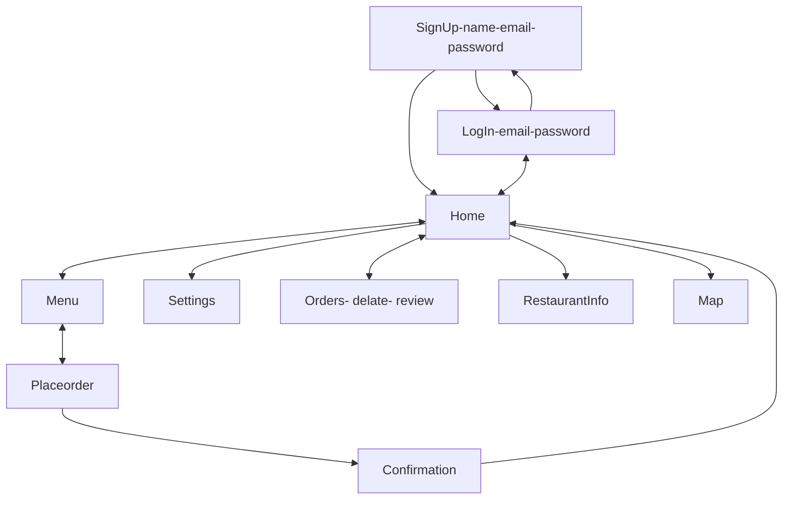
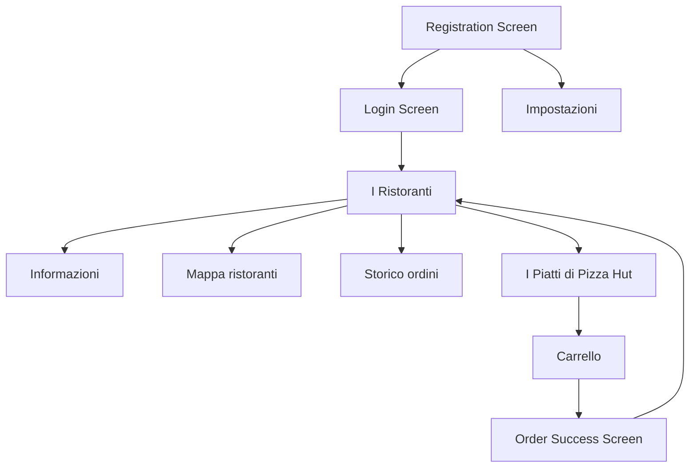
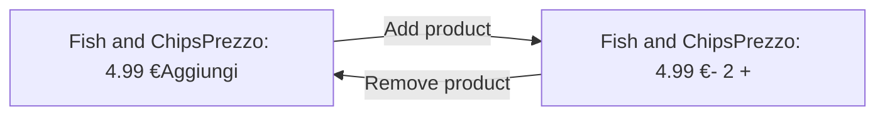
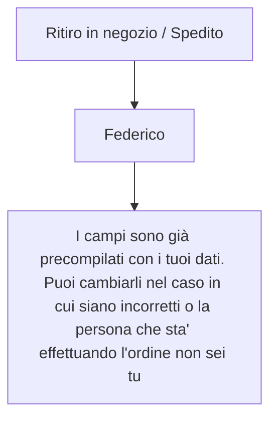

# Summary

Introduction 3
User Research 4
- User Profile 4
- User questionnaire and results 6
  - The questions 6
  - Results analysis 6
Personas 7
App Design 11
- Similar app research 11
- Navigation Map 13
- Interactive Mockup 16
- Mockup Navigation Map 17
- Mockup Pages 18
  - Login 18
  - Signup 19
  - Home 19
  - Restaurant Info 20
  - Restaurant Menu 21
  - Place Order 22
  - Order Confirmation 23
  - Map 23
  - Order History 24
  - Settings 25
- Mockup Testing 25
Implementation 26
- Google Firebase 26
- Login Activity 29
- Signup Activity 31
- Restaurant Activity 33

Map Activity 37
History Activity 38
Restaurant Info Activity 44
Menu Activity 45
Cart Activity 48
Success Order Activity 52

# Introduction

Fooddy is an application created with the intention of providing the ability to book and eventually ship the meals that the restaurants on the application provide. The operations of the application are simple and intuitive thanks to a clean graphics and with a good affordance.

The steps that the new user must perform to start using the application are very quick: it is only necessary a registration to the service and having provided a name, an email and a password, the user can start using the services made available by Fooddy.

In a few the user can select a restaurant of his liking from the list of restaurants present on food passages, choose which pious takeaways from the selected restaurant to choose whether to collect the meal in the store or have it sent home paid for and that's it. wait to enjoy your order.

This document will show all that have been carried out for the steps to the realization of the Fooddy app, from its conception, to its prototyping and finally to the drafting of the code that composes it.

A particular aspect of Fooddy is the fact that any data processed by the application (be it authentication data, restaurants and their menus or the order list of each user) is managed entirely in the cloud thanks to the use of Google Firebase. Each data can be recovered from a json file present in the Google database and this opens the door to the realization of interesting future developments such as the creation of a web platform that allows restaurants to check their orders, which see orders are still to be processed and in general information about your restaurant (such as opening and closing times or minimum shipping costs per order).

# User Research

Before starting the design phase of the application, some investigations were carried out that could guide the development of the realization. In particular, we tried to define a typical user of the future application by explaining his characteristics and his interests, after which, a survey was carried out on 8 people who answered a pool of questions in order to have clearer ideas about it. what and how to implement functions in the application and to add more information to the user profile. Naturally we tried to recruit for the survey people who respected as much as possible the prototype of the typical user described above.

Finally, 3 personas profiles were created based on both the user profile and the questionnaires so that during the development of the application it was always possible to have in mind for which class of users the application was being created. A storyline has been defined for each persona.

## User Profile

Fooddy was designed to make it quick and easy to book and collect (or deliver) dishes from restaurants on the platform. Since this is a smartphone application, the user must know how to use this device, therefore people with age groups indicatively over 80 and no less than 10 years old are to be excluded. The application allows you to pay for the order placed also in cash, although the user is not required to have a bank account and therefore be over 18 years old. However, the surveys <sup>1</sup>show that only about 4 percent of people over 50 use food delivery apps while the majority of users (87%) are between 18 and 50 years old with a peak of 28.9 % for the age group ranging from 25-29 years. Given the data and the mission of the application, it can be concluded with regard to the age that the typical user has an age ranging between 18-50 years.

Its attitude is positive as it is a simple application that satisfies a user's need (to be fed) quickly and comfortably. The motivation, on the other hand, is low as there are dozens of food delivery applications on the market and the features that are offered to the user of the Fooddy app are present in even more elaborate ways on various other platforms.

The user is not required to have a particular degree, while a sufficient degree of computer literacy is required to allow him to install and use a smartphone app. It is not necessary that the user has already used a food delivery application in the past, but if he has done so he will find in Fooddy an environment familiar to many applications of the same category.

<sup>1</sup> https://www.statista.com/statistics/1123071/china-food-delivery-app-users-by-age-group

As regards the frequency of use, it is known that food delivery applications are not used daily but rather a few times a month (according to a survey<sup>2</sup> on zionandzion.com in 3 months 48% of respondents used a food delivery app only 1 or 2 times and 24% 3 or 4 times, only 7% of people said they used a food delivery app more than 11 times in 3 months). Given the low frequency with which this type of app is used, it will be necessary to make the application as intuitive as possible as a user does not want to learn complex procedures if he then uses the application only a few times a month.

## Summary Table

<table>
  <thead>
    <tr>
        <th>Characteristic</th>
        <th>Typology</th>
    </tr>
  </thead>
  <tbody>
    <tr>
        <td>Age</td>
        <td>18-50</td>
    </tr>
    <tr>
        <td>Gender</td>
        <td>Any</td>
    </tr>
    <tr>
        <td>Cognitive style</td>
        <td>Any</td>
    </tr>
    <tr>
        <td>Attitude</td>
        <td>Positive</td>
    </tr>
    <tr>
        <td>Motivation</td>
        <td>Low</td>
    </tr>
    <tr>
        <td>Educational qualification</td>
        <td>Any</td>
    </tr>
    <tr>
        <td>Native language</td>
        <td>Italian</td>
    </tr>
    <tr>
        <td>IT literacy</td>
        <td>Mid/Low</td>
    </tr>
    <tr>
        <td>System Usage</td>
        <td>Optional</td>
    </tr>
    <tr>
        <td>Frequency of use</td>
        <td>Low</td>
    </tr>
    <tr>
        <td>Training</td>
        <td>Unnecessary</td>
    </tr>
    <tr>
        <td>Turnover</td>
        <td>High</td>
    </tr>
    <tr>
        <td>Task importance</td>
        <td>Low</td>
    </tr>
    <tr>
        <td>Task structure</td>
        <td>Low</td>
    </tr>
  </tbody>
</table>

<sup>2</sup> https://www.zionandzion.com/research/food-delivery-apps-usage-and-demographics-winners-losers-and-laggards

### User questionnaire and results

After outlining a user profile that could represent a typical person who uses the Fooddy application, we proceeded to recruit 8 individuals to ask some questions in order to enrich the figure of the prototype of a typical user and also add useful information to guide development choices.

The questionnaire consists of 14 questions and was provided to users through Google Form which allowed each person to fill it in from the comfort of their home and to have immediate and formatted answers already in data tables ready to be analyzed.

### The questions

The questions that were asked to the users are the following:

- Age
- Do you follow a particular type of diet? If so, which one
- Do you have any food intolerance? If so, which one
- Do you usually eat out? (How many times a month?)
- You prefer to eat out or at home
- When you are at home you prefer to cook yourself or reheat pre-cooked dishes
- Do you go to a specific place during business lunches (Canteen, Restaurant)? Or get food brought to the office
- Which aspect of the following crimes is most important for a dish, Good or Greet
- Have you ever used smartphone applications to book a meal or have it shipped to your home.
- If so, how often do you use this type of application
- Why do you use food delivery apps
- In the various app stores, there are several that offer food delivery services, which reasons led you to choose a certain app rather than another
- What aspects of the food delivery application you use do you like
- What aspects you don't like

### Results analysis

As for the age, the average of the years turns out to be 32. The figure is actually not surprising since the users have been selected in such a way that they respect the user profile seen in the previous chapter. One user is vegan and several users complained of being lactose intolerant even though only 1 had done any tests. 6 out of 7 users

report that they prefer to eat out but only if in the presence of friends. Most of the attendees don't have much experience in the kitchen and if it's not some of his relatives who cook for him, they prefer to order food from outside. All participants reported eating during the week, away from home for work or study purposes. Everyone agreed that a healthy dish is better than a good one. 5 out of 8 users reported having used a food delivery application at least once but only 2 of them continue to use it. The rest no longer used it for time or ethical reasons (one user highlighted the difficult working environment of the riders). The remaining questions in the questionnaire were answered by the 2 users who habitually use the food delivery application (Glovo and JustEat). They find this type of application very useful to save time and money, as if they were to cook, they would have to go to a supermarket personally. Their frequency is quite high considering the statistics you saw in the previous chapter: 1 or 2 times a week. The 2 applications were chosen by the 2 users not after a careful analysis of the functionality but rather because, after hearing about them, they downloaded them to their smartphone and never changed them. This highlights how important the first approach of these applications is. Either the customer feels comfortable with the app immediately and will consequently use only that app or he will abandon it forever. First impressions are everything. As for the aspects that they prefer about their applications, the intuitiveness of the service and the speed with which you reach the goal are in the first place. It seems instead that the 2 applications have no negative aspects or at least have not been encountered by the 2 users.

# Personas

After analyzing the user questionnaire, we proceeded to draw up the profile of 3 personas that corresponded both to the user profile and to the users who answered the questionnaire. A story was also created for each person that could show the context of use of an application with characteristics similar to Fooddy.

# App Design

After outlining the characters of the typical users and listening to the opinions of the 8 users, we proceeded with the design phase of the application. First, an application already on the market was evaluated: Deliveroo, to see how other companies have implemented their solutions. Subsequently, a Navigation map was created with the aim of having an idea of how the application should behave and what features it should make available to the user. Then we moved on to the application design phase through Adobe XD software. The design phase ended with a test of the UI by 2 users who tried the interactive mockup made in XD.

## Similar app research

It was decided as the first phase of the design to take a look at the functioning of Deliveroo, a food delivery app that has recently also provided a food reservation service. As seen in the preface, these 2 services (food delivery & reservation) will be included in the Fooddy app so it might be interesting to see how this company has implemented its solutions.

Deliveroo is a British online food delivery company founded by Will Shu and Greg Orlowski in 2013 in London, England. In 2021 Deliveroo holds almost 30 percent of the market share along with Uber Eats in England. It’s one of the most important food delivery companies in Europe.

After installing the application, the application can be explored immediately. Curious is the fact that no authentication is required at the first start, the user can freely explore and use the app. Only when you have to order something are you asked to register. This method allows the new user to immediately become familiar with the app and understand if it can be right for her.

The main page is full of elements: On the other, you can check whether the application is in "shipping" or "collection" mode, based on this the application does not change interface but only the stores that allow a collection in the store. Also, at the top we find an icon to access the personal profile area and a large and visible universal search bar. This search bar allows you to search for Restaurants, dishes, categories of dishes, etc. Immediately below the search bar there are small icons that allow you to quickly access the restaurants that offer a certain type of dishes, such as pizza, sushi and desserts.

Immediately below there are advertising banners and below them a list of restaurants sorted according to their approval rating among Deliveroo users.

Each box depicting a restaurant presents an image (often of a dish), the name of the restaurant, the distance from where the user is, his evaluation and an estimate of the time it will take to get the food to the user's home.

deliveroo logo

Screenshot of Deliveroo app interface showing search bar, category toggles, promotional banner for Amazon Prime, and restaurant listings.

**SearchBar**
**Toggle rapidi**
**Banner**
**Box ristorante**
**Rating**

15:36
Consegna · Adesso
**Consegna all'indirizz..**
Possibilità di selezionare l'indirizzo di consegna

Q Ristoranti, spesa, piatti

Spesa Pizza Sushi Dessert

**Deliveroo Plus INCLUSO per un anno con il tuo Amazon Prime**
Consegna GRATUITA per te\*
**Richiedi ora →**
\*Spesa minima per ordine: 25€. Si applicano T&Cs e spese di servizio.

**I partner più amati**
Aggiunti ai preferiti da altri clienti ❤️

-20% su prodotti selezionati
**Poke House**
4.4 Molto buono (500+)
Distanza: 2.4 km · Consegna gratuita
20 - 35 min
Tempo stimato di consegnba

Screenshot of restaurant header image with food bowls.

Screenshot of restaurant details page for Poke House.

**Info utili**
**Maggiori info**
**I prodotti**
**Consegna minima**

**Poke House**
20 - 35 min · Hawaiano · Poke
4.4 Molto buono (500+) · Distanza: 2.38 km · Chiude alle 22:15 · Consegna gratuita · Minimo d'ordine: 10,00 €

Informazioni
Allergeni e tanto altro

Consegna fra 20 - 35 min **Cambia**

**Scelti dal ristorante**
20% di sconto su prodotti selezionati (si applicano termini e condizioni)

20%
**Seasonal Special -**

20%
**Seasonal Sp**

Consegna gratuita se spendi 10,00 €

Once the user clicks on a restaurant, a page opens that contains more information about the restaurant (such as delivery costs, minimum order) it is possible to choose whether to deliver the order as soon as possible or select a specific date and finally yes find a list containing all the dishes that the restaurant offers. Once the dishes have been added to the cart and the minimum for shipping has been reached, you can proceed with the payment.

Some interesting aspects:

* Progress bar that indicates how much you must add to the cart to get free shipping

* Each order includes only one store, you cannot order from multiple stores at the same time

* Decide whether to collect the order in the store or have the order shipped home

* Restaurant rating

Deliveroo is a very intuitive application to use but also very complex as a whole. However, it was a valuable help to understand in general how a food delivery app was designed so as to structure the application in such a way as to incorporate some aspects that Deliveroo has implemented.

## Navigation Map

After getting an idea of how an application for food delivery is structured, we proceeded to outline the navigation map of the Fooddy application. The map is very high-level and shows the basic steps that the user can take during its use.



First of all, when the user accesses the application for the first time, he is asked to log in with his credentials, if he does not have one, he is asked to register with the application. In this case a new signup screen opens which allows the user to register. The user must enter their name, email and password. Once registered, it is redirected to the home screen of the application.

The home screen includes a menu at the top that allows you to log out of the app, access settings, view a map where all the restaurants are present and view the order history Under the menu there are all the restaurants that the user can choose. When the user selects one of them, he is redirected to the restaurant menu page. Here you can add all dishes to your cart. Once the user has chosen which dishes to buy, he goes to the payment screen. Here he decides whether to have the order sent or whether to collect it in the store, enter some of his personal information, wake up date and time of shipment / collection, select which payment method he prefers to pay with and proceed with the purchase. Once finished, there is a page that confirms your payment and redirects you to the home page.

Now let's see some use cases with the related portion of the navigation map explained in more detail:

1. **Registration:** If this is the first time that a user uses the Fooddy application, they will have to register. As soon as the application is opened, the Login page is shown to the user. Not having registered yet, you must access the Signup area where you will have to enter your credentials:

    * First Name

    * Email

    * Password

Once the fields are completed, registration takes place and the user is redirected to the Homepage.

2. **Order a plate:** Ordering a dish with Fooddy is very simple and the steps have been made as linear as possible. When a user wants to proceed with placing an order, he must first choose which resultant, among those on the Homepage, he wants to order. After selecting it, she has to choose which dishes to buy. The Menu screen shows all the dishes that the selected restaurant makes available and the user can select one or more and in different quantities. once the user is satisfied, they can proceed with the purchase. He is redirected to the Place Order page where he has to enter some information such as:

    * Choose whether you want to collect the order in the store or have it sent to you

    * Indicate your name (if you have not already done so)

    * Indicate the shipping address (in case you want the order shipped)

- Choose the date and time of collection / shipment • Choose which payment method to pay Once the user has completed all the fields, you can complete the procedure by paying. Once paid, the user is shown a screen that confirms his order and directs him to the home screen.

3. **Modify personal data:** The first time you access Fooddy, the application suggests adding some personal information in the settings area. This procedure can also be done at a later time. Let's see how: The user is on the home screen and decides to change their personal settings. Open the menu and select the Settings item. A new page opens that contains some fields to be entered such as: • Name (already present by default as entered during registration) • Cell phone • Address • City • CAP This information is not strictly necessary but speeds up the ordering process as these fields are required for each new order. If the user has already filled them in, it will not be necessary to enter them with each new order.

4. **Check orders:** To check orders (past and present), the user can access the orders page from the home screen. Once you have accessed the orders page, the user can see all the history of his orders from the most recent to the oldest ones. All orders that have not yet been pots can be canceled. While the orders already processed can be of 2 types: • Orders to review: the order has been processed but not reviewed, the user can review the order to give feedback to the restaurant. • Completed orders: the order has been processed and reviewed and no more actions can be taken on it.

5. **Check restaurant information** : each restaurant has its own personal information. to get information about a restaurant, the user can press the icon next to it on the home screen. Once in the restaurant's personal page, the user can see a brief description of the restaurant, its rating, the shipping costs for orders shipped, the opening hours during the week and the address of the restaurant.

6. **Check restaurant map:** The user has the opportunity to have a panoramic view of the restaurants in the city and its vicinity by accessing the Map page from the Homepage. On the map there are markers all the restaurants present on the Fooddy platform. The user can then see which restaurants are closest to the user.

# Interactive Mockup

Once the Navigation map was finished, the application interface began to be designed using a powerful tool made available to Adobe, namely Adobe XD.

Adobe XD (also known as Adobe Experience Design) is a vector-based user experience design tool for web apps and mobile apps, developed and published by Adobe Inc. It is available for macOS and Windows, and there are versions for iOS and Android to help preview the result of work directly on mobile devices. Adobe XD enables website wireframing and creating click-through prototypes.

The advantage of using adobe XD is that you can create graphical interfaces in an extremely easy and fast and above all extremely realistic way. Once the design phase is complete, it is also possible to automate the interface so that it is also possible to see how the application would work once developed.

The first aspect that was decided, as regards the design of the various pages of the application, were the colors to be used, it was decided to use only 2 "primary" colors with rare deviations from these. The 2 colors are Orange **#F7881F** and Red **#BE1F1F**. These colors were chosen because they recall the colors of a typical hamburger sandwich (orange is the color of the sandwich while red is the color of the meat). These colors are also taken from various fast-food chains such as Burger King and McDonald. Foody is not an application created exclusively for this kind of restaurants but given the good color combination and the frequency with which these types of restaurants offer food delivery services, it was decided to use them.

Burger King logo with color callouts for Orange #F7881F and Red #BE1F1F

# Mockup Navigation Map



### Registration Screen
**FOODDY**
Registrati all'app Fooddy, per te un mondo da assaggiare :)
* **Email**:     
* **Password**:     
* **Conferma password**:     
[REGISTRATI]
Registrandoti all'app Fooddy consenti all'applicazione di conservare i tuoi dati personali nel rispetto delle norme europee stilate nel testo GDPR

### Login Screen
**FOODDY**
* **Email**:     
* **Password**:     
[ACCEDI]
[Facebook] [Google]
Non hai ancora un account?
[Registrati]

### I Ristoranti
* **Pizza Hut**
  Indirizzo: Via Marconi 7
  Orari di oggi: 8:00 - 23:00
* **Pizza Hut**
  Indirizzo: Via Marconi 17
  Orari di oggi: 8:00 - 23:00
* **Pizza Hut**
  Indirizzo: Via Marconi 17
  Orari di oggi: 8:00 - 23:00
* **Pizza Hut**
  Indirizzo: Via Marconi 17
  Orari di oggi: 8:00 - 23:00

### I Piatti di Pizza Hut
* **Fish and Chips** - Prezzo: 4.99 € [Aggiungi]
* **Fish and Chips** - Prezzo: 4.99 € [Aggiungi]
* **Fish and Chips** - Prezzo: 4.99 € [Aggiungi]
* **Fish and Chips** - Prezzo: 4.99 € [Aggiungi]
* **Fish and Chips** - Prezzo: 4.99 € [Aggiungi]
* **Fish and Chips** - Prezzo: 4.99 € [Aggiungi]
[Totale: 24,99 €]

### Carrello
Ancora pochi passi e sarai pronto a gustare i nostri prodotti
* **Ritiro in negozio** [x]
* **Spedisci** [ ]
* **Nome**:     
Scegli la data di ritiro
* **Giorno**:     
* **Ora**:     
Come vuoi pagare?
* **Contanti** [x]
* **Carta** [ ]
* **Paypal** [ ]
**Il tuo ordine**
* **Fish and Chips** - Prezzo: 4.99 € - Qtà: 2
* **Fish and Chips** - Prezzo: 4.99 € - Qtà: 2
* **Fish and Chips** - Prezzo: 4.99 € - Qtà: 2
* **Totale**: 42,99 €
* **Totale prodotti**: 40,99 €
* **Spedizione**: 2,00 €
[ACQUISTA]

### Order Success Screen
[Checkmark Icon]
**ECCELLENTE**
Il tuo ordine verrà presto preso in carico dagli addetti del ristorante.
Puoi vedere il tuo ordine e quelli che hai effettuato in passato nello storico ordini nella pagina dei Ristoranti
[TORNA AI RISTORANTI]

### Impostazioni
* **Nome**: Federico
* **Cellulare**: 302849921
* **Indirizzo**: Via Milano 12
* **Città**: Brescia
* **CAP**: 25100
[SALVA]

### Informazioni
**Pizza Hut**
Pizza Hut è una catena di ristorazione statunitense con sede a Dallas, in Texas, nel quartiere settentrionale di Addison, fondata nel 1958 dai fratelli Dan e Frank Carney.
* **Valutazione**: ★★★★★
* **Costi spedizione**: 4.00 €
**Orari**
* Lunedì: 8:00 - 23:00
* Martedì: 8:00 - 23:00
* Mercoledì: 8:00 - 23:00
* Giovedì: 8:00 - 23:00
* Venerdì: 8:00 - 23:00
* Sabato: 8:00 - 23:00
* Domenica: 8:00 - 23:00
**Indirizzo**
Via Marconi 17, Brescia

### Mappa ristoranti
[Map view showing Brescia area with Pizza Hut location at Via Marconi 17]

### Storico ordini
* **Pizza Hut**
  Data ordine: 27/01/2022
  Data ritiro: 29/01/2022
  Ore: 10:00
* **Pizza Hut**
  Data ordine: 27/01/2022
  Data ritiro: 29/01/2022
  Ore: 10:00
* **Pizza Hut**
  Data ordine: 27/01/2022
  Data ritiro: 29/01/2022
  Ore: 10:00
* **Pizza Hut**
  Data ordine: 27/01/2022
  Data ritiro: 29/01/2022
  Ore: 10:00

# Mockup Pages

The following shows the design of the various pages of which the application will be composed and a brief description of their ideal functioning. All of them made in Adobe XD.

## Login

The first pages that have been drawn are the Login and Signup page, they are in fact the first that the user encounters once the application has been downloaded. The Login page shows at the top the name of the application an animated gif that represents a tray and 2 text fields to be filled: the first with the email with which the user registered, the second with the password that the user has entered when you registered. Once the credentials have been entered, the user can press the Login button "Accedi". If the credentials are correct, the user is redirected to the home screen while if they are incorrect, a Toast appears informing him that the credentials are incorrect. If the user is not yet registered with the application, he can press the "Register" button at the bottom and in that case, the user is redirected to the Signup page.

Mockup of the FOODDY application login screen showing fields for Email and Password, an "ACCEDI" button, social login options for Facebook and Google, and a registration link.

## Signup

The Signup page is very simple. There are 3 text fields that the user must fill in when you want to subscribe to the application:

*   First name

*   Email

*   Password

Once these three fields have been completed, the user can press the "Registrati" button and if all fields meet the minimum requirements (all fields must be filled in) then the user is redirected to the home screen.

Screenshot of the Fooddy signup screen showing fields for Email, Password, and Confirm Password, and a REGISTRATI button.

## Home

The home page is the heart of the application. Here the user can manage most of his information and orders and it is also from this page that he can create a new order.

At the top right there are 3 icons:

Map pin icon This icon allows the user to access the map of the restaurants, so that the user can see where they are located.

Clock/History icon This allows the user to access the page of the orders made by himself

Three dots menu icon This is a menu where the user, if he presses it, can select 2 different items: the "Impostazioni" item which allows him to access the area where his personal data are present (which he can also modify) and the Logout item that disconnects the user's account and brings it back to the Login screen.

Screenshot of the Fooddy home screen showing a list of Pizza Hut restaurants with addresses and opening hours.

Below these 3 icons is the list of restaurants from which you can place various orders. Each restaurant has its logo, its name, the address where it is located and today's opening and closing times. If the user wishes to have more information about the restaurant, he can press the information ball at the top right ⓘ. If pressed, the user is redirected to the restaurant information screen. Instead, by pressing on any part of the area that encloses the restaurant, the "Menu" section of the chosen restaurant opens.

## Restaurant Info

When the user presses the information ball, he is redirected to the restaurant information screen. This type of page has the same structure for all restaurants obviously with different data fields for each restaurant. It shows:

* Name of the restaurant

* The restaurant logo

* A brief description of the restaurant

* Restaurant rating (from a minimum of 0 stars and a maximum of 5)

* Shipping costs that the restaurant applies in case the user wants his order shipped home

* The opening and closing times of the restaurant during the week

* Address of the restaurant

* A mini map showing where the restaurant is located, this page allows the user to have all the information of the restaurant in one place and is useful in the event that the user wants to go to collect the order in the store or want to know if it is far from where it is located.

Screenshot of the Pizza Hut restaurant information screen showing description, rating, shipping costs, opening hours, address, and a map.

# Restaurant Menu

After selecting the restaurant from which the user wants to place the order, the restaurant menu appears. Each dish consists of an image that shows the product, the name of the product, its price and a button that allows you to add the product to the cart. Once the product has been added to the cart, the "Add" button disappears and a + and - button appear in its place, allowing you to add up to a maximum of 10 dishes of the same type to the cart. At the bottom right there is the floating button that shows the word "Cart" if there are no products added yet, otherwise it shows the total shopping. If pressed without products inside, it shows a Toast that tells the user to add at least one product to the cart, otherwise it redirects the user to the payment screen.

Screenshot of the Restaurant Menu mobile interface showing a list of "Fish and Chips" items with prices and "Aggiungi" buttons, and a floating cart button showing "Totale: 24,99 €"



# Place Order

This is the page that allows the user to choose some options before placing the order. First, through a switch, the user is asked if the user wants to collect the order in the store or if he wants it to be sent home. In the first case, the user only has to enter his name (if he has not done so before in the "Settings" menu) while in the second case, in addition to the name, he must enter his address so that the order can be delivered to home (even these fields if already entered in the "Settings" page are not necessary). After entering the data, the user is asked the day and time of collection or if the order is shipped, the date and time of arrival. To select the date and time, the user must press the orange button with the calendar icon. Once pressed, the calendar appears first with the days and then a time dial to select the time. After which the user is asked with which payment method he wants to pay. He can select only one out of a total of 4 different methods. Then the order is summarized and finally, the total is shown (including shipping if the user has chosen the shipping option of the order).

Once the "Pay" button has been pressed, the page opens that confirms to the user that the order has been successful.

Screenshot of the "Carrello" (Cart) mobile application page showing order options, payment methods, and order summary.

Screenshot of the date and time selection modal with a calendar and time slots.

## Order Confirmation

This page opens as soon as the user finishes his order. As soon as the page opens, a short animation appears and a message informing the user that his order has been successful. It is also suggested to the user that he can go to see his order history if he presses the icon ( history icon ) on the "Home" page.

Order confirmation screen showing a checkmark and the text "ECCELLENTE Il tuo ordine verrà presto preso in carico dagli addetti del ristorante. Puoi vedere il tuo ordine e quelli che hai effettuato in passato nello storico ordini nella pagina dei Ristoranti" with a "TORNA AI RISTORNATI" button.

## Map

On this page you can see the map with all the restaurants inside. Each marker is formed by the restaurant icon so that it is easier for the user to see it. If you press the icon, a message appears above the icon indicating the name of the restaurant, its address and today's opening hours.

Map interface titled "Mappa ristoranti" showing various restaurant locations in Brescia, including a popup for "Pizza Hut" at "Via Marconi 17" with hours "Lun: 8:00 - 23:00".

# Order History

On this page you can check all the orders that the user has placed. Each order is represented by a card that shows the date on which the order was placed and the date of the collection / delivery horde. By pressing on the small central arrow at the bottom of the card you can access more information about the order, find out if it is an order to be collected in the store or a shipped order, the products that have been purchased with the order and the total order. In addition, at the bottom right there is a button that allows you to delete the order (if the order has not yet been processed). If the user clicks on it, a message appears asking the user to confirm. If the user confirms the order, it is deleted. As for the orders already processed, there are 2 types. If the user has withdrawn or received the order, he can provide a review of the order. To do this, just proceed as if you want to delete the order but

instead of the delete button you will find a button to carry out the review. By pressing a message will appear with a rating bar inviting you to give a rating from 0 to 5 stars regarding your order. If the user has already made this assessment, there will be a message in the lower right corner that suggests to the user that the order has already been processed and reviews.

Screenshot of the Order History mobile interface showing multiple Pizza Hut order cards

Pizza Hut order card summary

Expanded Pizza Hut order card showing item details, total price, and ELIMINA button

Expanded Pizza Hut order card showing item details, total price, and Lascia una recensione button

Review prompt with star rating, Annulla and Conferma buttons

Delete confirmation dialog with Annulla and Elimina buttons

## Settings

In the settings menu you can change some personal information such as the user's name, telephone number and address. This information is not strictly necessary for the application but can speed up the process of purchasing a new order for the user. Once the user has entered or modified his information, he can press the "Salva" button, the system notifies with a Toast message that the changes have been saved correctly.

Screenshot of the Settings (Impostazioni) screen in the application, showing fields for Name (Federico), Cellphone (302849921), Address (Via Milano 12), City (Brescia), and ZIP code (25100) with a "SALVA" button.

## Mockup Testing

Once the creation of the interactive mock-up was completed, it was tested by 2 users who found it intuitive and quite simple. The following comments were also provided

* The settings area graphically clashes with the rest of the application

* On the checkout page there are small writings that could compromise the experience

* Small informatic shots that are difficult to press

* User cannot modify your order but only delete

* Rating only with stars, you cannot give a comment

* The various dishes on the menus have no information

* The dishes are not filterable

The 2 users were very demanding and some of the requests they proposed were not implemented due to a lack of technical skills. Overall, however, the steps taken by users were evaluated by them as easy and intuitive.

# Implementation

After the design phase in which it was defined how to structure the application and what design it should have, we proceeded with the programming phase. It was decided to use Kotlin as a programming language, a general purpose, multi-paradigm, open-source programming language based on JVM and to adopt the Android Studio programming environment, the official Android development environment made available by Google.

In this chapter we will examine the various activities that make up the application one by one, providing a navigation map between the activities at the end of the chapter to get a clearer picture of the whole.

The design of the various activities strongly reflects the design of the mockup made with Adobe XD. During the analysis of the various activities, the parts that differ between mockups and the application will be highlighted and some explanations will be provided regarding their implementation.

Before seeing the various activities, however, it is right to understand how the data is managed in the Fooddy application.

## Google Firebase

To manage all the data in Fooddy it was decided to use the Firebase platform made available by Google. In particular, the back-end service was used "Firebase Authentication" to manage user accounts while for the management of restaurants, menus and orders, the "Firebase Realtime Database", a Google cloud database that allows you to store and modify data in real time, was used. The data is structured in a json file as follows: Firebase logo

```mermaid
graph TD
    json --> Orders
    json --> Restaurants
    json --> Users

    subgraph Orders_Sub [ ]
        direction TB
        Orders --> User_ID[User ID]
        User_ID --> ID_O[ID]
        ID_O --> Address_O[Address]
        ID_O --> city_O[city]
        ID_O --> creation_date[creation date]
        ID_O --> delivery_date[delivery date]
        ID_O --> delivery_hours[delivery hours]
        ID_O --> delivery_on[delivery on]
        ID_O --> expired[expired]
        ID_O --> id_field_O[id]
        ID_O --> menus_O[menus]
        menus_O --> name_M[name]
        menus_O --> price_M[price]
        menus_O --> number_in_chart[number in chart]
        menus_O --> meal_image[meal image]
        ID_O --> restaurant_name[restaurant name]
        ID_O --> total_price[total price]
        ID_O --> zip_O[zip]
    end

    subgraph Restaurants_Sub [ ]
        direction TB
        Restaurants --> ID_R[ID]
        ID_R --> address_R[address]
        ID_R --> delivery_charge[delivery charge]
        ID_R --> hours[hours]
        ID_R --> id_field_R[id]
        ID_R --> logo_image[logo image]
        ID_R --> info[info]
        ID_R --> lat[lat]
        ID_R --> long[long]
        ID_R --> menus_R[menus]
        menus_R --> id_M_R[id]
        menus_R --> name_M_R[name]
        menus_R --> price_M_R[price]
        menus_R --> image_url[image url]
        ID_R --> name_R[name]
        ID_R --> rate[rate]
    end

    subgraph Users_Sub [ ]
        direction TB
        Users --> ID_U[ID]
        ID_U --> cap[cap]
        ID_U --> cell[cell]
        ID_U --> city_U[city]
        ID_U --> name_U[name]
        ID_U --> street[street]
    end

    style json font-weight:bold
    style Orders font-weight:bold
    style Restaurants font-weight:bold
    style Users font-weight:bold
```



The fact of managing all data through json files allows you to make very quick changes that do not require the user to reinstall the app (which would have happened if the data were stored within the application). Furthermore, the data can also be modified by third-party software. For example, a restaurant that is present on Fooddy can, through its website, change the restaurant menu and the Fooddy application will automatically adapt to the changes.

Let's now proceed to describe the various activities that make up the application:

# Login Activity

The login activity allows the user to access the application by entering an email and password as credentials. The activity presents the name of the application in an animated GIF representing a tray. the 2 text fields where you can enter your email and password and a button to access the app. In the event that the user is not registered, it is possible to access the Signup activity via the "register" button.

Initially, to implement the tray animation, it was decided to use an Android module made available by Lottie (the animation was taken from the Lottie site) but subsequently, to simplify things, it was decided to convert the animated file Lottie in a GIF and implement with the Android `<pl.droidsonroids.gif.GifImageView>` tags.

Screenshot of Android XML code for a GIF image view and buttons alongside a mobile app login screen mockup showing the "FOODDY" logo, a tray icon, email/password fields, and "ACCEDI" and "REGISTRATI" buttons.

```xml
<pl.droidsonroids.gif.GifImageView
    android:layout_width="wrap_content"
    android:layout_height="200dp"
    android:src="@drawable/food_ready"

    android:background="@color/rosso"
    android:layout_marginBottom="70dp"
    />
```

```xml
<androidx.appcompat.widget.AppCompatButton
    android:id="@+id/login_button"
    android:layout_width="200dp"
    android:layout_height="60dp"
    android:background="@drawable/custom_button"
    android:text="ACCEDI"
    android:textColor="@color/white"
    android:textSize="24sp"
    style="?android:attr/borderlessButtonStyle"
    android:layout_marginBottom="30dp"/>
```

```xml
<androidx.appcompat.widget.AppCompatButton
    android:id="@+id/signUp_button"
    android:layout_width="wrap_content"
    android:layout_height="wrap_content"
    android:text="Registrati"

    android:background="@drawable/custom_button_signup"
    android:paddingHorizontal="18dp"
    android:textSize="12dp"
    android:textColor="@color/white"
    style="?android:attr/borderlessButtonStyle" />
```

The "Accedi" and "Registrati" buttons are actually AppCompatButtons because, unlike the classic Android buttons, you can change their shape (note that both buttons have rounded corners). The "Login" button has the android: background attribute the drawable component called "custom_button" this component has the following form:

XML code for custom_button selector

It is made up of 2 items that represent the possible states of the button (pressed or not pressed). Based on which state the button has, either the custom_button_pressed component or the custom_button_default component is shown. They are 2 drawable files and their code is as follows:

XML code for custom_button_default shape XML code for custom_button_pressed shape

custom_button_default                            custom_button_pressed

Thanks to this system it is possible to carry out a strong personalization on Android buttons, customizing their color and shape

Once the "Login" button is pressed, the FireBase authentication service is contacted, which verifies that the credentials are correct and, in that case, allows the user to access the main page of the application. The task of checking the credentials is delegated to the "loginFun" function present in the "LogIn.kt" class.

```kotlin
private fun loginFun(mail: String, pass: String) {
    mAuth.signInWithEmailAndPassword(mail, pass)
        .addOnCompleteListener(this) { task ->
            if (task.isSuccessful) {
                val intent = Intent(packageContext: this, Restaurants::class.java)
                finish()
                startActivity(intent)
            } else {
                // If sign in fails, display a message to the user.
                Log.w(tag: "TAG", msg: "signInWithEmail:failure", task.exception)
                Toast.makeText(baseContext, text: "Autenticazione fallita", Toast.LENGTH_SHORT)
                    .show()
            }
        }
}
```

As you can see from the image, if authentication is successful, an Intent is created that refers to the "Restaurants" Activity while if authentication fails, a Toast is shown indicating that authentication has failed. mAuth is a FirebaseAuth instance

The differences with the mockup in this case are minimal. There are no 2 alternative access keys (Facebook and Google) and the mockup image which is static in the application has been replaced by an animated GIF.

## Signup Activity

The Signup activity is very similar to the Login activity with the difference that it creates a user instead of verifying that he is already registered. Much of the code used to create the Activity Login has been reused with the only difference being the user creation function: signUpFun.

```xml
<androidx.appcompat.widget.AppCompatButton
    android:id="@+id/signUp_button"
    style="?android:attr/borderlessButtonStyle"
    android:layout_width="200dp"
    android:layout_height="60dp"
    android:layout_marginTop="80dp"
    android:layout_marginBottom="0dp"
    android:background="@drawable/custom_button"
    android:text="REGISTRATI"
    android:textColor="@color/white"
    android:textSize="24dp" />
```

FOODDY registration screen mockup showing fields for Name, Email, Password and a REGISTRATI button

The signUpFun function has the task of registering the user to the FirebaseAuth service and creating a User type object that will be used in various points of the application. A User has the following attributes:

* First name

* Telephone number

* Address

* city

* Postal Code

The user object allows in some points of the application to speed up some operations such as making collection or shipping orders. These fields can also be modified in the appropriate personal area. Once the user has registered, he is redirected to the Login area which in turn

directs him to the main area, where he can already place a new order. If the registration is not successful, a Toast is also shown in this case indicating that the registration was not successful.

```kotlin
private fun signUpFun(personalName: String, mail: String, pass: String) {
    mAuth.createUserWithEmailAndPassword(mail, pass)
        .addOnCompleteListener(this) { task ->
            if (task.isSuccessful) {
                mDataBase.child(pathString: "utenti").child(mAuth.currentUser?.uid!!)
                    .setValue(Utente(personalName, cell: "", street: "", city: "", cap: ""))
                val intent = Intent(packageContext: this@SignUp, LogIn::class.java)
                finish()
                startActivity(intent)
            } else {
                Log.w(tag: "TAG", msg: "createUserWithEmail:failure", task.exception)
                Toast.makeText(
                    baseContext, text: "Authentication failed.",
                    Toast.LENGTH_SHORT
                ).show()
            }
        }
}
```

## Restaurant Activity

This is the main page of the application from which the user can perform various actions. First of all, you can see 3 TextView at the top right which represent respectively:

* icon to access the restaurant map

* icon to access the order history

* a menu to enter the personal area or to logout

Screenshot of Android app UI with XML code snippets pointing to UI elements

Each of these TextView has the android: onClick attribute which calls a function once the TextView is pressed. In this case, the following functions are called:

*   **showMap**: this function is invoked when you press the map icon. This function transforms all the content in the FireBase database into a json file and calls the activity MapActivity attaching the json file. This allows the MapActivity to extract useful information from the json file, such as the location of the various restaurants and their icons to show on the map

Code snippet for showMap function

*   **showHistory**: this function is invoked when you press the icon to access the order history. Also in this case, all the contents of the FireBase database are transformed into json files and the activity HistoryActivity is called

```kotlin
fun showHistory(view: View) {
    val restaurantModelJson =
        Gson().toJson(restaurantsArray)
    val intent = Intent(packageContext: this, HistoryActivity::class.java)
    intent.putExtra(name: "RestaurantModelJson", restaurantModelJson)
    startActivity(intent)
}
```

*   **showPopup**: this function is activated when you press the 3 dots icon that represents an Android menu. As you may have guessed, however, a normal Android menu was not used as this would have automatically resulted in the android action bar and this was not wanted. A PopupMenu was therefore used which allows a more agile implementation of the Android menus.

```kotlin
fun showPopup(v: View) {
    val popup = PopupMenu(context: this, v)
    val inflater: MenuInflater = popup.menuInflater
    inflater.inflate(R.menu.menu, popup.menu)
    popup.setOnMenuItemClickListener { menuItem ->
        when (menuItem.itemId) {
            R.id.popup_impostazoni -> {
                val utenteJson =
                    Gson().toJson(utente) // Transform Object -> Json (instead of make the class Parcelable)
                val intent = Intent(packageContext: this, Settings::class.java)
                intent.putExtra(name: "userJson", utenteJson)
                startActivity(intent)
            }
            R.id.popup_Logout -> {
                FirebaseAuth.getInstance().signOut();
                val intent = Intent(packageContext: this, LogIn::class.java)
                finish()
                startActivity(intent)
            }
        }
        true ^setOnMenuItemClickListener
    }
    popup.show()
}
```

The PopoupMenu shows the menu that is present in the R.menu.menu file and has 2 items: R.id.popup_impostazioni which, if pressed, refers to the activity Settings where the user can modify their personal data and the R.id. popup_Logout that disconnects the user from the application and brings him back to the LogIn area.

Below the 3 icons there is an animated GIF that is shown while the restaurants are being loaded. This gif has the simple task of giving feedback to the user who is informed that the background application is working. If this gif is not present, the user may think that the application is not working or there is some problem. Once the restaurants are loaded the gif disappears and the various restaurants are shown in the ReciclerView below the gif. Each

restaurant is represented by a CardView with some data inside, such as the name of the restaurant, its logo, address and current opening hours and an orange icon at the top right for more information about the restaurant.

```xml
<androidx.cardview.widget.CardView
    android:id="@+id/cardView"
    android:layout_width="match_parent"
    android:layout_height="wrap_content"
    app:layout_constraintStart_toStartOf="parent"
    app:layout_constraintEnd_toEndOf="parent"
    app:layout_constraintTop_toTopOf="parent"
    app:cardCornerRadius="10dp"
    android:layout_marginRight="20dp"
    android:layout_marginLeft="20dp"
    android:layout_marginBottom="15dp"
>
```

```xml
<LinearLayout
    android:layout_width="match_parent"
    android:layout_height="wrap_content"
    android:orientation="vertical"
    android:layout_marginStart="140dp">

    <TextView
        android:id="@+id/infoRestaurant"
        android:layout_width="wrap_content"
        android:layout_height="wrap_content"
        android:layout_gravity="right"
        android:layout_margin="10dp"
        android:clickable="true"
        android:drawableLeft="@drawable/ic_baseline_info_24"
        android:drawableTint="@color/arancione" />
</LinearLayout>
```

Screenshot of a mobile application interface showing a list of restaurants under the heading "Ristoranti". The list includes Chicago's Pizza, Salad food, McDonald's, and Zaxby's, each with their logo, address, and today's opening hours.

By pressing on one of the various Cards you enter the menu of the restaurant you have selected. In particular, each time a card is pressed, the following function is invoked:

```kotlin
override fun onItemClick(restaurantModel: RestaurantClassModel) {
    val restaurantModelJson = 
        Gson().toJson(restaurantModel) // Transform Object -> Json (instead of make the class Parcelable)
    val intent = Intent(this, RestaurantMenuActivirty::class.java)
    intent.putExtra("RestaurantModelJson", restaurantModelJson)
    startActivity(intent)
}
```

Which has the task of opening the menu activity of the selected restaurant. Also note here how the content in the FireBase database is transformed into a json file and passed to the activity RestaurantMenuActivirty.

If you press the orange icon instead to get more information about the restaurant, the following function is invoked:

```kotlin
override fun onInfoClick(restaurantModel: RestaurantClassModel) {
    val restaurantModelJson =
        Gson().toJson(restaurantModel) // Transform Object -> Json (instead of make the class Parcelable)
    val intent = Intent(this, RestaurantInfo::class.java)
    intent.putExtra("RestaurantModelJson", restaurantModelJson)
    startActivity(intent)
}
```

In this case, the RestaurantInfo activity is opened which will show the information of the selected restaurant.

## Map Activity

Once pressed on the map icon, the MapActivity is opened, showing a map containing the location of the various restaurants that are represented by their icons. The map was implemented with MapBox, an American provider of custom online maps for websites and applications. The code used to create the map was taken from the code that was presented during the lessons of the course with some changes made to show the icons of the various restaurants instead of the placeholders.

Map of Brescia showing various locations like Collebeato, Mompiano, and Fondazione Poliambulanza, with an arrow pointing to a code snippet for a MapView.

## History Activity

Once the user clicks on the icon to access the order history, the activity HistoryActivity opens. This page consists of a RecyclerView which has the task of showing all the orders present on the Firebase database and a TextView which is shown only if the user has not yet placed an order. This allows the user to know what to do when he has not yet placed an order.

Screenshot of a mobile app interface showing "I tuoi ordini" screen with code snippets for RecyclerView and TextView

If the user has placed at least one order, the RecyclerView is populated with orders represented by CardView that contain certain information, such as the date of creation of the order, the day and time of collection or shipment, etc.

```xml
<androidx.cardview.widget.CardView
    android:id="@+id/cardOrder"
    android:layout_width="match_parent"
    android:layout_height="wrap_content"
    android:layout_marginLeft="10dp"
    android:layout_marginRight="10dp"
    android:layout_marginBottom="15dp"
    app:cardCornerRadius="10dp"
    app:layout_constraintEnd_toEndOf="parent"
    app:layout_constraintStart_toStartOf="parent"
    app:layout_constraintTop_toTopOf="parent">
```

```xml
<androidx.appcompat.widget.AppCompatButton
    android:id="@+id/deleteOrder"
    android:layout_width="wrap_content"
    android:layout_height="wrap_content"
    android:drawableStart="@drawable/ic_baseline_delete_outline_24"
    android:drawableTint="@color/white"
    android:minWidth="20dp"
    android:minHeight="20dp"
    android:background="@drawable/custom_button_signup"
    android:textSize="10dp"
    android:layout_marginLeft="20dp"
    android:layout_marginBottom="20dp"
    android:layout_gravity="bottom|left"
    android:textColor="@color/white"
    style="?android:attr/borderlessButtonStyle"
    android:backgroundTint="@color/rossoChiaro"
/>
```

Screenshot of the "I tuoi ordini" mobile app screen showing a list of orders from Chicago's Pizza and McDonald's with details like creation date, pickup date, time, and total price.

Each order can be in 3 different states:

*   **Order in progress**: in this case, the user can decide to delete their order by clicking on the red basket icon at the bottom left. By pressing the button, a popup message appears asking the user for confirmation. The popup message was created in a custom way and was created using a CardView. When the delete order key is pressed, the following function is invoked:

```kotlin
override fun onItemClick(orderModel: OrderModel) {
    dialog.setContentView(R.layout.dialog_delete)
    dialog.window?.setBackgroundDrawable(ColorDrawable(Color.TRANSPARENT))
    val btnElimina = dialog.findViewById<Button>(R.id.btnElimina)
    btnElimina.setOnClickListener(){ it: View!
        mDataBase.child("orders").child(mAuth.currentUser?.uid!!).child(orderModel.id!!)
            .removeValue()
        dialog.hide()
    }
    val tvAnnulla = dialog.findViewById<TextView>(R.id.tvAnnulla)
    tvAnnulla.setOnClickListener(){ it: View!
        dialog.hide()
    }
    dialog.show()
}
```

It associates the custom layout of the popup message with the dialog element which is an instance of the Android Dialog class. If the "Delete" button is pressed, the order is deleted from the FireBase database while pressing "Cancel" on the TextView the deletion operation is canceled. Pressing on the button or on the TextView anyway closes the message.

```xml
<androidx.appcompat.widget.AppCompatButton
    android:id="@+id/btnElimina"
    android:layout_width="wrap_content"
    android:layout_height="wrap_content"
    android:background="@drawable/custom_button_delete"
    android:text="Elimina"
    android:textColor="@color/white"
    android:textSize="14dp"
    app:layout_constraintBottom_toBottomOf="parent"
    app:layout_constraintEnd_toEndOf="parent"
    app:layout_constraintHorizontal_bias="1.0"
    app:layout_constraintStart_toStartOf="parent"
    app:layout_constraintTop_toBottomOf="@+id/textView2"
    app:layout_constraintVertical_bias="0.967" />
```

```xml
<TextView
    android:id="@+id/tvAnnulla"
    android:layout_width="wrap_content"
    android:layout_height="wrap_content"
    android:layout_marginTop="96dp"
    android:text="Annulla"
    android:textSize="14dp"
    app:layout_constraintEnd_toStartOf="@+id/btnElimina"
    app:layout_constraintHorizontal_bias="0.856"
    app:layout_constraintStart_toStartOf="parent"
    app:layout_constraintTop_toBottomOf="@+id/textView" />
```

Screenshot of an Android application showing a list of orders with a delete confirmation dialog overlay. The dialog asks "Eliminare l'ordine? Sei sicuro di voler eliminare questo ordine?" with options "Annulla" and "ELIMINA".

*   **Order finished yet to be evaluated**: in this case the order has ended but the user has not yet given an evaluation to his order. This rating ranging from a minimum of 0 to a maximum of 5 stars will average with the overall rating of the restaurant. This rating will be visible to each user on the information page of the restaurant. Also in this case, a custom popup message was used which is shown when the user presses on the 3 stars that appear in place of the trash can. The function that is invoked is onStarsClick () and is very similar to the one seen above for the delete button of an order.

```kotlin
override fun onStarsClick(orderModel: OrderModel) {
    dialogRait.setContentView(R.layout.dialog_rate)
    dialogRait.window?.setBackgroundDrawable(ColorDrawable(Color.TRANSPARENT))
    var rb = dialogRait.findViewById<RatingBar>(R.id.ratingBar)
    rb.rating = 2.5f
    rb.stepSize = .5f
    var btnRate = dialogRait.findViewById<Button>(R.id.btnInvia)
    btnRate.setOnClickListener(){ it: View!
        var rate = (restaurantModel[orderModel.idRest!!].rate!! + rb.rating.toDouble())/2
        mDataBase.child("restaurant").child(orderModel.idRest.toString()).child("rate").setValue(rate)
        dialogRait.hide()
        mDataBase.child("orders").child(mAuth.currentUser?.uid!!).child(orderModel.id!!).child("rated").setValue(true)
        Toast.makeText(baseContext, "Recensione inviata. Grazie", Toast.LENGTH_SHORT)
            .show()
    }
    var tvAnnulla2 = dialogRait.findViewById<TextView>(R.id.tvAnnulla2)
    tvAnnulla2.setOnClickListener(){ it: View!
        dialogRait.hide()
    }
    dialogRait?.show()
}
```

The function describes the behavior of the RatingBar, such as the number of steps and which value to set by default. If you press the send button, the function updates the valuation value of the restaurant where the order was placed and saves everything on the FireBase database.

Screenshot of an Android application showing code snippets for a RatingBar, AppCompatButton, and TextView, alongside a mobile UI mockup for an order review screen.

*   **Order completed and reviewed**: if the user has reviewed the order that has ended, a badge appears on it indicating that the order has been completed and no further actions can be performed.

# Restaurant Info Activity

When the user presses on an information balloon, present at the top right of each restaurant card, the restaurant card is opened where the user can find some useful information about it.

```xml
<androidx.cardview.widget.CardView
    android:id="@+id/cardOrder"
    android:layout_width="match_parent"
    android:layout_height="match_parent"
    android:layout_marginHorizontal="20dp"
    android:layout_marginTop="70dp"
    android:layout_marginBottom="50dp"
    app:cardCornerRadius="20dp"
    app:layout_constraintBottom_toBottomOf="parent"
    app:layout_constraintEnd_toEndOf="parent"
    app:layout_constraintStart_toStartOf="parent"
    app:layout_constraintTop_toTopOf="parent">

    <ScrollView
        android:id="@+id/scrollView"
        android:layout_width="match_parent"
        android:layout_height="match_parent">

        <androidx.constraintlayout.widget.ConstraintLayout
            android:layout_width="match_parent"
            android:layout_height="wrap_content">
```

Screenshot of the "Informazioni" screen for Salad food restaurant

A problem that deserves to be highlighted concerns the implementation of the MapBox map within the scroll view. In particular, a problem encountered is that when you try to navigate the map using the Android finger, it receives the input but uses it for the scrollview, effectively making the use of the map impossible. To solve this problem, the following piece of code has been implemented within the RestaurantInfo.kt activity:

```kotlin
//Disable scrollView when map is scrolled
sv = findViewById(R.id.scrollView)
mapView = findViewById(R.id.mapRes)
mapView.getMapboxMap()
mapView.setOnTouchListener(OnTouchListener { v, event ->
    when (event.action) {
        MotionEvent.ACTION_MOVE -> sv.requestDisallowInterceptTouchEvent(true)
        MotionEvent.ACTION_UP, MotionEvent.ACTION_CANCEL -> sv.requestDisallowInterceptTouchEvent(
            false)
    }
    mapView.onTouchEvent(event)
    mapView.gestures.pinchToZoomEnabled ^OnTouchListener
})
```

In fact, what the code does is disable the scroll view while the user presses his finger on the map so as to prevent the scroll view from moving during the user's interaction on the map.

## Menu Activity

When the user presses on one of the restaurants, he enters his menu page. The menu is a set of Android CardViews arranged on a 2x grid (number of plates / 2) that fill a RecyclerView. On the page there is also an ExtendedFloatingActionButton at the bottom right which is nothing more than a button that remains fixed on the screen and in relief with respect to all the elements that are below it. This button is used to proceed with the order and open the activity that completes the order.

Screenshot of a mobile application showing a menu of salads with "Aggiungi" buttons and a "CARRELLO" floating action button.

```xml
<androidx.recyclerview.widget.RecyclerView
    android:id="@+id/menuRecyclerView"
    android:layout_width="match_parent"
    android:layout_height="wrap_content"
    android:layout_marginHorizontal="10dp"
    android:layout_marginTop="20dp"
    android:clipToPadding="false"
    android:paddingBottom="200dp"
    app:layout_constraintEnd_toEndOf="parent"
    app:layout_constraintStart_toStartOf="parent"
    app:layout_constraintTop_toBottomOf="@+id/titleMenuActivity" />
```

```xml
<com.google.android.material.floatingactionbutton.ExtendedFloatingActionButton
    android:id="@+id/fab_extended_cart"
    android:layout_width="wrap_content"
    android:layout_height="50dp"
    android:layout_margin="30dp"
    android:elevation="10dp"
    android:text="Carrello"
    android:textColor="@color/white"
    android:textSize="16dp"
    app:backgroundTint="#E15A00"
    app:icon="@drawable/ic_baseline_shopping_cart_24"
    app:iconSize="30dp"
    app:iconTint="@color/white"
    app:layout_constraintBottom_toBottomOf="parent"
    app:layout_constraintEnd_toEndOf="parent"
    app:shapeAppearance="@style/CustomShapeOverlay" />
```

In each CardView there is a button that allows you to add the product to the cart. If pressed in its place, a + and a - appear with the number of the same dish added to the cart in the center.

CardView showing "Misticanza con fragole" with an "Aggiungi" button.

CardView showing "Misticanza con fragole" with a quantity selector showing "2" between minus and plus icons.

Icons and UI elements from the application. Icons and UI elements from the application. Icons and UI elements from the application. Icons and UI elements from the application.

As dishes and products are added to the cart, it adds up their prices by presenting the final price to the user that he will have to pay for the order (excluding any shipping costs).

Graphic showing a cart icon with the text "CARRELLO" and an arrow pointing to a button with a cart icon and the text "TOTALE: 13.98 €"

To update the cart by inserting the items that the user has selected inside it involved 3 different functions:

*   **addToCartClickListener():** this function is invoked when the user presses the "Add" button in one of the CardView of the restaurant menu. This function adds the item to the cart and displays and adds its price to the total that is visible in the ExtendedFloatingActionButton.

```kotlin
override fun addToCartClickListener(menu: MenusModel) {
    if (itemsInTheCartList == null) {
        itemsInTheCartList = ArrayList()
    }
    itemsInTheCartList?.add(menu)
    totalItemInCartCount = 0
    totalPrice = 0.0F
    for (menu in itemsInTheCartList!!) {
        totalItemInCartCount += menu.totalInCart!!
        totalPrice += menu.price!! * menu.totalInCart!!
    }
    extendedFloatingButton.text = "Totale: " + Math.floor((totalPrice * 100).toDouble()) / 100 + " €"
}
```

*   **updateCartClickListener():** this function is invoked when there is already an article of the type of which you want to add more than one unit in the cart. This function has the task of adding the item to the cart when there is already more than one.

```kotlin
override fun updateCartClickListener(menu: MenusModel) {
    val index = itemsInTheCartList!!.indexOf(menu)
    itemsInTheCartList?.removeAt(index)
    itemsInTheCartList?.add(menu)
    totalItemInCartCount = 0
    totalPrice = 0.0F
    for (menu in itemsInTheCartList!!) {
        totalItemInCartCount += menu.totalInCart!!
        totalPrice+=menu.price!! * menu.totalInCart!!
    }
    extendedFloatingButton.text = "Totale: " + Math.floor((totalPrice * 100).toDouble()) / 100 + " €"
}
```

* **removeFromCartClickListener():** this function is invoked when you press the - button to remove one or more items of the same type from the cart. If there are 0 articles of that type, the "Aggiungi" button is shown again.

```kotlin
override fun removeFromCartClickListener(menu: MenusModel) {
    if (itemsInTheCartList!!.contains(menu)) {
        itemsInTheCartList?.remove(menu)
        totalItemInCartCount = 0
        totalPrice = 0.0F
        for (menu in itemsInTheCartList!!) {
            totalItemInCartCount += menu.totalInCart!!
            totalPrice += menu.price!! * menu.totalInCart!!
        }
        if (totalPrice <= 0) {
            extendedFloatingButton.text = "Carrello"
        } else {
            extendedFloatingButton.text = "Totale: " + Math.floor((totalPrice * 100).toDouble()) / 100 + " €"
        }
    }
}
```

## Cart Activity

After the user has clicked on the ExtendedFloatingActionButton, the PlaceYourOrderActivity activity is opened. This activity has the task of completing the order of the user who must specify some information such as the date and time of delivery of the order or with which payment method to place the order.

Screenshot of a mobile application interface for a shopping cart with XML code snippets pointing to UI elements.

At the top in the center there is a RadioGroup consisting of 2 RadioButtons. As you can see, they do not have the typical appearance of a RadioButton because custom graphics have been used. Under the RadioGroup there is a text field (already pre-filled). If instead of selecting "Pick up in store" you select "Shipped" the fields become 4.



Comparison of two UI states: one with a single pre-filled field for 'Ritiro in negozio' and another with four pre-filled fields for 'Spedito'.

Below the text fields there is an AppCompatButton to select the date and time of collection/delivery. Once pressed, a DatePickerDialog first appears that invites the user to select the collection/delivery date and then, after the user has selected the date, a RangeTimePickerDialog that invites the user to select the collection/delivery time.

Calendar icon button

Screenshot of DatePickerDialog showing August 2022 calendar

Screenshot of RangeTimePickerDialog showing a clock face set to 15:07

For the management of the date and time of collection / delivery, 2 functions have been implemented:

*   **clickDatePicker()**: this function has the task of showing a DatePickerDialog with a range of selectable dates ranging from the day after the current one to one month from the current day. This is to prevent the user from selecting a date that is too far away.

```kotlin
private fun clickDatePicker() {
    val myCalendar = Calendar.getInstance()
    Log.d(tag: "EditText", inputName.text.toString())
    val dialog = DatePickerDialog(
        context: this,
        { arg0, year, month, day_of_month ->
            myCalendar.set(Calendar.YEAR, year)
            myCalendar.set(Calendar.MONTH, month + 1)
            myCalendar.set(Calendar.DAY_OF_MONTH, day_of_month)
            val myFormat = "dd/MM/yyyy"
            val sdf = SimpleDateFormat(myFormat, Locale.getDefault())
            giornotv.text = "Giorno:      " + sdf.format(myCalendar.time)
            giornoRitiro = sdf.format(myCalendar.time)
        },
        myCalendar.get(Calendar.YEAR),
        myCalendar.get(Calendar.MONTH),
        myCalendar.get(Calendar.DAY_OF_MONTH)
    )
    dialog.datePicker.minDate =
        myCalendar.timeInMillis + 86_400_000 // from tomorrow
    myCalendar.add(Calendar.YEAR, 0);
    dialog.datePicker.maxDate =
        myCalendar.timeInMillis + 2_629_746_000 // to one month later
    dialog.setMessage("Scegli la data di ritiro")
    dialog.show()
}
```

*   **clickHourPicker():** this function has the task of showing the user, after a DatePickerDialog, a RangeTimePickerDialog. As can be seen from the function, any time of day can be selected. An attempt was made to solve this problem by creating an auxiliary function that prevents the user from selecting times when the restaurant is closed. Unfortunately, while it worked, the function had too many critical issues and confused the user. We therefore preferred to leave the basic function.

```kotlin
private fun clickHourPicker() {
    val myCalendar = Calendar.getInstance()
    var setHour: String
    var hourPicker = TimePickerDialog(
        context: this,
        TimePickerDialog.OnTimeSetListener { view, h, m ->
            myCalendar.set(Calendar.HOUR_OF_DAY, h)
            myCalendar.set(Calendar.MINUTE, m)
            oratv.text = "Ora:           " + SimpleDateFormat( pattern: "HH:mm").format(myCalendar.time)
            orarioRitiro = SimpleDateFormat( pattern: "HH:mm").format(myCalendar.time)
        }, myCalendar.get(Calendar.HOUR_OF_DAY), myCalendar.get(Calendar.MINUTE), is24HourView: true
    )
    hourPicker.setMessage("Scegli l'orario del ritiro")
    hourPicker.show()
}
```

After selecting the date and time of collection / delivery, the user can select the payment method he prefers. In this case there are 4 different ones and only one can be selected. In the Activity code there is a special function that regulates the mutual exclusion between the payment methods that can be selected.

After a RecyclerView that shows all the products that the user has added to the cart and is ready to buy, the order total is shown. In the event that the user has selected the shipment of the order, the shipping cost applied by the individual restaurant is added to the total price.

After the summary, the user can update the purchase by pressing the "Acquista" button.

## Success Order Activity

Once the user has completed the purchase, the SuccessOrderActivity is shown. This activity is intended to inform the user that his order has been successful. The page is quite simple but necessary to inform the user. It consists of a GIF that represents a Check. The user is informed that the order has been successful and the user is shown where he can see his order and also past ones. By pressing the "Back to restaurants" button, the user is redirected to the main page, where there is a list of the various restaurants.