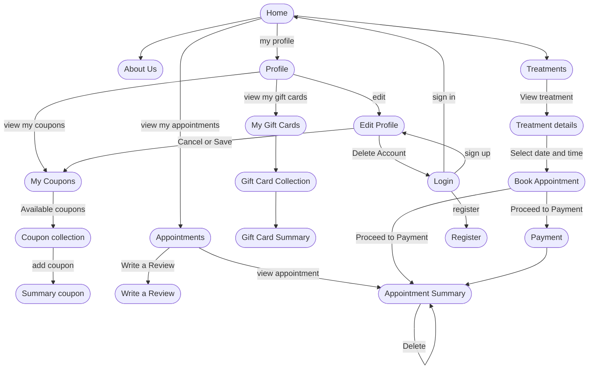
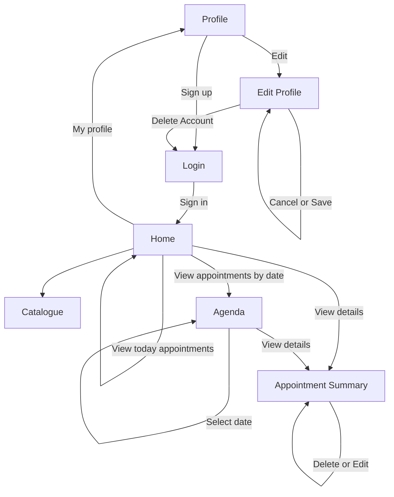
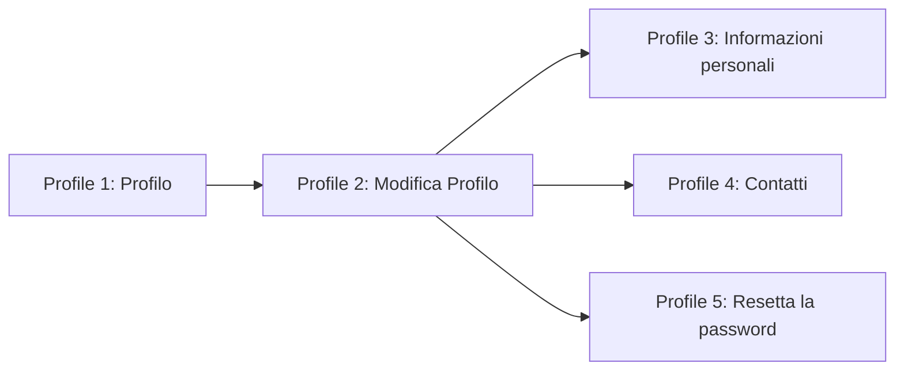
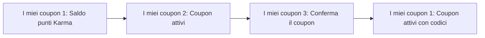
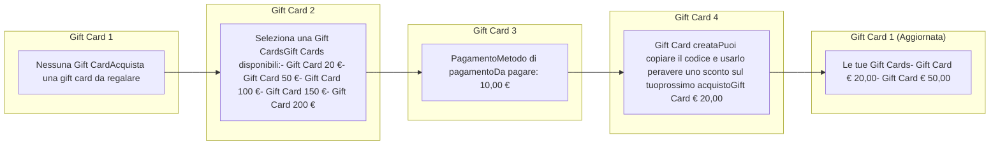
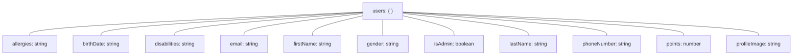
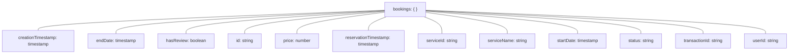
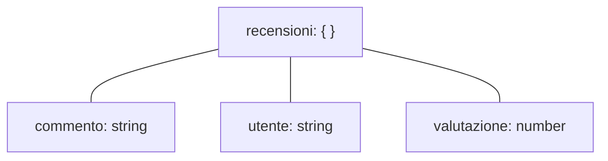
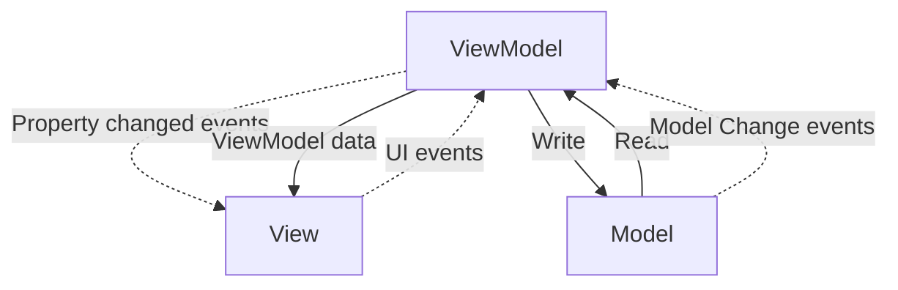

UNIVERSITÀ DEGLI STUDI DI BRESCIA logo

## DIPARTIMENTO DI INGEGNERIA DELL’INFORMAZIONE

*Corso di Laurea in Ingegneria Informatica*

Progetto per il corso di Mobile Development

# HAMMAMI CENTRO BENESSERE

Dumas Nicholas

Matteo Rossini

# Indice

**1 Introduzione** **3**
1.1 Funzionalità pre-analisi dei risultati dei questionari e dei competitor 4
1.1.1 Funzionalità essenziali 4
1.1.2 Funzionalità Avanzate 4
1.2 Tipologie di utente 5

**2 User research** **6**
2.1 Profili utente 6
2.1.1 Utente esterno: cliente 6
2.1.2 Utente interno: dipendente/amministratore 8
2.2 Questionari e risultati 9
2.2.1 Questionario utente esterno 10
2.2.2 Risultati 10
2.2.3 Questionario utente interno 18
2.2.4 Risultati 18
2.3 Personas 28
2.3.1 Scenari 30

**3 App design** **32**
3.1 Analisi competitor 34
3.2 Ridefinizione delle funzionalità dell’applicazione in seguito ai dati ottenuti 40
3.3 Navigation map 41
3.4 Mockup navigation map 43
3.4.1 Flusso *"Login & Registrazione"* 43
3.4.2 Flusso Homepage 43
3.4.3 Flusso prenotazione 44
3.4.4 Flusso recensione 44
3.4.5 Flusso profilo 45
3.4.6 Flusso *"I miei coupon"* 45
3.4.7 Flusso *"Gift Card"* 46
3.5 Principali pagine 47

<page_number>1</page_number>

3.5.1 Login e Registrazione 47
3.5.2 Home 50
3.5.3 Profilo 50
3.5.4 Servizi 58
3.5.5 Prenotazioni 63
3.5.6 Il centro 65

# 4 Implementazione 71
## 4.1 Google Firebase 71
4.1.1 Firestore Database 72
4.1.2 Firebase Authentication 75
4.1.3 Firebase Storage 75
## 4.2 Architettura 75
4.2.1 Pattern Model-View-Viewmodel (MVVM) 75
4.2.2 Collegamento con Firebase 77
## 4.3 Struttura dei package 77
## 4.4 Fragment 78
## 4.5 Gestione degli errori 78
4.5.1 *Domain Layer*: Errori di Dominio e di Validazione 78
4.5.2 *Data Layer*: Mapping delle Eccezioni a DataError 79
4.5.3 Presentation Layer: Gestione degli Errori UI nei ViewModels 80
4.5.4 Presentation Layer: Visualizzazione degli Errori nei Fragments 81

# 5 Possibili sviluppi futuri 83

<page_number>2</page_number>

# Capitolo 1

## Introduzione

L’applicazione "*Hammami*", sviluppata in Kotlin per smartphone Android, nasce con l’obiettivo di digitalizzare i servizi offerti dal centro benessere Hammami, attualmente in fase di cambio gestione. Il progetto, realizzato nell’ambito del corso di "*Mobile Application Development*", si propone di creare un’esperienza utente intuitiva e funzionale, permettendo ai clienti di consultare il catalogo dei trattamenti, prenotare appuntamenti e gestire i pagamenti in modo semplice e veloce, direttamente dal proprio smartphone. Tali sistemi di prenotazione, seppur consolidati in molti settori, rappresentano una novità significativa nel mondo del *wellness*.

Il processo di sviluppo dell’app di *Hammami* ha previsto diverse fasi: un’analisi degli utenti, tramite questionari e *personas*, lo studio dei competitor, la progettazione di un prototipo con Figma, basato sul *Material Design 3*, e l’implementazione in ambiente Android Studio.

L’architettura dell’applicazione si basa sul pattern MVVM (Model-View-ViewModel) e una chiara separazione dei livelli (Data, Domain, Presentation) per garantire modularità e manutenibilità, così come suggerito dalle best practices Android. Per la gestione dei dati e l’autenticazione, è stato utilizzato Firebase, mentre l’interfaccia utente è stata progettata seguendo i principi di usabilità di Nielsen e le leggi della Gestalt apprese durante il corso di Interazione Uomo-Macchina.

Questa relazione illustra nel dettaglio l’intero iter di sviluppo, fornendo una panoramica completa delle scelte progettuali, delle tecnologie utilizzate e dei risultati ottenuti.

<page_number>3</page_number>

# 1.1 Funzionalità pre-analisi dei risultati dei questionari e dei competitor

## 1.1.1 Funzionalità essenziali

* **Autenticazione**: Registrazione e login per creare e gestire un account utente

* **Profilo Utente**: Visualizzazione e modifica di informazioni personali (nome, email, telefono, allergie, problemi di salute, preferenze)

* **Gestione Trattamenti**: Consultazione di un elenco dettagliato dei trattamenti disponibili, con descrizioni, benefici, durata, prezzo e controindicazioni

* **Prenotazione Trattamenti**: Possibilità di prenotare trattamenti selezionando data, ora e operatore

* **Storico Prenotazioni**: Visualizzazione di uno storico completo delle prenotazioni effettuate e completate, con data, ora, tipologia di trattamento e operatore

* **Download Brochure**: Funzione per scaricare la brochure del centro in formato PDF

* **Informazioni Centro**: Sezione dedicata al team, con foto, descrizione, ruolo, competenze ed esperienza di ogni membro

* **Orari di Apertura**: Visualizzazione chiara degli orari di apertura e chiusura del centro

## 1.1.2 Funzionalità Avanzate

* **Gamification**:

    - Implementazione di un sistema a premi per incentivare l'utilizzo dell'app e fidelizzare i clienti

    - Raccolta punti attraverso prenotazioni, recensioni e inviti ad amici

    - Riscatto punti per sconti, trattamenti gratuiti o prodotti omaggio

* **Contatto Centro**: Diverse modalità di contatto: telefono, email e chat *WhatsApp*

* **Gestione Recensioni**: Possibilità per gli utenti di lasciare recensioni testuali sui trattamenti ricevuti

<page_number>4</page_number>

* ***Modifica e Cancellazione Prenotazioni:*** Gestione autonoma delle prenotazioni, con possibilità di modifica o cancellazione

* ***Notifiche Push:*** Invio di notifiche per promemoria appuntamenti, offerte speciali e novità

* ***Integrazione Calendario:*** Funzione per aggiungere automaticamente i promemoria appuntamenti al calendario personale

* Solo per utenti interni (staff, admin):

    - ***Visualizzazione Utenti:*** Accesso a un elenco completo dei clienti registrati

    - ***Gestione Servizi:*** Modifica del catalogo dei servizi offerti

    - ***Gestione Team:*** Aggiunta, modifica ed eliminazione dei membri del team

    - ***Gestione Prenotazioni:*** Visualizzazione, modifica e cancellazione delle prenotazioni

    - ***Gestione Offerte:*** Creazione, modifica e rimozione delle offerte promozionali

# 1.2 Tipologie di utente

Abbiamo deciso di differenziare due tipologie di utente che avranno compiti e funzionalità ben distinte:

* ***Utenti Esterni:***

    - *Cliente Registrato:* Può effettuare prenotazioni, scrivere recensioni, ricevere notifiche via email su offerte e promozioni

    - *Cliente Non Registrato:* Può visualizzare i servizi disponibili, le informazioni sul centro e la disponibilità dei trattamenti (da definire)

* ***Utenti interni (staff, admin)***

<page_number>5</page_number>

# Capitolo 2

# User research

Il presente capitolo illustra la fase di *User Research* essenziale nel processo di progettazione centrata sull'utente. L'obiettivo di tale fase è stato quello di raccogliere dati qualitativi e quantitativi sui potenziali utenti, al fine di identificare i requisiti funzionali e non funzionali dell'applicazione, e di creare un modello concettuale dell'utente per guidare le successive scelte progettuali.

## 2.1 Profili utente

L'utente è stato differenziato in due profili distiniti: l'utente esterno (cliente) e l'utente interno (dipendente/amministratore del centro benessere).

### 2.1.1 Utente esterno: cliente

La fase iniziale della progettazione, in accordo con i principi dello *User-Centered Design*, si è concentrata sulla definizione di un profilo utente preliminare. Tale profilo, inteso come modello concettuale dell'utente target dell'applicazione "Hammami", è stato elaborato a partire da ipotesi iniziali sui potenziali utenti target dei centri benessere. Il profilo è stato poi validato e arricchito tramite la successiva fase di raccolta dati empirici.

Le ipotesi iniziali, formulate prima della somministrazione dei questionari, hanno delineato un utente con le seguenti caratteristiche:

* **Età:** Si è ipotizzata una maggiore concentrazione di utenti nella fascia d'età 45-64 anni, considerata più propensa all'utilizzo di servizi benessere e con maggiore disponibilità economica. Tuttavia, si è esteso il range potenziale fino ai 70 anni, tenendo conto dell'interesse per i trattamenti benessere anche in età più avanzata. L'età minima di 18 anni è dettata da vincoli legali.

<page_number>6</page_number>

* **Genere**: Pur prevedendo una prevalenza di utenti di sesso femminile, in linea con la clientela tipica dei centri benessere, si è considerato un target potenzialmente aperto anche al pubblico maschile, data l'offerta variegata di servizi.

* **Competenze tecnologiche**: Si è assunto un livello di competenza tecnologica medio-basso, caratterizzato dalla capacità di utilizzo delle funzionalità base di uno smartphone (navigazione, inserimento testo, interazione con elementi dell'interfaccia) e da una familiarità generale con l'uso di applicazioni. Non si è presupposta, invece, un'esperienza pregressa con app di prenotazione per servizi benessere o, più in generale, per servizi che richiedono una prenotazione. Tale scelta progettuale è in linea con i sistemi di tipo *walk-up-and-use system*, che mirano a garantire un'esperienza utente intuitiva e accessibile anche a utenti con basse competenze tecnologiche.

La tabella seguente illustra in maniera dettagliata le caratteristiche del profilo utente esterno, raggruppandole in macro-aree per maggior chiarezza espositiva.

<page_number>7</page_number>

<table>
  <thead>
    <tr>
      <th colspan="2">Caratteristichesocio-demografiche</th>
    </tr>
  </thead>
  <tbody>
    <tr>
      <td>Et`a</td>
      <td>18-70(concentrazionemaggiore25-55anni)</td>
    </tr>
    <tr>
      <td>Genere</td>
      <td>Indifferente(principalmentefemminile)</td>
    </tr>
    <tr>
      <td>Manualit`a</td>
      <td>Irrilevante</td>
    </tr>
    <tr>
      <td>Daltonismo</td>
      <td>Indifferente</td>
    </tr>
    <tr>
      <td colspan="2">Competenzetecnologiche</td>
    </tr>
    <tr>
      <td>Esperienzasmartphone</td>
      <td>Medio-bassa</td>
    </tr>
    <tr>
      <td>Esperienzautilizzoappdiprenotazione</td>
      <td>Bassa</td>
    </tr>
    <tr>
      <td>Esperienzadeisistemainformatici</td>
      <td>Medio-Bassa</td>
    </tr>
    <tr>
      <td>Usodialtrisistemi</td>
      <td>Frequente</td>
    </tr>
    <tr>
      <td colspan="2">Caratteristichecomportamentalieambientali</td>
    </tr>
    <tr>
      <td>Usodelsistema</td>
      <td>Opzionale</td>
    </tr>
    <tr>
      <td>Frequenzad’uso</td>
      <td>Mensile</td>
    </tr>
    <tr>
      <td>Addestramentodibase</td>
      <td>Nessuno</td>
    </tr>
    <tr>
      <td>Usodialtristrumenti</td>
      <td>No</td>
    </tr>
    <tr>
      <td>Importanzadelcompito</td>
      <td>Bassa</td>
    </tr>
    <tr>
      <td>Strutturadelcompito</td>
      <td>Bassa</td>
    </tr>
    <tr>
      <td colspan="2">Caratteristicheambientali</td>
    </tr>
    <tr>
      <td>Ambientefisico</td>
      <td>Qualsiasi</td>
    </tr>
    <tr>
      <td>Sicurezzadell’ambiente</td>
      <td>Nonusareallaguida</td>
    </tr>
  </tbody>
</table>

## 2.1.2 Utente interno: dipendente/amministratore

Il profilo dell’utente interno, ovvero il personale del centro benessere che utilizzerà l’applicazione per gestire le prenotazioni e i servizi, è stato definito considerando le seguenti caratteristiche. Data la similarità delle iterazioni con l’app indipendenti dallo specifico ruolo (operatore, amministratore), si è optato per un unico profilo utente, evitando distinzioni non significative in questo contesto.

<page_number>8</page_number>

<table>
  <thead>
    <tr>
      <th colspan="2">Caratteristichefisiche</th>
    </tr>
  </thead>
  <tbody>
    <tr>
      <td>Et`a</td>
      <td>18-65</td>
    </tr>
    <tr>
      <td>Genere</td>
      <td>Indifferente</td>
    </tr>
    <tr>
      <td colspan="2">Caratteristichediesperienza</td>
    </tr>
    <tr>
      <td>Esperienzasmartphone</td>
      <td>Media</td>
    </tr>
    <tr>
      <td>Esperienzadeisistemainformatici</td>
      <td>Media</td>
    </tr>
    <tr>
      <td>Usodialtrisistemi</td>
      <td>Frequente</td>
    </tr>
    <tr>
      <td colspan="2">Caratteristichedellavoro</td>
    </tr>
    <tr>
      <td>Usodelsistema</td>
      <td>Opzionale</td>
    </tr>
    <tr>
      <td>Addestramentodibase</td>
      <td>Nessuno</td>
    </tr>
    <tr>
      <td>Categoriedilavoro</td>
      <td>Nessuna</td>
    </tr>
    <tr>
      <td>Usodialtristrumenti</td>
      <td>No</td>
    </tr>
    <tr>
      <td>Frequenzadelturnover</td>
      <td>No</td>
    </tr>
    <tr>
      <td>Importanzadelcompito</td>
      <td>Bassa</td>
    </tr>
    <tr>
      <td>Strutturadelcompito</td>
      <td>Bassa</td>
    </tr>
    <tr>
      <td colspan="2">Caratteristicheambientali</td>
    </tr>
    <tr>
      <td>Ambientefisico</td>
      <td>Centrobenessere</td>
    </tr>
    <tr>
      <td>Sicurezzadell’ambiente</td>
      <td>Nonusareallaguida</td>
    </tr>
  </tbody>
</table>

## 2.2 Questionari e risultati

Dopo aver delineato i profili utente siamo passati alla creazione di questionari da somministrare agli utenti, in particolar modo grazie al centro Hammami abbiamo potuto inviarli a dei loro clienti effettivi. I questionari sono stati raccolti in forma anonima e sono stati divisi in due tipologie: uno per i clienti (quindi gli utenti esterni) e uno per i dipendenti (utente interno). I questionari sono stati creati grazie a *Google Forms* e sono disponibili a questo link:

* Questionario utente esterno

* Questionario utente interno

<page_number>9</page_number>

## 2.2.1 Questionario utente esterno

Il questionario per l’utente esterno è diviso in 4 sezioni:

* ***Anagrafica:*** si raccolgono informazioni circa il sesso ed età anagrafica (suddivisa in cinque range differenti)

* ***Istruzione e profilo professionale:*** è richiesto il titolo di studio (nessuno, licenza media, diploma, laurea) e la professione attuale

* ***Esperienza pregresse:*** si cerca di capire quanto l’utente sia pratico di sistemi affini di prenotazione oppure le modalità preferite per effettuare prenotazioni

* ***Preferenze e funzionalità:*** è richiesto all’utente il grado di interesse (o di preferenza) per determinate funzionalità che potrebbero essere implementate all’interno dell’applicativo chiedendo un voto da 1 a 5, dove 1 corrisponde a "non molto interessato" mentre al contrario 5 "molto interessato". Abbiamo anche aggiunto una domanda aperta non obbligatoria per chiedere quale funzionalità si aspetterebbe di trovare all’interno di un app per un centro benessere

## 2.2.2 Risultati

In totale abbiamo ottenuto 23 risposte al questionario per gli utenti esterni.

Qui di seguito analizzeremo i risultati ottenuti.

**Anagrafica**

La prima sezione, come accennato precedentemente, si occupa di raccogliere informazioni anagrafiche dei possibili fruitori dell’applicazione mobile del centro benessere Hammami.

Le nostre deduzioni iniziali hanno trovato conferma, infatti notiamo come l’età media sia 45-64 anni e, seppur di poco, principalmente di sesso femminile.

<table>
  <tbody>
    <tr>
        <td>Category</td>
        <td>Percentage</td>
    </tr>
    <tr>
        <td>Femmina</td>
        <td>52.2</td>
    </tr>
    <tr>
        <td>Maschio</td>
        <td>47.8</td>
    </tr>
    <tr>
        <td colspan="2">Preferisco non specificare</td>
    </tr>
  </tbody>
</table>

Figura 2.1: Genere utente esterno

<page_number>10</page_number>

<table>
  <tbody>
    <tr>
        <td>Età</td>
        <td>Percentuale (%)</td>
    </tr>
    <tr>
        <td>14-25</td>
        <td>39,1</td>
    </tr>
    <tr>
        <td>26-44</td>
        <td>34,8</td>
    </tr>
    <tr>
        <td>45-64</td>
        <td>13</td>
    </tr>
    <tr>
        <td>65-74</td>
        <td>13</td>
    </tr>
    <tr>
        <td colspan="2">75+</td>
    </tr>
  </tbody>
</table>

Figura 2.2: Età utente esterno

## Istruzione e profilo professionale

Qui abbiamo raccolto informazioni circa il grado di istruzione e la propria occupazione.

<table>
  <tbody>
    <tr>
        <td>Titolo di studio</td>
        <td>Percentuale (%)</td>
    </tr>
    <tr>
        <td>Nessuno</td>
        <td>47,8</td>
    </tr>
    <tr>
        <td colspan="2">Licenzia media</td>
    </tr>
    <tr>
        <td>Diploma</td>
        <td>34,8</td>
    </tr>
    <tr>
        <td>Laurea</td>
        <td>17,4</td>
    </tr>
  </tbody>
</table>

Figura 2.3: Titolo di studio utente esterno

<table>
  <tbody>
    <tr>
        <td>Professione</td>
        <td>Frequenza (%)</td>
    </tr>
    <tr>
        <td>Avvocato</td>
        <td>1 (4,3%)</td>
    </tr>
    <tr>
        <td> </td>
        <td>1 (4,3%)</td>
    </tr>
    <tr>
        <td>Direttrice</td>
        <td>1 (4,3%)</td>
    </tr>
    <tr>
        <td> </td>
        <td>1 (4,3%)</td>
    </tr>
    <tr>
        <td> </td>
        <td>1 (4,3%)</td>
    </tr>
    <tr>
        <td>Educatrice</td>
        <td>1 (4,3%)</td>
    </tr>
    <tr>
        <td> </td>
        <td>3 (13%)</td>
    </tr>
    <tr>
        <td>Impiegata commerciale</td>
        <td>1 (4,3%)</td>
    </tr>
    <tr>
        <td> </td>
        <td>3 (13%)</td>
    </tr>
    <tr>
        <td>Infermiera</td>
        <td>1 (4,3%)</td>
    </tr>
    <tr>
        <td>Pensionato</td>
        <td>3 (13%)</td>
    </tr>
    <tr>
        <td> </td>
        <td>1 (4,3%)</td>
    </tr>
    <tr>
        <td>Studente</td>
        <td>5 (21,7%)</td>
    </tr>
  </tbody>
</table>

Figura 2.4: Professione utente esterno

<page_number>11</page_number>

# Esperienze pregresse

A partire da questa sezione cominciano le domande più interessanti. Abbiamo deciso di interrogare gli utenti circa le loro esperienze pregresse con sistemi affini di prenotazione di servizi, non necessariamente di un centro benessere, come può essere la prenotazione di un appuntamento ospedaliero oppure la visita di un museo. Il risultato ottenuto è stato quello che ci aspettavamo, mediamente gli utenti hanno un'esperienza moderata, questo è concorde anche con l'età media calcolata precedentemente. Infatti nel range di età ottenuto ci aspettavamo un utilizzo moderato di servizi digitali per la prenotazione di servizi essendo che sono essi radicati nella quotidianità di chiunque.

<table>
  <thead>
    <tr>
        <th>Livello di esperienza</th>
        <th>Percentuale (%)</th>
    </tr>
  </thead>
  <tbody>
    <tr>
        <td>Bassa</td>
        <td>21,7</td>
    </tr>
    <tr>
        <td>Moderata</td>
        <td>47,8</td>
    </tr>
    <tr>
        <td>Alta</td>
        <td>30,4</td>
    </tr>
  </tbody>
</table>

Figura 2.5: Esperienza nei sistemi di prenotazione utente esterno

Abbiamo in seguito interrogato la frequenza con la quale gli utenti usufruiscono di servizi in un centro benessere.

<table>
  <thead>
    <tr>
        <th>Frequenza</th>
        <th>Percentuale (%)</th>
    </tr>
  </thead>
  <tbody>
    <tr>
        <td colspan="2">Mai</td>
    </tr>
    <tr>
        <td>Meno di una volta al mese</td>
        <td>30,4</td>
    </tr>
    <tr>
        <td>Una volta al mese</td>
        <td>8,7</td>
    </tr>
    <tr>
        <td colspan="2">Una volta a settimana</td>
    </tr>
    <tr>
        <td>Più volte in una settimana</td>
        <td>60,9</td>
    </tr>
  </tbody>
</table>

Figura 2.6: Frequenza centri benessere utente esterno

La modalità di prenotazione maggiormente utilizzata dagli utenti è tramite una chiamata telefonica alla segreteria del proprio centro benessere preferito. Per quanto non sia il sistema più moderno è ancora quello preferito.

Ciononostante gli utenti hanno mostrato un interesse medio-alto alla possibilità di prenotare comodamente servizi direttamente dal proprio cellulare.

<page_number>12</page_number>

<table>
  <tbody>
    <tr>
        <td>Modalità</td>
        <td>Valore (Percentuale)</td>
    </tr>
    <tr>
        <td>Chiamata telefonica</td>
        <td>16 (69,6%)</td>
    </tr>
    <tr>
        <td>In loco presso il centro</td>
        <td>5 (21,7%)</td>
    </tr>
    <tr>
        <td>Pagina web</td>
        <td>4 (17,4%)</td>
    </tr>
    <tr>
        <td>Applicazione di messaggistica (whatsapp)</td>
        <td>2 (8,7%)</td>
    </tr>
    <tr>
        <td>Applicazione mobile</td>
        <td>7 (30,4%)</td>
    </tr>
  </tbody>
</table>

Figura 2.7: Modalità utilizzate solitamente per prenotazione in centri benessere utente esterno

<table>
  <tbody>
    <tr>
        <td>Livello di interesse</td>
        <td>Valore (Percentuale)</td>
    </tr>
    <tr>
        <td>1</td>
        <td>0 (0%)</td>
    </tr>
    <tr>
        <td>2</td>
        <td>0 (0%)</td>
    </tr>
    <tr>
        <td>3</td>
        <td>2 (8,7%)</td>
    </tr>
    <tr>
        <td>4</td>
        <td>15 (65,2%)</td>
    </tr>
    <tr>
        <td>5</td>
        <td>6 (26,1%)</td>
    </tr>
  </tbody>
</table>

Figura 2.8: Interesse per un app mobile utente esterno

**Preferenze e funzionalità**

Qui sono state poste domande specifiche per le funzionalità da implementare in seguito alla prima fase di *brainstorming* e all'analisi dei competitor.

Grazie a queste domande abbiamo potuto appurare che le foto di un servizio sono percepite dal cliente come qualcosa di funzionale ed importante.

<table>
  <tbody>
    <tr>
        <td>Livello di utilità</td>
        <td>Valore (Percentuale)</td>
    </tr>
    <tr>
        <td>1</td>
        <td>0 (0%)</td>
    </tr>
    <tr>
        <td>2</td>
        <td>0 (0%)</td>
    </tr>
    <tr>
        <td>3</td>
        <td>4 (17,4%)</td>
    </tr>
    <tr>
        <td>4</td>
        <td>13 (56,5%)</td>
    </tr>
    <tr>
        <td>5</td>
        <td>6 (26,1%)</td>
    </tr>
  </tbody>
</table>

Figura 2.9: Utilità delle foto per un servizio

Una descrizione dettagliata è quasi all'unanimità essenziale per una buona applicazione di prenotazione di servizi di benessere. Una descrizione dettagliata permette all'utente

<page_number>13</page_number>

di comprendere meglio le modalità del servizio ed i proprio benefici, utile anche per i neofiti o per chi non sia esperto.

<table>
  <tbody>
    <tr>
        <td>Valutazione</td>
        <td>Frequenza (%)</td>
    </tr>
    <tr>
        <td>1</td>
        <td>0 (0%)</td>
    </tr>
    <tr>
        <td>2</td>
        <td>0 (0%)</td>
    </tr>
    <tr>
        <td>3</td>
        <td>0 (0%)</td>
    </tr>
    <tr>
        <td>4</td>
        <td>5 (21,7%)</td>
    </tr>
    <tr>
        <td>5</td>
        <td>18 (78,3%)</td>
    </tr>
  </tbody>
</table>

Figura 2.10: Importanza descrizione dettagliata per ogni servizio

Una sezione grazie alla quale poter visualizzare velocemente le proprie prenotazioni è risultato essere mediamente di gradimento per tutti, permettendo così non solo di vedere le prenotazioni future ma anche quelle passate.

<table>
  <tbody>
    <tr>
        <td>Valutazione</td>
        <td>Frequenza (%)</td>
    </tr>
    <tr>
        <td>1</td>
        <td>0 (0%)</td>
    </tr>
    <tr>
        <td>2</td>
        <td>0 (0%)</td>
    </tr>
    <tr>
        <td>3</td>
        <td>4 (17,4%)</td>
    </tr>
    <tr>
        <td>4</td>
        <td>8 (34,8%)</td>
    </tr>
    <tr>
        <td>5</td>
        <td>11 (47,8%)</td>
    </tr>
  </tbody>
</table>

Figura 2.11: Utilità sezione *"le mie prenotazioni"* utente esterno

Collegata alla domanda precedente, è risultata gradita la possibilità di modificare le proprie prenotazioni direttamente in app (ovviamente sempre tenendo conto della disponibilità del centro).

<table>
  <tbody>
    <tr>
        <td>Valutazione</td>
        <td>Frequenza (%)</td>
    </tr>
    <tr>
        <td>1</td>
        <td>0 (0%)</td>
    </tr>
    <tr>
        <td>2</td>
        <td>0 (0%)</td>
    </tr>
    <tr>
        <td>3</td>
        <td>1 (4,3%)</td>
    </tr>
    <tr>
        <td>4</td>
        <td>12 (52,2%)</td>
    </tr>
    <tr>
        <td>5</td>
        <td>10 (43,5%)</td>
    </tr>
  </tbody>
</table>

Figura 2.12: Utilità di modifica delle prenotazioni effettuate direttamente in app

Una sezione di presentazione di tutti i membri del centro Hammami ha ottenuto risultati differenti, in ogni caso il 47,8% pensa sia abbastanza ininfluente come funzionalità.

<page_number>14</page_number>

<table>
  <tbody>
    <tr>
        <td>Punteggio</td>
        <td>Frequenza (Percentuale)</td>
    </tr>
    <tr>
        <td>1</td>
        <td>2 (8,7%)</td>
    </tr>
    <tr>
        <td>2</td>
        <td>1 (4,3%)</td>
    </tr>
    <tr>
        <td>3</td>
        <td>11 (47,8%)</td>
    </tr>
    <tr>
        <td>4</td>
        <td>6 (26,1%)</td>
    </tr>
    <tr>
        <td>5</td>
        <td>3 (13%)</td>
    </tr>
  </tbody>
</table>

Figura 2.13: Utilità di una sezione di presentazione degli operatori che lavorano in Hammami

Principalmente gli utenti si ritengono interessati a scrivere e leggere recensioni relative ad un servizio specifico.

<table>
  <tbody>
    <tr>
        <td>Punteggio</td>
        <td>Frequenza (Percentuale)</td>
    </tr>
    <tr>
        <td>1</td>
        <td>0 (0%)</td>
    </tr>
    <tr>
        <td>2</td>
        <td>1 (4,3%)</td>
    </tr>
    <tr>
        <td>3</td>
        <td>5 (21,7%)</td>
    </tr>
    <tr>
        <td>4</td>
        <td>7 (30,4%)</td>
    </tr>
    <tr>
        <td>5</td>
        <td>10 (43,5%)</td>
    </tr>
  </tbody>
</table>

Figura 2.14: Importanza di poter scrivere e leggere le recensioni per ogni servizio

Le due domande sulla possibilità di reimpostare la password e di poter modificare il proprio profilo personale hanno ottenuto mediamente valutazioni positive in quanto sono servizi presenti ormai in ogni applicazione utilizzata quotidianamente.

<table>
  <tbody>
    <tr>
        <td>Punteggio</td>
        <td>Frequenza (Percentuale)</td>
    </tr>
    <tr>
        <td>1</td>
        <td>0 (0%)</td>
    </tr>
    <tr>
        <td>2</td>
        <td>0 (0%)</td>
    </tr>
    <tr>
        <td>3</td>
        <td>3 (13%)</td>
    </tr>
    <tr>
        <td>4</td>
        <td>7 (30,4%)</td>
    </tr>
    <tr>
        <td>5</td>
        <td>13 (56,5%)</td>
    </tr>
  </tbody>
</table>

Figura 2.15: Importanza di poter reimpostare la password autonomamente

<page_number>15</page_number>

<table>
  <tbody>
    <tr>
        <td>Punteggio</td>
        <td>Frequenza (Percentuale)</td>
    </tr>
    <tr>
        <td>1</td>
        <td>0 (0%)</td>
    </tr>
    <tr>
        <td>2</td>
        <td>0 (0%)</td>
    </tr>
    <tr>
        <td>3</td>
        <td>8 (34,8%)</td>
    </tr>
    <tr>
        <td>4</td>
        <td>8 (34,8%)</td>
    </tr>
    <tr>
        <td>5</td>
        <td>7 (30,4%)</td>
    </tr>
  </tbody>
</table>

Figura 2.16: Importanza di poter modificare il proprio profilo personale

Per quanto riguarda l’interesse verso un sistemi di punti e la possibilità di acquistare gift card abbiamo ottenuto valutazioni positive mentre in contrasto la creazione di pacchetti personalizzati non ha ottenuto lo stesso successo.

<table>
  <tbody>
    <tr>
        <td>Punteggio</td>
        <td>Frequenza (Percentuale)</td>
    </tr>
    <tr>
        <td>1</td>
        <td>0 (0%)</td>
    </tr>
    <tr>
        <td>2</td>
        <td>0 (0%)</td>
    </tr>
    <tr>
        <td>3</td>
        <td>4 (17,4%)</td>
    </tr>
    <tr>
        <td>4</td>
        <td>9 (39,1%)</td>
    </tr>
    <tr>
        <td>5</td>
        <td>10 (43,5%)</td>
    </tr>
  </tbody>
</table>

Figura 2.17: Interesse verso un sistema di punti per ottenere buoni sconti

<table>
  <tbody>
    <tr>
        <td>Punteggio</td>
        <td>Frequenza (Percentuale)</td>
    </tr>
    <tr>
        <td>1</td>
        <td>0 (0%)</td>
    </tr>
    <tr>
        <td>2</td>
        <td>3 (13%)</td>
    </tr>
    <tr>
        <td>3</td>
        <td>7 (30,4%)</td>
    </tr>
    <tr>
        <td>4</td>
        <td>7 (30,4%)</td>
    </tr>
    <tr>
        <td>5</td>
        <td>6 (26,1%)</td>
    </tr>
  </tbody>
</table>

Figura 2.18: Interesse nell’acquistare gift card

<page_number>16</page_number>

<table>
  <tbody>
    <tr>
        <td>Punteggio</td>
        <td>Frequenza (%)</td>
    </tr>
    <tr>
        <td>1</td>
        <td>2 (8,7%)</td>
    </tr>
    <tr>
        <td>2</td>
        <td>7 (30,4%)</td>
    </tr>
    <tr>
        <td>3</td>
        <td>8 (34,8%)</td>
    </tr>
    <tr>
        <td>4</td>
        <td>5 (21,7%)</td>
    </tr>
    <tr>
        <td>5</td>
        <td>1 (4,3%)</td>
    </tr>
  </tbody>
</table>

Figura 2.19: Interesse per creazione di pacchetti personalizzati

Il seguente grafico "a torta" ci ha permesso di apprendere la modalità di notifiche preferita dall'utente esterno, con un netto scarto (52% dei voti totali) si evince che le notifiche in app sono di gran lunga le favorite.

<table>
  <tbody>
    <tr>
        <td>Tipologia</td>
        <td>Percentuale</td>
    </tr>
    <tr>
        <td>Notifiche in app</td>
        <td>52,2%</td>
    </tr>
    <tr>
        <td>Notifiche via email</td>
        <td>39,1%</td>
    </tr>
    <tr>
        <td>Entrambe</td>
        <td>8,7%</td>
    </tr>
  </tbody>
</table>

Figura 2.20: Preferenza di tipologia per le notifiche

<table>
  <tbody>
    <tr>
        <td>Punteggio</td>
        <td>Frequenza (%)</td>
    </tr>
    <tr>
        <td>1</td>
        <td>0 (0%)</td>
    </tr>
    <tr>
        <td>2</td>
        <td>3 (13%)</td>
    </tr>
    <tr>
        <td>3</td>
        <td>9 (39,1%)</td>
    </tr>
    <tr>
        <td>4</td>
        <td>10 (43,5%)</td>
    </tr>
    <tr>
        <td>5</td>
        <td>1 (4,3%)</td>
    </tr>
  </tbody>
</table>

Figura 2.21: Interesse nel poter scaricare la brochure in formato *pdf*

<page_number>17</page_number>

### 2.2.3 Questionario utente interno

Il questionario per l'utente interno è diviso in 5 sezioni:

* **Anagrafica:** si raccolgono informazioni circa il sesso ed età anagrafica (suddivisa in cinque range differenti)

* **Istruzione e profilo professionale:** è richiesto il titolo di studio (nessuno, licenza media, diploma, laurea) e la professione attuale

* **Esperienza pregresse:** si cerca di capire quanto l'utente sia pratico di sistemi affini di prenotazione oppure le modalità preferito per effettuare prenotazioni

* **Preferenze e funzionalità:** è richiesto all'utente il grado di interesse (o di preferenza) per determinate funzionalità che potrebbero essere implementate all'interno dell'applicativo chiedendo un voto da 1 a 5, dove 1 corrisponde a "non molto interessato" mentre al contrario 5 "molto interessato". Abbiamo anche aggiunto una domanda aperta non obbligatoria per chiedere quale funzionalità si aspetterebbe di trovare all'interno di un app per un centro benessere

* **Sezione amministratore:** qui sono presenti domande specifiche per l'applicazione lato amministratore e le funzionalità più interessanti da implementare in base alle necessità dei dipendenti

### 2.2.4 Risultati

Come per l'utente esterno, analizzeremo qui di seguito i risultati ottenuti dal questionario per gli utenti interni. In totale nel centro Hammami lavorano 6 persone, con incarichi differenti, quindi abbiamo deciso di sottoporre a loro il relativo questionario.

**Anagrafica**

Analogamente al questionario per gli utenti esterni abbiamo dapprima analizzato l'anagrafica degli utenti interni.

<table>
  <tbody>
    <tr>
        <td>Categoria</td>
        <td>Percentuale (%)</td>
    </tr>
    <tr>
        <td>Maschio</td>
        <td>83,3</td>
    </tr>
    <tr>
        <td>Femmina</td>
        <td>16,7</td>
    </tr>
    <tr>
        <td>Preferisco non specificare</td>
        <td>0</td>
    </tr>
  </tbody>
</table>

Figura 2.22: Genere utente interno

<page_number>18</page_number>

<table>
  <tbody>
    <tr>
        <td>Età</td>
        <td>Percentuale</td>
    </tr>
    <tr>
        <td>14-25</td>
        <td>33,3</td>
    </tr>
    <tr>
        <td>26-44</td>
        <td>66,7</td>
    </tr>
    <tr>
        <td>45-64</td>
        <td>0</td>
    </tr>
    <tr>
        <td>65-74</td>
        <td>0</td>
    </tr>
    <tr>
        <td>75+</td>
        <td>0</td>
    </tr>
  </tbody>
</table>

Figura 2.23: Età utente interno

## Istruzione e profilo professionale

Anche qui è simile al questionario per gli utenti esterni, con l'unica differenza che abbiamo chiesto il proprio ruolo all'interno del centro benessere Hammami così da conoscere la distribuzione dei ruoli nel centro.

Il centro benessere è quindi così suddiviso:

* Una segretaria

* Due massaggiatori

* Due estetisti

* Una direttrice

<table>
  <tbody>
    <tr>
        <td>Titolo di studio</td>
        <td>Percentuale</td>
    </tr>
    <tr>
        <td>Nessuno</td>
        <td>0</td>
    </tr>
    <tr>
        <td>Licenzia media</td>
        <td>0</td>
    </tr>
    <tr>
        <td>Diploma</td>
        <td>66,7</td>
    </tr>
    <tr>
        <td>Laurea</td>
        <td>33,3</td>
    </tr>
  </tbody>
</table>

Figura 2.24: Titolo di studio utente interno

<page_number>19</page_number>

<table>
  <tbody>
    <tr>
        <td>Professione</td>
        <td>Conteggio</td>
        <td>Percentuale (%)</td>
    </tr>
    <tr>
        <td>Direttrice</td>
        <td>1</td>
        <td>16,7</td>
    </tr>
    <tr>
        <td>Estetista</td>
        <td>2</td>
        <td>33,3</td>
    </tr>
    <tr>
        <td>Massaggiatrice</td>
        <td>2</td>
        <td>33,3</td>
    </tr>
    <tr>
        <td>Segretaria</td>
        <td>1</td>
        <td>16,7</td>
    </tr>
  </tbody>
</table>

Figura 2.25: Professione utente interno

## Esperienze pregresse

Similmente a quanto chiesto all'utente esterno, abbiamo qui cercato di apprendere il grado di esperienza di sistemi di prenotazione riferendoci però alla sezione amministratore, destinata solo agli addetti ai lavori.

I risultati ottenuti hanno evidenziato una esperienze generalmente moderata con una frequenza di utilizzo molto alta.

<table>
  <tbody>
    <tr>
        <td>Livello di esperienza</td>
        <td>Percentuale (%)</td>
    </tr>
    <tr>
        <td>Moderata</td>
        <td>83,3</td>
    </tr>
    <tr>
        <td>Alta</td>
        <td>16,7</td>
    </tr>
    <tr>
        <td>Bassa</td>
        <td>0</td>
    </tr>
  </tbody>
</table>

Figura 2.26: Esperienza nei sistemi di prenotazione utente interno

<table>
  <tbody>
    <tr>
        <td>Frequenza</td>
        <td>Percentuale (%)</td>
    </tr>
    <tr>
        <td>Mai</td>
        <td>66,7</td>
    </tr>
    <tr>
        <td>Una volta al giorno</td>
        <td>16,7</td>
    </tr>
    <tr>
        <td>Più volte al giorno</td>
        <td>16,7</td>
    </tr>
    <tr>
        <td>Meno di una volta al mese</td>
        <td>0</td>
    </tr>
    <tr>
        <td>Una volta al mese</td>
        <td>0</td>
    </tr>
    <tr>
        <td>Una volta a settimana</td>
        <td>0</td>
    </tr>
    <tr>
        <td>Più volte a settimana</td>
        <td>0</td>
    </tr>
  </tbody>
</table>

Figura 2.27: Frequenza utilizzo dispositivi informatici utente interno

<page_number>20</page_number>

## Preferenze e funzionalità

Il metodo preferito di prenotazione dai membri interni del centro è a pari punteggio la pagina web e l’applicazione mobile, quindi entrambi sistemi informatici in contrasto con quanto riscontrato dal questionario per gli utenti esterni.

<table>
  <tbody>
    <tr>
        <td>Metodo di prenotazione</td>
        <td>Valore</td>
        <td>Percentuale (%)</td>
    </tr>
    <tr>
        <td>Chiamata telefonica</td>
        <td>4</td>
        <td>66,7</td>
    </tr>
    <tr>
        <td>In loco presso il centro</td>
        <td>3</td>
        <td>50</td>
    </tr>
    <tr>
        <td>Pagina web</td>
        <td>6</td>
        <td>100</td>
    </tr>
    <tr>
        <td>Applicazione mobile</td>
        <td>6</td>
        <td>100</td>
    </tr>
  </tbody>
</table>

Figura 2.28: Preferenza metodi di prenotazione per utente interno

Come conseguenza della domanda precedente, essendone al momento sprovvisti, lo staff del centro benessere Hammami gradirebbe una applicazione mobile per la gestione del loro centro.

<table>
  <tbody>
    <tr>
        <td>Livello di interesse</td>
        <td>Valore</td>
        <td>Percentuale (%)</td>
    </tr>
    <tr>
        <td>1</td>
        <td>0</td>
        <td>0</td>
    </tr>
    <tr>
        <td>2</td>
        <td>0</td>
        <td>0</td>
    </tr>
    <tr>
        <td>3</td>
        <td>0</td>
        <td>0</td>
    </tr>
    <tr>
        <td>4</td>
        <td>1</td>
        <td>16,7</td>
    </tr>
    <tr>
        <td>5</td>
        <td>5</td>
        <td>83,3</td>
    </tr>
  </tbody>
</table>

Figura 2.29: Interesse in una app mobile utente interno

<page_number>21</page_number>

Lo staff gradisce molto la possibilità che gli utenti possano lasciare recensione ai servizi che hanno provato.

<table>
  <tbody>
    <tr>
        <td>Rating</td>
        <td>Count (Percentage)</td>
    </tr>
    <tr>
        <td>1</td>
        <td>0 (0%)</td>
    </tr>
    <tr>
        <td>2</td>
        <td>0 (0%)</td>
    </tr>
    <tr>
        <td>3</td>
        <td>0 (0%)</td>
    </tr>
    <tr>
        <td>4</td>
        <td>1 (16,7%)</td>
    </tr>
    <tr>
        <td>5</td>
        <td>5 (83,3%)</td>
    </tr>
  </tbody>
</table>

Figura 2.30: Interesse per recensioni utente interno

Proprio come per l'utente esterno, anche lo staff ritiene indispensabili una descrizione dettagliata per ciascun servizio.

<table>
  <tbody>
    <tr>
        <td>Rating</td>
        <td>Count (Percentage)</td>
    </tr>
    <tr>
        <td>1</td>
        <td>0 (0%)</td>
    </tr>
    <tr>
        <td>2</td>
        <td>0 (0%)</td>
    </tr>
    <tr>
        <td>3</td>
        <td>0 (0%)</td>
    </tr>
    <tr>
        <td>4</td>
        <td>1 (16,7%)</td>
    </tr>
    <tr>
        <td>5</td>
        <td>5 (83,3%)</td>
    </tr>
  </tbody>
</table>

Figura 2.31: Utilità di una descrizione dettagliata per i servizi utente interno

Principalmente l'utente interno apprezza la possibilità di ricevere notifiche in app ma, a nostra sorpresa, ha ottenuto scarsi risultati la possibilità di creare pacchetti personalizzati. Simile a quanto ottenuto nel questionario degli utenti esterni.

<table>
  <tbody>
    <tr>
        <td>Rating</td>
        <td>Count (Percentage)</td>
    </tr>
    <tr>
        <td>1</td>
        <td>0 (0%)</td>
    </tr>
    <tr>
        <td>2</td>
        <td>0 (0%)</td>
    </tr>
    <tr>
        <td>3</td>
        <td>1 (16,7%)</td>
    </tr>
    <tr>
        <td>4</td>
        <td>4 (66,7%)</td>
    </tr>
    <tr>
        <td>5</td>
        <td>1 (16,7%)</td>
    </tr>
  </tbody>
</table>

Figura 2.32: Interesse nel ricevere notifiche utente interno

<page_number>22</page_number>

<table>
  <tbody>
    <tr>
        <td>Punteggio</td>
        <td>Frequenza (%)</td>
    </tr>
    <tr>
        <td>1</td>
        <td>1 (16,7%)</td>
    </tr>
    <tr>
        <td>2</td>
        <td>2 (33,3%)</td>
    </tr>
    <tr>
        <td>3</td>
        <td>3 (50%)</td>
    </tr>
    <tr>
        <td>4</td>
        <td>0 (0%)</td>
    </tr>
    <tr>
        <td>5</td>
        <td>0 (0%)</td>
    </tr>
  </tbody>
</table>

Figura 2.33: Interesse nel creare pacchetti utente interno

Similmente all’utente sterno anche lo staff ha apprezzato l’introduzione di un sistema di punti, funzionalità non presente nel loro sito web.

<table>
  <tbody>
    <tr>
        <td>Punteggio</td>
        <td>Frequenza (%)</td>
    </tr>
    <tr>
        <td>1</td>
        <td>0 (0%)</td>
    </tr>
    <tr>
        <td>2</td>
        <td>0 (0%)</td>
    </tr>
    <tr>
        <td>3</td>
        <td>0 (0%)</td>
    </tr>
    <tr>
        <td>4</td>
        <td>3 (50%)</td>
    </tr>
    <tr>
        <td>5</td>
        <td>3 (50%)</td>
    </tr>
  </tbody>
</table>

Figura 2.34: Interesse in un sistema di punti utente interno

<table>
  <tbody>
    <tr>
        <td>Punteggio</td>
        <td>Frequenza (%)</td>
    </tr>
    <tr>
        <td>1</td>
        <td>0 (0%)</td>
    </tr>
    <tr>
        <td>2</td>
        <td>0 (0%)</td>
    </tr>
    <tr>
        <td>3</td>
        <td>0 (0%)</td>
    </tr>
    <tr>
        <td>4</td>
        <td>3 (50%)</td>
    </tr>
    <tr>
        <td>5</td>
        <td>3 (50%)</td>
    </tr>
  </tbody>
</table>

Figura 2.35: Interesse nell’offrire offerte a tempo limitato utente interno

<page_number>23</page_number>

Lo staff preferisce principalmente visualizzare le prenotazioni in programma in uno specifico giorno sotto forma di elenco in ordine cronologiche piuttosto che sotto forma di calendario, in modo tale da ottenere una visualizzazione più compatta.

<table>
  <tbody>
    <tr>
        <td>Category</td>
        <td>Percentage</td>
    </tr>
    <tr>
        <td>Elenco</td>
        <td>83.3</td>
    </tr>
    <tr>
        <td>Calendario</td>
        <td>16.7</td>
    </tr>
  </tbody>
</table>

Figura 2.36: Preferenza di visualizzazione per le prenotazioni utente interno

Come si evince dal grafico seguente, l’importanza che il cliente possa inserire recensione è all’unanimità massima. Quindi andrà riposta particolare attenzione a questa funzionalità in sede di progettazione.

<table>
  <tbody>
    <tr>
        <td>Livello di importanza</td>
        <td>Conteggio (Percentuale)</td>
    </tr>
    <tr>
        <td>1</td>
        <td>0 (0%)</td>
    </tr>
    <tr>
        <td>2</td>
        <td>0 (0%)</td>
    </tr>
    <tr>
        <td>3</td>
        <td>0 (0%)</td>
    </tr>
    <tr>
        <td>4</td>
        <td>0 (0%)</td>
    </tr>
    <tr>
        <td>5</td>
        <td>6 (100%)</td>
    </tr>
  </tbody>
</table>

Figura 2.37: Importanza che il cliente possa inserire recensioni

<page_number>24</page_number>

<table>
  <tbody>
    <tr>
        <td>Livello di importanza</td>
        <td>Risposte</td>
    </tr>
    <tr>
        <td>1</td>
        <td>0 (0%)</td>
    </tr>
    <tr>
        <td>2</td>
        <td>0 (0%)</td>
    </tr>
    <tr>
        <td>3</td>
        <td>0 (0%)</td>
    </tr>
    <tr>
        <td>4</td>
        <td>4 (66,7%)</td>
    </tr>
    <tr>
        <td>5</td>
        <td>2 (33,3%)</td>
    </tr>
  </tbody>
</table>

Figura 2.38: Importanza di modificare le prossime attività utente interno

<table>
  <tbody>
    <tr>
        <td>Tipologia di notifica</td>
        <td>Percentuale</td>
    </tr>
    <tr>
        <td>Notifiche in app</td>
        <td>83,3%</td>
    </tr>
    <tr>
        <td>Notifiche via email</td>
        <td>16,7%</td>
    </tr>
  </tbody>
</table>

Figura 2.39: Preferenza tipologie di notifiche utente interno

<table>
  <tbody>
    <tr>
        <td>Livello di interesse</td>
        <td>Risposte</td>
    </tr>
    <tr>
        <td>1</td>
        <td>0 (0%)</td>
    </tr>
    <tr>
        <td>2</td>
        <td>2 (33,3%)</td>
    </tr>
    <tr>
        <td>3</td>
        <td>1 (16,7%)</td>
    </tr>
    <tr>
        <td>4</td>
        <td>2 (33,3%)</td>
    </tr>
    <tr>
        <td>5</td>
        <td>1 (16,7%)</td>
    </tr>
  </tbody>
</table>

Figura 2.40: Interesse nel poter scaricare *pdf* brochure utente interno

<page_number>25</page_number>

**Sezione amministratore**

Alla domanda relativa quali parametri richiedere al cliente al momento della registrazione i diversi campi proposti sono i seguenti:

* Nome

* Cognome

* Sesso

* Data di nascita

* Luogo di nascita

* Codice fiscale

* Email

* Password

* Cellulare/telefono

* Allergie

* Disabilità

Il metodo preferito di autenticazione è quello classico, ovvero email e password.

<table>
  <tbody>
    <tr>
        <td>Metodo di autenticazione</td>
        <td>Conteggio</td>
        <td>Percentuale</td>
    </tr>
    <tr>
        <td>Nome utente, email, password</td>
        <td>1</td>
        <td>16,7</td>
    </tr>
    <tr>
        <td>email, password</td>
        <td>5</td>
        <td>83,3</td>
    </tr>
  </tbody>
</table>

Figura 2.41: Preferenza metodo di autenticazione

Lo staff ha evidenziato quanto sia importante per loro la gestione delle offerte, del catalogo dei servizi e del calendario (visualizzato come elenco). Al contrario la gestione degli operatori, quindi dei membri dello staff non è per loro essenziale.

<page_number>26</page_number>

<table>
  <tbody>
    <tr>
        <td>Punteggio</td>
        <td>Frequenza (%)</td>
    </tr>
    <tr>
        <td>1</td>
        <td>0 (0%)</td>
    </tr>
    <tr>
        <td>2</td>
        <td>0 (0%)</td>
    </tr>
    <tr>
        <td>3</td>
        <td>0 (0%)</td>
    </tr>
    <tr>
        <td>4</td>
        <td>2 (33,3%)</td>
    </tr>
    <tr>
        <td>5</td>
        <td>4 (66,7%)</td>
    </tr>
  </tbody>
</table>

Figura 2.42: Importanza di aggiungere/rimuovere offerte

<table>
  <tbody>
    <tr>
        <td>Punteggio</td>
        <td>Frequenza (%)</td>
    </tr>
    <tr>
        <td>1</td>
        <td>0 (0%)</td>
    </tr>
    <tr>
        <td>2</td>
        <td>0 (0%)</td>
    </tr>
    <tr>
        <td>3</td>
        <td>0 (0%)</td>
    </tr>
    <tr>
        <td>4</td>
        <td>3 (50%)</td>
    </tr>
    <tr>
        <td>5</td>
        <td>3 (50%)</td>
    </tr>
  </tbody>
</table>

Figura 2.43: Importanza gestione catalogo servizi

<table>
  <tbody>
    <tr>
        <td>Punteggio</td>
        <td>Frequenza (%)</td>
    </tr>
    <tr>
        <td>1</td>
        <td>0 (0%)</td>
    </tr>
    <tr>
        <td>2</td>
        <td>1 (16,7%)</td>
    </tr>
    <tr>
        <td>3</td>
        <td>5 (83,3%)</td>
    </tr>
    <tr>
        <td>4</td>
        <td>0 (0%)</td>
    </tr>
    <tr>
        <td>5</td>
        <td>0 (0%)</td>
    </tr>
  </tbody>
</table>

Figura 2.44: Utilità gestione operatori

<table>
  <tbody>
    <tr>
        <td>Punteggio</td>
        <td>Frequenza (%)</td>
    </tr>
    <tr>
        <td>1</td>
        <td>0 (0%)</td>
    </tr>
    <tr>
        <td>2</td>
        <td>0 (0%)</td>
    </tr>
    <tr>
        <td>3</td>
        <td>0 (0%)</td>
    </tr>
    <tr>
        <td>4</td>
        <td>3 (50%)</td>
    </tr>
    <tr>
        <td>5</td>
        <td>3 (50%)</td>
    </tr>
  </tbody>
</table>

Figura 2.45: Importanza gestione calendario

<page_number>27</page_number>

# 2.3 Personas

Di seguito sono presentate tre rappresentazioni dettagliate e realistiche degli utenti finali, al fine di comprendere meglio chi sono gli utenti e quali sono le loro esigenze e aspettative nei confronti del sistema.

Photograph of Michele Romano

## Michele Romano

**Età**: 24
**Lavoro**: Impiegato
**Luogo**: Brescia
**Status**: Single

Michele è un ragazzo che ha appena cominciato a vivere da solo. Alterna le sue giornate tra lavoro in ufficio e palestra. Il sabato sera si ritrova con i suoi amici di vecchia data per trascorre del tempo assieme.

*"Sii il cambiamento che vuoi vedere nel mondo"*

### OBIETTIVI

* Uscire con gli amici il sabato sera
* Riuscire a ritagliare tempo per l'allenamento in palestra
* Comprare casa

### TECNOLOGIA

<table>
  <thead>
    <tr>
        <th>Dispositivo</th>
        <th>Livello</th>
    </tr>
  </thead>
  <tbody>
    <tr>
        <td>PC</td>
        <td>70</td>
    </tr>
    <tr>
        <td>Smartphone</td>
        <td>100</td>
    </tr>
    <tr>
        <td>Tablet</td>
        <td>85</td>
    </tr>
  </tbody>
</table>

### FRUSTRAZIONI

* Il traffico della città
* Le scadenze lavorative
* L'affitto troppo alto

### PERSONALITÀ

* Intraprendente
* Socievole
* Disponibile

### INTERESSI

* Uscire con amici
* Musica
* Palestra

<page_number>28</page_number>

Sara Gatto photograph

## Sara Gatto

**Età**: 47
**Lavoro**: Direttrice
**Luogo**: Collebeato (BS)
**Status**: Single

## OBIETTIVI

* Organizzare efficacemente la settimana lavorativa
* Riservare un momento della giornata per la meditazione
* Viaggiare per il mondo

## FRUSTRAZIONI

* Non riuscire a lavorare in gruppo
* Una recensione negativa di un cliente
* Il rumore della città

Federica Pasini photograph

## Federica Pasini

**Età**: 31
**Lavoro**: Segretaria
**Luogo**: Villa Carcina (BS)
**Status**: Sposata

## OBIETTIVI

* Trovare una casa in città più vicina ai familiari
* Passare del tempo con il marito
* Essere efficiente al lavoro

## FRUSTRAZIONI

* Il traffico per raggiungere il posto di lavoro
* Un cliente insoddisfatto
* I ritardi

Sara è da sempre stata affascinata dalla cultura orientale della meditazione e dei massaggi. Dopo anni di sacrifici è riuscita ad aprire un proprio centro benessere ed ora desidera condividere la propria passione con i suoi clienti.

"Chi non medita è come colui che non si specchia mai"

## TECNOLOGIA

<table>
  <thead>
    <tr>
        <th>Tecnologia</th>
        <th>Livello</th>
    </tr>
  </thead>
  <tbody>
    <tr>
        <td>PC</td>
        <td>65</td>
    </tr>
    <tr>
        <td>Smartphone</td>
        <td>40</td>
    </tr>
    <tr>
        <td>Tablet</td>
        <td>45</td>
    </tr>
  </tbody>
</table>

## PERSONALITÀ

* Precisa
* Disponibile
* Espansiva

## INTERESSI

* Viaggiare
* Meditare
* Leggere

Federica è una ragazza ordinata ma sempre cordiale ed estroversa con il prossimo. Si trova bene ad interagire con i clienti e mette al primo posto la loro soddisfazione. Il suo lavoro la gratifica ed i suoi colleghi sono per lei come una seconda famiglia.

"Non c'è niente di difficile al mondo se ti impegni davvero a farlo"

## TECNOLOGIA

<table>
  <thead>
    <tr>
        <th>Tecnologia</th>
        <th>Livello</th>
    </tr>
  </thead>
  <tbody>
    <tr>
        <td>PC</td>
        <td>80</td>
    </tr>
    <tr>
        <td>Smartphone</td>
        <td>90</td>
    </tr>
    <tr>
        <td>Tablet</td>
        <td>85</td>
    </tr>
  </tbody>
</table>

## PERSONALITÀ

* Cordiale
* Estroversa
* Disponibile

## INTERESSI

* Musica
* Pattinaggio
* Cenare fuori

<page_number>29</page_number>

Photograph of Alice Rossi

# Alice Rossi

**Età**: 33
**Lavoro**: Medico
**Luogo**: Gardone Val Trompia (BS)
**Status**: Sposata

Alice dopo tanti anni di studi è riuscita a diventare medico. Ora desidera aiutare il prossimo, trattando ogni paziente come se fosse un membro della sua famiglia.

*"Ridere non è solo contagioso, ma è anche la miglior medicina"*

## OBIETTIVI

* Aiutare tutti i propri pazienti
* Avere dei bambini
* Trascorrere del tempo con suo marito

## TECNOLOGIA

<table>
    <tr>
        <td>PC</td>
        <td>bar chart</td>
    </tr>
    <tr>
        <td>Smartphone</td>
        <td>bar chart</td>
    </tr>
    <tr>
        <td>Tablet</td>
        <td>bar chart</td>
    </tr>
</table>

## FRUSTRAZIONI

* La burocrazia ospedaliera
* Il traffico alla mattina
* Non riuscire ad organizzare un weekend di relax con il marito

## PERSONALITÀ

* Entusiasta
* Disponibile
* Estroversa

## INTERESSI

* Camminare
* Terme
* Studiare

## 2.3.1 Scenari

**Personas**: Michele Romano

**Scenario**: *Prenotazione di un trattamento*

Durante la sua pausa pranzo in ufficio, Michele decide di concedersi un momento di relax prenotando un massaggio presso il centro benessere Hammami. Apre l'app del centro e inizia a navigare tra i vari trattamenti offerti. Si focalizza sul "massaggio hammam" e decide di prenotarlo. Controlla la disponibilità e scopre che c'è un appuntamento disponibile alle 18.00 del pomeriggio. Conferma quindi la prenotazione. Finito il lavoro, si reca al centro benessere. All'arrivo, fornisce all'operatore il suo nome e cognome per confermare la prenotazione. Ora può finalmente cominciare a rilassarsi.

**Personas**: Alice Rossi

**Scenario**: *Recensione di un trattamento*

Dopo un'esperienza rilassante al centro benessere Hammami, Alice decide di condividere la sua esperienza positiva attraverso una recensione. Tornata a casa, apre l'app del centro benessere e accede al suo profilo personale. Da lì, naviga verso lo storico dei suoi trattamenti e seleziona l'ultimo trattamento che ha ricevuto. Entra nella sezione delle recensioni e lascia un commento entusiasta sulla sua esperienza rilassante. Così anche altri saranno invogliati di provare questa nuova esperienza coinvolgente.

<page_number>30</page_number>

**Personas: Sara Gatto**

**Scenario:** *Modificare un appuntamento causa imprevisto*

Inizia una nuova giornata lavorativa per Sara al centro benessere Hammami. Come ogni mattina apre l'applicazione Hammami per vedere gli appuntamenti fissati per la giornata in modo da organizzarsi con gli altri suo colleghi. Purtroppo oggi Luca è in malattia; nessuno riuscirà a coprire l'appuntamento di metà mattina per "*chocolate massage*". Sara allora modifica l'appuntamento notificando il cliente se è possibile rimandare alle 17.00 del giorno stesso.

**Personas: Federica Pasini**

**Scenario:** Organizzare la giornata lavorativa nel centro

Come ogni mattina, Federica è la prima ad arrivare al centro Hammami. Infatti come ogni giorno deve organizzare la giornata lavorativa al resto del team, mostrando loro gli appuntamenti fissati nell'arco dell'intera giornata in modo da suddividere gli impegni allo staff. Invece di avere un registro, come succedeva in precedenza, ora finalmente può usare l'app Hammami. Grazie ad essa tutti gli appuntamenti sono salvati e registrati in un unico posto, senza dove raggruppare gli appuntamenti fissati sul sito, via chiamata oppure direttamente in sede. Inoltre aprendo l'applicazione ha già disponibile l'elenco degli appuntamenti della giornata in ordine cronologico.

<page_number>31</page_number>

# Capitolo 3

## App design

Terminata l'analisi degli utenti e l'analisi dei dati ottenuti in seguito ai questionari abbiamo proceduto con la fase di design dell'applicazione. Dapprima abbiamo cercato negli store mobile (sia iOS quindi Apple Store che Android quindi Play Store) applicazioni simile alla nostra e quindi definibili "competitor". Di queste abbiamo svolto un analisi delle funzionalità, studiato i loro punti forti e cercato di pensare come correggere i punti deboli in modo tale da evitarli nella nostra applicazione. Unendo questo studio alla ricerca sugli utenti abbiamo stilato le funzionalità principali da implementare. Prima di passare all'implementazione del codice in Android Studio abbiamo realizzato dei mockup interattivi attraverso il software Figma, in modo tale da concentrarci dapprima sulla disposizione grafica degli elementi e dei processi esecutivi piuttosto che cominciare dal codice, così da avere anche una sorta di guida da seguire.

La progettazione si è basata prevalentemente sul *Material Design 3* di Google, tenendo, altresì, conto delle leggi della Gestalt e i design pattern illustrati durante il corso.

<page_number>32</page_number>

QR code per accede al progetto Figma

Figura 3.1: QR code per accede al progetto Figma

**Note sulla riprogettazione**

In generale, per il layout sono state seguite le linee guida fornite dal *Material Design 3*, così anche per i colori *Material Design 3 - Color system*. Per la generazione della palette cromatica abbiamo utilizzato un'estensione di Material Design che data in input un'immagine (nel nostro caso uno screenshot del sito web) ritorna la palette cromatica (fig. 3.2) da utilizzare definendo i colori primari, secondari, terziari ecc.
Inoltre differenzia in versione *light* e *dark* ma la seconda non è stata utilizzata da noi.

<page_number>33</page_number>

Palette cromatica con codici colore

Figura 3.2: Palette cromatica

# 3.1 Analisi competitor

L'analisi dei competitor è stata suddivisa come segue:

* Abbiamo dapprima cercato sugli store mobile (*Apple Store* e *Play Store*) applicazioni simili alla nostra, cercando esclusivamente quindi applicazioni che gestiscono un centro benessere, che sia esso un unico negozio oppure una catena. Abbiamo scartato applicazione che offrono una piattaforma generica per tanti centri benessere differenti

* Abbiamo scaricato ognuna di essere selezionando alla fine un totale di 6 applicazioni da analizzare attentamente. Questo perché molte app o erano identiche (magari progettate con uno stesso template generico oppure sviluppate dalla stessa azienda senza una personalizzazione mirata per i diversi centri benessere) oppure troppo scarne di contenuti quindi un'analisi e confronto di essere non avrebbe arricchito la nostra fase di studio

* In seguito abbiamo stilato in versione tabellare le diverse features e funzionalità che ogni app offre in modo tale da confrontarle tra di loro. Abbiamo suddiviso le tabelle in base alle diverse funzionalità che implementano

Le applicazioni che abbiamo identificato come già detto sono 6 e sono le seguenti:

* <span style="color: blue">Centro estetico Anna</span>

<page_number>34</page_number>

- Dahara
- CentroesteticoMichela
- Davideaestetica
- CentrobenessereColle
- Lafatadelbenessere

35

## Funzionalità di Login

<table>
  <thead>
    <tr>
        <th>Nome app</th>
        <th>Login/registrati</th>
        <th>Login con account Apple</th>
        <th>Login con account facebook</th>
    </tr>
  </thead>
  <tbody>
    <tr>
        <td>Centro estetico Anna</td>
        <td>No</td>
        <td>No</td>
        <td>No</td>
    </tr>
    <tr>
        <td>Dahara</td>
        <td>Si</td>
        <td>Si</td>
        <td>Si</td>
    </tr>
    <tr>
        <td>Centro estetico Michela</td>
        <td>Si</td>
        <td>No</td>
        <td>No</td>
    </tr>
    <tr>
        <td>Davidea Estetica</td>
        <td>Si</td>
        <td>No</td>
        <td>No</td>
    </tr>
    <tr>
        <td>Centro benessere Colle</td>
        <td>Si</td>
        <td>No</td>
        <td>No</td>
    </tr>
    <tr>
        <td>La fata del benessere</td>
        <td>No</td>
        <td>No</td>
        <td>No</td>
    </tr>
  </tbody>
</table>

36

## Funzionalità legate ai servizi

<table>
  <thead>
    <tr>
        <th>Nome app</th>
        <th>Catalogo</th>
        <th>Filtro per categorie</th>
        <th>Ricerca per nome del servizio</th>
        <th>Offerte</th>
        <th>Scaricare catalogo</th>
    </tr>
  </thead>
  <tbody>
    <tr>
        <td>Centro estetico Anna</td>
        <td>Si</td>
        <td>No</td>
        <td>No</td>
        <td>No</td>
        <td>No</td>
    </tr>
    <tr>
        <td>Dahara</td>
        <td>No</td>
        <td>No</td>
        <td>No</td>
        <td>Si</td>
        <td>No</td>
    </tr>
    <tr>
        <td>Centro estetico Michela</td>
        <td>Si</td>
        <td>Si</td>
        <td>Si</td>
        <td>Si</td>
        <td>No</td>
    </tr>
    <tr>
        <td>Davidea Estetica</td>
        <td>Si</td>
        <td>Si</td>
        <td>Si</td>
        <td>No</td>
        <td>No</td>
    </tr>
    <tr>
        <td>Centro benessere Colle</td>
        <td>Si</td>
        <td>No</td>
        <td>No</td>
        <td>No</td>
        <td>No</td>
    </tr>
    <tr>
        <td>La fata del benessere</td>
        <td>Si</td>
        <td>Si</td>
        <td>No</td>
        <td>Si</td>
        <td>No</td>
    </tr>
  </tbody>
</table>

**Info e contatti**

<table>
  <thead>
    <tr>
        <th>Nome app</th>
        <th>Chi siamo</th>
        <th>Email</th>
        <th>Whatsapp</th>
        <th>Telefono</th>
        <th>Mappa</th>
        <th>Avvia navigatore</th>
        <th>Galleria</th>
    </tr>
  </thead>
  <tbody>
    <tr>
        <td>Centro estetico Anna</td>
        <td>Si</td>
        <td>No</td>
        <td>Si</td>
        <td>Si</td>
        <td>Si</td>
        <td>Si</td>
        <td>Si</td>
    </tr>
    <tr>
        <td>Dahara</td>
        <td>No</td>
        <td>Si</td>
        <td>No</td>
        <td>Si</td>
        <td>No</td>
        <td>No</td>
        <td>Si</td>
    </tr>
    <tr>
        <td>Centro estetico Michela</td>
        <td>No</td>
        <td>Si</td>
        <td>Si</td>
        <td>Si</td>
        <td>Si</td>
        <td>Si</td>
        <td>No</td>
    </tr>
    <tr>
        <td>Davidea Estetica</td>
        <td>No</td>
        <td>No</td>
        <td>No</td>
        <td>No</td>
        <td>No</td>
        <td>No</td>
        <td>No</td>
    </tr>
    <tr>
        <td>Centro benessere Colle</td>
        <td>No</td>
        <td>Si</td>
        <td>No</td>
        <td>Si</td>
        <td>Si</td>
        <td>No</td>
        <td>No</td>
    </tr>
    <tr>
        <td>La fata del benessere</td>
        <td>Si</td>
        <td>No</td>
        <td>No</td>
        <td>Si</td>
        <td>Si</td>
        <td>Si</td>
        <td>No</td>
    </tr>
  </tbody>
</table>

37

**Collegamenti esterni**

<table>
  <thead>
    <tr>
        <th>Nome app</th>
        <th>Collegamento pagina web</th>
        <th>Collegamento pagina Instagram</th>
        <th>Collegamento pagina Facebook</th>
    </tr>
  </thead>
  <tbody>
    <tr>
        <td>Centro estetico Anna</td>
        <td>No</td>
        <td>Si</td>
        <td>Si</td>
    </tr>
    <tr>
        <td>Dahara</td>
        <td>Si</td>
        <td>No</td>
        <td>No</td>
    </tr>
    <tr>
        <td>Centro estetico Michela</td>
        <td>No</td>
        <td>No</td>
        <td>No</td>
    </tr>
    <tr>
        <td>Davidea Estetica</td>
        <td>No</td>
        <td>No</td>
        <td>No</td>
    </tr>
    <tr>
        <td>Centro benessere Colle</td>
        <td>Si</td>
        <td>Si</td>
        <td>Si</td>
    </tr>
    <tr>
        <td>La fata del benessere</td>
        <td>No</td>
        <td>Si</td>
        <td>Si</td>
    </tr>
  </tbody>
</table>

# Prenotazione e pagamento

<table>
  <thead>
    <tr>
        <th>Nome app</th>
        <th>Prenota in app</th>
        <th>Prenotazione multipla</th>
        <th>Selezione dell’operatore</th>
        <th>Inserimento richieste aggiuntive</th>
    </tr>
  </thead>
  <tbody>
    <tr>
        <td>Centro estetico Anna</td>
        <td>No</td>
        <td>No</td>
        <td>No</td>
        <td>No</td>
    </tr>
    <tr>
        <td>Dahara</td>
        <td>No</td>
        <td>No</td>
        <td>No</td>
        <td>No</td>
    </tr>
    <tr>
        <td>Centro estetico Michela</td>
        <td>Si</td>
        <td>Si</td>
        <td>No</td>
        <td>Si</td>
    </tr>
    <tr>
        <td>Davidea Estetica</td>
        <td>Si</td>
        <td>Si</td>
        <td>Si</td>
        <td>No</td>
    </tr>
    <tr>
        <td>Centro benessere Colle</td>
        <td>Si</td>
        <td>No</td>
        <td>No</td>
        <td>No</td>
    </tr>
    <tr>
        <td>La fata del benessere</td>
        <td>No</td>
        <td>No</td>
        <td>No</td>
        <td>No</td>
    </tr>
  </tbody>
</table>

38

<table>
  <thead>
    <tr>
        <th>Nome app</th>
        <th>Riepilogo</th>
        <th>Pagamento in app</th>
        <th>Prenota con metodi esterni</th>
        <th>Le tue prenotazioni</th>
    </tr>
  </thead>
  <tbody>
    <tr>
        <td>Centro estetico Anna</td>
        <td>No</td>
        <td>No</td>
        <td>Si</td>
        <td>No</td>
    </tr>
    <tr>
        <td>Dahara</td>
        <td>No</td>
        <td>No</td>
        <td>Si</td>
        <td>No</td>
    </tr>
    <tr>
        <td>Centro estetico Michela</td>
        <td>Si</td>
        <td>No</td>
        <td>Si</td>
        <td>Si</td>
    </tr>
    <tr>
        <td>Davidea Estetica</td>
        <td>Si</td>
        <td>No</td>
        <td>No</td>
        <td>Si</td>
    </tr>
    <tr>
        <td>Centro benessere Colle</td>
        <td>Si</td>
        <td>No</td>
        <td>No</td>
        <td>Si</td>
    </tr>
    <tr>
        <td>La fata del benessere</td>
        <td>No</td>
        <td>No</td>
        <td>Si</td>
        <td>No</td>
    </tr>
  </tbody>
</table>

## Funzionalità accessorie

<table>
  <thead>
    <tr>
        <th>Nome app</th>
        <th>Seleziona centro</th>
        <th>Notifiche</th>
        <th>Recensioni in app</th>
        <th>Sistema di punti</th>
    </tr>
  </thead>
  <tbody>
    <tr>
        <td>Centro estetico Anna</td>
        <td>No</td>
        <td>Si</td>
        <td>Si</td>
        <td>Si</td>
    </tr>
    <tr>
        <td>Dahara</td>
        <td>Si</td>
        <td>No</td>
        <td>No</td>
        <td>No</td>
    </tr>
    <tr>
        <td>Centro estetico Michela</td>
        <td>No</td>
        <td>No</td>
        <td>No</td>
        <td>No</td>
    </tr>
    <tr>
        <td>Davidea Estetica</td>
        <td>No</td>
        <td>Si</td>
        <td>No</td>
        <td>No</td>
    </tr>
    <tr>
        <td>Centro benessere Colle</td>
        <td>No</td>
        <td>No</td>
        <td>No</td>
        <td>No</td>
    </tr>
    <tr>
        <td>La fata del benessere</td>
        <td>No</td>
        <td>No</td>
        <td>No</td>
        <td>No</td>
    </tr>
  </tbody>
</table>

<page_number>39</page_number>

## 3.2 Ridefinizione delle funzionalità dell’applicazione in seguito ai dati ottenuti

A seguito delle analisi condotte sui questionari somministrati ai clienti e ai membri dello staff, nonché dello studio dei principali competitor, è stata effettuata una revisione delle funzionalità da integrare all’interno dell’applicazione.

L’obiettivo di questa revisione è stato duplice: da un lato, adattare l’applicazione alle reali esigenze degli utenti, migliorandone l’usabilità e la pertinenza rispetto al contesto specifico del centro benessere; dall’altro, differenziare il prodotto rispetto alle soluzioni già presenti sul mercato.

Tra le modifiche apportate, si è scelto di rimuovere la possibilità di selezionare un operatore in fase di prenotazione. Tale decisione è motivata dalla dimensione ridotta dello staff del centro, che rende questa funzionalità poco utile e più adatta a strutture di maggiori dimensioni. Di conseguenza, anche all’interno del dettaglio della prenotazione, non viene riportata alcuna informazione relativa all’operatore assegnato al servizio. Analogamente, le informazioni sullo staff sono state semplificate, limitandosi a elencarne i membri senza includere descrizioni dettagliate, in linea con i risultati dell’analisi dei questionari.

Inoltre, si è deciso di non implementare una modalità di contatto diretta all’interno dell’applicazione, limitandosi a fornire le informazioni essenziali di contatto, quali numero di telefono ed email.

Per quanto riguarda il sistema di notifiche, è stato scelto di svilupparle esclusivamente come promemoria per gli appuntamenti programmati dall’utente, senza l’integrazione di ulteriori funzionalità avanzate, come la possibilità di esportare automaticamente le prenotazioni nel proprio calendario personale.

Dal punto di vista della gestione amministrativa, le funzionalità sviluppate si limitano alla visualizzazione, modifica ed eliminazione delle prenotazioni da parte dell’amministratore. Quest’ultimo può consultare non solo le prenotazioni della giornata corrente, ma anche quelle relative a un intervallo temporale specifico.

Infine, a seguito dell’analisi delle applicazioni concorrenti, si è deciso di non consentire la prenotazione a utenti non registrati. Questa scelta è stata dettata dalla volontà di incentivare gli utenti a completare la registrazione, offrendo loro la possibilità di accumulare punti *karma*.

<page_number>40</page_number>

## 3.3 Navigation map



41

Figura 3.3: Navigation Map lato cliente



Figura 3.4: Navigation Map lato admin

<page_number>42</page_number>

# 3.4 Mockup navigation map

## 3.4.1 Flusso "*Login & Registrazione*"

Diagramma del flusso di Login e Registrazione che mostra diverse schermate dell'app collegate tra loro: Login, Reset password, e cinque passaggi di Registrazione.

Figura 3.5: Flusso "*Login & Registrazione*"

## 3.4.2 Flusso Homepage

Diagramma del flusso della Homepage che mostra il passaggio dalla schermata principale alla pagina di Dettaglio Servizio per un "Rituale Hammam".

Figura 3.6: Flusso Homepage

<page_number>43</page_number>

### 3.4.3 Flusso prenotazione

Screenshots showing the booking flow from service selection to confirmation

Figura 3.7: Flusso prenotazione

### 3.4.4 Flusso recensione

Screenshots showing the review flow from past appointments to submitting a review

Figura 3.8: Flusso recensione

<page_number>44</page_number>

### 3.4.5 Flussoprofilo



Figura 3.9: Flusso profilo

### 3.4.6 Flusso "I miei coupon"



Figura 3.10: Flusso "I miei coupon"

<page_number>45</page_number>

## 3.4.7 Flusso "*Gift Card*"



Figura 3.11: Flusso "*Gift Card*"

<page_number>46</page_number>

# 3.5 Principali pagine

Ora saranno mostrate le pagine principali del mockup seguendo l'ordine di sviluppo con le quali sono state realizzate.

Come già accennato in precedenza per i layout e per la scelta cromatica abbiamo seguito le linee guida fornite da Material Design 3. I colori usati sono stati scelti per seguire e abbinarsi a quelli utilizzati nel logo del centro benessere.

## 3.5.1 Login e Registrazione

Schermata di login dell'app Harmari

Figura 3.12: Schermata iniziale di avvio dell'app per la prima volta

Al primo avvio (dopo una breve animazione del logo del centro) la prima schermata che l'utente visualizza è quella del login.

La struttura della pagina è di per sé semplice ed intuitiva, viene mostrato il logo, un breve saluto e i due form per l'inserimento dell'email e della password.

In seguito ci sono tre possibili alternative per l'utente:

* premere il tasto *accedi* per confermare i dati inseriti ed entrare nell'app; se i dati inseriti sono sbagliati sarà mostrato a schermo l'errore permettendo all'utente di riprovare

<page_number>47</page_number>

* premere la scritta *"hai dimenticato la password?"* la quale offre all'utente la possibilità di recuperare la password per poter accedere nuovamente con il proprio account

* premere la scritta *"registrati"* se non si dispone di account registrato nell'app Hammami

Screenshot of the Hammami app showing the "Resetta la password" (Reset password) modal overlaying the login screen. The modal asks for an email address to send a reset link.

Figura 3.13: Recupero password

<page_number>48</page_number>

Questa è la schermata visualizzata in caso di necessità di recuperare la password, come mostrato a schermo se l'utente inserisce la propria email verrà inviato un link per effettuare il ripristino della password.

Screenshot di un'applicazione mobile che mostra la prima pagina di registrazione con campi per Nome e Cognome

Figura 3.14: Prima pagina di registrazione

Qui l'utente comincia il suo iter di registrazione che consta di 5 pagine in totale. In alto alla pagina l'utente può visualizzare a che punto dell'iter si trova fino a quel momento. Nella relazione è stata riportata solo la prima schermata poiché le altre hanno tutte la medesima struttura variando esclusivamente i dati richiesti per l'inserimento.

<page_number>49</page_number>

## 3.5.2 Home

Screenshot of the Hammami Hub application homepage showing service categories like "Novità" and "Offerte" with a bottom navigation bar.

Figura 3.15: Homepage Hammami Hub

Questa è la schermata principale dell'applicazione. Notiamo i suoi elementi principali:

* **Top app bar**: qui abbiamo il logo del centro e l'icona del profilo per accedere alla propria area personale

* **Tre sezioni per i servizi (in ordine)**: *Novità*, *Offerte* e *Consigliati*. Cliccando un servizio l'utente è renderizzato al *dettaglio del servizio* scelto dove può visualizzare le informazioni di esso.

* **Bottom navigation**: da qui è possibile accedere alle schermate principali dell'applicazione ovvero *Home*, *Search*, *Appointments* e *Il centro*

## 3.5.3 Profilo

Anche questa pagina possiamo analizzarla per i suoi componenti principali spiegandone la funzione:

* **Top app bar**: presenta il titolo della pagina e una icona di una freccia indietro che permette di ritornare alla pagina precedente (questa scelta progettuale di top app bar sarà presente per tutte le schermate quindi per evitare ridondanze nelle prossime pagine non verrà descritta nuovamente)

<page_number>50</page_number>

Screenshot of the user profile page on a mobile app showing user information, settings for coupons and gift cards, and a logout button.

Figura 3.16: Pagina iniziale della propria area personale

* **Card profilo:** mostra alcune informazioni dell'utente quali nome e cognome, numero di punti karma in possesso e un collegamento per poter *modificare i propri dati personali*

* **Elenco impostazioni:**

    - *Coupon:* permette di accedere alla pagina coupon

    - *Gift Card:* permette di accedere alla pagina delle gift card

* **Button "Logout":** come si può intuire effettua il logout

Come già detto permette la modifica dei propri dati personali; questi sono divisi in 3 card differenti in base alla propria area di competenza, ognuno con il proprio tasto modifica:

* **Informazioni di base**

* **Contatti**

* **Sicurezza**

In alto invece è presente la possibilità di inserire/modificare la propria immagine di profilo.

<page_number>51</page_number>

Screenshot of the "Modifica Profilo" (Edit Profile) page showing basic information (Name: Anna, Surname: Bianchi, Date of Birth: 01/01/2000), contact details (Phone: 333 12345678, Email: anna.bianchi@gmail.com), and security settings.

Figura 3.17: Pagina di modifica del profilo

Screenshot of the "I miei coupons" (My coupons) page showing a Karma points balance of 1000 pt and a message stating there are no active coupons, with a button to redeem coupons.

Figura 3.18: Pagina iniziale della sezione coupon

Qui siamo alla prima schermata della sezione dedicata ai coupon. Nelle prossime schermate saranno anche mostrate (in seguito a specifiche azioni qui simulate negli

52

screenshot) le modifiche che questa prima pagina subisce. Inizialmente la pagina consta di:

*   ***Sezione saldo dei karma points:*** un piccolo riquadro evidenziato che mostra a schermo il saldo attuale aggiornato dei propri punti karma

*   ***Sezione principale centrale:*** qui sono mostrati i coupon attivi attualmente, in questo caso non ce ne sono (per vedere il layout completo si fa riferimento a 3.20

*   ***FAB button:*** un bottone che permette di *riscattare un nuovo coupon*

Screenshot of a mobile application interface titled "I miei coupons" showing a list of available coupons for 10€, 20€, and 50€ with their respective karma point requirements.

Figura 3.19: Pagina per riscattare nuovi coupon

<page_number>53</page_number>

Da questa pagina è possibile visualizzare quali coupon è possibile riscattare e confermare la propria scelta spendendo punti karma.

Screenshot of the "I miei coupons" mobile app page showing active coupons and karma points balance.

Figura 3.20: La pagina principale dei coupon avente ora coupon attivi

Dopo che un coupon è stato riscattato viene inserita la sua card a schermo. Questa oltre a mostrare i dettagli del coupon presenta anche un codice che è possibile copiare premendo l'icona apposita per usarlo successivamente.

<page_number>54</page_number>

Screenshot of the Gift Cards section in a mobile application showing an empty state with the text "Nessuna Gift Card" and a button "Acquista Gift Card"

Figura 3.21: Pagina iniziale della sezione dedicata alle gift cards

Questa è la sezione dedicata alle gift card le quali a differenza dei coupon non vengono acquistate con i karma points bensì con un normale pagamento (esattamente come quello realizzato per la prenotazione di servizi). Coupon e Gift Card però condividono la medesima struttura: la prima pagina mostra le gift card attivate.

<page_number>55</page_number>

Screenshot of the "Seleziona una Gift Cards" screen showing available gift cards in denominations of 20 €, 50 €, 100 €, 150 €, and 200 €.

Figura 3.22: Gift disponibili

Dal *FAB button* l'utente può decidere di acquistare una nuova gift card, passa così alla schermata delle gift card disponibili. Selezionando una di esse si procede al pagamento.

Screenshot of the "Pagamento" screen for a 20.00 € Gift Card, including fields for a discount code, payment method selection (Carta di credito, Paypal, Google Pay), card details, and a summary showing a 10.00 € discount and a final price of 10.00 €.

Figura 3.23: Pagamento di una gift card

<page_number>56</page_number>

Come accennato la schermata di pagamento è la medesima del pagamento di un servizi; si rimanda quindi la spiegazione della schermata successivamente andando più nel dettaglio.

Screenshot of a mobile app showing a "Gift Card creata" confirmation screen with a checkmark icon, the code GCA36BAD2B069520, an expiration date of 31/12/2024, and buttons to return to "mie Gift Cards" or the "home".

Figura 3.24: Conferma dell’avvenuto pagamento

Effettuato il pagamento all’utente è mostrata a schermo un breve resoconto del pagamento ed è possibile copiare il codice della gift card per inviarla alla persona desiderata. L’utente ora può tornate alla pagina principale delle gift card oppure tornare alla home.

<page_number>57</page_number>

### 3.5.4 Servizi

Alla "*tab*" dei servizi si accede direttamente dalla *bottom navigation*.

Screenshot of the "Servizi" mobile app screen showing categories for Estetica, Benessere, and Massaggi with placeholders for images.

Figura 3.25: Schermata principale dei servizi con la suddivisione nelle tre categorie: *Estetica, Benessere, Massaggi*

La pagina principale dei servizi mostra la suddivisione in tre categorie ognuna delle quali identificata da una card (con annessa la relativa immagine, in questo caso si ricorda che essendo un mockup abbiamo tenuto un *placeholder*):

* ***Estetica***

* ***Benessere***

* ***Massaggi***

<page_number>58</page_number>

Selezionando la card desiderata si accede all’elenco dei servizi appartenenti alla categoria.

Screenshot of the "Benessere" category service list in the mobile app

Figura 3.26: Elenco dei servizi di una categoria specifica (in questo caso *Benessere*)

Nell’elenco non sono mostrate tutti i dettagli del servizio bensì solo il nome, la descrizione (in parte) ed il prezzo. L’utente selezionando il servizio desiderato accede alla schermata di dettaglio del servizio.

La pagina di dettaglio del servizio è corposa ed è divisa in diverse parti:

* **Immagine**

* **Titolo**

* **Descrizione dettagliata**

* **Durata**

* **Prezzo**

* **Benefici**

* **Recensioni**

* **Button per proseguire alla prenotazione**

<page_number>59</page_number>

Screenshot of the "Dettagli prenotazione" screen for Rituale Hammam (singolo), showing a descriptive image and details including duration (1 h) and price (95 €).

Figura 3.27: Dettaglio del servizio

Screenshot of the "Prenota l'appuntamento" screen for Ritual Hammam e Spa (coppia), showing a calendar for Gennaio 2025 with January 17th selected, and time slots (10:00, 13:00, 16:00).

Figura 3.28: Scelta del giorno e dell’orario

La pagina di selezione della data e dell’orario presente all’utente un calendario interagibile grazie al quale è possibile scegliere la data preferita. La scelta dell’orario invece

<page_number>60</page_number>

avviene tramite delle chip con gli orari disponibili.

Effettuate entrambe le scelte, quindi sia data che orario l'utente può proseguire al pagamento.

Screenshot of a mobile payment interface showing service details (Ritual Hammam e Spa), discount code field, payment method selection (Credit Card, PayPal, Google Pay), and a total of 10.00€ with a "Paga" button.

Figura 3.29: Scelta della modalità di pagamento

La pagina di pagamento è composta da diverse card (in ordine):

* Card riassuntiva del servizio scelto, con data e orario

* Card per l'inserimento (opzionale) di un codice sconto

* Card per la scelta del metodo di pagamento che si vuole effettuate, sono possibili tre metodi ognuno dei quali ha dei dati da inserire differenti:

    - Carta di credito: numero di carta, scadenza e CVC

    - PayPal

    - Google Pay

* Card con il totale da pagare, eventuali sconti applicati e totale dei punti guadagnati a seguito di questa transazione

<page_number>61</page_number>

Confermando con il tasto "paga" si accede ad una breve schermata di conferma molto simile a quella per le gift card. Anche qua l'utente ha due scelte visualizzare le prenotazioni oppure tornare alla home.

Screenshot of a mobile app showing a successful booking confirmation for "Ritual Hammam e Spa (coppia)" on 17/12/2025 from 10:00-13:00, with buttons to "Visualizza le prenotazioni" and "Vai alla home".

Figura 3.30: Conferma di pagamento

<page_number>62</page_number>

### 3.5.5 Prenotazioni

La pagina dedicata alle prenotazioni presenta un ulteriore suddivisione in due tab distinte:

* *In programma*

* *Passati*

Screenshot dell'interfaccia mobile che mostra la sezione "Prenotazioni" con la tab "In programma" selezionata, contenente una lista di appuntamenti con data 01/02 e orario 17:00.

Figura 3.31: Prenotazioni in programma

<page_number>63</page_number>

La prima *tab* presenta le prenotazioni in programma mostrando brevemente le informazioni principali quali il servizio, il giorno e l’orario. Cliccando su una di essere si accederà ad una schermata di dettaglio della prenotazione.

Screenshot of a mobile application showing a list of past appointments under the "Passati" tab. Each list item shows a date (01/02) and time (17:00) with an add icon. The bottom navigation bar includes Home, Servizi, Appuntamenti, and Il centro.

Figura 3.32: Prenotazioni passate

<page_number>64</page_number>

La seconda *tab* invece è dedicata ai servizi di cui si è già usufruito in passato. Anche qua sono mostrate le stesse informazioni principale evidenziate nella *tab* precedente. Selezionando un servizio passato si può però lasciare una recensione

Screenshot dell'interfaccia per l'aggiunta di una recensione nell'app Hammami

Figura 3.33: Aggiunta di una recensione

Qui sono presenti due elementi:

* **rating bar:** per lasciare una recensione in stelle da 1 a 5

* **textfield:** per lasciare una recensione testuale

## 3.5.6 Il centro

La pagina il centro presenta tutte le informazioni più importanti legate alla strutture Hammami, quali:

* ***Chi siamo:*** presenta la struttura elencando le esperienze che vuole offrire al cliente

* ***Il nostro team:*** presenta tramite una foto e l'identificazione del ruolo i dipendenti di Hammami

* ***Orari:*** presenta tramite delle card gli orari di apertura e chiusura del centro benessere

<page_number>65</page_number>

*   ***Dove siamo:*** mostra la mappa del centro e testualmente come raggiungere facilmente la sede

*   ***Contatti:*** riporta i contatti (quali indirizzo email, numero di telefono, pagina *Facebook* e *Instagram*) e la via del centro

*   ***Scarica brochure:*** permette di scaricare in formato pdf la brochure completa di tutti i servizi con il listino prezzi aggiornato così da poterlo consultare anche fuori dall'app in qualsiasi momento

Screenshot of the "Chi siamo" (About us) page of the Hammami app, showing a description of the wellness center, its mission, and a section on massages.

Figura 3.34: Pagina dedicata alla presentazione delle informazioni relative al centro Hammami

<page_number>66</page_number>

## Lato amministratore

Se l'utente in fase di login è riconosciuto dal sistema come un amministratore viene renderizzato ad una pagina di *Home* differente (fig. 3.35) con funzionalità ben distinte.

Screenshot of the Home page for the administrator showing a list of appointments for the day.

Figura 3.35: Pagina *Home* per l'admin

Similmente all'applicazione per l'utente esterno il layout presenta:

* ***Top app bar*** dalla quale è possibile accedere alla sezione profilo, identica a quella per il cliente esterno con l'unica modifica che non ci sono ovviamente i menù per accedere ai coupon e alle gift card

* ***Bottom navigation bar*** simile a quella lato cliente ma qua è possibile accedere alle tre pagine principali: *Home*, *Servizi*, *Catalogo*

* Come contenuto della pagina ci sono delle card per gli appuntamenti fissati in data odierna, l'admin selezionando uno di essi può vederne il dettaglio, modificarlo oppure eliminarlo

<page_number>67</page_number>

Accedendo alla pagina Servizi notiamo in alto un campo per la scelta di un range di date, in modo tale di visualizzare tutti gli appuntamenti presenti a database in questo range temporale.

Screenshot of the "Servizi" page on a mobile application showing a date range selector and a list of appointments such as "Massaggio riflessogeno plantare" and "Ritual Hammam e Spa (coppia)".

Figura 3.36: Pagina servizi

Il filtro date è stato progettato grazie ai componenti presenti in Material Design come si può vedere dalla fig. 3.37.

<page_number>68</page_number>

Screenshot of a date picker interface showing August and September 2023 calendars with dates Aug 17 - Aug 23 selected.

Figura 3.37: Filtro date

La pagina dei servizi permette di visualizzare l'intero catalogo, con un filtro in base alla categoria dei servizi realizzato tramite tre chip in alto della pagina.

Screenshot of a service catalog mobile app interface showing various spa and wellness services with prices.

Figura 3.38: Catalogo di tutti i servizi

<page_number>69</page_number>

Selezionando un servizio è possibile modificare i campi relativi ad esso tramite text-field come mostrato nella figura sottostante.

Screenshot di un'applicazione mobile che mostra la pagina "Modifica Servizio" con campi per Nome servizio, Benefici, Descrizione e Durata.

Figura 3.39: Pagina di modifica di un servizio

<page_number>70</page_number>

# Capitolo 4

# Implementazione

Firebase logo

## 4.1 Google Firebase

Il *backend* della nostra applicazione è stato gestito tramite il servizio cloud di Google Firebase (come mostrato durante il corso). Firebase offre (gratuitamente per progetti di piccole dimensioni come il nostro) una piattaforma affidabile e scalabile, incentrata alla gestione dei dati indispensabili per il corretto funzionamento dell’applicativo.

La connessione con Firebase è stata implementata attraverso le Firebase SDK per Android, includendo:

* **Firestore**: Database NoSQL utilizzato per memorizzare dati strutturati come servizi, prenotazioni, utenti, recensioni e voucher.

* **Authentication**: Firebase Authentication è utilizzato per gestire l’autenticazione degli utenti, semplificando i processi di registrazione, login, reset password e gestione dell’account.

* **Storage**: Firebase Storage è impiegato per la memorizzazione di file multimediali, in particolare le immagini profilo degli utenti/servizi.

<page_number>71</page_number>

### 4.1.1 Firestore Database

In particolar modo abbiamo utilizzato il servizio di database cloud offerto da Google, ovvero Firestore. Firestore è un database NoSQL che salva i dati in formato JSON offrendo una struttura scalabile e flessibile.

Firestore è strutturato in raccolte che contengono documenti, i quali sono caratterizzati da campi che possono essere di un tipo semplice come una stringa o un numero oppure più articolati come un *array* di *reference* ad altri documenti.

Il nostro progetto consta di cinque raccolte:

* ***Users:*** contiene le informazioni circa gli account registrati all’applicazione

* ***Servizi:*** contiene tutto il catalogo dei servizi disponibili al pubblico

* ***Recensioni:*** contiene le recensione scritte dagli utenti all’interno dell’app

* ***Bookings:*** contiene i dettagli delle prenotazione acquistate dagli utenti

* ***Vouchers:*** contiene le informazioni delle *gift card* o dei *coupon* riscattati dagli utenti

Di seguito sono presentate le strutture di ognuna delle cinque raccolte:

<page_number>72</page_number>







<page_number>73</page_number>

vouchers data structure diagram

```mermaid
graph TD
    servizi["servizi: { }"]
    servizi --> Benessere["Benessere: { }"]
    Benessere --> Trattamenti1["Trattamenti: { }"]
    Trattamenti1 --> Benefici1["Benefici: string"]
    Trattamenti1 --> Descrizione1["Descrizione: string"]
    Trattamenti1 --> Durata1["Durata: number"]
    Trattamenti1 --> Immagine1["Immagine: string"]
    Trattamenti1 --> Nome1["Nome: string"]
    Trattamenti1 --> Prezzo1["Prezzo: number"]
    Trattamenti1 --> PrezzoScontato1["Prezzo scontato: number"]
    Trattamenti1 --> Recensioni1["Recensioni: array"]
    Trattamenti1 --> SezioneHomepage1["Sezione homepage: string"]

    servizi --> Estetica["Estetica: { }"]
    Estetica --> Epilazione["Epilazione corpo con cera: { }"]
    Epilazione --> Durata2["Durata: number"]
    Epilazione --> Nome2["Nome: string"]
    Epilazione --> Prezzo2["Prezzo: number"]
    Epilazione --> SezioneHomepage2["Sezione homepage: string"]
    
    Estetica --> TrattamentoCorpo["Trattamento corpo: { }"]
    TrattamentoCorpo --> Durata3["Durata: number"]
    TrattamentoCorpo --> Nome3["Nome: string"]
    TrattamentoCorpo --> Prezzo3["Prezzo: number"]
    TrattamentoCorpo --> SezioneHomepage3["Sezione homepage: string"]
    
    Estetica --> TrattamentoViso["Trattamento viso: { }"]
    TrattamentoViso --> Durata4["Durata: number"]
    TrattamentoViso --> Nome4["Nome: string"]
    TrattamentoViso --> Prezzo4["Prezzo: number"]
    TrattamentoViso --> SezioneHomepage4["Sezione homepage: string"]

    servizi --> Massaggi["Massaggi: { }"]
    Massaggi --> Trattamenti2["Trattamenti: { }"]
    Trattamenti2 --> Benefici2["Benefici: string"]
    Trattamenti2 --> Descrizione2["Descrizione: string"]
    Trattamenti2 --> Durata5["Durata: number"]
    Trattamenti2 --> Immagine2["Immagine: string"]
    Trattamenti2 --> Nome5["Nome: string"]
    Trattamenti2 --> Prezzo5["Prezzo: number"]
    Trattamenti2 --> PrezzoScontato2["Prezzo scontato: number"]
    Trattamenti2 --> Recensioni2["Recensioni: array"]
    Trattamenti2 --> SezioneHomepage5["Sezione homepage: string"]
```



<page_number>74</page_number>

### 4.1.2 Firebase Authentication

Non è stato usato solo il servizio *Firestore* ma anche *Firebase Authentication*. Quest'ultimo semplifica le operazioni di registrazione di nuovi utenti e mantiene l'accesso agli utenti già registrati senza che sia richiesto il login all'avvio dell'app ogni volta.

Le funzionalità di autenticazione sono incapsulate nella classe `FirebaseAuthDataSource.kt`, che fornisce metodi per:

* Creazione di nuovi utenti (`createUserWithEmailAndPassword`).

* Login di utenti esistenti (`signInWithEmailAndPassword`).

* Logout (`signOut`).

* Reset della password (`sendPasswordResetEmail`).

* Gestione dell'utente corrente (`getCurrentUser`).

* Aggiornamento email e cancellazione account.

### 4.1.3 Firebase Storage

Infine abbiamo sfruttato anche il servizio *Firebase Storage* grazie al quale abbiamo potuto archiviare le immagini dei servizi comodamente.

## 4.2 Architettura

Durante le prime fasi di implementazione del codice abbiamo deciso di porre molte attenzione alla struttura dell'intero progetto ricordando le nozioni apprese durante il corso di *"Ingegneria del Software"*. Abbiamo quindi adottato alcuni pattern e seguito alcune regole di "buona programmazione" fornite anche dalla sezione *developers* del sito di Android; in modo tale da agevolare la manutenzione e implementazioni future.

Nelle sezioni a seguire saranno illustrate le principali tecniche adottate.

### 4.2.1 Pattern Model-View-Viewmodel (MVVM)

*Model-View-Viewmodel* (MVVM) è il modello di architettura software che supera tutti gli svantaggi dei modelli di progettazione *MVP* (Model-View-Presenter) e *MVC* (Model-View-Controller).

Il codice consta quindi di tre livelli:

* **Model:** livello responsabile dell'astrazione delle fonti dati. *Model* e *Viewmodel* lavorano insieme per ottenere e salvare i dati

<page_number>75</page_number>

* ***View***: layer adibito ad informare il *ViewModel* sull'azione dell'utente. Osserva il *ViewModel* e non contiene alcun tipo di logica applicativa

* ***Viewmodel***: espone i flussi di dati rilevanti per la *View*. Funge da collegamento tra il *Model* e la *View*

**MVVM**



**Vantaggi:**

* migliora la riusabilità del codice

* tutti i moduli sono indipendenti, così è anche più facile testare ogni layer

* rende il progetto manutenibile e facile implementare modifiche

**Svantaggi:**

* se la logica di *binding* dei dati è troppo complessa, il *debug* dell'applicazione sarà più arduo

* il pattern non è ideale per progetti piccoli con poche interfacce

<page_number>76</page_number>

### 4.2.2 Collegamento con Firebase

L'applicazione interagisce con *Firebase* grazie alle classi *Repository* e classi che implementano l'interfaccia *UseCase*.

Le prime gestiscono la connessione con il database mentre le altri si occupano di creare *query* specifiche per casi d'uso specifici (come la ricerca di un utenza dal suo id per esempio) inoltrandole in seguito alla *repository* specifica. Si sottolinea come ogni singola classe *UseCase* esegue un singolo caso d'uso attraverso il metodo *useCase*.

### 4.3 Struttura dei package

La struttura dei package è progettata per riflettere la separazione delle responsabilità e le diverse componenti dell'applicazione:

* `com.example.hammami.core`: contiene classi core e di utilità, come formattatori di input, gestori di *clipboard*, calcolatori di punti karma, validatori di input, e classi per la gestione di errori e risultati

* `com.example.hammami.data`: contiene classi relative all'accesso ai dati, suddivise in *datasource* (per l'interazione diretta con *Firebase Firestore*, *Authentication*, *Storage*, e altri data sources) e *repositories* (per incapsulare la logica di accesso ai dati e fornire un'*API* di dominio ai livelli superiori)

* `com.example.hammami.di`: contiene il modulo *Hilt* `AppModule.kt` per la configurazione della *Dependency Injection* a livello di applicazione.

* `com.example.hammami.domain`: Contiene la logica di dominio dell'applicazione, suddivisa in error (per la definizione di classi di errore), factory (per factories come VoucherFactory), model (per le classi model come User, Service, Booking, Voucher, Review, PaymentItem, PaymentSystem), e usecase (per gli Use Cases che definiscono le operazioni di business dell'applicazione).

* `com.example.hammami.presentation`: Contiene le classi relative alla presentation layer (UI e ViewModels), suddivise in ui (per Activities, Adapters, e Fragments) e viewmodel (per ViewModels generici o legati alle Activities).

* `com.example.hammami.util`: Contiene classi di utilità e costanti globali, come Constants, PreferencesManager, e sottocartelle per validator, formatter, e altre utility.

Questa struttura modulare facilita la navigazione nel codice, la comprensione delle responsabilità di ogni componente, e la manutenibilità del progetto.

<page_number>77</page_number>

## 4.4 Fragment

L'applicazione utilizza Fragments per la costruzione dell'interfaccia utente, seguendo le best practices di Android per la modularità e la riusabilità delle UI. La navigazione tra Fragments è gestita tramite il Navigation Component di AndroidX, che semplifica la gestione del back stack, il passaggio di dati tra Fragments (tramite Safe Args), e la transizione tra schermate.

I Fragments sono organizzati nel package `com.example.hammami.presentation.ui.features` e suddivisi in sottocartelle per funzionalità (es. appointments, booking, categories, client, loginResigter, payment, service, userProfile). Ogni Fragment è responsabile per una specifica schermata o sezione dell'app e comunica con i ViewModels per recuperare i dati e gestire la logica di presentazione.

Un esempio di Fragment è `LoginFragment.kt`, che gestisce la schermata di login e interagisce con LoginViewModel per l'autenticazione utente. La navigazione verso altre schermate (come MainActivity dopo il login) viene gestita tramite `findNavController()` e le azioni definite nel navigation graph.

## 4.5 Gestione degli errori

La gestione degli errori è un aspetto cruciale nell'architettura del progetto, con l'obiettivo di garantire la robustezza dell'applicazione, fornire un feedback chiaro all'utente in caso di problemi, e facilitare il debugging e la manutenibilità del codice.

La strategia di gestione degli errori è implementata a diversi livelli dell'applicazione.

### 4.5.1 Domain Layer: Errori di Dominio e di Validazione

Nel package `com.example.hammami.domain.error`, sono definite le classi sealed interface `DataError` e `ValidationError`. Queste classi rappresentano i diversi tipi di errori che possono verificarsi a livello di dominio e di validazione dei dati.

* **DataError**: Rappresenta errori relativi al recupero o alla manipolazione dei dati, suddivisi in enum per categorie:

* **DataError.Network**: Errori di rete (es. NO_INTERNET, SERVER_ERROR).

* **DataError.Auth**: Errori di autenticazione (es. USER_NOT_FOUND, INVALID_CREDENTIALS).

* **DataError.Firestore**: Errori specifici di Firestore.

* **DataError.Storage**: Errori relativi a Firebase Storage.

<page_number>78</page_number>

*   **DataError.User**: Errori relativi alle operazioni sugli utenti (es. USER\_NOT\_FOUND, INSUFFICIENT\_POINTS).

*   **DataError.Payment**: Errori specifici dei pagamenti.

*   **DataError.Voucher**: Errori specifici dei voucher.

*   **DataError.Service**: Errori relativi ai servizi.

*   **DataError.Booking**: Errori specifici delle prenotazioni.

*   **DataError.Unknown**: Errori generici sconosciuti.

*   **ValidationError**: Rappresenta errori di validazione degli input utente, suddivisi in interfacce sealed per area di validazione:

*   **ValidationError.User**: Errori di validazione relativi ai dati utente (es. FirstNameError, LastNameError, EmailError, PasswordError, BirthDateError, PhoneNumberError).

*   **ValidationError.Card**: Errori di validazione relativi ai dati della carta di credito (es. ExpiryDateError, CvvError, NumberError).

*   **ValidationError.VoucherError**: Errori di validazione specifici per i voucher (es. INVALID\_DISCOUNT, EXPIRED).

*   **ValidationError.Payment**: Errori di validazione relativi ai pagamenti (es. INVALID\_CREDIT\_CARD).

Queste classi forniscono una tipizzazione forte per gli errori di dominio e di validazione, facilitando la gestione e la differenziazione degli errori nei livelli superiori dell'applicazione.

## 4.5.2 Data Layer: Mapping delle Eccezioni a DataError

Nelle Repository (`package com.example.hammami.data.repositories`), le eccezioni provenienti dai DataSources (Firebase SDK, API esterne, etc.) vengono intercettate e mappate alle classi DataError definite nel dominio. Questo isola i livelli superiori (ViewModels e UI) dalle specifiche eccezioni delle librerie di accesso ai dati e fornisce un modello di errore uniforme a livello di dominio.

Un esempio di mapping delle eccezioni a DataError è visibile nel metodo `mapExceptionToDataError(e: Exception)` della classe `AppointmentRepository.kt`:

<page_number>79</page_number>

Listato 4.1: Esempio di codice Kotlin

```kotlin
1  private fun mapExceptionToDataError(e: Exception): DataError {
2      return when (e) {
3          is FirebaseFirestoreException -> when (e.code) {
4              FirebaseFirestoreException.Code.NOT_FOUND -> DataError.
                   Service.SERVICE_NOT_FOUND
5              else -> DataError.Network.SERVER_ERROR
6          }
7          // ... (altri casi per StorageException, FirebaseException, ecc
               .) ...
8          else -> DataError.Network.UNKNOWN
9      }
10 }
```

Questo frammento mostra come le eccezioni specifiche di FirebaseFirestoreException e StorageException vengano trasformate in istanze di DataError, come DataError.Service.SERVICE_NOT_FOUND o DataError.Storage.BUCKET_NOT_FOUND, fornendo una rappresentazione astratta degli errori di data layer.

### 4.5.3 Presentation Layer: Gestione degli Errori UI nei ViewModels

I ViewModels (package `com.example.hammami.presentation.ui.viewmodel`) gestiscono gli errori provenienti dagli Use Cases e li trasformano in eventi UI (UiEvent) per informare i Fragments della necessità di visualizzare messaggi di errore.

Ad esempio, nel LoginViewModel.kt, in caso di fallimento del login (gestito da SignInUseCase), il ViewModel emette un evento UiEvent.ShowError:

Listato 4.2: Esempio di codice Kotlin

```kotlin
1  private suspend fun handleLoginError(error: DataError): Result<Unit,
   DataError> {
2      preferencesManager.setLoggedIn(false)
3      _authState.value = Result.Error(error)
4      return Result.Error(error)
5  }
```

L'evento UiEvent.ShowError contiene un oggetto UiText che rappresenta il messaggio di errore da visualizzare nella UI. La conversione da DataError a UiText avviene tramite funzioni di estensione definite nel file asUiText.kt nel package `com.example.hammami.core.utils`, come mostrato nell'esempio seguente:

Listato 4.3: Esempio di codice Kotlin

```kotlin
1  fun DataError.asUiText(): UiText {
2      return when (this) {
3          is Network -> when (this) {
```

<page_number>80</page_number>

```kotlin
4           Network.NO_INTERNET -> UiText.StringResource(R.string.
                error_no_internet)
5           // ... (altri casi per Network errors) ...
6       }
7       // ... (altri casi per DataError categories) ...
8   }
9 }
```

Queste funzioni di estensione permettono di convertire ogni tipo di errore di dominio in un UiText appropriato, gestendo sia stringhe statiche (risorse) che dinamiche, e facilitando la localizzazione dei messaggi di errore.

## 4.5.4 Presentation Layer: Visualizzazione degli Errori nei Fragments

I Fragments (`package com.example.hammami.presentation.ui.features.*`) osservano gli uiEvent esposti dai ViewModels e reagiscono agli eventi di errore visualizzando Snackbars con i messaggi di errore UiText ricevuti.

Ad esempio, in LoginFragment.kt, l'observer per uiEvent gestisce l'evento `UiEvent.ShowError`:

Listato 4.4: Esempio di codice Kotlin

```kotlin
1 private suspend fun observeUiEvents() {
2     viewModel.uiEvent.collect { handleUiEvent(it) }
3 }
4
5 private fun handleUiEvent(event: UiEvent) {
6     when (event) {
7         is UiEvent.ShowError -> {
8             showSnackbar(event.error) // Visualizza la Snackbar con il
                                        // messaggio di errore UiText
9             showLoading(false)
10        }
11        // ... (altri casi per altri eventi UI) ...
12    }
13 }
```

Il metodo `showSnackbar(event.message)` (fornito dalla classe base BaseFragment) si occupa di visualizzare la Snackbar, estraendo la stringa appropriata dal UiText utilizzando il contesto del Fragment.

**Vantaggi della Strategia di Gestione degli Errori:**

* ***Tipizzazione Forte degli Errori:*** L'uso di sealed classes e enums per DataError e ValidationError fornisce una rappresentazione strutturata e type-safe degli errori.

<page_number>81</page_number>

* ***Separazione delle Responsabilità:*** La gestione degli errori è distribuita tra i diversi livelli dell'applicazione, con ogni livello responsabile per la gestione degli errori pertinenti al suo contesto (mapping delle eccezioni nel data layer, gestione degli errori di business nei ViewModels, visualizzazione degli errori nella UI nei Fragments).

* ***Feedback Utente Coerente e Localizzabile:*** L'utilizzo di UiText per i messaggi di errore garantisce coerenza nella presentazione degli errori all'utente e facilita la localizzazione dell'applicazione.

* ***Manutenibilità e facilità di testing:*** La separazione della logica di gestione degli errori e la tipizzazione forte degli errori rendono il codice più manutenibile e testabile.

<page_number>82</page_number>

# Capitolo 5

# Possibili sviluppi futuri

Al termine dell’implementazione dell’applicazione abbiamo eseguito numero test per controllare che le singole funzionalità funzionassero correttamente, anche in caso di imprevisti quali input particolari o altro.

L’applicazione non è esente a migliorie e/o sviluppi futuri di alcune funzionalità non implementate.

Tra i possibili sviluppi futuri abbiamo pensato:

* Approfondire la sicurezza dell’applicazione poiché non è stato sviluppato nel dettaglio

* Inserire la possibilità di contattare direttamente il centro magari tramite una chat testuale interna all’app, in modo tale da essere disponibili in caso l’utente avesse dubbi o problemi

* Introdurre una mappa interattiva per trovare il centro, magari utilizzando API disponibili online affini a *Google Maps*

* Permettere la prenotazione di più servizi contemporaneamente senza doverne pagare uno alla volta

* Ovviamente introdurre e gestire effettivamente i pagamenti che per scopi accademici sono stati resi fittizi

* La possibilità del cliente, nella fase di prenotazione, di scegliere il massaggiatore/estetista che preferisce in base anche alle disponibilità di quest’ultimo

* Migliorare il sistema di notifiche, magari approfondendolo sempre con la piattaforma Firebase in modo da comunicare all’utente non solo il promemoria dell’appuntamento ma anche nuovi servizi aggiunti, nuove offerte ecc.

<page_number>83</page_number>

* Implementare un algoritmo che generi dei servizi consigliati in base alle ultime vendite e ai servizi preferiti dell'utente loggato

* Introdurre la possibilità di modificare una recensione precedentemente inserita ad un servizio

* Ampliare ovviamente il lato utente interno dell'applicazione che è al momento limitato. Introducendo la possibilità di modificare il catalogo e i servizi specifici, cambiare orari di apertura del negozio oppure la possibilità di indicare alcuni giorni specifici come di chiusura.

Inoltre prima di poter inserire l'applicazione nello store bisogna condurre un'analisi più approfondita dei competitor, magari analizzando anche applicazioni affini di prenotazione non necessariamente appartenenti al mondo del benessere.

<page_number>84</page_number>