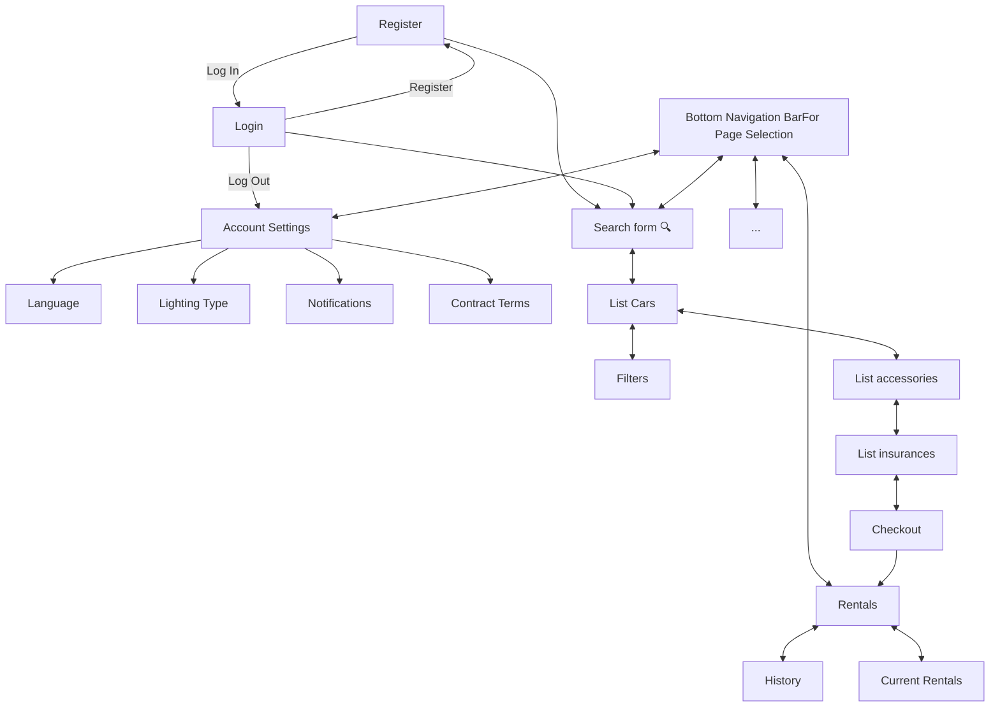
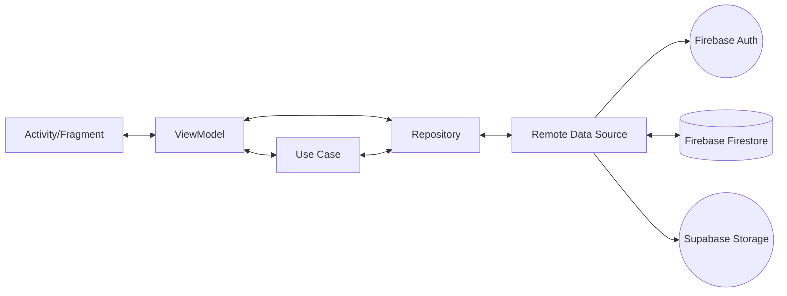
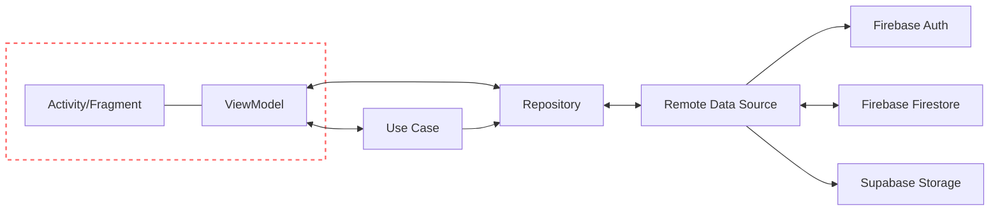
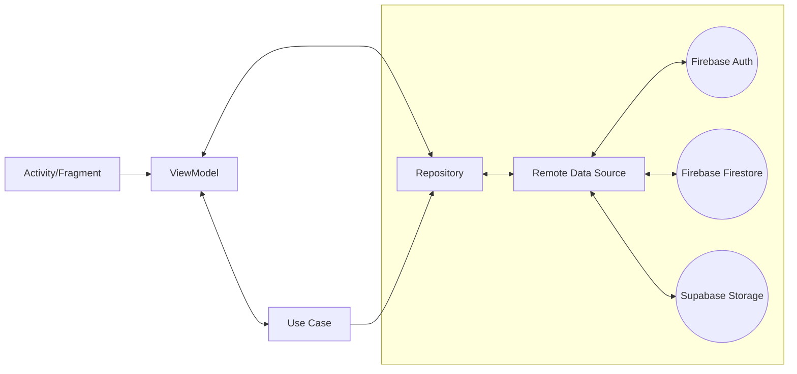
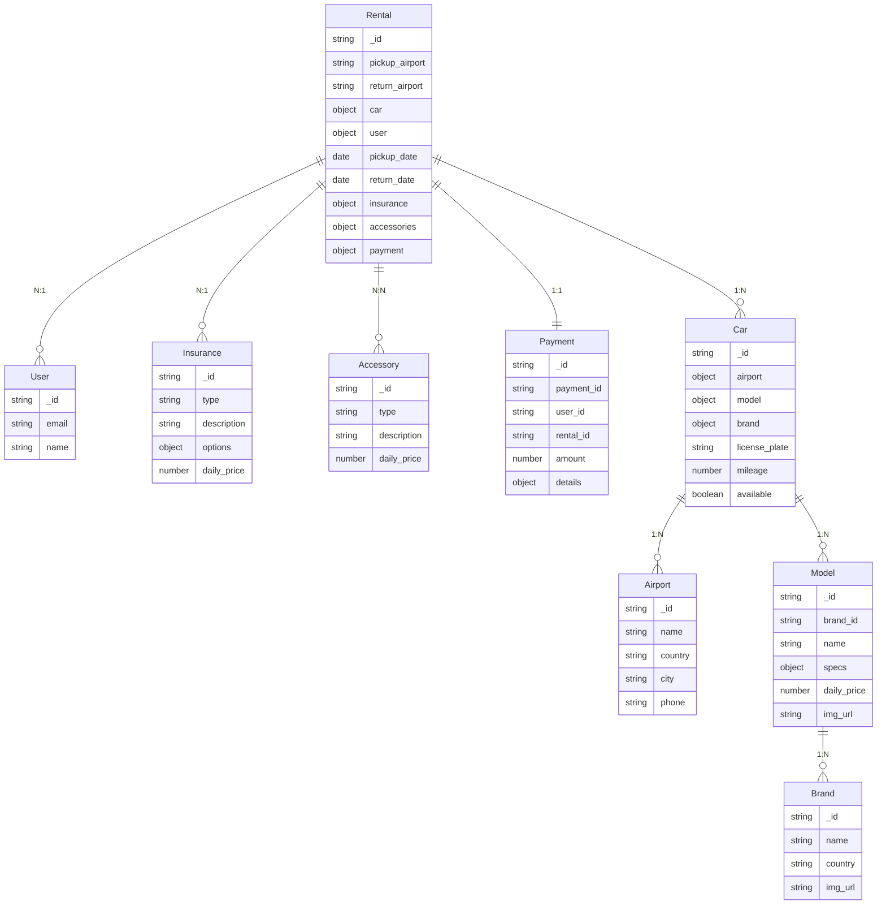
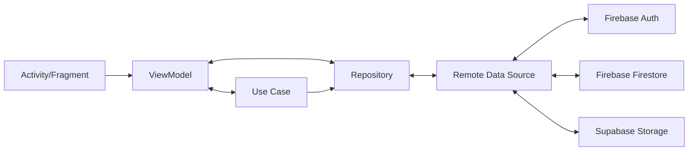
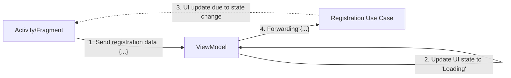
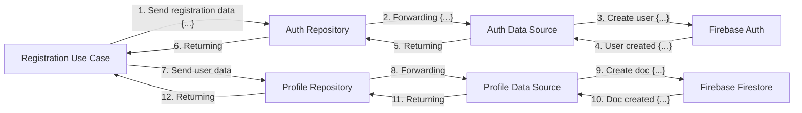
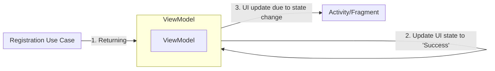

UNIVERSITÀ DEGLI STUDI DI BRESCIA logo

# UNIVERSITÀ DEGLI STUDI DI BRESCIA

DIPARTIMENTO DI INGEGNERIA DELL'INFORMAZIONE

# Vroom

Mobile Application Development Course

**Studenti:**

<table>
  <tbody>
    <tr>
        <td>Kevin Liu</td>
        <td>k.liu@studenti.unibs.it</td>
        <td>(731822)</td>
    </tr>
    <tr>
        <td>Davide Mottini</td>
        <td>d.mottini@studenti.unibs.it</td>
        <td>(731303)</td>
    </tr>
    <tr>
        <td>Michael Pluda</td>
        <td>m.pluda001@studenti.unibs.it</td>
        <td>(727389)</td>
    </tr>
  </tbody>
</table>

Anno Accademico 2024/2025

Data di consegna: December 17, 2025

# Contents

**1 Introduction**  **3**

**2 User Research**  **4**
2.1 Competitors Analysis  4
2.2 User Interview  5
2.2.1 User demographics  5
2.2.2 Questions about technology usage  7
2.2.3 Questions about past car rentals  8
2.2.4 Questions about booking process and competitors  10
2.2.5 Questions about users’ personal experience with car renting apps  13
2.3 Affinity Diagram  13
2.4 User Personas and Scenarios  18
2.4.1 User Persona: Alessandra Magnoli  18
2.4.2 User Scenario for Alessandra Magnoli  19
2.4.3 User Persona: Marco Ingegni  20
2.4.4 User Scenario n°1 for Marco Ingegni  21
2.4.5 User Scenario n°2 for Marco Ingegni  22

**3 Application Design**  **23**
3.1 Navigation Map  23
3.2 Design Prototype  25

**4 Architecture**  **34**
4.1 UI Layer  34
4.1.1 ViewModels  35
4.1.2 Multi-activity approach  36
4.2 Data Layer  38
4.2.1 Firebase & Supabase  38

<page_number>1</page_number>

4.2.2 Data Sources 39
4.2.3 Repositories 41
4.3 Domain Layer 42
4.3.1 Use Cases 43
4.4 Dependency Injection 44
4.5 End-to-End Example: User Registration Flow 45

**List of figures** **48**

**List of tables** **50**

<page_number>2</page_number>

*SECTION 1. Introduction*

# 1 Introduction

The purpose of this project was to design and implement an Android-based Car Rental Application that provides users with a streamlined and intuitive platform for reserving vehicles. Given the rapid expansion of mobile technologies, on-demand access to transportation services has become a core expectation among consumers. This project aims to address these expectations by developing an application that integrates essential car rental functionalities, including user authentication, vehicle browsing, booking management, and secure payment handling.

This document presents the application’s development in three sections. The first section focuses on user research, to identify the most important features to implement and the most important requirements that the design and final application will have to answer to. The next section presents the application design prototype, which shows the structure and functionalities of the application’s user interface before the actual implementation as a functioning program. The final section explains the application’s software architecture and data flow, detailing the interaction between the application on the users’ personal mobile device and the service’s database structure.

<page_number>

3
</page_number>

SECTION 2. User Research

# 2 User Research

The User Research phase lays the foundations of the user experience through a structured investigation of the market, the user base, and the navigational logic of the application. It establishes the functional scope of the system, identifies user expectations, and lays the groundwork for interaction patterns that guide the rest of the implementation.

This section is structured around four key components:

* **Competitors Analysis**: identifies market standards and missing opportunities.

* **User Interview**: gathers qualitative insights from real-world users.

* **Affinity Diagram**: organizes observations into meaningful themes.

* **User Personas and Scenarios**: models archetypes and realistic usage flows.

The following subsections present each phase in detail and demonstrate how they contributed to shaping the application's design direction.

## 2.1 Competitors Analysis

To understand the landscape of Car Rental and Sharing services, we conducted a systematic competitor analysis focusing on seven popular applications. Car Rental is a well-established service model. This offers an advantage: there is an abundance of options for our team to take inspiration from, and for users to experience many application features and point out what they like or dislike.

The main disadvantage is the necessity to outperform competitors by introducing new features or, more generally, by offering a better service.

Seven features have been identified, and seven competitor applications have been taken into consideration as shown in Table 2.1.

The results show that most of the applications offer the option to rent cars directly from the service provider instead of only offering car-sharing, as such we decided to focus

<page_number>4</page_number>

*SECTION 2. User Research*

<table>
  <thead>
    <tr>
        <th>Application</th>
        <th>Car Rental<br/>(filters)</th>
        <th>Car Sharing</th>
        <th>Alternative<br/>Vehicles</th>
        <th>Interactive<br/>Map</th>
        <th>PayPal<br/>Payment</th>
        <th>Custom<br/>Accessories</th>
        <th>Chat<br/>Assistance</th>
    </tr>
  </thead>
  <tbody>
    <tr>
        <td>Sixt App</td>
        <td>[yes]</td>
        <td>[yes]</td>
        <td>[yes]</td>
        <td>[yes]</td>
        <td>[yes]</td>
        <td>[yes]</td>
        <td>✓ (external)</td>
    </tr>
    <tr>
        <td>EuropCar</td>
        <td>[yes]</td>
        <td>[no]</td>
        <td>[yes]</td>
        <td>[yes]</td>
        <td>[no]</td>
        <td>[yes]</td>
        <td>[no]</td>
    </tr>
    <tr>
        <td>Free2Move</td>
        <td>[yes]</td>
        <td>[no]</td>
        <td>[no]</td>
        <td>[yes]</td>
        <td>[no]</td>
        <td>[no]</td>
        <td>[no]</td>
    </tr>
    <tr>
        <td>Turo</td>
        <td>[no]</td>
        <td>[yes]</td>
        <td>[no]</td>
        <td>[no]</td>
        <td>[yes]</td>
        <td>[no]</td>
        <td>[yes]</td>
    </tr>
    <tr>
        <td>Virtuo</td>
        <td>[yes]</td>
        <td>[no]</td>
        <td>[no]</td>
        <td>[no]</td>
        <td>[no]</td>
        <td>[no]</td>
        <td>[yes]</td>
    </tr>
    <tr>
        <td>EconomyBookings</td>
        <td>[yes]</td>
        <td>[no]</td>
        <td>[no]</td>
        <td>[yes]</td>
        <td>[yes]</td>
        <td>[yes]</td>
        <td>[no]</td>
    </tr>
    <tr>
        <td>DiscoverCar</td>
        <td>[yes]</td>
        <td>[no]</td>
        <td>[no]</td>
        <td>[no]</td>
        <td>[yes]</td>
        <td>[yes]</td>
        <td>[no]</td>
    </tr>
  </tbody>
</table>

Table 2.1: Comparison of competitor applications and supported features.

on that type of application model. This choice allowed us to better narrow down the most important features even before conducting a user interview. To name the most important underlying information that was gathered from this analysis: it allowed us to clearly identify the differences between mandatory features of Car Rental and Car Sharing services. Chat Assistance for instance was clearly identified as a non-mandatory feature, as most competitors do not use it for Car Rental, while Car-Sharing makes an in-app chat essential.

In order to make a decision on which of these features (or other features) to implement we relied on the user research to evaluate the importance of each of these.

## 2.2 User Interview

The user research took the form of an online survey, composed of twenty questions. The following sections will discuss the groups of questions and the answers users have provided.

### 2.2.1 User demographics

* Age range

* Gender

* Education Level

<page_number>5</page_number>

*SECTION 2. User Research*

* Country of Residence

These questions are aimed to get a sense of the general demographics of users that would use a car renting application. Users’ answers are displayed in the image below, except country of residence, as all but one user claimed Italian residence.

**Age range**
11 Responses

<table>
  <thead>
    <tr>
        <th>Age range</th>
        <th>Percentage</th>
    </tr>
  </thead>
  <tbody>
    <tr>
        <td>18-24</td>
        <td>27.3</td>
    </tr>
    <tr>
        <td>25-34</td>
        <td>36.4</td>
    </tr>
    <tr>
        <td>35-44</td>
        <td>36.4</td>
    </tr>
    <tr>
        <td>45-55</td>
        <td>0</td>
    </tr>
    <tr>
        <td>55+</td>
        <td>0</td>
    </tr>
  </tbody>
</table>

**Gender**
11 Responses

<table>
  <thead>
    <tr>
        <th>Gender</th>
        <th>Percentage</th>
    </tr>
  </thead>
  <tbody>
    <tr>
        <td>Male</td>
        <td>63.6</td>
    </tr>
    <tr>
        <td>Female</td>
        <td>36.4</td>
    </tr>
    <tr>
        <td>Prefer not to say</td>
        <td>0</td>
    </tr>
  </tbody>
</table>

Figure 2.1: Demographic distribution of survey respondents (Page 1 of 2)

<page_number>6</page_number>

SECTION 2. User Research

**Education level**
11 Responses

<table>
  <thead>
    <tr>
        <th>Education Level</th>
        <th>Percentage (%)</th>
    </tr>
  </thead>
  <tbody>
    <tr>
        <td>High School</td>
        <td>18.2</td>
    </tr>
    <tr>
        <td>Bachelor's Degree</td>
        <td>36.4</td>
    </tr>
    <tr>
        <td>Master's Degree</td>
        <td>36.4</td>
    </tr>
    <tr>
        <td colspan="2">PhD</td>
    </tr>
    <tr>
        <td>Other</td>
        <td>9.1</td>
    </tr>
  </tbody>
</table>

Figure 2.2: Demographic distribution of survey respondents (Page 2 of 2)

## 2.2.2 Questions about technology usage

* How many hours a day do you use your smartphone?

* How comfortable do you feel using your smartphone?

These questions are meant to figure out the perceived level of technology usage for our users. Users’ answers are displayed in the image below.

<page_number>

7
</page_number>

*SECTION 2. User Research*

**How many hours a day do you use your smartphone**

11 Responses

<table>
  <tbody>
    <tr>
        <td>Category</td>
        <td>Percentage</td>
    </tr>
    <tr>
        <td>Less than 1 hour</td>
        <td>18.2</td>
    </tr>
    <tr>
        <td>1 to 3 hours</td>
        <td>45.5</td>
    </tr>
    <tr>
        <td>3 to 5 hours</td>
        <td>9.1</td>
    </tr>
    <tr>
        <td>5 to 7 hours</td>
        <td>27.3</td>
    </tr>
    <tr>
        <td colspan="2">More than 7 hours</td>
    </tr>
  </tbody>
</table>

(a) Phone daily usage of survey respondents

**How comfortable do you feel using your smartphone**

11 Responses

<table>
  <tbody>
    <tr>
        <td>Comfort Level</td>
        <td>Responses</td>
    </tr>
    <tr>
        <td>1</td>
        <td>0 (0%)</td>
    </tr>
    <tr>
        <td>2</td>
        <td>0 (0%)</td>
    </tr>
    <tr>
        <td>3</td>
        <td>0 (0%)</td>
    </tr>
    <tr>
        <td>4</td>
        <td>5 (45.5%)</td>
    </tr>
    <tr>
        <td>5</td>
        <td>6 (54.5%)</td>
    </tr>
  </tbody>
</table>

(b) Phone ease of use for survey respondents

## 2.2.3 Questions about past car rentals

* Do you have a driver's license?

* Have you ever rented a car online?

* How often do you rent a car online?

* Why did you rent a car?

<page_number>8</page_number>

*SECTION 2. User Research*

* What type of vehicle did you rent?

All our users have claimed to possess a driving license, but one of them has never performed a car rental and as such, no further questions were answered by that particular user.

**Have you ever rented a car online?**

11 Responses

<table>
  <tbody>
    <tr>
        <td>Category</td>
        <td>Percentage</td>
    </tr>
    <tr>
        <td>Yes</td>
        <td>90.9%</td>
    </tr>
    <tr>
        <td>No</td>
        <td>9.1%</td>
    </tr>
  </tbody>
</table>

(a) Finding out how many users rented cars

**How often do you rent a car online?**

11 Responses

<table>
  <tbody>
    <tr>
        <td>Category</td>
        <td>Percentage</td>
    </tr>
    <tr>
        <td>I've done so only once</td>
        <td>36.4%</td>
    </tr>
    <tr>
        <td>Occasionally (1–2 times per year)</td>
        <td>45.5%</td>
    </tr>
    <tr>
        <td>Frequently (3+ times per year)</td>
        <td>18.2%</td>
    </tr>
    <tr>
        <td colspan="2">Monthly or more</td>
    </tr>
  </tbody>
</table>

(b) Frequency of rentals

<page_number>9</page_number>

*SECTION 2. User Research*

**Why Did You Rent a Car?**
11 Responses

<table>
  <tbody>
    <tr>
        <td>Category</td>
        <td>Percentage</td>
    </tr>
    <tr>
        <td>Vacation / Leisure</td>
        <td>18.2</td>
    </tr>
    <tr>
        <td>Work / Business</td>
        <td>27.3</td>
    </tr>
    <tr>
        <td>Emergency (or repairs)</td>
        <td>54.5</td>
    </tr>
  </tbody>
</table>

(a) Reasons for renting cars

**What type of vehicle did you rent?**
11 Responses

<table>
  <tbody>
    <tr>
        <td>Vehicle Type</td>
        <td>Responses (Percentage)</td>
    </tr>
    <tr>
        <td>City Car</td>
        <td>9 (81,8%)</td>
    </tr>
    <tr>
        <td>SUV</td>
        <td>5 (45.5%)</td>
    </tr>
    <tr>
        <td>Van</td>
        <td>0 (0%)</td>
    </tr>
    <tr>
        <td>Truck (pickup trucks)</td>
        <td>0 (0%)</td>
    </tr>
    <tr>
        <td>Electric/Hybrid</td>
        <td>3 (27.3%)</td>
    </tr>
    <tr>
        <td>Motorbike / Scooter</td>
        <td>0 (0%)</td>
    </tr>
    <tr>
        <td>Offroad Vehicle</td>
        <td>0 (0%)</td>
    </tr>
  </tbody>
</table>

(b) Preferred car types

### 2.2.4 Questions about booking process and competitors

* Which of the following car rental apps do you know or have used?

* Which features have you used the most?

* How important are the following features to you?

* How easy was it to complete your booking(s)?

<page_number>10</page_number>

*SECTION 2. User Research*

These questions are crucial for comparison with competitor apps and to determine the most important features. Users’ answers are displayed in the images below.

**Which of the following car rental apps do you know or have used?**

10 Responses

<table>
  <tbody>
    <tr>
        <td>App</td>
        <td>Responses</td>
    </tr>
    <tr>
        <td>Free2Move</td>
        <td>2 (20%)</td>
    </tr>
    <tr>
        <td>Sixt App</td>
        <td>5 (50%)</td>
    </tr>
    <tr>
        <td>EuropCar</td>
        <td>4 (40%)</td>
    </tr>
    <tr>
        <td>Virtuo</td>
        <td>1 (10%)</td>
    </tr>
    <tr>
        <td>Turo</td>
        <td>0 (0%)</td>
    </tr>
    <tr>
        <td>EconomyBookings</td>
        <td>1 (10%)</td>
    </tr>
    <tr>
        <td>Discover Cars</td>
        <td>4 (40%)</td>
    </tr>
    <tr>
        <td>other websites (I don't rememb...</td>
        <td>1 (10%)</td>
    </tr>
    <tr>
        <td>Citiz</td>
        <td>1 (10%)</td>
    </tr>
  </tbody>
</table>

(a) Other application used by users

**Which features have you used the most?**

10 Responses

<table>
  <tbody>
    <tr>
        <td>Feature</td>
        <td>Responses</td>
    </tr>
    <tr>
        <td>Search cars on a map</td>
        <td>5 (50%)</td>
    </tr>
    <tr>
        <td>Car sharing</td>
        <td>5 (50%)</td>
    </tr>
    <tr>
        <td>Filters (price, car type, location)</td>
        <td>8 (80%)</td>
    </tr>
    <tr>
        <td>Booking and payment</td>
        <td>8 (80%)</td>
    </tr>
    <tr>
        <td>Customer support</td>
        <td>2 (20%)</td>
    </tr>
    <tr>
        <td>Extend a rental</td>
        <td>3 (30%)</td>
    </tr>
    <tr>
        <td>Manage bookings</td>
        <td>6 (60%)</td>
    </tr>
    <tr>
        <td>Interactive map</td>
        <td>1 (10%)</td>
    </tr>
  </tbody>
</table>

(b) Most used features

<page_number>11</page_number>

*SECTION 2. User Research*

How important are the following features to you?

<table>
  <thead>
    <tr>
        <th>Feature</th>
        <th>1</th>
        <th>2</th>
        <th>3</th>
        <th>4</th>
        <th>5</th>
    </tr>
  </thead>
  <tbody>
    <tr>
        <td>Fast and intuitive search</td>
        <td>0</td>
        <td>1</td>
        <td>1</td>
        <td>2</td>
        <td>7</td>
    </tr>
    <tr>
        <td>Transparent Payment methods (such as Paypal)</td>
        <td>0</td>
        <td>0</td>
        <td>1</td>
        <td>1</td>
        <td>8</td>
    </tr>
    <tr>
        <td>Interactive map</td>
        <td>0</td>
        <td>1</td>
        <td>6</td>
        <td>3</td>
        <td>0</td>
    </tr>
    <tr>
        <td>Quick Customer Support</td>
        <td>0</td>
        <td>1</td>
        <td>2</td>
        <td>1</td>
        <td>6</td>
    </tr>
    <tr>
        <td>Variety of Available Vehicles</td>
        <td>0</td>
        <td>0</td>
        <td>4</td>
        <td>4</td>
        <td>2</td>
    </tr>
    <tr>
        <td>Accessories and customization with extra fuel, child seats and seat mats</td>
        <td>1</td>
        <td>2</td>
        <td>3</td>
        <td>3</td>
        <td>1</td>
    </tr>
    <tr>
        <td>Selection of different Insurance Policies</td>
        <td>0</td>
        <td>0</td>
        <td>2</td>
        <td>2</td>
        <td>6</td>
    </tr>
    <tr>
        <td>Car Sharing</td>
        <td>1</td>
        <td>4</td>
        <td>2</td>
        <td>3</td>
        <td>0</td>
    </tr>
    <tr>
        <td>Live Chat with car lenders</td>
        <td>2</td>
        <td>1</td>
        <td>3</td>
        <td>3</td>
        <td>0</td>
    </tr>
    <tr>
        <td>Competitive Prices</td>
        <td>0</td>
        <td>0</td>
        <td>1</td>
        <td>3</td>
        <td>6</td>
    </tr>
  </tbody>
</table>

Figure 2.7: Importance of several features in Car Rental services

How easy was it to complete your booking(s)?

10 Responses

<table>
  <thead>
    <tr>
        <th>Rating</th>
        <th>Count</th>
    </tr>
  </thead>
  <tbody>
    <tr>
        <td>1</td>
        <td>0</td>
    </tr>
    <tr>
        <td>2</td>
        <td>0</td>
    </tr>
    <tr>
        <td>3</td>
        <td>1</td>
    </tr>
    <tr>
        <td>4</td>
        <td>2</td>
    </tr>
    <tr>
        <td>5</td>
        <td>3</td>
    </tr>
    <tr>
        <td>6</td>
        <td>4</td>
    </tr>
  </tbody>
</table>

Figure 2.8: Ease of rental completion from 1 to 6

<page_number>12</page_number>

*SECTION 2. User Research*

### 2.2.5 Questions about users' personal experience with car renting apps

* Have you ever felt confused or uncertain during the rental process?

* If you answered "yes", why did you feel confused or uncertain?

* What has been your biggest frustration when using a car rental app?

* What would improve your overall rental experience?

* Is there any feature you wished existed in Car Rental apps but doesn't exist yet?

For the sake of brevity, users' answers to these open-handed questions were summarized. Exactly half of our users have reported feeling confused or uncertain during the rental process. About half of them claimed it was caused by the low responsiveness and slow loading times of the application. The other half have expressed frustration during the search for the car they wanted, as filters "didn't work" or electric or cheaper cars were missing or hard to find. They suggested that by fixing the reported causes of frustration and making the application faster and more clear in its display and search parameters would be the greatest possible improvement. Some users also insisted that spending less by having options for reliable and cheaper options is a priority to them. Some suggestions were clearly dismissed as ironic, such as the possibility of using ai or bizarre vehicles, probably used in place of some "I have no suggestions" answer.

### 2.3 Affinity Diagram

The following important information has been extracted from the users' answers:

<page_number>

13
</page_number>

*SECTION 2. User Research*

> Both genders (male/ female) use rental services.
>
> michael pluda

> Almost everyone has a driving license.
>
> michael pluda

> Users are aged uniformly between 18 and 44
>
> D_Mottini

> Most of our users have an university level education
>
> D_Mottini

> Most of our users come from Italy
>
> michael pluda

<page_number>

14
</page_number>

*SECTION 2. User Research*

Rental car apps are used occationally, once or two times a year

kevin liu

Most people rent a car for vacation related purposes.

michael pluda

A smaller portion of our users have rented cars for work or emergency purposes

D_Mottini

Discover Cars, Sixt App and EuropCar are the most popular car rental app

kevin liu

Half of our users have felt confused during the rental process.

D_Mottini

Half of our users use their smartphones less than 3 hours a day.

D_Mottini

Some people navigate on an interactive map to filter for cars.

michael pluda

<page_number>

15
</page_number>

# SECTION 2. User Research

Most of our users have booked a city car or a suv.

D_Mottini

Competitive prices

michael pluda

Cleaner graphical user interface

kevin liu

A third of our users have booked an electric car.

D_Mottini

Ample selection of vehicles to choose from

D_Mottini

Faster apps

kevin liu

A lot of people use filters to search for the ideal car to rent.

michael pluda

Availability of multiple insurances.

michael pluda

More intuitive apps

kevin liu

<page_number>16</page_number>

# SECTION 2. User Research

User interface should be easy to remember for consecutive times

kevin liu

Most of our users have found it easy to complete their bookings. But not all of them.

D_Mottini

Most of our user believe better information display would improve the rental experience.

D_Mottini

Most of the user frustration was caused by low responsiveness or lack of the desired vehicle to rent.

D_Mottini

Most of the user confusion was caused by low responsiveness or excessive amount of information all at once.

D_Mottini

Five clusters were identified among the main points of information:

1. User demographics

2. User habits, concerning both technology and Car Rental services

3. Vehicle selection for their rentals

4. User goals, what they really want from Car Rental services

5. UI/UX: as it was one of our goals for this user research to identify what the users found frustrating or hard to use in competitor applications to try and guarantee a better user experience

Of all of these, the most important conclusions are those that these factors are crucial for a Car Rental application:

<page_number>17</page_number>

*SECTION 2. User Research*

1. Abundance of vehicle types, which means this option has to be handled via accessories and advanced filters

2. The application must be quick and easy to use; the rental process must be streamlined, and the interface uncluttered and simplistic

## 2.4 User Personas and Scenarios

Personas were created to synthesize different user types into clear archetypes. Each persona was paired with one or more scenarios that represent typical interaction patterns within the application.

These personas embody user motivations, frustrations, and ideal outcomes, helping ensure that each design decision remains grounded in real-world needs.

### 2.4.1 User Persona: Alessandra Magnoli

The first User Persona is called Alessandra Magnoli, she's a Psychologist from Prevalle. She's meant to represent the users with higher standards of living that rent cars mainly for vacation purposes. She has a large family with young children, for which she'll need the possibility to add children seats and rent a larger type of car. Safety is a greater concern than price for her: a good insurance policy is important for her. She's not uncomfortable with the use of a smartphone, but she's not exactly tech savvy, so she'd prefer an application that is simple to use, with few things on the screen at any given time.

<page_number>

18
</page_number>

SECTION 2. User Research

Photograph of Alessandra Magnoli

**ALESSANDRA MAGNOLI**
31 YEARS OLD

"Rosso di sera, bel tempo si spera"

PSYCHOLOGIST

LOVES THE SEA

PREVALLE

VERY RICH

**GOALS**

* Wants to book electric cars to reduce her carbon footprint

* Sometimes she might need a larger car when the whole family tags along

**MOTIVATIONS**

* Price
* Comfort
* Convenience
Motivations bar chart

**CAR RENTAL EXPERIENCE**

* Has some eperience with Sixt App

* Rents a car once a year for vacation with her family

**PERSONALITY**

* Confident

* Friendly

* Precise

**DESIRED FEATURES**

* Simple UI to interact with

* Large selection of cars

* Good insurances

* Possibility to add children seats

Figure 2.9: User Persona: Alessandra Magnoli

## 2.4.2 User Scenario for Alessandra Magnoli

Alessandra, a 31-year-old mother of three, is organizing a long-awaited vacation to Hawaii with her large family.

The group includes her husband and three young children — so five in total. Since they'll be traveling across multiple islands and visiting several beaches and attractions, Alessandra knows that relying on public transportation or taxis would be stressful and impractical.

She decides that renting a car or possibly a large SUV or minivan is the most convenient solution. Alessandra is environmentally conscious, so she'd prefer an electric or hybrid vehicle if available. She also wants to make sure the car is comfortable, safe, and spacious enough for her family and luggage.

While researching options, Alessandra discovers the Vroom app, which promises flexible rental options, transparent pricing, and easy filtering. She opens the app and starts by

<page_number>19</page_number>

SECTION 2. User Research

entering her travel dates and selecting the pickup and drop-off location, which will both be the airport where she lands.

Using the search filters, she specifies:

* **Vehicle type:** SUV or minivan

* **Fuel type:** Electric or hybrid

* **Capacity:** 5+ passengers

The app quickly shows a curated list of suitable vehicles. She taps on a vehicle that catches her eye — a Tesla Model X with seven seats and an extended battery range. Before confirming, she explores add-ons. Since this is her first time in Hawaii, she adds:

* GPS navigation (to avoid getting lost on island roads)

* Two child seats for her youngest kids

* Full coverage insurance, for peace of mind during the trip

At checkout, Alessandra reviews all details in a clean summary screen: rental duration, accessories, and total price.

Finally, she completes her booking using PayPal, receiving instant confirmation and a digital receipt. Feeling reassured and organized, Alessandra closes the app knowing her transportation is fully taken care of, allowing her to focus on planning the rest of her family’s vacation.

### 2.4.3 User Persona: Marco Ingegni

The second User Persona is called Marco Ingegni, he’s a Software Developer from Sarezzo. He’s meant to represent the users with lower standards of living that rent cars mainly for work travels and purposes. He usually travels alone and money is tight for him, so he’ll often need a low cost city car with little to no accessories and the cheapest insurance

<page_number>

20
</page_number>

*SECTION 2. User Research*

he can get. Another tight resource for Marco is time, he's absorbed in his work and a responsive application would save him much frustration, since he travels often.

User Persona: Marco Ingegni

Figure 2.10: User Persona: Marco Ingegni

## 2.4.4 User Scenario n°1 for Marco Ingegni

Marco, a 25-year-old technician for an Italian telecommunications company, receives unexpected news from his manager: he's being transferred to Tirana, Albania, to support a new expansion project. At first, Marco refuses — he's reluctant to leave his family and worried about the costs of living abroad. However, the alternative would be losing his job, which could lead to financial trouble and instability at home. Feeling cornered, he decides to accept the transfer. Once in Tirana, Marco quickly realizes that public transportation isn't very reliable and that he'll need a car to move between his hotel, the office, and several work sites. Given his tight budget, he decides to rent a small, affordable vehicle for the duration of his stay. He opens the Vroom app, enters his rental dates, and sets both the pickup and return locations at Tirana Airport. Using the sorting feature, he

<page_number>

21
</page_number>

*SECTION 2. User Research*

orders the available cars "from cheapest to most expensive." After browsing a few options, he chooses a Renault Twingo (gas-powered) — compact, economical, and perfectly sufficient for his needs. He selects the basic insurance package, skips any optional accessories, and pays securely via PayPal. Within moments, he receives confirmation and a digital receipt. Although he's still uneasy about the move, Marco feels relieved to have handled one major concern quickly and efficiently. Thanks to Vroom, he's able to secure reliable transportation and focus on adapting to his new temporary life in Albania.

## 2.4.5 User Scenario n°2 for Marco Ingegni

Marco has forgotten the date of his return flight. Furthermore, his wife wants to make sure he hasn't spent more than the last time he's had to travel for work.

Marco opens the Vroom App and selects the Rentals page, where he can see the car he has rented for his planned trip He can easily see the return date for his trip and he can compare the prices to show his wife by selecting the current rentals or the historical ones.

<page_number>

22
</page_number>

*SECTION 3. Application Design*

# 3 Application Design

This section describes the Applications' design before the software implementation. While the software architecture defines the technical organization of the application, the design phase clarifies the **conceptual organization of the product**, ensuring that its features align with real user needs and industry standards.

This section is structured around two key components:

* **Navigation Map:** defines the internal structure and app flow.

* **Design Prototype:** summarizes the interaction and information models.

The following subsections present each phase in detail and demonstrate how they contributed to shaping the application's design direction.

## 3.1 Navigation Map

As illustrated in the Navigation Map, the application is organized into several interconnected sections. The first set of pages forms the authentication loop, consisting of the Login and Register screens. Users can freely switch between the two, and once they successfully log in or create an account, they gain access to the main application.

The application is structured around three primary sections:

* Car Search

* Rentals

* Account Settings

To ensure a seamless experience, the app is designed so that users can begin the car-rental process immediately. After logging in or signing up, users are directed straight to the Search page. From the Search page, users may navigate to other main sections or enter the Rental Flow, which includes the following steps:

<page_number>

23
</page_number>

*SECTION 3. Application Design*



Figure 3.1: Navigation structure for the rental application.

<page_number>24</page_number>

*SECTION 3. Application Design*

* Filters – Apply filters to refine the list of available cars.

* Select Cars – Browse available cars and select one.

* Select Accessories – View and choose optional accessories.

* Select Insurances – Review available insurance options and select a preferred policy.

* Checkout – Review all selections and complete the payment (e.g., with PayPal).

After completing the Rental Flow, users are taken directly to the Rentals section, where they can view both current and past rentals. Finally, the Account Settings section allows users to configure their preferences, such as language, theme (e.g., light/dark mode), notification settings, and contract terms.

## 3.2 Design Prototype

This section displays the components explored in the Navigation Map.

The following tables map each page or fragment in the navigation structure to its corresponding screenshot. Each image illustrates the visual layout of the page as it appears in the mobile application.

<page_number>

25
</page_number>

*SECTION 3. Application Design*

Login Page UI design featuring a logo, "Welcome back" message, email and password fields, a Login button, and a "Create account" link.

Register Page UI design featuring "Create Account" title, fields for Username, Email, Driver license number, Password, and Repet password, a Register button, and a "Login" link.

Figure 3.2: Login Page

Figure 3.3: Register Page

<page_number>

26
</page_number>

*SECTION 3. Application Design*

Screenshot of the Car Search interface showing pickup/drop-off locations, date selection (10 ottobre - 17 ottobre), time selection (8:00), and a "Search car" button.

Screenshot of the List Cars interface showing search results for Aeroporto di Malpensa (10-10-25 to 17-10-25), featuring a Volvo EX30 and a Fiat 500 with pricing and specifications.

Figure 3.4: Car Search

Figure 3.5: List Cars

<page_number>27</page_number>

*SECTION 3. Application Design*

Screenshot of a mobile application interface showing a "Filters" screen with options for Fuel type (Diesel, Electric, LPG, CNG, Hybrid, Petrol), Vehicle type (Hatchback, Crossover, SUV, Sedan), Number of seats (4 seats, 5 seats, 7+ seats), and a Price range slider from € 0 - € 150, with an "Apply filters" button at the bottom.

Screenshot of a mobile application interface showing a "Smart Insurances" screen with three insurance tiers: Premium (Zero deductible and full coverage, includes Deductible reduction, 24/7 Assistance, and Theft coverage for + €19,90 per day), Comfort (Medium coverage with partial protection, includes Deductible reduction and 24/7 Assistance for + €9,90 per day), and Basic (Minimum coverage and standard assistance, includes 24/7 Assistance). The total price € 111,30 and a "Continue" button are at the bottom.

Figure 3.6: Filters

Figure 3.7: List Insurances

<page_number>28</page_number>

SECTION 3. Application Design

Screenshot of Optional & Accessories app screen

Figure 3.8: List Accessories

Screenshot of Payment app screen

Figure 3.9: Payment Section

<page_number>

29
</page_number>

SECTION 3. Application Design

Screenshot of the Active Rentals mobile application screen showing current and upcoming car rentals.

Screenshot of the Historical Rentals mobile application screen showing a list of completed car rentals.

Figure 3.10: Active Rentals

Figure 3.11: Historical Rentals

<page_number>30</page_number>

SECTION 3. Application Design

# Rental Detail

**VOLVO EX30**
SUV
€ 15,90 per day

**Pickup**
oct 10, 10:00 am at Milano Airport

**Drop-off**
oct 17, 10:00 am at Milano Airport

Total duration: 7 days

**Premium insurance**
Full coverage for theft and damage
Details
€ 19,90 per day

**Child seat**
€ 4,90 per day € 34,50

**Android Auto**
€ 2,00 per day € 14,00

**Cost summary**
Base car price € 111,30
Premium insurance € 139,30
Accessories € 48,50

**Total paid € 299,10**

Screenshot of a mobile application showing rental details for a Volvo EX30, including pickup/drop-off times, insurance, accessories, and a cost summary.

Figure 3.12: Rental Details

<page_number>

31
</page_number>

*SECTION 3. Application Design*

Screenshot of Account Settings mobile application screen showing menu options for Personal data, Notifications, Theme, Language, Contract terms, and Logout, with a bottom navigation bar.

Figure 3.13: Account Settings

Screenshot of Personal Data mobile application screen showing fields for Username (GoodAvocado), Mail (avocado@vroom.com), Driver licence number (AB1234567), and Phone number (+39 334 0021 345), with a "No changes made" button and bottom navigation bar.

Figure 3.14: Personal Data

<page_number>

32
</page_number>

*SECTION 3. Application Design*

Notifications screen showing toggle switches for "Enable notifications" and "Enable promotions" with a bottom navigation bar.

Contract terms screen showing "General contract terms" and "Privacy policy" text with a bottom navigation bar.

Figure 3.15: Notifications

Figure 3.16: Contract Terms

<page_number>

33
</page_number>

*SECTION 4. Architecture*

# 4 Architecture

The application follows a layered MVVM (Model-View-ViewModel) inspired architecture, which separates responsibilities into clear areas:

* **UI layer**: displays application data on the screen.

* **Data layer**: contains the business logic of the application and exposes its data.

* **Domain layer**: simplifies the interaction between the UI and data layers, orchestrating complex business logic.

This architectural pattern has been heavily influenced by the Android architecture guidelines<sup>1</sup> on their website. All the code for the project can be found in our GitHub repository<sup>2</sup>.



Figure 4.1: Application architecture.

## 4.1 UI Layer

The role of the UI layer (also called "presentation layer") is to display the application data on the screen and also to serve as the primary point of user interaction. Whenever

<sup>1</sup>[https://developer.android.com/topic/architecture](https://developer.android.com/topic/architecture)

<sup>2</sup>[https://github.com/MechaMic38/Vroom](https://github.com/MechaMic38/Vroom)

<page_number>34</page_number>

*SECTION 4. Architecture*

the data changes, either due to user interaction (pressing or swiping) or external input (such as network responses), the UI should update to reflect those changes.

It can be seen as a **visual representation of the application state**, converting data coming from the data layer into a form that the UI can present and display to the user.



Figure 4.2: UI layer section of the app architecture.

## 4.1.1 ViewModels

A ViewModel acts as a state holder of both UI-related data and the business operations exposed to the UI. It serves as a **bridge between the interface and the application’s underlying logic.**

Its most important benefit is that it survives configuration changes (e.g. device rotations or language changes), preventing refetching of data. Since it persists beyond screen recreation, it can safely cache state and reduce the number of calls to the data layer. It’s also lifecycle-aware, meaning they remain active only while the associated UI scope is alive, reducing the risk of memory leaks.

The UI observes the state stored in the ViewModel and reacts dynamically to its updates, while the user actions are forwarded to the ViewModel, which exposes methods for interacting with the domain and data layers.

<page_number>35</page_number>

SECTION 4. Architecture

```kotlin
sealed class UiState {
    object Loading : UiState()
    data class Success(val insurances: List<Insurance>) : UiState()
    data class Error(val message: String) : UiState()
}

@HiltViewModel
class InsuranceViewModel @Inject constructor(
    private val insuranceRepository: IInsuranceRepository
) : ViewModel() {
    private val _uiState = MutableStateFlow<UiState>(UiState.Loading)
    val uiState: StateFlow<UiState> = _uiState.asStateFlow()

    init {
        viewModelScope.launch {
            _uiState.value = UiState.Loading
            try {
                val insurances = insuranceRepository.getInsurances()
                _uiState.value = UiState.Success(insurances)
            } catch (e: Exception) {
                _uiState.value = UiState.Error(
                    e.message ?: "Failed to load insurance packages."
                )
            }
        }
    }
}
```

## 4.1.2 Multi-activity approach

Activities and Fragments are what the user really sees (i.e. what appears on screen). We decided to use multiple Activities to create a clear separation between major user flows:

<page_number>36</page_number>

*SECTION 4. Architecture*

* **AuthActivity**: login and registration.

* **MainActivity**: the main area of the application where the user can see his rentals and access the app settings.

* **RentalFlowActivity**: rental configuration steps (car selection, insurance, accessories) and final checkout.

Each Activity hosts its own navigation graph and, when needed, exposes a shared ViewModel to all its associated Fragments.

Notice that a single-Activity approach is definitely possible, by scoping ViewModels to the navigation subgraphs instead of the Activity itself, but we intentionally used multiple activities to isolate complex flows.

```kotlin
@AndroidEntryPoint
class InsuranceFragment : Fragment() {
    private val viewModel: InsuranceViewModel by viewModels()

    override fun onViewCreated(view: View, savedInstanceState: Bundle?) {
        ...

        lifecycleScope.launch {
            repeatOnLifecycle(Lifecycle.State.STARTED) {
                viewModel.uiState.collect { state ->
                    when (state) {
                        is UiState.Loading -> {
                            progressBar.visibility = View.VISIBLE
                            recyclerView.visibility = View.GONE
                        }
                        is UiState.Success -> {
                            progressBar.visibility = View.GONE
                            recyclerView.visibility = View.VISIBLE
```

<page_number>

37
</page_number>

*SECTION 4. Architecture*

```kotlin
            adapter.submitList(state.insurances)
        }
        is UiState.Error -> {
            // error handling
        }
    }
}
}
}
}
}
}
```

## 4.2 Data Layer

The data layer is responsible not only for providing data to the UI layer, but also for determining how application data is created, stored, and modified. These rules and behaviors collectively represent the application's **business logic**.

Thanks to the separation of concerns, this business logic is encapsulated within small, well-defined components. This makes the logic easier to maintain, test, and safely reuse across different screens of the application.

### 4.2.1 Firebase & Supabase

The application relies primarily on Firebase for backend services, more specifically:

* **Firebase Authentication<sup>3</sup>**: manages user accounts, allowing sign-up and login using email and password.

* **Firebase Firestore<sup>4</sup>**: serves as the main database for all business-related data. Its document-oriented structure fits naturally with the hierarchical data models required by the application.

<sup>3</sup>[https://firebase.google.com/products/auth](https://firebase.google.com/products/auth)

<sup>4</sup>[https://firebase.google.com/products/firestore](https://firebase.google.com/products/firestore)

<page_number>

38
</page_number>

*SECTION 4. Architecture*



Figure 4.3: Data layer section of the app architecture.

Because the application also needs to retrieve images asynchronously, a remote storage service was required. While Firebase provides Cloud Storage, at the time of development it was only available under a paid plan. For this reason, we opted for **Supabase Storage**<sup>5</sup>, which is free, straightforward to use, and provided all the functionalities we needed. All base data and images were seeded in advance using a custom Python script<sup>6</sup>.

## 4.2.2 Data Sources

Data sources are the components responsible for interacting directly with the real data providers—in this case, Firebase (and Supabase for images). They act as the source of truth for remote data and **manage all low-level operations** such as fetching, creating, updating, and deleting records.

For clarity and separation of responsibilities, each major entity in the application is assigned its own dedicated remote data source (e.g., one for rentals, one for payments, one for authentication, etc.). These data sources perform direct network operations and return data structured according to the remote schema.

<sup>5</sup>[https://supabase.com/storage](https://supabase.com/storage)

<sup>6</sup>[https://github.com/MechaMic38/Vroom-Seeder](https://github.com/MechaMic38/Vroom-Seeder)

<page_number>

39
</page_number>

*SECTION 4. Architecture*



Figure 4.4: Firestore database structure.

<page_number>40</page_number>

*SECTION 4. Architecture*

```kotlin
class FirestoreRentalRemoteDataSource @Inject constructor(
    private val firestore: FirebaseFirestore
) : IRentalRemoteDataSource {
    val collectionName: String = FirestoreCollections.RENTALS

    override suspend fun createRental(rental: NetworkRental): NetworkRental {
        val docRef = firestore.collection(collectionName)
            .add(rental)
            .await()

        return rental.copy(id = docRef.id)
    }
}
```

## 4.2.3 Repositories

Repositories sit above the data sources and provide a clean **API for the rest of the application**. Their responsibilities include:

* Coordinating multiple data sources when needed.

* Enforcing access rules so that users can only retrieve data they are authorized to view, providing a very basic layer of security (which does not substitute an ideal server authentication and authorization system).

* Translating remote data models into domain models used throughout the app.

* Converting outgoing domain models back into their network representation.

Each repository delegates low-level operations to its corresponding data sources while ensuring that the data exposed to the upper layers remains consistent.

<page_number>

41
</page_number>

*SECTION 4. Architecture*

Since our application didn't require it, remote data is not cached locally through something like Room<sup>7</sup>. But if we wanted to, the repository would be responsible for synchronizing data between the remote data source and the local data source.

```kotlin
class RentalRepository @Inject constructor(
    private val rentalRemoteDataSource: IRentalRemoteDataSource,
    private val authRepository: IAuthRepository
) : IRentalRepository {
    override suspend fun createRental(rental: Rental): Rental {
        // Assign current user ID
        val user = authRepository.getCurrentUser().first()
            ?: throw UserNotAuthenticatedException
        val rentalToCreate = rental.copy(userId = user.id)

        // Create remote rental
        val createdRental = rentalRemoteDataSource.createRental(
            rentalToCreate.asNetworkModel()
        )

        // Convert network data to domain data
        return createdRental.asExternalModel()
    }
}
```

## 4.3 Domain Layer

The domain layer sits between the UI layer and the data layer, and encapsulates the core of the application's business logic. It contains the logic that must remain consistent across multiple screens, ensuring that decisions and rules are centralized.

<sup>7</sup>[https://developer.android.com/training/data-storage/room](https://developer.android.com/training/data-storage/room)

<page_number>42</page_number>

*SECTION 4. Architecture*



Figure 4.5: Domain layer section of the app architecture.

## 4.3.1 Use Cases

Classes in the domain layer are typically modeled as “use cases”, each responsible for a single, well-defined piece of functionality (e.g. user registration, payment finalization...). Their main goal is to coordinate and **orchestrate complex operations** that involve multiple different sections of the business logic.

Instead of having the ViewModel orchestrate everything by itself, we let the use case manage all business logic related operations, letting the ViewModel simply handle UI logic and delegate all business logic to the use case.

Code snippet showing FinalizePaymentUseCase class implementation

<page_number>

43
</page_number>

*SECTION 4. Architecture*

```kotlin
        ?: throw UserNotAuthenticatedException

    // Capture the PayPal order
    val captureResult = captureOrderUseCase(orderId)

    // Create payment record
    val payment = paymentRepository.createPayment(
        ...
    )

    // Update rental
    rentalRepository.updateRentalPayment(
        id = rentalId,
        payment = payment
    )
}
}
```

## 4.4 Dependency Injection

The application uses Hilt<sup>8</sup> to manage dependency injection, ensuring that every class automatically receives the components it needs without having to create them manually. With Hilt, dependencies such as repositories, data sources, and use cases are created in a centralized and controlled way, then injected wherever they are required. This avoids tightly coupling classes together, and avoids instantiating and passing all their dependencies manually.

In practice, Hilt acts as the **“glue” that wires together** the UI, domain, and data layers. Each layer only depends on clear interfaces, while the dependency injection framework handles the actual object creation behind the scenes.

<sup>8</sup>[https://developer.android.com/training/dependency-injection/hilt-android](https://developer.android.com/training/dependency-injection/hilt-android)

<page_number>44</page_number>

*SECTION 4. Architecture*

```kotlin
@Module
@InstallIn(SingletonComponent::class)
abstract class RepositoryModule {
    @Binds
    @Singleton
    abstract fun bindAuthRepository(
        authRepository: AuthRepository
    ): IAuthRepository
}
```

## 4.5 End-to-End Example: User Registration Flow

To illustrate how the different layers of the architecture collaborate, we examine the complete flow of a user registration request—from the moment the user presses "Register" to the moment their account is created in Firebase Authentication and their profile is stored in Firestore. To avoid overcomplicating the explanation, we describe only the successful case.

The flow begins in the `RegistrationFragment`, where the user enters their email, password, and personal information. When the "Register" button is pressed, the Fragment forwards this input to the `RegistrationViewModel`, without handling business logic itself. The `RegistrationViewModel` validates the input at a UI level (e.g., non-empty fields). It then delegates the actual registration process to the `UserRegistrationUseCase`. During this process, the ViewModel sets the UI state as "Loading", causing the interface to update accordingly.

The `UserRegistrationUseCase` orchestrates the entire registration process. It coordinates operations involving two repositories:

* **AuthRepository**, responsible for creating the authentication record.

* **ProfileRepository**, responsible for storing user profile data.

<page_number>45</page_number>

*SECTION 4. Architecture*



Figure 4.6: Initial user registration step, happening in the UI layer.

It first makes sure to register the user correctly, by passing the request to the **AuthRepository**, which in turn delegates the registration to the **AuthDataSource**. The latter will complete the process through Firebase Authentication.

Once the authentication record is successfully created and returned to the use case, it then creates the profile document in the database, by passing the request to the **ProfileRepository**, which in turn delegates the creation to the **ProfileDataSource**. The latter completes the process through Firebase Firestore.



Figure 4.7: Intermediate user registration step, happening in the data layer.

The **UserRegistrationUseCase** sends the final user data back to the **RegistrationViewModel**, which will update its state accordingly. The **RegistrationFragment** reacts immediately

<page_number>46</page_number>

*SECTION 4. Architecture*

to the state update, by navigating to the main activity.



Figure 4.8: Final user registration step, happening in the UI layer.

<page_number>

47
</page_number>

*LIST OF FIGURES*

# List of Figures

2.1 Demographic distribution of survey respondents (Page 1 of 2)  6
2.2 Demographic distribution of survey respondents (Page 2 of 2)  7
2.7 Importance of several features in Car Rental services  12
2.8 Ease of rental completion from 1 to 6  12
2.9 User Persona: Alessandra Magnoli  19
2.10 User Persona: Marco Ingegni  21
3.1 Navigation structure for the rental application  24
3.2 Login Page  26
3.3 Register Page  26
3.4 Car Search  27
3.5 List Cars  27
3.6 Filters  28
3.7 List Insurances  28
3.8 List Accessories  29
3.9 Payment Section  29
3.10 Active Rentals  30
3.11 Historical Rentals  30
3.12 Rental Details  31
3.13 Account Settings  32
3.14 Personal Data  32
3.15 Notifications  33
3.16 Contract Terms  33
4.1 Application architecture  34
4.2 UI layer section of the app architecture  35
4.3 Data layer section of the app architecture  39
4.4 Firestore database structure  40

<page_number>48</page_number>

*LIST OF FIGURES*

4.5 Domain layer section of the app architecture 43
4.6 Initial user registration step, happening in the UI layer 46
4.7 Intermediate user registration step, happening in the data layer 46
4.8 Final user registration step, happening in the UI layer 47

<page_number>

49
</page_number>

*LIST OF TABLES*

# List of Tables

2.1 Comparison of competitor applications and supported features . . . . . . . . 5

<page_number>50</page_number>